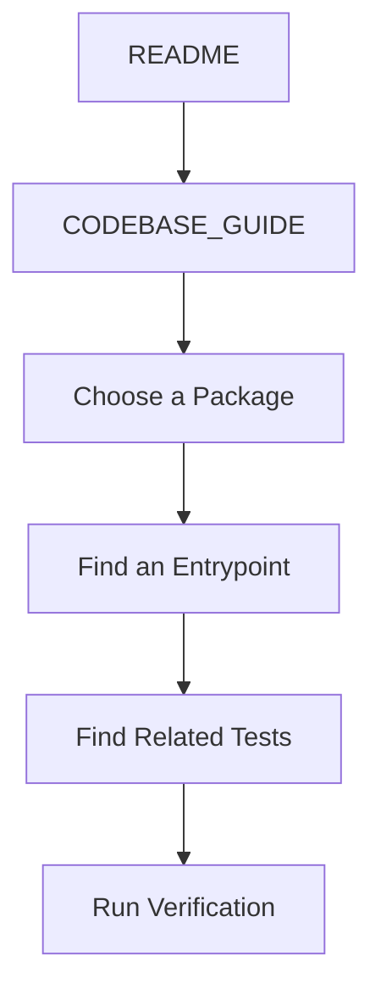
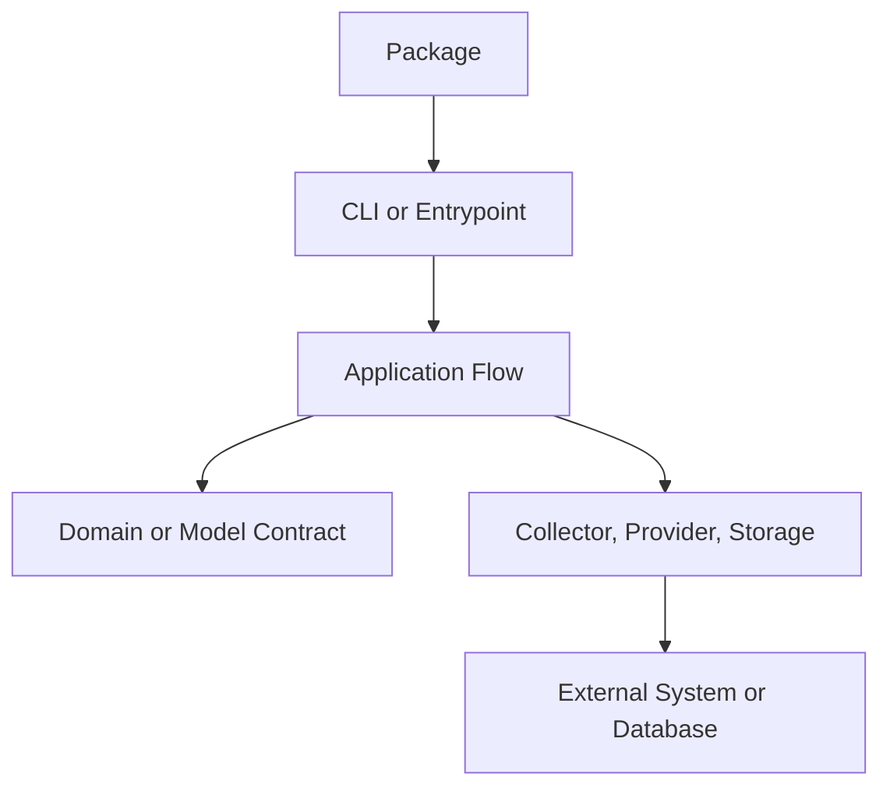
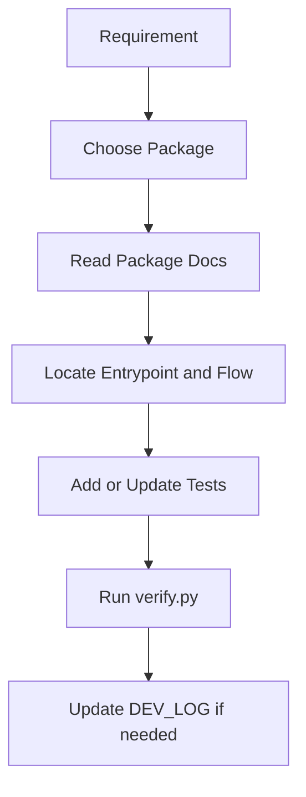

# automation-hub Codebase Guide

이 문서는 `automation-hub`를 처음 읽거나 수정하는 개발자가 관련 파일을 빠르게 찾도록 돕는 Repository 탐색 가이드입니다. 설계 이유와 Package 내부 Architecture는 [Root Architecture](docs/architecture.md)와 각 [Package Architecture](docs/packages/)에서 확인합니다.

| 항목 | 내용 |
|---|---|
| 문서 유형 | Code Exploration Guide |
| 대상 독자 | Contributor, Junior Developer, Backend Engineer |
| 예상 읽기 시간 | 15~20분 |
| 읽는 시점 | 코드 수정과 테스트 작성 전 |

## Who Should Read This Guide

다음 작업을 시작하기 전에 이 문서를 읽습니다.

- 처음 보는 Package의 실행 흐름을 찾을 때
- 변경할 source와 관련 test를 찾을 때
- 새 기능을 어느 계층에 추가할지 파일 기준으로 판단할 때
- 변경 후 어떤 검증 명령을 실행할지 확인할 때

실행 명령만 필요한 경우에는 먼저 [Root README](README.md)와 해당 [Package README](docs/packages/)를 읽습니다.

## Repository Overview

Repository는 세 개의 Automation Package와 Root 수준의 Database, Tests, Scripts, Documentation으로 구성됩니다.



| 경로 | 먼저 확인할 대상 | 탐색 목적 |
|---|---|---|
| `google_finance/` | `main.py`, `watchlist_main.py` | 단일 종목·Watchlist 실행 진입점 |
| `namuwiki_trend/` | `main.py`, `snapshot_main.py`, `daily_trend_main.py` | 수집·Snapshot·Daily Trend 실행 진입점 |
| `bus_monitor/` | `main.py`, `pipeline.py`, `odsay.py`, `gyeonggi.py`, `storage.py` | target 기반 route·realtime 수집과 snapshot 저장 흐름 |
| `database/` | `base.py`, `session.py`, `models.py` | DB 기반과 현재 DB 관련 코드 |
| `tests/` | Package별 테스트 디렉터리 | 공개 동작과 실패 계약 확인 |
| `scripts/` | `verify.py` | Repository 공통 검증 |
| `docs/` | 목적별 Canonical 문서 | 실행·설계·운영·기록 확인 |

## Choosing a Package

| 작업 목적 | Package | 시작 파일 |
|---|---|---|
| Google Finance Quote·Snapshot·Movement·Analysis·Watchlist | `google_finance` | `google_finance/main.py` 또는 `google_finance/watchlist_main.py` |
| Namuwiki Top 10·Enrichment·Snapshot·Daily Trend | `namuwiki_trend` | `namuwiki_trend/main.py`, `snapshot_main.py`, `daily_trend_main.py` |
| Bus Monitor target route·realtime·snapshot | `bus_monitor` | `bus_monitor/main.py` |
| DB 공통 기반 또는 DB 관련 동작 확인 | Root `database` | 사용 중인 호출부와 관련 테스트부터 확인 |
| 공통 검증 명령 변경 | Root Scripts | `scripts/verify.py` |

Package의 현재 기능과 실행 조건은 Package README가 기준입니다. Package 내부 구조를 이해해야 하면 해당 Package Architecture로 이동합니다.

## Reading Order

### 1. 작업 범위 확인

먼저 [Root README](README.md)에서 Package와 현재 범위를 확인합니다. 여러 Package에 영향을 주는 구조인지, 한 Package에 한정된 기능인지 구분합니다.

### 2. 실행 문서 확인

변경 대상 Package의 README에서 실행 명령, 환경 변수와 제한사항을 확인합니다.

### 3. Entrypoint 확인

실제 명령이 어느 모듈에서 시작되는지 확인합니다.

- Google Finance 단일 종목: `google_finance/main.py`
- Google Finance Watchlist: `google_finance/watchlist_main.py`
- Namuwiki 기본 흐름: `namuwiki_trend/main.py`
- Namuwiki Snapshot: `namuwiki_trend/snapshot_main.py`
- Namuwiki Daily Trend: `namuwiki_trend/daily_trend_main.py`
- Bus Monitor persisted target: `bus_monitor/main.py --target-id <id>`

### 4. 호출 파일 따라가기

Entrypoint에서 호출하는 모듈을 한 단계씩 따라갑니다. 파일을 먼저 찾고, 각 파일의 공개 함수와 생성자 주입 지점을 확인한 뒤 구현 세부사항을 읽습니다.



### 5. 관련 테스트 확인

변경 파일과 이름이 대응하는 테스트부터 읽습니다. 호출 경계가 여러 파일에 걸치면 해당 Package 테스트와 `tests/database/`의 관련 테스트를 함께 확인합니다.

### 6. 문서와 기록 대조

설계 이유는 [Root Architecture](docs/architecture.md)와 Package Architecture를 확인합니다. 장기 결정은 [Decision Records](docs/decisions/README.md)와 [LLM ADRs](docs/adr/ADR-0007-llm-runtime.md), 변경 과정은 [DEV_LOG](docs/development/DEV_LOG.md)에서 확인합니다.

## Repository Structure

실제 코드 탐색은 다음 순서로 진행합니다.

1. 실행 명령이 가리키는 Entrypoint
2. Entrypoint가 조정하는 Application 또는 Pipeline
3. 입력·출력에 사용되는 Model
4. 외부 시스템을 다루는 Collector·Provider·Storage
5. 해당 흐름을 검증하는 Tests

구체적인 책임 경계와 의존성 방향을 이 문서에서 다시 정의하지 않습니다. 그 내용은 [Root Architecture](docs/architecture.md)와 Package Architecture를 기준으로 확인합니다.

## Common Directories

### `google_finance/`

Google Finance 기능과 실행 모듈입니다. 먼저 Entrypoint를 연 뒤 관련 Application, Model, Provider, Storage와 테스트를 따라갑니다.

### `namuwiki_trend/`

Namuwiki 수집과 활용 흐름의 모듈입니다. 실행 목적에 따라 `main.py`, `snapshot_main.py`, `daily_trend_main.py` 중 하나를 선택합니다.

### `bus_monitor/`

좌표가 저장된 monitoring target을 ODsay route planning과 경기도 realtime API로 조회하는 모듈입니다.
`main.py`에서 target 실행을 시작한 뒤 `pipeline.py`, `odsay.py`, `gyeonggi.py`, `storage.py` 순서로
따라가면 route·realtime·snapshot 경계를 확인할 수 있습니다.

### `database/`

DB 기반과 현재 DB 모델·조회·저장 보조 코드가 있는 위치입니다. 이 디렉터리의 파일을 공통 코드라고 가정하지 말고, 실제 호출부와 테스트를 함께 확인합니다.

### `tests/`

- `tests/google_finance/`: Google Finance 단위·Application·CLI 테스트
- `tests/namuwiki_trend/`: Namuwiki 수집·변환·Enrichment·CLI 테스트
- `tests/bus_monitor/`: ODsay·경기도 Provider, pipeline, target CLI와 storage 테스트
- `tests/database/`: DB 모델·조회·저장 및 Integration 테스트

### `scripts/`

`scripts/verify.py`가 Ruff, pytest, compileall과 `git diff --check`를 순서대로 실행하는 공통 검증 진입점입니다.

### `docs/`

문서 목적에 따라 다음 기준 문서를 선택합니다.

| 알고 싶은 것 | 기준 문서 |
|---|---|
| Repository 전체 구조 | [Root Architecture](docs/architecture.md) |
| Package 실행 방법 | [Package README](docs/packages/) |
| Package 내부 설계 | [Package Architecture](docs/packages/) |
| 운영 환경 | [Operations](docs/operations/README.md) |
| 장기 설계 결정 | [Decision Records](docs/decisions/README.md), [LLM ADRs](docs/adr/ADR-0007-llm-runtime.md) |
| 개발 이력 | [DEV_LOG](docs/development/DEV_LOG.md) |
| 설계 학습 | [Architecture Handbook](docs/handbook/README.md) |

## Tests

테스트를 찾을 때는 다음 규칙을 사용합니다.

| 변경 대상 | 우선 확인할 테스트 |
|---|---|
| `google_finance/<module>.py` | `tests/google_finance/test_<module>.py` |
| `namuwiki_trend/<module>.py` | `tests/namuwiki_trend/test_<module>.py` |
| `bus_monitor/<module>.py` | `tests/bus_monitor/test_<module>.py`, 필요 시 `tests/database/test_bus_monitor_integration.py` |
| `database/<module>.py` | `tests/database/`의 대응 테스트 |
| CLI Entrypoint | Package의 `test_main.py` 또는 대응 CLI 테스트 |
| 외부·DB 경계 | Fake 테스트와 관련 Integration 테스트 |

테스트를 읽을 때는 정상 흐름뿐 아니라 빈 입력, 잘못된 입력, 외부 실패와 부분 결과를 확인합니다. 실제 외부 환경을 요구하는 테스트의 실행 조건은 Operations 문서에서 확인합니다.

## Verification

변경 후 Repository 전체 검증은 다음 명령으로 실행합니다.

```bash
python scripts/verify.py
```

개별 테스트가 필요하면 먼저 관련 Package 테스트를 실행한 뒤 전체 검증으로 확장합니다.

```bash
pytest -q tests/google_finance
pytest -q tests/namuwiki_trend
pytest -q tests/database
```

외부 네트워크, 실제 API, 브라우저 또는 MySQL이 필요한 검증은 기본 자동화 테스트와 구분하고, 해당 Operations 문서의 실행 조건을 따릅니다.

## Adding a New Feature

새 기능을 추가할 때는 다음 순서로 파일을 찾습니다.



1. 요구사항이 어느 Package에 속하는지 확인합니다.
2. Package README와 Package Architecture를 읽습니다.
3. 기존 Entrypoint와 호출 흐름을 찾습니다.
4. 변경할 계약에 대응하는 테스트를 먼저 확인합니다.
5. 필요한 source와 tests만 수정합니다.
6. `python scripts/verify.py`를 실행합니다.
7. 장기 결정이나 Sprint 기록이 필요한 경우 ADR 또는 DEV_LOG를 갱신합니다.

새로운 공통 계층이나 Package를 추가할 때는 Root Architecture와 관련 ADR을 먼저 확인합니다.

## Related Documents

- [README](README.md): Repository Landing Page와 Quick Start입니다.
- [Root Architecture](docs/architecture.md): Repository 전체 Architecture입니다.
- [Package README](docs/packages/): Package 실행 방법과 현재 기능입니다.
- [Package Architecture](docs/packages/): Package 내부 설계 Reference입니다.
- [Architecture Handbook](docs/handbook/README.md): 설계 판단을 학습하는 문서입니다.
- [DEV_LOG](docs/development/DEV_LOG.md): 시간순 개발 기록입니다.

## Next Reading

- [Package README](docs/packages/): 작업할 Package의 실행 조건과 현재 범위를 확인합니다.
- [Root Architecture](docs/architecture.md): Repository 전체 경계를 확인합니다.
- [Tests](tests/): 변경 대상과 대응하는 테스트를 찾습니다.
