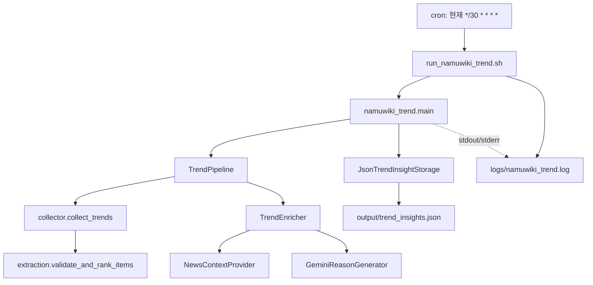
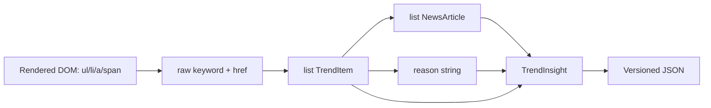
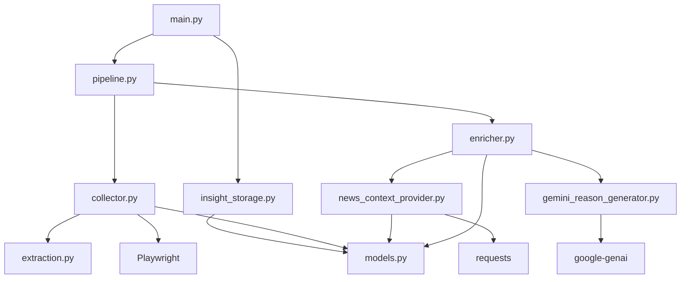
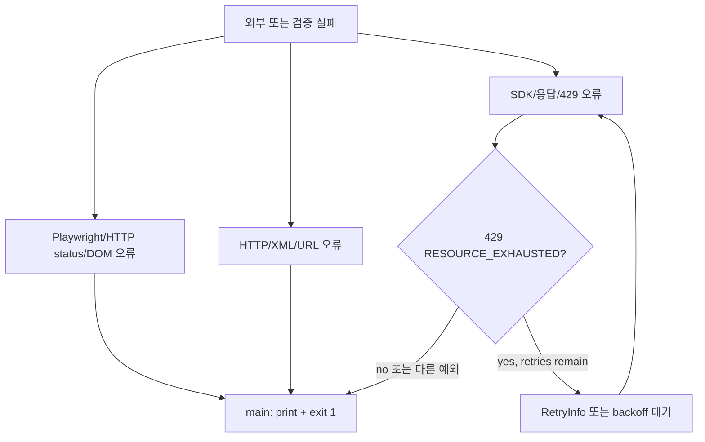
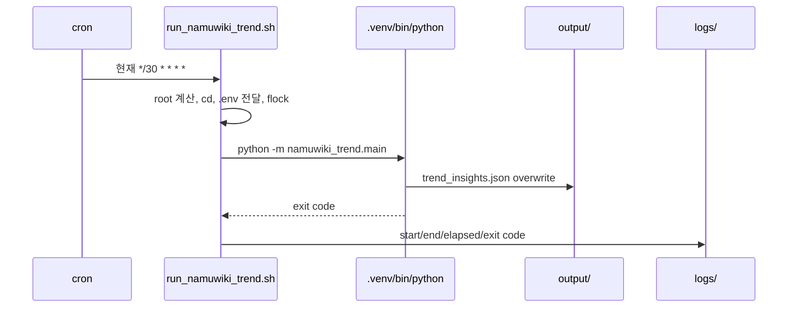

# automation-hub Codebase Guide

이 문서는 `automation-hub`를 처음 보는 개발자가 약 30분 안에 현재 구조와 실행 흐름을
파악하도록 돕는 역설계 가이드다. 함수 목록을 나열하는 API Reference가 아니라, 각 계층이
왜 존재하고 어떤 흐름에서 협력하는지를 설명한다.

문서의 기준은 현재 코드다. 계획 중인 기능, 과거 PoC, 실제 운영 경로를 구분하며, 현재
`google_finance`는 단일 종목 수집·정규화·CLI 실행 경로를 제공한다.

이 문서는 `automation-hub` 전체 저장소를 개괄하지만, 상세 실행 흐름과 코드 Walkthrough는
현재 완성된 `namuwiki_trend`를 중심으로 한다. `google_finance`의 단일 종목 실행 흐름은
패키지 문서에 기록한다. 공통 설계는
[`docs/architecture.md`](docs/architecture.md), 패키지별 문서는
[`docs/packages/`](docs/packages/)에서 관리한다.

## 1. 프로젝트 한눈에 보기

### 목적

`automation-hub`는 독립적인 Python 업무 자동화 프로젝트를 한 저장소에서 관리하는
모노레포다. 첫 번째 완성 프로젝트인 `namuwiki_trend`는 나무위키 실시간 검색어 Top 10을
수집하고, 뉴스 문맥과 Gemini reason을 결합한 `TrendInsight`를 JSON으로 저장한다.

해결하려는 문제는 단순한 HTML 추출이 아니다.

- JavaScript 렌더링 후 나타나는 검색어를 검증된 DOM 규칙으로 수집한다.
- 수집 원본과 뉴스·LLM enrichment를 서로 다른 책임으로 분리한다.
- 외부 API 실패와 quota를 계층별로 처리한다.
- 결과를 테스트 가능한 계약과 JSON 파일로 남긴다.
- WSL cron에서 반복 실행하고 실패를 로그와 exit code로 관찰한다.

### 핵심 아키텍처



`TrendPipeline`은 목록 순회와 enrichment만 담당한다. Storage는 Pipeline 내부가 아니라
`main.py`의 Application Entry Point가 실행 결과를 받은 뒤 호출한다.

## 2. 전체 실행 흐름

사용자가 다음 명령을 실행하면:

```bash
python -m namuwiki_trend.main
```

호출 순서는 다음과 같다.

1. `main()`이 `build_pipeline()`과 `JsonTrendInsightStorage()`를 생성한다.
2. `build_pipeline()`이 `NewsContextProvider`, `GeminiReasonGenerator`, `TrendEnricher`,
   `TrendPipeline`을 생성자 주입으로 조립한다.
3. `run_application()`이 `pipeline.run()`을 호출한다.
4. `TrendPipeline.run()`이 `collect_trends()`를 한 번 호출한다.
5. `collect_trends()`가 Headless Chromium으로 `https://namu.wiki/`에 접속한다.
6. 검증된 root locator 아래의 직접 자식 `li`를 읽고 visible 항목의 raw keyword·href를
   `extraction.validate_and_rank_items()`에 전달한다.
7. extraction은 마지막 sentinel을 제거하고 정확히 10개인지 검증한 뒤 rank 1~10의
   `list[TrendItem]`을 반환한다.
8. Pipeline은 입력 순서대로 각 `TrendItem`을 `TrendEnricher.enrich()`에 전달한다.
9. Enricher는 `NewsContextProvider.search()`로 최대 5개의 뉴스 문맥을 검색한다.
10. Enricher는 뉴스 목록을 `GeminiReasonGenerator.generate_reason()`에 전달한다.
11. Gemini Generator는 Prompt를 만들고 rate limiting·bounded retry를 적용해 SDK를 호출한다.
12. Enricher는 원본 TrendItem, reason, 기사 tuple을 `TrendInsight`로 만든다.
13. Pipeline은 `list[TrendInsight]`를 반환한다.
14. `JsonTrendInsightStorage.save()`가 결과를 `output/trend_insights.json`에 저장한다. 같은
    디렉터리에서 임시 파일을 완성한 뒤 `replace()`하여 불완전한 JSON이 최종 경로에 노출될
    가능성을 줄인다.
15. 성공하면 `main()`은 저장 경로를 출력하고 0을 반환한다. 예외가 발생하면 오류를 출력하고
    1을 반환한다.

운영 실행에서는 사용자가 Python을 직접 호출하지 않고 Wrapper가 root 이동, `.env` 전달,
로그 수집과 `flock` 중복 방지를 담당한다.

## 3. 디렉터리 구조

```text
automation-hub/
├── namuwiki_trend/
│   ├── collector.py              # Playwright로 raw Top10을 수집
│   ├── extraction.py             # sentinel·개수·rank를 검증하고 TrendItem 생성
│   ├── models.py                 # TrendItem, NewsArticle, TrendInsight 계약
│   ├── news_context_provider.py  # Google News RSS 검색과 XML 파싱
│   ├── gemini_reason_generator.py# Prompt, Gemini 호출, rate limit, retry
│   ├── enricher.py               # 단일 TrendItem의 뉴스·reason 결합
│   ├── pipeline.py               # 목록 순회 Batch Orchestrator
│   ├── insight_storage.py        # TrendInsight JSON 저장
│   ├── csv_storage.py            # 기본 Flow 밖의 원본 TrendItem CSV 저장
│   ├── quality_diagnostics.py    # 기본 Flow 밖의 결과 품질 heuristic 계산
│   ├── main.py                   # 운영 의존성 조립과 전체 실행
│   ├── config.py                 # Settings와 로거 정의
│   ├── playwright_poc.py         # Playwright 수동 검증 경로
│   └── news_context_poc.py       # 뉴스 Provider 수동 검증 경로
├── google_finance/
│   ├── collector.py              # Playwright rendered quote 수집
│   ├── extraction.py              # 가격·통화·퍼센트 정규화
│   ├── db_models.py               # Google Finance snapshot ORM 계약
│   ├── storage.py                 # append-only snapshot 저장·조회
│   ├── models.py                 # StockPrice, StockReport 계약
│   ├── pipeline.py               # 단일 종목 변환 흐름
│   ├── main.py                   # CLI Composition Root
│   └── config.py                 # Settings와 로거
├── tests/
│   ├── namuwiki_trend/           # 각 계층의 네트워크 비의존 계약 테스트
│   └── test_verify.py            # Harness 자체 테스트
├── scripts/verify.py             # Ruff·pytest·compileall·diff 검사
├── run_namuwiki_trend.sh         # WSL cron 운영 Wrapper
├── output/                       # 실행 JSON, Git ignore
├── logs/                         # Wrapper·운영 로그, Git ignore
├── namu.html                     # 과거 DOM fixture/조사 자산
├── pyproject.toml                # 의존성, 패키지 탐색, Ruff·pytest 설정
├── docs/                         # 공통·패키지·학습·PoC 문서
│   ├── architecture.md
│   ├── packages/
│   ├── decisions/
│   ├── development/
│   ├── learning/
│   ├── operations/
│   └── poc/
├── README.md                     # GitHub 첫 화면용 안내
├── CODEBASE_GUIDE.md             # 전체 코드 탐색 가이드
└── AGENTS.md                     # AI 협업 규칙
```

`google_finance`는 현재 단일 종목 Collector, extraction, Pipeline, CLI와 Google Finance 전용
append-only snapshot Storage 실행 흐름을 제공한다. Movement Detection, News, LLM, Scheduler는
아직 구현하지 않았으며, 향후 개발 시 `namuwiki_trend`의 구조를 그대로 복사하기보다 실제
요구사항을 먼저 확인한다.

## 4. 실행 흐름 상세 분석

### 4.1 Composition Root: `main.py`

누가 호출하는가: 사용자 명령 또는 Wrapper.

무엇을 하는가: 운영 객체를 생성하고 연결한다. `build_pipeline()`은 외부 의존성을 안쪽
계층에 주입하며, `run_application()`은 Pipeline과 Storage의 순서를 조정한다.

무엇을 반환하는가: 성공 시 저장된 `Path`, 프로세스 경계인 `main()`은 종료 코드.

다음 호출: `TrendPipeline.run()`과 `JsonTrendInsightStorage.save()`.

환경변수는 `GeminiReasonGenerator`가 직접 `os.getenv("GEMINI_API_KEY")`로 읽는다. 현재
`main.py`는 `Settings`를 생성하지 않는다. Wrapper가 `.env`를 shell 환경으로 export한다.

### 4.2 수집: `collector.py`

누가 호출하는가: `TrendPipeline`이 Collector callable로 호출한다.

무엇을 하는가: Playwright Sync API로 브라우저를 실행하고 페이지 접속, HTTP 200, root
visibility를 확인한 뒤 DOM의 raw keyword·href를 읽는다.

무엇을 반환하는가: extraction을 통과한 `list[TrendItem]`.

다음 호출: `TrendPipeline`이 각 TrendItem을 Enricher로 전달한다.

절대로 하지 않는 일: 뉴스 검색, Gemini 호출, JSON 저장, rank 재계산 이외의 enrichment.

### 4.3 경계 검증: `extraction.py`

누가 호출하는가: `collector.py`.

무엇을 하는가: raw tuple을 정규화하고 `/Go?q=` href, non-empty keyword, sentinel과 정확한
10개를 검증한다. DOM 순서를 rank로 표현한다.

무엇을 반환하는가: `TrendItem(rank, keyword, href)` 목록.

다음 호출: Collector가 Pipeline으로 반환한다.

검증 실패는 보정하거나 임의 slice하지 않고 예외로 전달한다.

### 4.4 Batch Orchestration: `pipeline.py`

누가 호출하는가: `main.py`.

무엇을 하는가: Collector를 한 번 호출하고 결과를 입력 순서대로 순회해 Enricher를 한 번씩
호출한다.

무엇을 반환하는가: 순서가 보존된 `list[TrendInsight]`.

다음 호출: 반환된 목록을 `main.py`가 Storage로 전달한다.

절대로 하지 않는 일: Playwright 세부 처리, 뉴스 검색, Gemini retry, 저장, scheduler,
parallelism. Collector 예외와 Enricher 예외는 fail-fast로 그대로 전달한다.

### 4.5 Enrichment: `enricher.py`

누가 호출하는가: `TrendPipeline`.

무엇을 하는가: 하나의 TrendItem에 대해 News Provider를 호출하고, 그 결과와 TrendItem을
Reason Generator에 전달한 뒤 reason을 trim·길이 검증해 TrendInsight로 결합한다.

무엇을 반환하는가: `TrendInsight`.

다음 호출: Pipeline이 다음 항목을 처리하거나 전체 목록을 반환한다.

절대로 하지 않는 일: Provider 구현 선택, Gemini API 상세 retry, 파일 저장, 순위 변경.

### 4.6 외부 문맥: `news_context_provider.py`

누가 호출하는가: Enricher.

무엇을 하는가: keyword를 trim하고 Google News RSS 검색 URL을 구성한다. HTTP 응답 XML을
파싱해 title, URL, source, published_at을 검증·변환하며 URL 중복을 제거한다.

무엇을 반환하는가: `list[NewsArticle]`.

다음 호출: Enricher가 Reason Generator로 전달한다.

절대로 하지 않는 일: Gemini 호출, reason 생성, TrendInsight 생성.

### 4.7 LLM 호출: `gemini_reason_generator.py`

누가 호출하는가: Enricher.

무엇을 하는가: title·source·published_at만 Prompt에 넣고 URL은 제외한다. Gemini SDK를
호출하며 요청 간 최소 간격을 지키고 `429 RESOURCE_EXHAUSTED`에만 bounded retry를 적용한다.

무엇을 반환하는가: trim된 최대 300자 reason 문자열.

다음 호출: Enricher가 TrendInsight를 생성한다.

절대로 하지 않는 일: 뉴스 검색, CSV/JSON 저장, Pipeline 순회.

### 4.8 저장: `insight_storage.py`

누가 호출하는가: `main.py`.

무엇을 하는가: TrendInsight 모델을 명시적 JSON mapping으로 변환하고 schema version,
generated_at, UTF-8, indentation을 적용한다. 같은 디렉터리의 임시 파일을 작성한 뒤
replace한다.

무엇을 반환하는가: 저장된 `Path`.

절대로 하지 않는 일: Collector·Pipeline·Enricher를 생성하거나 실행하는 일.

### 4.9 기본 Flow 밖의 모듈

- `csv_storage.py`: `TrendItem` 원본을 CSV로 저장하는 독립 Storage 함수다. 현재
  `main.py`의 기본 경로는 JSON Storage만 호출하므로 기본 실행에는 포함되지 않는다.
- `quality_diagnostics.py`: 이미 생성된 `TrendInsight` 목록을 별도로 분석하는 진단 모듈이다.
  Pipeline이나 Storage에 자동 연결되어 있지 않으며, title keyword match는 heuristic이다.
- `playwright_poc.py`: 운영 Collector가 아니라 Playwright 환경과 수집 결과를 수동 확인하는
  PoC 실행 경로다.
- `news_context_poc.py`: 운영 Enricher가 아니라 News Provider의 외부 RSS 동작을 수동 확인하는
  PoC 실행 경로다.
- `config.py`: Settings와 logger factory를 정의하지만, 현재 기본 `main.py` 실행에서
  Settings나 `get_logger()`가 직접 생성되지는 않는다.
- `tests/`: 운영 실행의 일부가 아니라 각 계층의 계약과 실패 정책을 보호하는 테스트 전용 코드다.

## 5. 핵심 클래스 분석

### `TrendPipeline`

- 역할: 목록 단위 Application Orchestrator
- 책임: Collector 호출, 순서 보존, Enricher 호출, 결과 반환
- 협력 객체: `TrendCollector` callable, `TrendEnricherProtocol`
- 절대로 하지 않는 일: 저장·retry·외부 시스템 세부 처리
- 설계 이유: 단일 항목 Enrichment와 Top10 batch 순회를 분리해 각 계층을 독립 테스트하기 위해 존재한다.

### `TrendEnricher`

- 역할: 하나의 TrendItem을 뉴스 기반 Insight로 변환
- 책임: News Provider와 Reason Generator의 호출 순서, article limit, reason 검증
- 협력 객체: `NewsProvider`, `ReasonGenerator`
- 절대로 하지 않는 일: Collector와 Storage 조정
- 설계 이유: Collector가 LLM을 알지 않도록 원본 수집 계약과 enrichment 계약을 분리한다.

### Collector 함수 `collect_trends`

- 역할: 브라우저 렌더링 결과에서 Top10 원본을 얻는 입구
- 책임: Playwright lifecycle, 접속, DOM raw 값 수집
- 협력 객체: Playwright `Browser`, `Page`, extraction 함수
- 절대로 하지 않는 일: 뉴스·Gemini·파일 저장
- 설계 이유: 검증된 DOM을 읽는 기술 책임을 Application 흐름에서 격리한다.

### `NewsContextProvider`

- 역할: 검색어의 최신 뉴스 문맥 Provider
- 책임: Google News RSS 요청, XML parsing, URL deduplication, 필드 변환
- 협력 객체: 주입 가능한 `HttpClient`
- 절대로 하지 않는 일: 의미적 관련성 확정과 LLM 호출
- 설계 이유: 네트워크와 parser를 Enricher 밖에 두고 fixture 테스트를 가능하게 한다.

### `JsonTrendInsightStorage`

- 역할: Enriched 결과의 파일 경계
- 책임: JSON Output Contract와 파일 I/O
- 협력 객체: `TrendInsight`, 주입 가능한 clock
- 절대로 하지 않는 일: pipeline orchestration
- 설계 이유: 기존 원본 CSV 계약을 바꾸지 않고 Enriched 결과를 별도 schema로 보존한다.

### `GeminiReasonGenerator`

- 역할: 뉴스 근거 기반 reason 생성기
- 책임: Prompt 생성, SDK 호출, 응답 검증, quota retry
- 협력 객체: `google-genai` client, clock, sleeper
- 절대로 하지 않는 일: Google News 호출과 Pipeline 제어
- 설계 이유: Gemini-specific 정책을 `TrendPipeline`에 노출하지 않기 위해 Provider 계층에 둔다.

## 6. 데이터 흐름



핵심 데이터 계약은 다음과 같다.

- `TrendItem`: `rank`, `keyword`, `href`; Collector의 원본 결과
- `NewsArticle`: `title`, `url`, optional `source`, optional `published_at`
- `TrendInsight`: `trend`, `reason`, `articles` tuple
- JSON: `schema_version`, `generated_at`, `insights[]`

원본 CSV는 `rank,keyword,href`만 저장하고, Enriched JSON은 뉴스와 reason을 저장한다.
두 계약을 합치지 않은 이유는 원본 수집과 LLM 결과의 생성 실패·재생성 수명을 분리하기 위해서다.

## 7. 의존성 분석



테스트에서는 실제 Playwright·HTTP·Gemini를 호출하지 않고 Fake, MagicMock, fixture를 주입한다.
`main.py`의 운영 조립과 개별 계층의 테스트 조립은 서로 다른 Composition Root다.

## 8. Config 분석

`namuwiki_trend/config.py`와 `google_finance/config.py`는 Pydantic Settings와 logger factory를
정의한다. `.env` 파일을 프로젝트 루트 기준으로 읽고, 필수 설정 누락 시 Settings 생성 시점에
검증 오류를 낸다.

현재 `namuwiki_trend.main`의 실제 실행은 `Settings`를 생성하지 않고,
`GeminiReasonGenerator`가 `os.getenv("GEMINI_API_KEY")`를 직접 읽는다. 따라서 운영 Wrapper가
`.env`를 source하고 export하는 것이 현재 실행 경로의 환경변수 전달 방식이다.

`NAVER_CLIENT_ID`, `NAVER_CLIENT_SECRET`은 현재 `NewsContextProvider` 실행에 사용되지 않는다.
`NewsContextProvider`는 Google News RSS에서 검색어 관련 문맥을 가져온다. 설정 파일에 정의되어 있다는 사실과 현재
호출된다는 사실을 혼동하면 안 된다.

## 9. 예외 처리 흐름



- Collector는 root 개수, visible 항목, sentinel, 정확한 10개를 검증하고 실패를 전달한다.
- News Provider는 HTTP 예외와 malformed XML을 wrapping하지 않고 원인을 보존한다.
- Gemini Generator는 `code == 429`와 `status == RESOURCE_EXHAUSTED`일 때만 제한적으로 retry한다.
- `RetryInfo.retryDelay`를 우선 사용하고 없으면 exponential backoff를 사용한다.
- Pipeline은 fail-fast이며 Gemini-specific 예외를 처리하지 않는다.
- `main()`은 process boundary에서 예외를 출력하고 1을 반환한다.

## 10. Logging 흐름

현재 두 종류의 logging 경로가 있다.

1. `config.py`의 `get_logger()`는 INFO/WARNING/ERROR와 rotating file handler를 정의한다.
2. `run_namuwiki_trend.sh`는 Python의 stdout/stderr 전체를 `logs/namuwiki_trend.log`로
   redirect하고 시작·종료·경과 시간·exit code를 기록한다.

현재 `main.py`, Collector, Provider가 `get_logger()`를 직접 호출하는 구조는 아니다. 따라서
운영 로그에서 확인할 수 있는 Python 출력은 `main()`의 성공·실패 메시지와 외부 SDK 오류이며,
Wrapper 실행 정보는 Shell이 기록한다. API key 등 credential은 로그에 기록하면 안 된다.

## 11. Scheduler 구조



`flock -n`이 이미 실행 중인 작업을 발견하면 exit 75로 건너뛴다. 현재 로컬 crontab에는
검증을 위해 다음 임시 설정이 적용되어 있다.

```cron
*/30 * * * * /home/kstec/projects/automation-hub/run_namuwiki_trend.sh
```

이는 매시 00분과 30분에 실행한다. 검증 완료 후 기본 운영 주기는 다음 설정으로 복원할
예정이다.

```cron
0 */3 * * * /home/kstec/projects/automation-hub/run_namuwiki_trend.sh
```

cron 설정은 저장소 파일이 아니라 현재 로컬 사용자 crontab의 상태다. WSL이 종료되거나
sleep 상태이면 Linux cron이 실행되지 않을 수 있다. cron은 Python Application의 내부
정책을 알지 않으며, Wrapper는 실행 경계와 운영 관찰만 담당한다.

## 12. 설계 철학

- Flat Layout: 현재 프로젝트가 독립적이고 모듈 수가 작아 import 경로와 구조 복잡도를 낮춤
- Clean Architecture: 엄격한 전체 구현이 아니라 책임 분리, Composition Root, Dependency
  Inversion 개념을 현재 규모에 맞게 부분적으로 적용함
- Pipeline: 목록 순회와 단일 항목 enrichment를 분리해 순서·fail-fast 계약을 명확히 함
- dataclass: 모델 필드를 명시하고 `TrendItem`, `TrendInsight`의 불변 계약을 표현함
- Collector/Enricher 분리: 브라우저 수집이 뉴스·LLM과 결합되지 않도록 함
- Config 분리: 환경변수와 로거 정의를 프로젝트별로 격리함. 단, 현재 main은 Settings를 직접 사용하지 않음
- Retry를 Generator 내부에 배치: rate limit은 Gemini Provider의 정책이며 Pipeline이 알 필요가 없음
- Explicit serialization: `asdict()`에 의존하지 않고 외부 JSON 계약을 모델 변화와 분리함
- Quality Diagnostics 분리: 의미 품질을 해결한다고 과장하지 않고 관찰 가능한 heuristic만 계산함

## 13. 핵심 코드 Walkthrough

### 13.1 `main.py`의 조립

```python
news_provider = NewsContextProvider()
reason_generator = GeminiReasonGenerator()
enricher = TrendEnricher(news_provider, reason_generator)
return TrendPipeline(collect_trends, enricher)
```

이 부분은 비즈니스 로직이 아니라 Composition Root다. 운영 구현을 여기서 만들고, 테스트에서는
같은 인터페이스를 가진 Fake를 주입한다.

### 13.2 `pipeline.py`의 순서 보존

```python
trends = self._collector()
return [self._enricher.enrich(trend) for trend in trends]
```

Pipeline이 정렬·slice·retry하지 않기 때문에 Collector의 순위와 입력 순서가 그대로 Insight에
반영된다. 중간 예외가 나면 comprehension이 중단되어 fail-fast가 된다.

### 13.3 `extraction.py`의 sentinel 경계

```python
if first_item != last_item:
    raise ValueError(...)
data_items = normalized_items[:-1]
```

마지막 노드가 첫 항목 복제라는 실제 DOM Evidence를 코드 계약으로 옮긴 부분이다. 검증 실패를
조용히 보정하지 않는 것이 데이터 손실과 잘못된 rank를 막는다.

### 13.4 `gemini_reason_generator.py`의 제한 정책

```python
is_quota_error = exc.code == 429 and exc.status == "RESOURCE_EXHAUSTED"
```

모든 예외를 retry하지 않고 quota 오류만 재시도한다. 이는 네트워크·입력·모델 오류를 숨기지
않고, Gemini 정책을 상위 Pipeline으로 누출하지 않기 위한 경계다.

### 13.5 `insight_storage.py`의 외부 계약

```python
temporary_path.replace(output_path)
```

동일 디렉터리의 임시 파일을 완성한 뒤 교체해 중간 JSON이 output 경로에 노출될 가능성을 줄인다.
저장 계층은 모델을 명시적으로 mapping하며 Collector나 Pipeline을 생성하지 않는다.

## 14. 개발자가 프로젝트를 수정하려면

### 새로운 뉴스 Provider 추가

1. `NewsProvider` Protocol의 `search(keyword, limit)` 계약을 확인한다.
2. 기존 Provider와 새 Provider를 비교하는 순수 parser·Fake 테스트를 만든다.
3. `TrendEnricher`는 수정하지 않고 새 Provider를 `main.py` Composition Root에서 주입한다.
4. 한국어 품질, 최신성, 약관과 장애 정책을 문서에 기록한다.

### 저장 형식 추가

1. `TrendInsight` 모델 계약을 확인한다.
2. 기존 JSON·CSV 소비자를 깨뜨리지 않는 별도 Storage 모듈을 설계한다.
3. 명시적 serializer와 tmp_path 테스트를 추가한다.
4. `main.py`에서만 원하는 저장소를 조립한다.

### Gemini 정책 변경

1. `gemini_reason_generator.py`의 Prompt·응답·retry 계약을 먼저 확인한다.
2. clock/sleeper를 사용해 실제 sleep 없는 테스트를 추가한다.
3. `TrendPipeline`에는 Gemini 예외나 sleep을 넣지 않는다.
4. Live 호출은 quota와 credential 영향을 검토한 뒤 별도로 승인한다.

### Google Finance 시작

1. 현재 `google_finance`의 `collector.py`, `extraction.py`, `pipeline.py`, `db_models.py`,
   `storage.py`, `main.py`와 패키지 문서를 함께 검토한다.
2. Collector는 symbol-scoped rendered DOM만 읽고, 내부 Google RPC를 사용하지 않는다.
3. Movement Detection과 다중 종목을 추가하기 전에 snapshot output contract와 운영 요구사항을
   먼저 정한다.
4. 공통화는 실제 세 프로젝트에서 반복되는 시점까지 `shared/`를 만들지 않는다.

## 15. 개선 포인트

### 현재 장점

- Collector, Provider, Enricher, Pipeline, Storage의 변경 경계가 명확하다.
- 외부 시스템은 Protocol·Fake로 단위 테스트할 수 있다.
- Top10 rank, sentinel, JSON schema를 코드 계약으로 검증한다.
- Gemini rate limit이 Pipeline에 침투하지 않는다.
- verify Harness와 cron Wrapper가 개발·운영 실행 경계를 분리한다.

### 현재 단점과 위험

- `main()`이 broad exception을 process boundary에서 처리하므로 오류 유형별 운영 집계가 제한적이다.
- `config.py`의 Settings·logger와 실제 `main.py` 환경변수 사용 경로가 완전히 통합되어 있지 않다.
- 로그는 Wrapper가 한 파일로 수집하지만 구조화된 retry·quality metric logging은 없다.
- JSON은 overwrite 전용이며 장기 이력·schema migration·Database 조회가 없다.
- keyword-title match는 의미적 관련성을 보장하지 않는다.
- cron 실행이 quota와 WSL 실행 상태에 의존한다.

### Google Finance에서 재사용할 부분

- flat package layout과 `models.py` 데이터 계약
- Provider와 Application Layer의 Protocol 경계
- `main.py` Composition Root 패턴
- Fake 기반 테스트와 `scripts/verify.py`
- Shell Wrapper, `flock`, 로그와 exit code 운영 방식

### 재사용 전에 다시 판단할 부분

- Google Finance의 API·인증·호출 한도에 맞는 retry 정책
- 시세 데이터의 시간대·시장 휴장·중복 저장 계약
- JSON/CSV가 아닌 장기 저장소가 필요한지 여부
- 두 프로젝트에서 실제로 반복되는 코드가 세 곳에 도달했는지 여부

## 16. 테스트 전략

단위 테스트는 실제 Playwright, Google News, Gemini 서비스가 항상 정상 동작함을 증명하지
않는다. 각 계층의 입력·출력 계약, 호출 순서, 검증 규칙, 실패 처리 정책을 검증한다.

### Collector

`test_collector.py`는 Playwright 객체를 `MagicMock`으로 대체한다. root 개수, anchor·href
누락, extraction 오류 전파와 browser/context 정리 계약을 확인하며 실제 Chromium과 사이트를
호출하지 않는다.

### Extraction

`test_extraction.py`는 `validate_and_rank_items()`라는 순수 함수에 raw tuple fixture를
전달한다. sentinel 제거, 10개 검증, keyword·href 검증과 rank 부여를 네트워크 없이 확인한다.

### News Provider

`test_news_context_provider.py`는 Fake HTTP client와 RSS XML fixture를 사용한다. XML parsing,
URL deduplication, limit, trim, malformed XML과 HTTP 예외 전달을 검증하며 Google News를
호출하지 않는다.

### Gemini Generator

`test_gemini_reason_generator.py`는 Fake client/model을 사용한다. Prompt 계약, 응답 검증,
SDK 오류 전달, clock·sleeper 주입, 요청 간격과 429 bounded retry를 실제 sleep 없이 확인한다.

### Enricher와 Pipeline

`test_enricher.py`는 Fake News Provider와 Fake Reason Generator를 주입한다. 호출 순서,
article limit, reason validation과 예외 전달을 보호한다. `test_pipeline.py`는 Fake Collector와
Fake Enricher로 순서 보존, 빈 결과, fail-fast와 입력 불변성을 확인한다.

### Storage

`test_csv_storage.py`와 `test_insight_storage.py`는 `tmp_path`와 실제 모델을 사용한다. CSV·JSON
필드 계약, encoding, 순서, overwrite, 부모 디렉터리, 입력 불변성과 JSON parsing을 검증한다.

### Main과 Quality Diagnostics

`test_main.py`는 Fake Pipeline과 Fake Storage로 Composition Root의 주입과 성공·실패 종료 코드를
확인한다. `test_quality_diagnostics.py`는 외부 호출 없이 빈 결과, fallback, title match heuristic,
중복 URL, rank 이상과 빈 필드를 검증한다.

### Harness

`tests/test_verify.py`는 `scripts/verify.py`가 Ruff, pytest, compileall, `git diff --check`를
순서대로 실행하고 첫 실패에서 중단하는지 검증한다. 실제 표준 실행은 다음 명령이다.

```bash
python scripts/verify.py
```

## 17. 추천 코드 읽기 순서

### 1단계: 실행 경계와 Application Flow

```text
main.py
pipeline.py
enricher.py
```

왜 먼저 읽는가: 사용자의 명령이 어떤 객체를 조립하고 어떤 순서로 데이터를 이동시키는지
먼저 알아야 내부 Provider의 역할을 오해하지 않는다.

확인할 질문:

- 누가 `TrendPipeline.run()`을 호출하는가?
- 이 계층은 어떤 의존성을 생성하고 어떤 의존성을 주입받는가?
- 이 객체가 절대로 하지 않는 일은 무엇인가?

### 2단계: 입력과 출력 경계

```text
collector.py
extraction.py
insight_storage.py
```

왜 읽는가: 입력 데이터가 어떻게 검증된 `TrendItem`이 되고, 최종 `TrendInsight`가 어떻게
외부 JSON으로 나가는지 이해한다.

확인할 질문:

- DOM의 sentinel과 Top10 경계는 어디서 검증되는가?
- rank와 입력 순서는 어느 계층에서 보존되는가?
- 저장 실패가 수집·enrichment 책임으로 역전되지 않는가?

### 3단계: 외부 시스템

```text
news_context_provider.py
gemini_reason_generator.py
```

왜 읽는가: Application이 외부 시스템을 직접 다루지 않고 Provider 계약을 통해 사용하는
이유와 외부 실패 정책을 확인한다.

확인할 질문:

- 실제 네트워크·SDK를 테스트에서 어떻게 대체하는가?
- 어떤 예외만 retry하며 retry하지 않는 예외는 무엇인가?
- 뉴스 문맥이 의미적 관련성을 보장하지 않는다는 한계는 어디에 반영되는가?

### 4단계: 데이터 계약과 검증

```text
models.py
tests/namuwiki_trend/
scripts/verify.py
```

왜 읽는가: 앞서 본 호출 흐름이 어떤 모델 계약과 자동 검증으로 보호되는지 확인한다.

확인할 질문:

- `TrendItem`, `NewsArticle`, `TrendInsight`의 경계는 무엇인가?
- 각 테스트는 구현 세부사항이 아니라 어떤 공개 계약을 보호하는가?
- 로컬 검증을 통과해도 어떤 외부 Live 사실은 여전히 확인되지 않는가?
