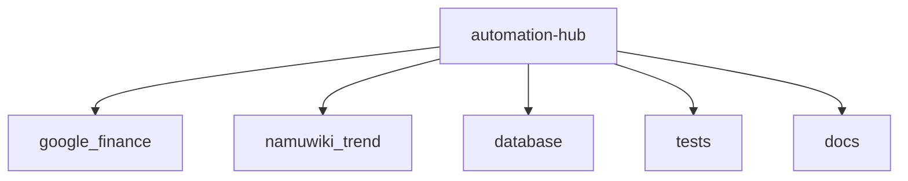
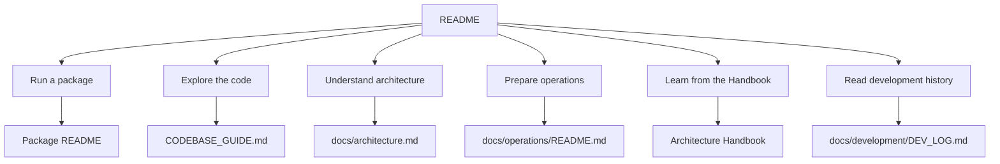

# automation-hub

`automation-hub`는 Python으로 업무 자동화를 다시 설계하는 개인 Monorepo입니다. 화면에서 값을 읽는 작업을 명시적인 데이터 모델, 검증 가능한 실행 경계와 테스트 가능한 흐름으로 발전시키는 것을 목표로 합니다.

## Repository at a Glance

| 항목 | 내용 |
|---|---|
| Runtime | Python 3.12 |
| Layout | Flat layout Monorepo |
| Packages | `namuwiki_trend`, `google_finance` |
| Browser automation | Playwright |
| Persistence | MySQL, SQLAlchemy, Alembic |
| AI integration | Gemini·OpenAI 기반 Provider |
| Verification | pytest, Ruff, compileall, `scripts/verify.py` |



## Quick Start

```bash
python3.12 -m venv .venv
source .venv/bin/activate
pip install -e ".[dev]"
```

가장 짧은 검증은 다음 명령입니다.

```bash
python scripts/verify.py
```

외부 서비스나 MySQL이 필요한 실행은 각 Package 문서와 운영 문서에서 환경 조건을 확인합니다.

Dashboard는 optional dependency 설치 후 repository root에서 다음 공식 명령으로 실행합니다.

```bash
pip install -e ".[dashboard,dev]"
./run_dashboard.sh
```

## Packages

| Package | 현재 기능 | 실행 문서 | 설계 문서 |
|---|---|---|---|
| `namuwiki_trend` | Namuwiki Top 10 수집, 뉴스·LLM enrichment, JSON·DB snapshot, Daily Trend | [Package README](docs/packages/namuwiki_trend/README.md) | [Architecture](docs/packages/namuwiki_trend/architecture.md) |
| `google_finance` | Quote 수집, 정규화, MySQL snapshot, Movement, News·Gemini 분석, Watchlist | [Package README](docs/packages/google_finance/README.md) | [Architecture](docs/packages/google_finance/architecture.md) |

Package README는 실행 방법과 현재 기능의 기준 문서입니다. Package 내부 설계와 책임 경계는 각 Architecture 문서에서 관리합니다.

## Documentation

| I want to... | Start here |
|---|---|
| Run a package | [Package README](docs/packages/) |
| View persisted snapshots | [Automation Dashboard](automation_dashboard/README.md) |
| Understand the repository architecture | [Root Architecture](docs/architecture.md) |
| Explore the code | [CODEBASE_GUIDE.md](CODEBASE_GUIDE.md) |
| Prepare an operating environment | [Operations](docs/operations/README.md) |
| Configure cron operations | [Cron Operations](docs/operations/cron.md) |
| Operate the shared LLM Runtime | [LLM Runtime Operations](docs/operations/llm_runtime.md) |
| Learn architecture from this project | [Architecture Handbook](docs/handbook/README.md) |
| Read design decisions | [Decision Records](docs/decisions/README.md) and [LLM ADRs](docs/adr/ADR-0007-llm-runtime.md) |
| Read development history | [DEV_LOG.md](docs/development/DEV_LOG.md) |



## Architecture

공통 개발 환경과 검증 규칙은 Repository Root에서 관리하고, 각 Package는 자신의 모델·Provider·Application 흐름을 소유합니다. 전체 경계와 의존성 방향은 [Root Architecture](docs/architecture.md)에서, Package별 설계는 위의 Package Architecture 문서에서 확인합니다.

## Verification

표준 검증 명령은 다음입니다.

```bash
python scripts/verify.py
```

이 명령은 Ruff, pytest, compileall과 `git diff --check`를 실행합니다. 외부 네트워크, 실제 API 또는 MySQL이 필요한 검증은 해당 Package와 [Operations](docs/operations/README.md)의 조건을 따릅니다.

## Implemented

- `namuwiki_trend`: Playwright 기반 Top 10 수집, rank 보존, 뉴스·LLM enrichment, JSON·CSV·DB snapshot, Daily Trend 조회
- `google_finance`: 단일 종목 Quote 수집, `StockPrice` 변환, MySQL snapshot, Movement Detection, Google News·Gemini 분석, `STOCK_SYMBOLS` Watchlist
- 공통 범위 밖: Scheduler, 분석 결과 DB 저장, threshold와 상대 변동률
- Google Finance Batch 분석 결과 JSON artifact 저장과 Dashboard Insight 표시

세부 구현 상태, 제한사항과 실행 계약은 각 Package README를 기준으로 합니다. 개발 과정의 문제와 검증 기록은 [DEV_LOG](docs/development/DEV_LOG.md)에서 확인합니다.

## Planned

- Multi-host Quota Ledger
- Additional LLM Providers

위 항목은 현재 구현 범위가 아니며, 실행 가능한 기능으로 간주하면 안 됩니다.

## Contributing / Code Exploration

코드를 수정하려면 먼저 [CODEBASE_GUIDE.md](CODEBASE_GUIDE.md)에서 Package 선택, Entrypoint, 관련 테스트와 검증 순서를 확인합니다. 공통 설계 규칙은 [Root Architecture](docs/architecture.md), 장기 결정은 [Decision Records](docs/decisions/README.md)에 기록됩니다.

## Next Reading

- [Package README](docs/packages/): 실행 가능한 명령과 환경 조건을 확인합니다.
- [Root Architecture](docs/architecture.md): Monorepo와 Package 경계를 이해합니다.
- [Architecture Handbook](docs/handbook/README.md): Chapter 1부터 8까지 프로젝트 사례를 통해 설계 판단을 학습합니다.

## Related Documents

- [Project Philosophy](docs/project-philosophy.md): 프로젝트를 시작한 배경을 읽습니다.
- [Automation Patterns](docs/automation-patterns.md): RPA와 Python 자동화의 관점을 비교합니다.
- [Study Notes](docs/learning/STUDY_NOTE.md): 개인 학습 기록을 확인합니다.
- [Playwright PoC](docs/poc/playwright-preparation.md): 브라우저 자동화 조사 기록을 확인합니다.
