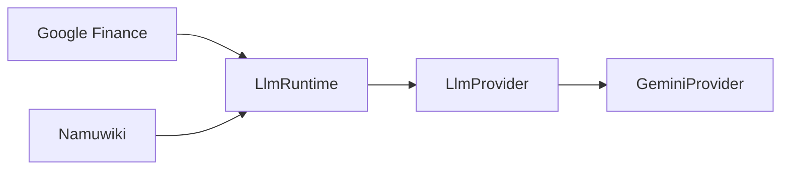

# ADR-0007: Shared LLM Runtime 도입

## Status

Accepted

## Date

2026-08-05

## Context

Google Finance와 Namuwiki가 각각 Gemini SDK, credential, retry와 quota 처리를 직접
소유하면 동일한 운영 정책이 Package마다 달라질 수 있다. 특히 profile별 credential,
local quota reservation, Provider 오류 분류를 공통 경계로 관리할 필요가 있었다.

## Decision

Package Application과 Gemini SDK 사이에 provider-neutral `LlmRuntime`을 둔다.

Runtime은 credential resolver, quota ledger, retry와 Provider 호출을 조정한다.
Package는 Prompt와 Domain 응답 검증을 담당한다.

## Consequences

### Positive

- Job/profile별 credential 선택을 한 경계에서 관리한다.
- RPD, RPM, TPM reservation을 Package 간 공유할 수 있다.
- retry와 503 Provider 오류 정책이 일관된다.
- Fake Provider와 Fake Runtime을 주입해 외부 API 없는 테스트가 가능하다.
- 향후 다른 Provider를 추가할 때 Application의 SDK 의존성을 피할 수 있다.

### Negative

- 단순한 단일 호출에도 Runtime, credential resolver와 quota ledger가 필요하다.
- quota ledger 파일과 운영 상태를 함께 관리해야 한다.
- Provider-neutral 계약과 SDK 변환 코드를 유지해야 한다.

## Alternatives Considered

1. 각 Package가 Gemini SDK를 직접 호출한다. 초기 구현은 단순하지만 quota와 retry 정책이
   중복되고 서로 달라질 위험이 있어 선택하지 않았다.
2. 모든 공통 코드를 `shared/`에 즉시 둔다. 현재 Rule of Three와 독립 Package 원칙에
   맞지 않으며, LLM Runtime이라는 명확한 책임 경계를 별도 Package로 두는 편이 낫다.
3. Runtime에서 Package별 Prompt와 Domain mapping까지 처리한다. Package 의미를 공통
   계층에 넣게 되므로 선택하지 않았다.

## Related Documents

- [LLM Runtime operations](../operations/llm_runtime.md)
- [Root Architecture](../architecture.md)
- [Namuwiki Package Architecture](../packages/namuwiki_trend/architecture.md)
- [Google Finance Package Architecture](../packages/google_finance/architecture.md)

## Future Work

- Additional LLM Providers
- Multi-host Quota Ledger
