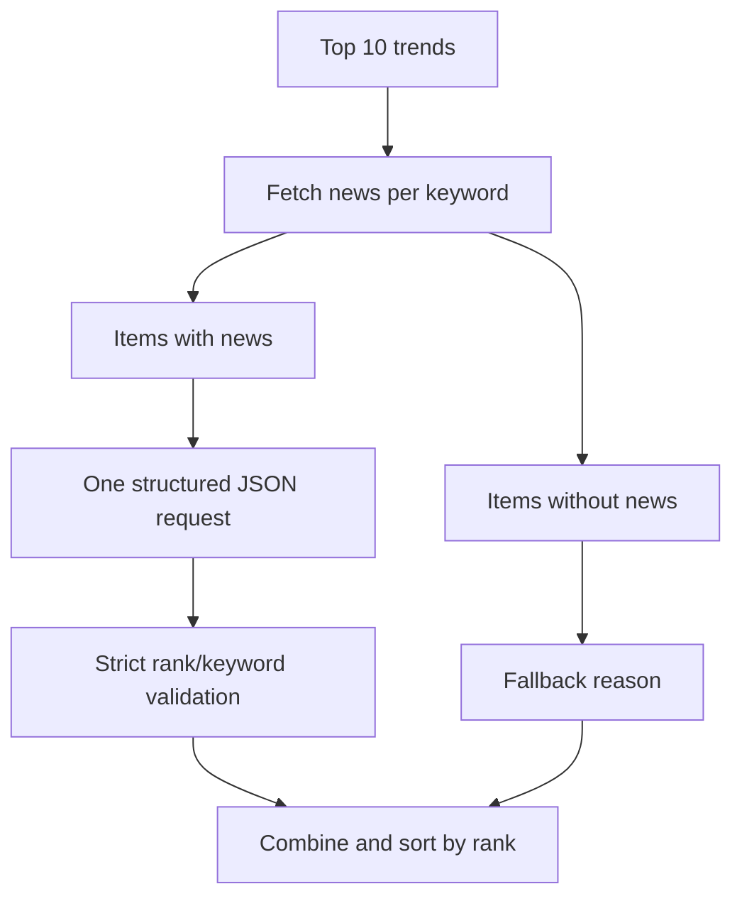

# ADR-0008: Namuwiki Batch Analysis 적용

## Status

Accepted

## Date

2026-08-05

## Context

Namuwiki Top 10 enrichment는 뉴스가 있는 검색어마다 Gemini를 호출하는 구조였다.
이 방식은 한 번의 실행에서 요청 수와 quota 사용량을 항목 수만큼 증가시킨다. 또한
부분 응답을 저장하면 rank와 keyword mapping이 불완전해질 수 있다.

## Decision

뉴스가 있는 Namuwiki 항목을 하나의 JSON 요청으로 분석한다. 뉴스가 없는 항목은
Gemini 입력에서 제외하고 기존 근거 부족 fallback을 사용한다.

Parser는 schema가 있어도 missing, duplicate, unknown item, pair mismatch와 reason 길이를
다시 검증한다. Batch가 실패하면 부분 결과를 저장하지 않고 기존 artifact를 유지한다.

## Consequences

### Positive

- 정상 경로의 Namuwiki Gemini 호출이 최대 10회에서 1회로 줄어든다.
- 뉴스가 없는 항목은 Gemini quota를 사용하지 않는다.
- 단일 응답에서 전체 mapping을 검증하므로 부분 저장을 막을 수 있다.
- Structured Output으로 JSON 형식 요구를 Provider에도 전달한다.

### Negative

- 하나의 Batch item이 잘못되어도 전체 Batch가 실패한다.
- 응답이 길어지면 JSON truncation 위험이 생긴다.
- Parser와 Prompt가 rank·keyword 계약을 함께 유지해야 한다.
- 실패한 항목만 다시 요청하는 개별 fallback은 사용하지 않는다.

## Alternatives Considered

1. 기존처럼 항목별 Gemini 호출을 유지한다. 구현은 단순하지만 요청 수와 quota 비용이
   증가하므로 선택하지 않았다.
2. 실패한 item만 개별 재요청한다. 부분 결과와 추가 quota 사용을 만들 수 있어 현재
   fail-fast artifact 계약과 맞지 않는다.
3. JSON을 문자열에서 fuzzy extraction하거나 자동 복구한다. 잘못된 mapping을 정상으로
   오인할 수 있어 선택하지 않았다.
4. Google Finance에도 같은 Batch를 즉시 적용한다. 현재 Google Finance는 종목별
   Generator를 사용하므로 이번 결정의 범위에 포함하지 않는다.

## Related Documents

- [LLM Runtime operations](../operations/llm_runtime.md)
- [Namuwiki operations](../operations/namuwiki_trend.md)
- [Namuwiki Package Architecture](../packages/namuwiki_trend/architecture.md)

## Future Work

- Google Finance Batch
- Dashboard LLM Insights
