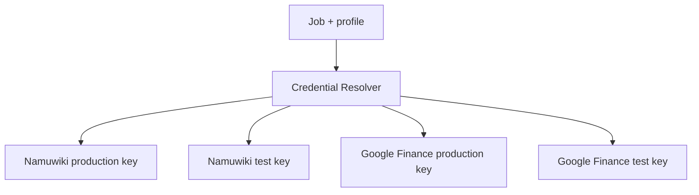

# ADR-0009: Gemini Production/Test Profile 분리

## Status

Accepted

## Date

2026-08-05

## Context

운영 cron과 수동 smoke test가 같은 Gemini credential을 사용하면 quota 사용량과
실패 영향을 분리하기 어렵다. Job별로도 서로 다른 credential을 선택해야 하며,
credential 값 자체는 Repository에 기록할 수 없다.

## Decision

Gemini credential을 Job과 profile의 조합으로 선택한다.

Production cron은 production profile만 사용한다. Test profile은 수동 smoke test 전용이며,
다른 Job이나 profile의 key로 fallback하지 않는다.

## Consequences

### Positive

- 운영과 테스트 실행의 credential 선택이 명시적이다.
- Job별 key 회전과 사용 추적이 가능하다.
- 잘못된 profile에서 다른 key를 조용히 사용하는 위험을 줄인다.
- Runtime과 quota ledger가 project profile 기준으로 사용량을 분리할 수 있다.

### Negative

- 환경변수와 운영 설정이 늘어난다.
- 같은 Google Cloud Project의 key는 여전히 quota를 공유한다.
- Production/Test quota를 실제로 분리하려면 별도 Google Cloud Project가 필요하다.
- cron과 수동 실행 명령에 profile을 명시해야 한다.

## Alternatives Considered

1. 하나의 `GEMINI_API_KEY`를 모든 Job과 환경에서 공유한다. 설정은 단순하지만 quota와
   운영 영향 분리가 불가능해 선택하지 않았다.
2. Production/Test를 profile로 구분하되 Job 간 key fallback을 허용한다. 잘못된 Job의
   credential을 사용할 수 있어 선택하지 않았다.
3. key를 코드나 문서에 기록한다. Secret 노출 위험 때문에 선택하지 않았다.
4. key를 분리하면 quota도 자동 분리된다고 가정한다. 같은 Project의 key는 quota를
   공유하므로 이 가정은 채택하지 않았다.

## Related Documents

- [LLM Runtime operations](../operations/llm_runtime.md)
- [Operations overview](../operations/README.md)
- [Google Finance operations](../operations/google_finance.md)
- [Namuwiki operations](../operations/namuwiki_trend.md)

## Future Work

- Multi-host Quota Ledger
- Additional LLM Providers
