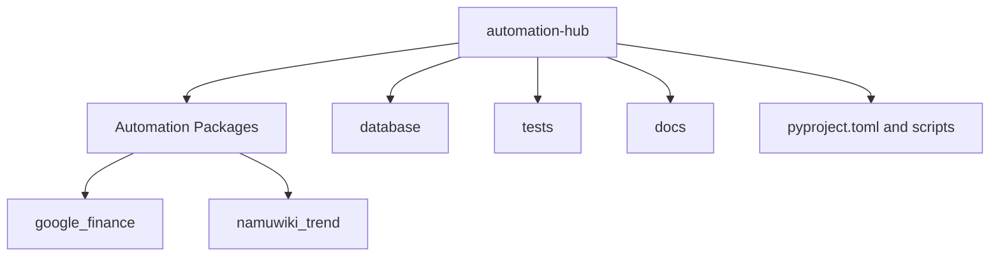
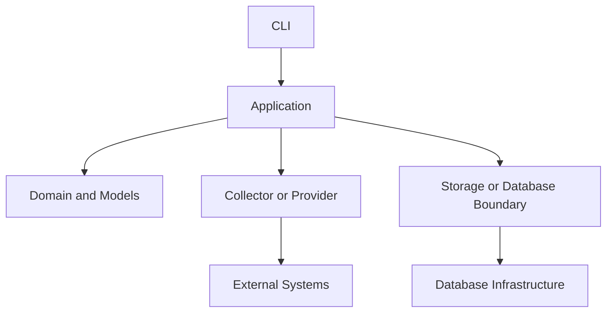
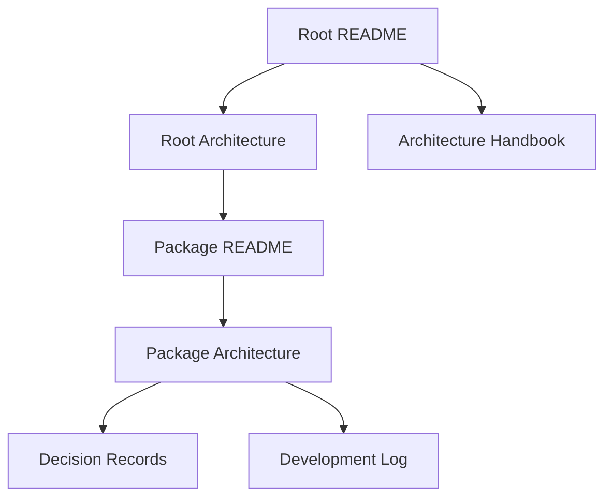

# automation-hub Repository Architecture

> 이 문서는 `automation-hub` 전체 Repository의 공통 구조와 책임 경계를 설명하는 Canonical Architecture 문서입니다.

이 문서의 범위는 Monorepo, Package Boundary, Root 공통 기반, 의존성 방향, 검증 전략과 문서 구조입니다. `google_finance`와 `namuwiki_trend` 내부의 수집·분석·저장 구현은 각 [Package Architecture](packages/)에서 관리합니다.

## Repository Structure

`automation-hub`는 독립적인 자동화 Package 두 개와 Root 수준의 개발·검증·데이터베이스 기반을 하나의 Repository에서 관리합니다. Python 코드는 `src/`를 사용하지 않는 flat layout으로 배치되며, `pyproject.toml`은 `google_finance*`, `namuwiki_trend*`, `database*` Package를 탐색 대상으로 지정합니다.



| 영역 | 공통 책임 |
|---|---|
| `google_finance/` | Google Finance 자동화의 모델·Application·Provider·Storage |
| `namuwiki_trend/` | Namuwiki 자동화의 수집·변환·Enrichment·출력 |
| `database/` | SQLAlchemy 기반과 현재 DB 모델·조회·저장 보조 코드 |
| `tests/` | Package와 데이터베이스 경계의 자동화 테스트 |
| `scripts/` | Repository 공통 검증 진입점 |
| `docs/` | 공통 규칙, Package 문서, 운영·결정·학습·기록 |

## Package Boundaries

각 Package는 외부 시스템과 자신의 데이터 의미, 실행 흐름을 소유합니다. `google_finance`와 `namuwiki_trend` 사이에는 현재 실제 실행 코드의 직접 import가 없습니다. 두 Package가 공유하는 것은 Root의 개발 환경, Package 탐색 설정, 검증 명령과 문서 정책입니다.

Package 내부의 구체적인 책임과 데이터 흐름은 다음 문서가 소유합니다.

| Package | 실행·현재 기능 | 상세 Architecture |
|---|---|---|
| `google_finance` | [Package README](packages/google_finance/README.md) | [Package Architecture](packages/google_finance/architecture.md) |
| `namuwiki_trend` | [Package README](packages/namuwiki_trend/README.md) | [Package Architecture](packages/namuwiki_trend/architecture.md) |

Root Architecture는 Package 내부의 Movement Rule, Watchlist, News Provider, Gemini, Collector와 Storage 구현을 복사하지 않습니다.

## Shared Components

현재 Repository에는 `shared/` Package가 없습니다. 공통 책임을 이름만 보고 추가하지 않으며, 실제 여러 Package에서 반복되는 코드와 동일한 변경 이유가 확인될 때만 공통화를 검토합니다.

Root의 `database/`는 모든 저장 구현을 추상화한 순수 공통 계층이 아닙니다. `database.base`, engine, session과 config 같은 DB 기반이 있고, `database.models`, `daily_trend_query.py`, `snapshot_save_service.py`처럼 현재 `namuwiki_trend`와 직접 연결된 코드도 함께 있습니다. Google Finance의 persistence model은 `google_finance/db_models.py`에 있으며 Root `database.base`를 사용합니다.

따라서 현재의 공통 기반과 Package 전용 코드가 완전히 분리되어 있다고 표현하지 않습니다. 이 경계와 변경 영향은 각 Package Architecture와 관련 [ADR](decisions/)에서 함께 확인해야 합니다.

## Dependency Direction

공통적으로 Application은 실행 흐름을 조정하고, 외부 시스템을 감싼 Collector·Provider와 내부 Model·Storage를 연결합니다. 실제 모듈 구성은 Package마다 다를 수 있으므로 아래 방향은 공통 원칙을 나타내며, 모든 모듈의 정확한 import graph를 의미하지 않습니다.



- Package 사이에 직접 기능 의존성을 만들지 않습니다.
- Collector와 Provider가 상위 Application이나 LLM을 직접 호출하지 않도록 합니다.
- Model은 계층 사이에서 의미 있는 데이터 계약을 보존합니다.
- 외부 시스템과 생성기는 가능한 경우 생성자 주입으로 교체 가능하게 합니다.
- Root의 Database 코드는 현재 완전히 공통화된 Domain 계층으로 간주하지 않습니다.

## Testing Strategy

기본 `pytest` 실행은 외부 네트워크, 실제 API와 실제 브라우저에 의존하지 않는 테스트를 우선합니다. Collector·Provider·SDK는 Fake 또는 Mock으로 대체하고, 파서와 변환은 격리된 입력으로 검증합니다.

Repository에는 Package 단위 테스트와 `tests/database/`의 데이터베이스 관련 테스트가 있습니다. MySQL Integration Test처럼 실행 환경이 필요한 검증은 기본 테스트와 별도 계약으로 관리합니다.

표준 검증 진입점은 다음 명령입니다.

```bash
python scripts/verify.py
```

이 Harness는 Ruff, pytest, `compileall`과 `git diff --check`를 순서대로 실행합니다. 외부 환경을 요구하는 추가 검증 조건은 각 Package Operations 문서에서 확인합니다.

## Documentation Structure

문서마다 하나의 Canonical 책임을 둡니다.



| 문서 영역 | Canonical 책임 |
|---|---|
| [Root README](../README.md) | Repository 소개, Quick Start, 문서 Navigation |
| 이 문서 | Repository 전체 Architecture |
| `docs/packages/<package>/README.md` | Package 실행 방법과 현재 기능 |
| `docs/packages/<package>/architecture.md` | Package 내부 설계 Reference |
| [Operations](operations/README.md) | 운영 환경과 실행 절차 |
| [Decision Records](decisions/README.md) | 장기 설계 결정 |
| [Development Log](development/DEV_LOG.md) | 시간순 개발 기록 |
| [Architecture Handbook](handbook/README.md) | 설계 판단을 학습하는 서사 |

같은 내용을 여러 문서에 복사하지 않습니다. 공통 Architecture는 이 문서에서, Package 내부 설계는 Package Architecture에서, 학습용 설명은 Handbook에서 관리하고 서로 링크합니다.

## Related Documents

- [Root README](../README.md): Repository의 첫 실행과 Documentation Hub입니다.
- [Google Finance README](packages/google_finance/README.md): Google Finance 실행 방법과 현재 기능입니다.
- [Google Finance Architecture](packages/google_finance/architecture.md): Google Finance 내부 설계 Reference입니다.
- [Namuwiki README](packages/namuwiki_trend/README.md): Namuwiki 실행 방법과 현재 기능입니다.
- [Namuwiki Architecture](packages/namuwiki_trend/architecture.md): Namuwiki 내부 설계 Reference입니다.
- [Decision Records](decisions/README.md): 장기 설계 선택의 근거입니다.
- [Development Log](development/DEV_LOG.md): 구현과 검증의 시간순 기록입니다.
- [Architecture Handbook](handbook/README.md): Repository 사례를 통한 학습 경로입니다.

## Next Reading

- [Package README](packages/): 실행하려는 자동화 Package를 선택합니다.
- [Decision Records](decisions/README.md): 공통 Architecture 선택의 근거를 확인합니다.
