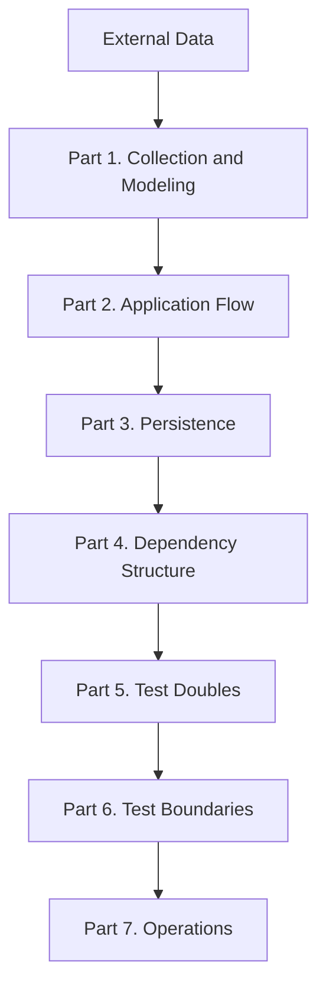

# Python Automation Architecture Concepts

## 이 책은 무엇인가

이 책은 Python 자동화 시스템을 설계할 때 필요한 백엔드와 소프트웨어 아키텍처 개념을 순서대로 학습하는 개념서입니다.

`automation-hub`는 개념을 확인하는 실제 사례로만 사용합니다. 이 문서는 Repository 사용법이나 현재 구현의 정확한 Reference가 아니며, 특정 폴더 구조를 그대로 복사하도록 안내하지도 않습니다. 개념을 먼저 이해하고, 마지막에 실제 사례와 연결하는 방식으로 읽습니다.

Python 문법보다 설계 판단, 책임 경계, 데이터 흐름과 외부 의존성의 관계를 중심으로 설명합니다. 큰 Architecture 개념뿐 아니라 HTML, 정규화와 저장처럼 각 개념을 이해하는 데 필요한 기초 용어도 짧게 설명합니다.

## 대상 독자

- Python 기본 문법을 아는 초급 개발자
- 자동화 스크립트를 유지 가능한 시스템으로 발전시키고 싶은 사람
- Backend Architecture 개념을 실제 사례와 연결해 배우고 싶은 사람
- RPA 경험을 Python 자동화 개발 역량으로 확장하려는 사람

## 다른 문서와의 차이

| 문서 | 역할 |
|---|---|
| [Package README](../packages/google_finance/README.md) | 실행 방법과 현재 기능 |
| [Package Architecture](../packages/google_finance/architecture.md) | 현재 Repository의 정확한 설계 Reference |
| [Architecture Handbook](../handbook/README.md) | 프로젝트에서 설계 판단이 형성된 과정 |
| Concepts Book | 개념 자체의 정의, 원리, 비교와 실무 판단 |
| [DEV_LOG](../development/DEV_LOG.md) | 시간순 개발 기록 |

## Book Structure

| Part | 학습 주제 | 포함 Chapter | 학습 후 설명할 수 있어야 하는 것 |
|---|---|---|---|
| Part 1 | External Data to Internal Meaning | 1~3 | 외부 원시 데이터를 내부 모델로 바꾸는 경계 |
| Part 2 | Coordinating a Use Case | 4~6 | Application, Pipeline, Provider의 역할과 연결 |
| Part 3 | Preserving Data | 7~9 | Domain 데이터를 저장하고 다시 조회하는 경계 |
| Part 4 | Structuring Dependencies | 10~12 | 의존성을 조립하고 교체 가능한 구조를 만드는 방법 |
| Part 5 | Replacing Dependencies in Tests | 13~15 | Test Double과 경계 테스트의 목적 |
| Part 6 | Defining Test Boundaries | 16~18 | 테스트 수준별로 증명되는 범위와 한계 |
| Part 7 | Operating an Automation System | 19~21 | 반복 실행 자동화의 설정, 관찰, 동시성 문제 |

`STUDY_NOTE`는 학습 순서와 코드 탐색 경로를 안내하고, 이 디렉터리는 상세한 개념 설명을
제공합니다. 기존 Concepts Chapter 번호(Collector 1~Logging 21)와 `STUDY_NOTE` Chapter
번호는 서로 다른 학습 목차이므로 혼동하지 않습니다.

문서는 두 역할로 나뉩니다.

- **Canonical Concept**: `provider.md`, `domain-model.md`, `unit-test.md`처럼 하나의 개념을
  집중적으로 설명하는 기준 문서입니다.
- **Integrated Learning Guide**: Sprint B~J 문서처럼 여러 개념을 실제 `automation-hub`
  흐름과 연결해 학습하는 통합 안내서입니다. Canonical 문서를 대체하거나 삭제하지 않습니다.

처음 읽는다면 다음 순서를 권장합니다.

1. [Python Project Structure](python-project-structure.md)
2. [Python Data Contracts](python-data-contracts.md)
3. [Software Design Foundations](software-design-foundations.md)
4. [Protocol and Dependency Injection](protocol-and-dependency-injection.md)
5. [Pipeline, Provider and Storage](pipeline-provider-storage.md)
6. [Domain and Persistence Models](domain-and-persistence-models.md)
7. [Relational Database Design](relational-database-design.md)
8. [HTTP, REST API, JSON and External API](http-rest-json-external-api.md)
9. [Error Handling and Resilience](error-handling-and-resilience.md)
10. [Testing Fundamentals and Test Doubles](testing-fundamentals-and-test-doubles.md)
11. [Process, Shell and Operations](process-shell-and-operations.md)

| 보충 문서 | 다루는 범위 |
|---|---|
| [Python Project Structure](python-project-structure.md) | source file, module, package, import, virtual environment, dependency, `pyproject.toml` |
| [Python Data Contracts](python-data-contracts.md) | type hint, dataclass, Enum, optional value, `Path`, provider-to-domain contract |
| [Software Design Foundations](software-design-foundations.md) | responsibility, separation of concerns, coupling, cohesion, abstraction, boundary |
| [Protocol and Dependency Injection](protocol-and-dependency-injection.md) | interface, Protocol, dependency, DIP, DI, Composition Root |
| [Pipeline, Provider and Storage](pipeline-provider-storage.md) | orchestration, Provider, Pipeline, Storage, Repository와 application flow |
| [Domain and Persistence Models](domain-and-persistence-models.md) | Domain Model, DTO, Persistence Model, ORM Model과 변환 경계 |
| [SQLAlchemy Session, Transaction and Migration](sqlalchemy-session-transaction-migration.md) | Session, flush, commit, rollback, Transaction, Snapshot, UTC/KST, Alembic |
| [Relational Database Design](relational-database-design.md) | PK/FK, 관계, constraint, index, query와 Bus Monitor schema 판단 |
| [HTTP, REST API, JSON and External API](http-rest-json-external-api.md) | HTTP request/response, JSON 경계, requests, 인증과 Provider 정규화 |
| [Web, DOM and Browser Automation](web-dom-browser-automation.md) | HTML, DOM, CSS selector, SSR/CSR, scraping과 Playwright 선택 |
| [Error Handling and Resilience](error-handling-and-resilience.md) | Exception boundary, timeout, retry, quota, partial success와 exit code |
| [Testing Fundamentals and Test Doubles](testing-fundamentals-and-test-doubles.md) | Unit/Integration/Live 경계, Fake/Mock/Fixture와 verification |
| [Process, Shell and Operations](process-shell-and-operations.md) | Process, wrapper, environment, PATH, cron, flock, timeout과 logging |

## Complete Chapter Map

| Chapter | 제목 | 핵심 질문 | 선행 개념 | 상태 |
|---:|---|---|---|---|
| 1 | [Collector](collector.md#chapter-1-collector) | 외부 시스템에서 원시 데이터를 어떻게 가져오는가? | 없음 | Available |
| 2 | [Parser and Extraction](parser.md#chapter-2-parser-and-extraction) | 원시 데이터를 어떻게 검증하고 변환하는가? | Collector | Available |
| 3 | [Domain Model](domain-model.md#chapter-3-domain-model) | 내부 데이터의 의미와 유효한 상태를 어떻게 표현하는가? | Parser and Extraction | Available |
| 4 | [Application Service](application-service.md#chapter-4-application-service) | 하나의 Use Case 흐름을 어디에서 조정하는가? | Domain Model | Available |
| 5 | [Pipeline and Orchestration](pipeline-and-orchestration.md#chapter-5-pipeline-and-orchestration) | 여러 단계를 어떤 순서와 경계로 연결하는가? | Application Service | Available |
| 6 | [Provider](provider.md#chapter-6-provider) | 외부 서비스 의존성을 어떻게 감싸고 교체하는가? | Pipeline and Orchestration | Available |
| 7 | [Persistence](persistence.md#chapter-7-persistence) | 내부 데이터를 영속 데이터와 어떻게 연결하는가? | Domain Model | Available |
| 8 | [Repository Pattern](repository-pattern.md#chapter-8-repository-pattern) | 저장소 접근을 어떤 계약으로 분리하는가? | Persistence | Available |
| 9 | [ORM and Data Mapping](orm-and-data-mapping.md#chapter-9-orm-and-data-mapping) | Domain Model과 데이터베이스 표현을 어떻게 매핑하는가? | Repository Pattern | Available |
| 10 | [Dependency Injection](dependency-injection.md#chapter-10-dependency-injection) | 객체는 누가 생성해야 하는가? | Application Service | Available |
| 11 | [Composition Root](composition-root.md#chapter-11-composition-root) | 의존성은 프로젝트 어디에서 조립해야 하는가? | Dependency Injection | Available |
| 12 | [Configuration](configuration.md#chapter-12-configuration) | 환경 변수와 설정은 왜 Domain 안으로 들어가면 안 되는가? | Composition Root | Available |
| 13 | [Fake](fake.md#chapter-13-fake) | 왜 실제 외부 시스템 대신 동작하는 구현이 필요한가? | Configuration | Available |
| 14 | [Mock and Stub](mock-and-stub.md#chapter-14-mock-and-stub) | Mock과 Stub은 언제 사용해야 하는가? | Fake | Available |
| 15 | [Test Fixture](test-fixture.md#chapter-15-test-fixture) | 테스트 데이터를 어떻게 관리해야 하는가? | Mock and Stub | Available |
| 16 | [Unit Test](unit-test.md#chapter-16-unit-test) | 가장 작은 단위는 무엇을 검증해야 하는가? | Test Fixture | Available |
| 17 | [Integration Test](integration-test.md#chapter-17-integration-test) | 여러 구성요소가 함께 동작하는 것은 어떻게 검증하는가? | Unit Test | Available |
| 18 | [Live Test](live-test.md#chapter-18-live-test) | 실제 외부 시스템은 언제 검증해야 하는가? | Integration Test | Available |
| 19 | [Command-Line Interface (CLI)](cli.md#chapter-19-command-line-interface-cli) | 프로그램은 어디에서 시작되어야 하는가? | Live Test | Available |
| 20 | [Scheduler](scheduler.md#chapter-20-scheduler) | 프로그램은 언제 실행되어야 하는가? | Command-Line Interface (CLI) | Available |
| 21 | [Logging](logging.md#chapter-21-logging) | 프로그램은 무엇을 기록해야 하는가? | Scheduler | Available |

## Recommended Reading Path

기본 경로는 Chapter 1부터 21까지 순서대로 읽는 것입니다. 각 Chapter는 앞 단계에서 생긴 문제를 다음 개념으로 해결하도록 구성합니다.

Python 프로젝트를 처음 읽는 독자는 먼저 [Python Project Structure](python-project-structure.md)와
[Python Data Contracts](python-data-contracts.md)를 읽은 뒤 이 책의 Collector Chapter로 이동합니다.
Architecture를 읽을 때는 [Software Design Foundations](software-design-foundations.md),
[Protocol and Dependency Injection](protocol-and-dependency-injection.md),
[Pipeline, Provider and Storage](pipeline-provider-storage.md) 순서를 따릅니다.
Persistence를 읽을 때는 [Domain and Persistence Models](domain-and-persistence-models.md)에서
도메인과 저장 모델을 구분하고, [Relational Database Design](relational-database-design.md)에서
PK/FK·constraint·index·query를 실제 schema와 연결한 뒤,
[SQLAlchemy Session, Transaction and Migration](sqlalchemy-session-transaction-migration.md)으로
이동한 뒤 기존 [Database Learning](../database/database_learning.md)을 세부 Reference로 사용합니다.

Web/API를 읽을 때는 [HTTP, REST API, JSON and External API](http-rest-json-external-api.md)에서
HTTP와 JSON 경계를 먼저 익힌 뒤 Provider 문서와 실제 integration code를 읽습니다.
Browser 수집은 [Web, DOM and Browser Automation](web-dom-browser-automation.md)에서
초기 HTML과 최종 DOM의 차이를 이해한 뒤 실제 collector를 읽습니다.
실패 처리는 [Error Handling and Resilience](error-handling-and-resilience.md)에서
Provider 예외, Domain status, CLI/cron exit code의 경계를 연결합니다.
Testing은 [Testing Fundamentals and Test Doubles](testing-fundamentals-and-test-doubles.md)에서
Fake와 실제 외부 시스템의 검증 범위를 구분한 뒤 관련 테스트를 읽습니다.
운영 실행은 [Process, Shell and Operations](process-shell-and-operations.md)에서
Program/Process와 wrapper·cron·환경의 관계를 이해한 뒤 운영 문서를 읽습니다.

| 목적 | 읽기 경로 | 건너뛸 때 놓치는 내용 |
|---|---|---|
| 빠른 프로젝트 구조 이해 | 1 → 2 → 3 → 4 → 5 → 6 | 저장, 의존성, 테스트와 운영의 후속 경계를 다루지 않음 |
| Persistence 중심 | 3 → 7 → 8 → 9 | Application이 Domain을 연결하는 과정을 건너뜀 |
| Architecture 중심 | 3 → 4 → 10 → 11 → 12 | 저장소와 테스트 경계를 충분히 다루지 않음 |
| Testing 중심 | 4 → 6 → 13 → 14 → 15 → 16 → 17 → 18 | 테스트 전에 Application과 Provider가 왜 필요한지 일부 생략함 |
| Operations 중심 | 6 → 19 → 20 → 21 | 테스트 경계와 실제 운영 검증의 연결을 생략함 |

## How to Study Each Chapter

각 Chapter는 다음 순서로 읽는 것을 권장합니다.

1. Real World Example에서 익숙한 상황을 먼저 떠올립니다.
2. Background Knowledge에서 낯선 용어를 확인합니다.
3. Definition과 Responsibilities를 읽습니다.
4. Mermaid 흐름을 자신의 말로 설명합니다.
5. Minimal Python Example로 원리를 이해합니다.
6. Example from automation-hub에서 실제 코드를 확인합니다.
7. Source 링크로 Repository 파일을 직접 엽니다.
8. Checkpoint 질문에 자신의 언어로 답합니다.

현재 Available Chapter는 개념 설명과 사례 연결까지 제공하지만, 아직 작성되지 않은 Planned Chapter의 내용이나 링크를 미리 제공하지 않습니다.

## Start Reading

- [Python Project Structure](python-project-structure.md): `automation-hub`의 package, import와 실행 환경을 읽는 기초입니다.
- [Python Data Contracts](python-data-contracts.md): 외부 값을 dataclass·Enum 기반 내부 계약으로 바꾸는 기초입니다.
- [Software Design Foundations](software-design-foundations.md): 책임·결합·응집·경계를 작은 예제로 이해합니다.
- [Protocol and Dependency Injection](protocol-and-dependency-injection.md): Protocol과 생성자 주입을 실제 wiring과 연결합니다.
- [Pipeline, Provider and Storage](pipeline-provider-storage.md): Bus Monitor와 다른 package의 application 흐름을 비교합니다.
- [Domain and Persistence Models](domain-and-persistence-models.md): Python 업무 객체가 저장 모델로 바뀌는 경계를 이해합니다.
- [SQLAlchemy Session, Transaction and Migration](sqlalchemy-session-transaction-migration.md): 객체 저장, Transaction, Snapshot과 schema 이력을 연결합니다.
- [HTTP, REST API, JSON and External API](http-rest-json-external-api.md): HTTP 요청, JSON 정규화, API key와 Provider 경계를 이해합니다.
- [Web, DOM and Browser Automation](web-dom-browser-automation.md): HTML, DOM, 동적 렌더링과 Playwright 선택을 이해합니다.
- [Error Handling and Resilience](error-handling-and-resilience.md): 예외, timeout, retry, partial success와 운영 exit code를 이해합니다.
- [Testing Fundamentals and Test Doubles](testing-fundamentals-and-test-doubles.md): Unit/Integration/Live 테스트와 대역 객체의 경계를 이해합니다.
- [Process, Shell and Operations](process-shell-and-operations.md): Process, Shell, 환경변수와 cron/flock 실행 경계를 이해합니다.
- [Chapter 1. Collector](collector.md#chapter-1-collector): 외부 시스템과 내부 데이터 사이의 첫 경계를 이해합니다.
- [Chapter 2. Parser and Extraction](parser.md#chapter-2-parser-and-extraction): 원시 표현을 검증하고 변환하는 방법을 이해합니다.
- [Chapter 3. Domain Model](domain-model.md#chapter-3-domain-model): 변환된 데이터에 업무 의미를 부여하는 방법을 이해합니다.

## Related Project Documents

- [Root README](../../README.md): Repository의 실행과 전체 문서 진입점입니다.
- [Root Architecture](../architecture.md): Repository 전체 구조의 기준 문서입니다.
- [Architecture Handbook](../handbook/README.md): 실제 프로젝트에서 설계 판단이 형성된 과정을 읽습니다.
- [Google Finance Architecture](../packages/google_finance/architecture.md): Google Finance 현재 구현 Reference입니다.
- [Namuwiki Architecture](../packages/namuwiki_trend/architecture.md): Namuwiki Trend 현재 구현 Reference입니다.

## Next Reading

- [Chapter 1. Collector](collector.md#chapter-1-collector): 책의 첫 개념부터 시작합니다.
