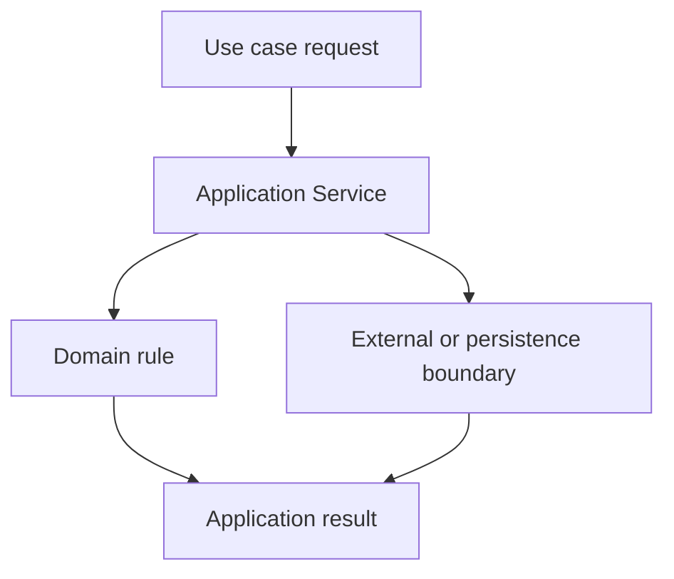

# Chapter 4. Application Service

## Real World Example

여행을 예약할 때는 좌석을 확인하고, 결제하고, 예약 결과를 알려주는 순서가 필요합니다.

각 일을 누가 어떤 순서로 연결할지 정하지 않으면 호출하는 사람마다 흐름이 달라집니다.

Application Service는 하나의 사용 목적을 실행하는 순서를 맡습니다.

## Why Does It Exist?

Domain Model은 중요한 규칙을 표현하지만, 보통 전체 업무 흐름을 혼자 실행하지는 않습니다. 여러 모델을 조회하고, 외부 서비스를 호출하고, 결과를 다시 조합하는 작업까지 Domain Model에 넣으면 모델이 Storage와 Provider를 알게 됩니다.

Application Service는 이 연결 문제를 해결합니다. 호출자는 여러 구성요소를 직접 조정하지 않고 하나의 Use Case를 호출할 수 있습니다. Domain Model은 자신의 규칙에 집중하고, Application Service는 그 규칙이 실행되는 순서를 관리합니다.

## Definition

Application Service는 하나의 사용 목적을 실행하는 흐름을 담당합니다. 먼저 입력을 받습니다. 그다음 필요한 Domain 연산과 외부 경계를 정해진 순서로 연결하고 결과를 반환합니다. Domain Model의 규칙을 대신 만들기보다, 하나의 업무 흐름이 실행되는 방법을 조정합니다.

## Background Knowledge

### Use Case(사용 사례)

사용자가 시스템으로 하려는 하나의 목적입니다. 예를 들어 최신 가격을 조회하거나 저장된 두 값을 비교하는 일이 하나의 Use Case가 될 수 있습니다.


예를 들어 “저장된 최신 두 가격을 비교한다”가 하나의 Use Case입니다.

### Application Layer(애플리케이션 계층)

요청을 받아 Domain 규칙과 외부 구성요소를 연결하는 영역입니다. 이 Chapter의 Application Service는 이 계층에서 하나의 Use Case를 실행합니다.


예를 들어 버튼 입력을 받아 필요한 작업을 순서대로 실행하는 코드가 이 영역에 놓일 수 있습니다.

### Business Rule(업무 규칙)

업무상 어떤 상태를 허용하고 어떻게 판단할지 정하는 규칙입니다. 모든 Business Rule을 Application Service 안에 넣는다는 뜻은 아닙니다.


예를 들어 잔액보다 큰 금액은 출금할 수 없다는 규칙이 Business Rule입니다.

### Orchestration(조정)

여러 작업을 어떤 순서로 호출하고 결과를 어떻게 연결할지 정하는 일입니다.

예를 들어 조회 후 계산하고 마지막에 저장하도록 작업 순서를 정하는 것이 Orchestration입니다.

## Responsibilities

| 해야 하는 일 | 하면 안 되는 일 |
|---|---|
| 하나의 Use Case 입력을 받는다 | 핵심 업무 규칙을 여러 단계에 복사한다 |
| 필요한 구성요소의 호출 순서를 조정한다 | 데이터베이스 세부 구현을 직접 수행한다 |
| Domain Model과 외부 경계를 연결한다 | 외부 API의 응답 형식을 Domain 규칙으로 사용한다 |
| 정상 결과와 Application 상태를 표현한다 | 모든 예외를 조용히 성공으로 바꾼다 |
| 호출자에게 필요한 결과를 반환한다 | 여러 Use Case의 책임을 하나로 합친다 |

Application Service는 흐름의 소유자이지만 모든 규칙의 소유자는 아닙니다. 특정 값이 유효한지, 두 상태를 어떻게 비교하는지는 해당 Domain Model이나 Domain 연산이 결정해야 합니다.

## Typical Workflow



Application Service는 입력을 해석하고 필요한 순서를 조정합니다. Domain 연산과 외부 경계의 결과를 조합한 뒤 호출자가 이해할 수 있는 결과를 반환합니다. 이 흐름은 Application Service가 모든 하위 구현을 알아야 한다는 뜻이 아니라, 연결에 필요한 계약을 사용한다는 뜻입니다.

## Relationship with Other Concepts

| 개념 | Application Service와의 차이 |
|---|---|
| Domain Model | 업무 의미와 핵심 규칙을 표현한다 |
| Pipeline | 하나의 흐름을 더 작은 단계의 순서로 구조화할 수 있다 |
| Provider | 외부 서비스 접근 방법을 감싼다 |
| Repository | 영속 데이터의 저장과 조회를 감싼다 |
| Controller or CLI | 외부 요청을 Application Service 호출로 변환한다 |

Application Service와 Pipeline은 겹칠 수 있습니다. 작은 Use Case에서는 하나의 함수가 두 역할을 함께 가질 수 있고, 흐름이 커지면 Application Service가 Use Case의 경계를 소유하고 Pipeline이 내부 단계를 조정하도록 나눌 수 있습니다.

## Common Mistakes

- Domain Model이 Storage나 Provider를 직접 호출하게 한다.
- Application Service에 모든 데이터 변환과 업무 규칙을 넣는다.
- CLI에서 여러 하위 구성요소를 직접 호출한다.
- 하나의 거대한 Service가 수집, 저장, 알림, 분석을 모두 담당한다.
- 하위 단계의 예외를 무조건 기본값으로 바꾼다.
- 호출 순서만 바뀌었는데 Domain Model까지 수정한다.

이런 구조에서는 Use Case의 흐름과 개별 규칙의 변경 이유를 구분하기 어렵습니다.

## Best Practices

1. 하나의 Application Service가 하나의 명확한 Use Case를 대표하게 합니다.
2. 입력과 결과를 명시적인 타입이나 계약으로 표현합니다.
3. Domain 연산은 직접 수행하기보다 호출하고 결과를 조정합니다.
4. 외부 경계는 생성자 주입이나 작은 호출 계약으로 연결합니다.
5. 정상적인 unavailable 상태와 실제 실패를 구분합니다.
6. 흐름이 커질 때만 내부 단계를 별도 Pipeline으로 분리합니다.

Application Service를 만들기 전에 호출자가 이미 충분히 단순한지도 확인해야 합니다. 모든 함수 호출에 Service 클래스를 추가하는 것이 좋은 설계는 아닙니다.

## Trade-offs

| 선택 | 장점 | 단점 |
|---|---|---|
| Use Case마다 Application Service를 둔다 | 실행 경계와 테스트 대상이 명확하다 | 함수와 파일 수가 늘어난다 |
| 호출자가 하위 구성요소를 직접 조정한다 | 작은 기능을 빠르게 만들 수 있다 | 실행 순서와 의존성이 여러 곳에 퍼진다 |
| Application Service가 결과를 조합한다 | 호출자는 하나의 결과 계약을 사용한다 | 변환과 상태 판단이 과도하게 모일 수 있다 |
| Domain Model에 흐름까지 넣는다 | 호출 경로가 짧아 보인다 | Domain이 외부 의존성에 묶인다 |

작은 기능에서는 단순한 함수가 충분할 수 있습니다. 독립적인 Use Case 경계가 실제로 필요할 때 Application Service를 도입하는 것이 적절합니다.

## Minimal Python Example

```python
def create_order(load_customer, save_order, customer_id: str) -> str:
    customer = load_customer(customer_id)
    if customer is None:
        raise ValueError("customer not found")
    order_id = f"order-{customer_id}"
    save_order(order_id)
    return order_id


orders = []
result = create_order(lambda _: "customer", orders.append, "C-1")
assert result == "order-C-1"
```

Application Service는 여러 호출의 순서와 Use Case 결과를 조정하지만, 각 하위 구성요소의 세부 구현은 소유하지 않습니다.

## Example from automation-hub

앞의 작은 예제에서는 고객을 조회하고 주문을 저장하는 흐름을 함수가 조정했습니다. 실제 Application Service도 Storage 조회와 Domain 계산의 순서를 연결합니다.

### 실제 코드

이 함수는 symbol을 정규화하고 최신 두 snapshot을 조회한 뒤, 비교가 불가능하면 `MovementUnavailable`을 반환합니다.

```python
def lookup_movement(
    storage: StockQuoteStorage,
    symbol: str,
) -> MovementResult | MovementUnavailable:
    """Look up two stored snapshots and compare them when possible."""
    normalized_symbol = validate_symbol(symbol)
    snapshots = storage.get_latest_two(normalized_symbol)
    if len(snapshots) < 2:
        return MovementUnavailable(
            symbol=normalized_symbol,
            snapshot_count=len(snapshots),
        )

    return detect_movement(latest=snapshots[0], previous=snapshots[1])
```

Source: [`google_finance/movement_application.py`](../../google_finance/movement_application.py)

### 코드에서 확인할 점

- **이 코드는 무엇을 하는가?** 이 함수는 symbol을 정규화하고 최신 두 snapshot을 조회한 뒤, 비교가 불가능하면 `MovementUnavailable`을 반환합니다.
- **왜 이 Chapter의 개념인가?** Application Service가 하나의 Use Case를 조립하는 책임을 보여 줍니다.
- **무엇을 하지 않는가?** 가격 차이의 판정 규칙은 `movement.py`에 있고, DB 쿼리의 세부 구현은 Storage에 있습니다.

### Repository에서 따라가 보기

- `google_finance/movement.py`의 `detect_movement()`를 읽습니다.

## Checkpoint

1. Application Service가 Domain Model과 다른 책임을 가지는 이유는 무엇입니까?
2. 실행 순서를 호출자마다 반복하면 어떤 문제가 생깁니까?
3. Application Service가 외부 기술의 세부사항을 직접 가지지 않아야 하는 이유는 무엇입니까?
4. 작은 기능에서 별도 Service를 만들지 않아도 되는 기준은 무엇입니까?

## Summary

이번 Chapter에서 기억해야 할 것은 다음입니다. Application Service는 하나의 Use Case를 위해 여러 구성요소의 호출 순서와 결과를 조정합니다. Domain 규칙을 대신하지 않고, 외부 기술의 세부 구현도 소유하지 않습니다. 다음에는 하나의 흐름이 여러 단계로 커질 때 Pipeline으로 나누는 방법을 살펴봅니다.

## Related Concepts

- [Domain Model](domain-model.md#chapter-3-domain-model): Application Service가 호출하는 내부 업무 의미를 표현합니다.
- [Pipeline and Orchestration](pipeline-and-orchestration.md#chapter-5-pipeline-and-orchestration): 커지는 Use Case의 단계를 조정합니다.
- [Provider](provider.md#chapter-6-provider): 외부 시스템과 통신하는 경계를 제공합니다.

## Related Project Documents

- [Architecture Handbook](../handbook/README.md): Application Layer와 Domain 독립성의 설계 과정을 학습합니다.
- [Google Finance Architecture](../packages/google_finance/architecture.md): 현재 Application 흐름의 Reference입니다.
- [Namuwiki Architecture](../packages/namuwiki_trend/architecture.md): 현재 Pipeline과 Application 구조의 Reference입니다.
- [CODEBASE_GUIDE](../../CODEBASE_GUIDE.md): Repository 코드 탐색 순서입니다.
- [Root Architecture](../architecture.md): Repository 전체 구조입니다.

## Next Chapter

[Chapter 5. Pipeline and Orchestration](pipeline-and-orchestration.md#chapter-5-pipeline-and-orchestration)에서는 하나의 Use Case를 여러 단계로 나누고 조정하는 방법을 설명합니다.

---

| 이전 Chapter | 목차 | 다음 Chapter |
|---|---|---|
| [Chapter 3. Domain Model](domain-model.md#chapter-3-domain-model) | [Concepts Book](README.md#python-automation-architecture-concepts) | [Chapter 5. Pipeline and Orchestration](pipeline-and-orchestration.md#chapter-5-pipeline-and-orchestration) |
