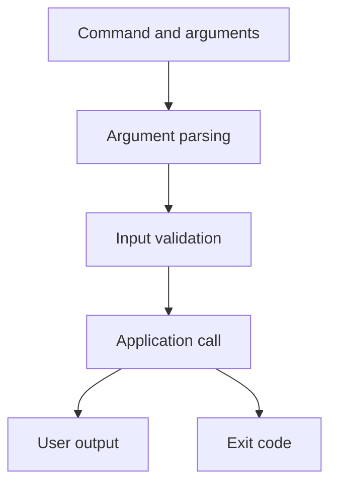

# Chapter 19. Command-Line Interface (CLI)

## Real World Example

자판기는 버튼과 금액을 입력받아 음료를 내놓고 성공 또는 오류 상태를 표시합니다.

터미널 프로그램도 명령과 인자를 받아 실행 결과와 종료 상태를 돌려줍니다.

CLI는 사람이 프로그램을 시작하는 입구입니다.

## Why Does It Exist?

프로그램을 다른 사람이 반복 실행하려면 함수 호출 방법만으로는 부족합니다. CLI는 사람이 실행할 수 있는 명령, 자동화 도구가 전달할 수 있는 인자와 운영체제가 해석할 수 있는 종료 상태를 제공합니다.

CLI를 두면 동일한 Application을 터미널, Cron, CI Job과 같은 실행 환경에서 사용할 수 있습니다. 반대로 CLI에 업무 규칙을 넣으면 Library 재사용과 테스트가 어려워집니다.

## Definition

CLI는 터미널에서 명령을 입력해 프로그램을 실행하는 방법입니다. CLI는 입력을 해석하고 Application을 호출한 뒤 결과와 Exit Code를 반환합니다. CLI는 Library나 Domain 자체가 아니며, 실행 환경과 내부 규칙 사이의 얇은 진입점이어야 합니다.

## Background Knowledge

### Entry Point(진입점)

프로그램 실행이 시작되는 함수, Module 또는 등록된 명령이다.

사용자는 내부 함수 호출 순서를 몰라도 Entry Point를 통해 Application을 시작할 수 있다.

예를 들어 `python -m package.main`이 Python 프로그램의 진입점이 될 수 있다.


### Argument(인자)

명령을 실행할 때 프로그램에 전달하는 값이나 옵션이다.

인자는 같은 프로그램을 다른 대상과 모드로 실행하게 하며, 입력 검증의 시작점이 된다.

예를 들어 `--analyze`나 `NVDA:NASDAQ`을 명령에 전달할 수 있다.


### Exit Code(종료 코드)

프로세스가 끝난 뒤 운영체제와 호출자에게 결과를 숫자로 알리는 값이다.

스크립트와 CI는 화면의 문장보다 Exit Code로 성공과 실패를 자동 판단할 수 있다.

예를 들어 0은 성공, 0이 아닌 값은 오류를 나타내도록 약속할 수 있다.

## Responsibilities

| 해야 하는 일 | 하면 안 되는 일 |
|---|---|
| Command와 Argument를 파싱한다 | 핵심 Business Rule을 직접 계산한다 |
| 입력 오류를 사용자에게 설명한다 | Database나 Provider를 여러 개 직접 조정한다 |
| Application을 호출한다 | 내부 모듈의 구현을 다시 작성한다 |
| 결과를 사람이 읽을 형식으로 출력한다 | 비밀 정보와 원본 예외를 출력한다 |
| 성공·실패를 Exit Code로 표현한다 | CLI 호출만을 유일한 사용 방식으로 강제한다 |

Thin CLI 원칙은 CLI가 아무 일도 하지 않는다는 뜻이 아닙니다. 외부 입력을 내부 계약으로 바꾸고, 이미 조립된 Application을 호출하며, 결과를 운영체제가 이해할 형태로 내보내는 정도로 책임을 제한한다는 뜻입니다.

## Typical Workflow



파싱 실패는 보통 사용자의 입력 오류이고, Application 실패는 실행 중 발생한 오류입니다. 두 종류를 구분하면 메시지와 Exit Code를 더 정확히 설계할 수 있습니다.

## Relationship with Other Concepts

| 개념 | CLI와의 차이 |
|---|---|
| Library | 다른 코드가 함수·객체를 import해 사용한다 |
| API | 네트워크를 통해 다른 프로세스에 기능을 제공한다 |
| Command | 특정 작업을 요청하는 이름과 동작이다 |
| Argument | Command에 전달되는 값이나 옵션이다 |
| Entry Point | 프로그램 실행이 시작되는 등록·함수·Module 경계이다 |
| Exit Code | 프로세스 결과를 운영체제와 호출자에게 전달하는 숫자다 |

CLI와 Library는 같은 Application을 서로 다른 방식으로 노출할 수 있습니다. CLI가 있다고 해서 내부 코드가 CLI 출력 문자열을 반환해야 하는 것은 아닙니다.

## Common Mistakes

- CLI 함수 안에 모든 업무 로직을 넣는다.
- Argument 파싱과 환경 설정 검증을 아무 구분 없이 처리한다.
- 실패해도 Exit Code 0을 반환한다.
- 성공 결과와 오류 메시지를 같은 출력 스트림에 섞는다.
- Library 코드가 `sys.argv`를 직접 읽는다.
- 사용자의 입력값과 비밀 정보가 예외 메시지에 노출된다.

이 구조에서는 테스트가 CLI를 통해서만 가능해지고, 다른 실행 방식에서 Application을 재사용하기 어렵습니다.

## Best Practices

1. CLI는 가능한 한 얇게 유지하고 Application을 호출합니다.
2. Command와 Argument의 의미를 명확히 정의합니다.
3. 잘못된 입력과 실행 실패를 구분합니다.
4. 성공은 stdout, 실패는 stderr와 적절한 non-zero Exit Code로 표현합니다.
5. Library 함수는 CLI 전역 상태를 읽지 않게 합니다.
6. 자동화 도구가 해석할 수 있는 안정적인 출력과 종료 계약을 유지합니다.

CLI를 사용하지 않는 편이 나은 경우도 있습니다. 다른 서비스가 직접 호출할 API, 내부 Library 호출, 이벤트 기반 실행처럼 터미널이 자연스러운 경계가 아닐 때는 CLI를 억지로 추가하지 않습니다.

## Trade-offs

| 선택 | 장점 | 단점 |
|---|---|---|
| CLI 제공 | 사람이 즉시 실행하고 Shell·Cron과 연결하기 쉽다 | 문자열 파싱과 출력 계약이 필요하다 |
| Library만 제공 | 코드 재사용과 타입 계약이 명확하다 | 운영자가 직접 실행하기 어렵다 |
| API 제공 | 원격 호출과 서비스 통합에 적합하다 | 서버·인증·네트워크 운영 비용이 생긴다 |
| CLI에 많은 로직을 둔다 | 초기 파일 수가 적다 | 테스트와 다른 실행 방식의 재사용이 어려워진다 |

## Minimal Python Example

```python
import sys


def main(argv: list[str]) -> int:
    if len(argv) != 2:
        print("usage: app NAME", file=sys.stderr)
        return 2
    print(f"Hello, {argv[1]}")
    return 0


if __name__ == "__main__":
    raise SystemExit(main(sys.argv))
```

CLI는 입력을 해석하고 Application을 호출한 뒤, 결과를 출력과 exit code로 전달하는 얇은 진입점입니다.

## Example from automation-hub

앞의 작은 예제에서는 Argument를 파싱하고 stdout·stderr와 Exit Code를 반환했습니다. 실제 CLI도 symbol과 실행 모드를 명시적으로 파싱합니다.

### 실제 코드

이 함수는 단일 종목과 `--save-db`, `--show-movement`, `--analyze` 모드를 정의합니다.

```python
def _build_parser() -> argparse.ArgumentParser:
    """Build the single-symbol command-line parser."""
    parser = argparse.ArgumentParser(description="Display one Google Finance quote.")
    parser.add_argument("symbol", help="exchange-qualified symbol, for example AAPL:NASDAQ")
    mode_group = parser.add_mutually_exclusive_group()
    mode_group.add_argument(
        "--save-db",
        action="store_true",
        help="append the collected quote to the configured MySQL database",
    )
    mode_group.add_argument(
        "--show-movement",
        action="store_true",
        help="show movement between the latest stored snapshots",
    )
    mode_group.add_argument(
        "--analyze",
        action="store_true",
        help="analyze movement between the latest stored snapshots with related news",
    )
```

Source: [`google_finance/main.py`](../../google_finance/main.py)

### 코드에서 확인할 점

- **이 코드는 무엇을 하는가?** 이 함수는 단일 종목과 `--save-db`, `--show-movement`, `--analyze` 모드를 정의합니다.
- **왜 이 Chapter의 개념인가?** Entry Point가 입력을 Application 흐름에 전달할 명령 계약을 만드는 사례입니다.
- **무엇을 하지 않는가?** Argument Parser가 가격 계산, DB 쿼리와 Gemini Prompt를 직접 구현하지는 않습니다.

### Repository에서 따라가 보기

- `tests/google_finance/test_main.py`에서 성공 stdout과 실패 stderr 계약을 확인합니다.

## Checkpoint

1. CLI와 Library가 같은 Application을 다른 방식으로 사용할 수 있는 이유는 무엇입니까?
2. Exit Code가 운영 자동화에서 중요한 이유는 무엇입니까?
3. Thin CLI가 지켜야 할 책임 범위는 어디까지입니까?
4. 터미널보다 API나 Library가 자연스러운 경우는 언제입니까?

## Summary

이번 Chapter에서 기억해야 할 것은 다음입니다. CLI는 사람이 프로그램을 시작하고 결과를 확인하는 외부 인터페이스입니다. 입력 검증과 출력 변환은 담당하지만 핵심 업무 규칙을 소유하지 않는 것이 좋습니다. 따라서 같은 Application을 다른 진입점에서도 재사용할 수 있습니다.

## Related Concepts

- [Live Test](live-test.md#chapter-18-live-test): 실제 실행 경계를 확인합니다.
- [Composition Root](composition-root.md#chapter-11-composition-root): CLI에서 의존성을 조립할 수 있습니다.
- [Configuration](configuration.md#chapter-12-configuration): CLI 실행에 필요한 설정을 제공합니다.
- [Scheduler](scheduler.md#chapter-20-scheduler): CLI를 정해진 시점에 실행할 수 있습니다.
- [Logging](logging.md#chapter-21-logging): CLI 실행의 상태와 실패를 기록합니다.

## Related Project Documents

- [Google Finance Package README](../packages/google_finance/README.md): 실행 명령과 옵션입니다.
- [Namuwiki Package README](../packages/namuwiki_trend/README.md): Package Entry Point와 실행 방법입니다.
- [CODEBASE_GUIDE](../../CODEBASE_GUIDE.md): Entry Point 탐색 순서입니다.
- [Architecture Handbook](../handbook/README.md): Application과 CLI 경계를 학습합니다.
- [Root Architecture](../architecture.md): Repository 전체 구조입니다.

## Next Chapter

[Chapter 20. Scheduler](scheduler.md#chapter-20-scheduler)에서는 CLI나 Application을 정해진 시점에 반복 실행하는 방법을 설명합니다.

---

| 이전 Chapter | 목차 | 다음 Chapter |
|---|---|---|
| [Chapter 18. Live Test](live-test.md#chapter-18-live-test) | [Concepts Book](README.md#python-automation-architecture-concepts) | [Chapter 20. Scheduler](scheduler.md#chapter-20-scheduler) |
