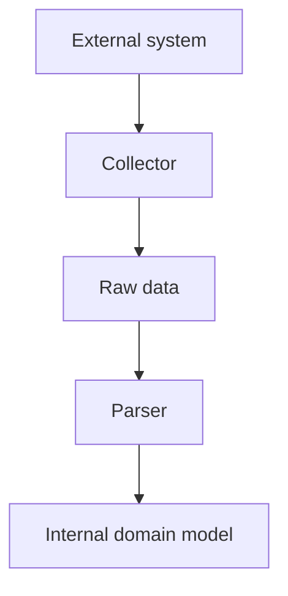

# Chapter 1. Collector

## Real World Example

택배 기사는 물건을 가져오는 일에 집중합니다.

물건의 가격이 맞는지, 주문에 맞는지는 다음 사람이 확인합니다.

Collector도 외부에서 값을 가져오는 일과 그 값을 최종적으로 판단하는 일을 나눕니다.

## Why Does It Exist?

외부 시스템의 접근 방식은 내부 업무 규칙과 다른 이유로 바뀝니다. 웹 페이지의 DOM, API 인증, 네트워크 timeout, 응답 상태 코드는 데이터를 해석하는 규칙과 별개의 문제입니다. Collector를 두면 외부 시스템과 대화하는 코드를 한 경계에 모을 수 있고, 나머지 구성요소는 외부 접근 방식 대신 명시적인 입력을 다룰 수 있습니다.

Collector는 다음 질문에 답합니다.

- 어디에서 데이터를 가져오는가?
- 외부 시스템에 어떻게 연결하는가?
- 원시 데이터를 어떤 형태로 반환하는가?

## Definition

Collector는 다른 시스템에서 필요한 값을 가져오는 역할입니다. 웹 페이지, API, 파일, 메시지 큐처럼 애플리케이션이 직접 통제하지 않는 경계와 통신하고, 이후 단계가 해석할 수 있는 원시값을 반환합니다. Collector의 결과는 아직 업무 규칙을 통과한 내부 데이터가 아닐 수 있습니다.

## Background Knowledge

### HTML(HyperText Markup Language)

웹 페이지의 구조를 표현하는 문서 형식입니다. 제목, 링크와 목록 같은 요소를 태그로 나타냅니다.


예를 들어 제목과 링크가 있는 웹 문서는 HTML로 작성됩니다.

### DOM(Document Object Model)

브라우저가 HTML을 프로그램에서 다룰 수 있도록 트리 구조로 표현한 것입니다. Playwright 같은 도구는 이 구조에서 원하는 요소를 찾을 수 있습니다.


사람은 검색 버튼을 보지만, 프로그램은 HTML을 트리 형태로 만든 DOM에서 그 버튼을 찾습니다.

### CSS Selector

HTML 안에서 특정 요소를 찾기 위한 표현식입니다. 예를 들어 `a`는 링크 요소를 찾는 선택자입니다.


예를 들어 `a`는 링크 요소를, `.price`는 `price`라는 class를 가진 요소를 찾을 때 사용할 수 있습니다.

### Raw Data(원시 데이터)

외부 시스템에서 막 가져온 값입니다. 아직 우리 프로그램의 업무 규칙에 맞는지 확인되지 않았을 수 있습니다.

예를 들어 화면에서 읽은 `1,250원`은 아직 계산에 바로 쓸 내부 가격이 아닙니다.

## Responsibilities

| 해야 하는 일 | 하면 안 되는 일 |
|---|---|
| 외부 시스템에 연결한다 | 데이터베이스에 저장한다 |
| 필요한 원시값을 읽는다 | 업무 규칙을 최종 판정한다 |
| 연결 실패와 응답 실패를 드러낸다 | LLM이나 다른 상위 서비스를 호출한다 |
| 외부 입력을 다음 단계의 입력 형태로 묶는다 | CLI 출력 형식을 결정한다 |

Collector가 원시값을 읽을 때 최소한의 접근 검증을 수행할 수는 있습니다. 다만 “이 값이 업무상 유효한가”라는 판단까지 한 구성요소에 몰아넣으면 외부 접근과 내부 규칙의 변경 이유가 섞입니다.

## Typical Workflow



일반적인 흐름은 외부 시스템에서 원시값을 읽고, Parser가 형식과 의미를 확인한 뒤, 내부 모델을 만드는 순서입니다. 모든 프로젝트가 별도의 Parser 파일을 가져야 한다는 뜻은 아닙니다. 중요한 점은 외부 접근의 책임과 내부 데이터 계약의 책임을 구분하는 것입니다.

## Relationship with Other Concepts

| 개념 | Collector와의 차이 |
|---|---|
| Parser | 이미 받은 원시값을 검증하고 변환한다 |
| Provider | 외부 서비스와의 접근 계약을 감싸는 더 넓은 역할을 가리킬 수 있다 |
| Repository | 영속 데이터의 저장·조회 경계를 담당한다 |
| Pipeline | 여러 단계의 실행 순서를 조정한다 |
| Domain Model | 내부에서 의미를 가진 데이터를 표현한다 |

Collector와 Provider는 프로젝트에 따라 겹치는 이름으로 사용될 수 있습니다. 이름보다 중요한 것은 외부 통신을 담당하는 경계가 내부 업무 규칙을 직접 소유하지 않는다는 점입니다.

## Common Mistakes

- Collector 안에서 데이터베이스 저장까지 수행한다.
- Collector 안에서 LLM을 호출한다.
- 페이지에서 읽은 문자열을 검증 없이 정상 데이터로 반환한다.
- 외부 시스템의 실패를 빈 목록이나 기본값으로 숨긴다.
- 여러 외부 시스템의 공통점을 이유로 서로 다른 데이터 의미를 억지로 합친다.

이런 구조에서는 외부 시스템이 바뀌었는지, 내부 규칙이 잘못되었는지 구분하기 어려워집니다.

## Best Practices

1. 외부 연결에 필요한 설정과 자원을 Collector 경계에서 관리합니다.
2. 원시값의 반환 형태를 명시하고, 누락된 값과 연결 실패를 구분합니다.
3. Parser 또는 변환 단계가 검증할 수 있도록 외부 표현과 내부 표현을 분리합니다.
4. 외부 자원은 생성과 종료의 책임을 분명히 합니다.
5. 테스트에서는 외부 시스템 대신 고정된 응답이나 Fake를 주입할 수 있게 합니다.
6. Collector가 상위 Application의 흐름을 직접 조정하지 않게 합니다.

## Trade-offs

| 선택 | 장점 | 단점 |
|---|---|---|
| Collector와 Parser를 분리한다 | 외부 접근과 데이터 규칙을 독립적으로 검증할 수 있다 | 중간 데이터 형태와 파일이 늘어난다 |
| Collector에서 바로 내부 모델을 만든다 | 호출 흐름이 짧고 작은 작업에 단순하다 | 외부 접근과 변환 규칙이 강하게 결합될 수 있다 |
| 외부 서비스마다 Collector를 둔다 | 서비스별 변경과 실패를 격리하기 쉽다 | 비슷한 연결 코드가 반복될 수 있다 |
| 여러 서비스를 하나의 Collector로 묶는다 | 공통 실행 흐름을 공유하기 쉽다 | 서비스별 데이터 의미와 실패 경계가 섞일 수 있다 |

## Minimal Python Example

```python
from dataclasses import dataclass


@dataclass(frozen=True)
class RawPage:
    body: str


def collect(fetch_page) -> RawPage:
    return RawPage(body=fetch_page())


page = collect(lambda: "<html>data</html>")
assert "data" in page.body
```

Collector는 외부에서 값을 가져오는 일만 담당하고, 응답의 업무 의미를 해석하지 않습니다.

## Example from automation-hub

앞의 작은 예제에서는 외부에서 페이지를 가져와 원시값을 반환했습니다. 실제 Collector도 페이지 접근과 응답 확인 뒤, 읽은 원시 항목을 다음 변환 단계로 넘깁니다.

### 실제 코드

이 코드는 브라우저로 페이지에 접근하고 보이는 원시 항목을 읽은 뒤 `validate_and_rank_items()`에 전달합니다.

```python
                response = page.goto(
                    TARGET_URL,
                    wait_until="domcontentloaded",
                    timeout=PAGE_TIMEOUT_MS,
                )
                if response is None:
                    raise RuntimeError("페이지 응답을 받지 못함")
                if response.status != 200:
                    raise RuntimeError(f"페이지 접속 상태 코드가 200이 아님: {response.status}")

                page.locator(ROOT_LOCATOR).first.wait_for(
                    state="visible",
                    timeout=PAGE_TIMEOUT_MS,
                )
                raw_items = _read_raw_items(page)
                return validate_and_rank_items(raw_items)
```

Source: [`namuwiki_trend/collector.py`](../../namuwiki_trend/collector.py)

### 코드에서 확인할 점

- **이 코드는 무엇을 하는가?** 이 코드는 브라우저로 페이지에 접근하고 보이는 원시 항목을 읽은 뒤 `validate_and_rank_items()`에 전달합니다.
- **왜 이 Chapter의 개념인가?** Collector가 외부 페이지와 브라우저를 다루는 책임을 보여 줍니다.
- **무엇을 하지 않는가?** HTML 항목을 `TrendItem`으로 최종 검증하는 일은 Extraction에 남아 있습니다. 뉴스 검색이나 저장은 하지 않습니다.

### Repository에서 따라가 보기

- `namuwiki_trend/extraction.py`의 `validate_and_rank_items()`를 이어서 읽습니다.

## Checkpoint

1. Collector와 Parser를 분리하면 어떤 변경 이유가 나뉩니까?
2. Collector가 Domain 규칙을 수행하면 어떤 문제가 생깁니까?
3. 외부 응답 실패와 데이터 검증 실패는 왜 다른 경계에 둘 수 있습니까?
4. Collector를 테스트할 때 외부 시스템의 어떤 부분을 대체할 수 있습니까?

## Summary

이번 Chapter에서 기억해야 할 것은 다음입니다. Collector는 외부 시스템에서 원시 응답을 가져오는 경계입니다. 내부 의미를 해석하거나 저장하지 않고 다음 단계에 전달할 입력을 만듭니다. 이 분리는 외부 연결의 변화와 내부 규칙의 변화를 따로 다루게 합니다.

## Related Concepts

- [Parser](parser.md#chapter-2-parser-and-extraction): 원시값을 검증하고 내부 형태로 변환합니다.
- [Domain Model](domain-model.md#chapter-3-domain-model): 내부 업무 의미를 표현합니다.

## Related Project Documents

- [Architecture Handbook](../handbook/README.md): 프로젝트 사례를 통한 설계 학습 경로입니다.
- [Namuwiki Architecture](../packages/namuwiki_trend/architecture.md): 현재 Package 구조 Reference입니다.
- [Google Finance Architecture](../packages/google_finance/architecture.md): 현재 Package 구조 Reference입니다.
- [CODEBASE_GUIDE](../../CODEBASE_GUIDE.md): Repository 코드 탐색 순서입니다.
- [Root Architecture](../architecture.md): Repository 전체 구조입니다.

## Next Chapter

[Chapter 2. Parser and Extraction](parser.md#chapter-2-parser-and-extraction)에서는 Collector가 가져온 원시 표현을 검증하고 내부에서 사용할 형태로 바꾸는 방법을 설명합니다.

---

| 이전 Chapter | 목차 | 다음 Chapter |
|---|---|---|
| 처음 | [Concepts Book](README.md#python-automation-architecture-concepts) | [Chapter 2. Parser and Extraction](parser.md#chapter-2-parser-and-extraction) |
