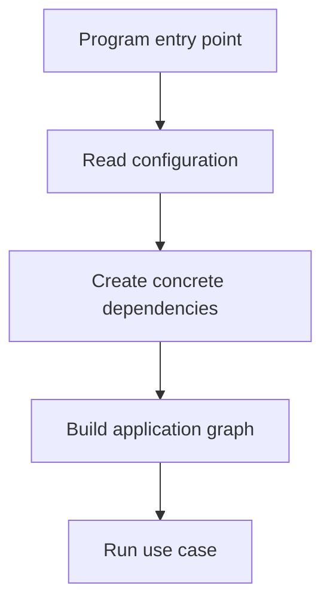

# Chapter 11. Composition Root

## Real World Example

공연 시작 전에 무대 담당자가 조명, 음향과 좌석을 한 곳에서 준비합니다.

배우가 공연 중에 장비를 직접 조립하지는 않습니다.

Composition Root는 프로그램 시작 시 필요한 객체를 연결하는 위치입니다.

## Why Does It Exist?

DI를 사용해도 누군가는 구체적인 구현을 만들어 연결해야 합니다. 이 코드가 여러 Service에 흩어지면 운영 환경에서 무엇이 사용되는지 알기 어렵고, 같은 의존성이 서로 다른 설정으로 만들어질 수 있습니다.

Composition Root는 이 결정을 한 곳에 모읍니다. CLI, Web Framework Startup, Worker 시작 함수 또는 테스트 Fixture가 이 역할을 할 수 있습니다. 실행 경계에서 구현을 선택하고, 내부에는 완성된 객체 그래프를 전달합니다.

## Definition

Composition Root는 프로그램 시작 시 필요한 객체를 한 곳에서 만들고 연결하는 위치입니다. 의존성 그래프는 객체와 그 객체가 필요로 하는 다른 객체의 관계를 뜻합니다. Composition Root는 보통 프로그램 시작 시 실행되며, 내부 구성요소는 자신이나 서로의 구체적인 생성 방법을 결정하지 않습니다.

## Background Knowledge

### Dependency Graph(의존성 그래프)

객체와 그 객체가 필요로 하는 다른 객체의 연결 관계이다.

프로그램을 실행하려면 어떤 객체를 먼저 만들고 어디에 전달할지 전체 연결을 알아야 한다.

예를 들어 Application이 Provider를 필요로 하고 Provider가 HTTP Client를 필요로 한다면 세 객체의 연결이 그래프가 된다.


### Factory(팩토리)

정해진 규칙에 따라 객체를 만들어 반환하는 함수나 객체이다.

생성 절차를 호출자에게서 감출 수 있지만, 전체 애플리케이션의 조립 위치를 반드시 대신하는 것은 아니다.

예를 들어 환경에 따라 실제 Client 또는 Fake Client를 반환하는 함수를 만들 수 있다.


### Service Locator(서비스 로케이터)

필요한 객체를 전역 저장소에서 찾아 쓰게 하는 방식이다.

호출부가 의존성을 인자로 받지 않아도 되지만, 실제로 무엇을 사용하는지 코드만 보고 알기 어려워질 수 있다.

예를 들어 모든 Service가 전역 Container에서 `get("payment")`를 호출하는 방식이다.

## Responsibilities

| 해야 하는 일 | 하면 안 되는 일 |
|---|---|
| 구체적인 구현을 선택하고 생성한다 | Domain Model이 자신을 조립하게 한다 |
| 설정을 읽고 필요한 의존성에 전달한다 | 모든 업무 규칙을 시작점에 넣는다 |
| 객체 간 연결과 수명을 결정한다 | Service 내부에서 전역 객체를 몰래 만든다 |
| 실행 모드별 구성을 제공한다 | 호출 위치마다 다른 구현을 임의로 선택한다 |
| 완성된 Application을 실행 경계에 넘긴다 | Service Locator로 어디서나 의존성을 조회하게 한다 |

Composition Root는 그래프의 생성 책임을 가집니다. 실행 흐름과 Domain 판단은 Application과 Domain에 남겨야 합니다.

## Typical Workflow



시작점은 설정을 읽고 외부 구현을 만든 뒤 Application 그래프를 완성합니다. 테스트에서는 같은 그래프의 일부를 Fake나 Stub으로 바꿀 수 있습니다.

## Relationship with Other Concepts

| 개념 | Composition Root와의 차이 |
|---|---|
| Dependency Injection | 의존성을 전달하는 방식이고 Root는 조립 위치이다 |
| Factory | 객체 생성 절차를 캡슐화하며 전체 그래프를 소유하지는 않는다 |
| Service Locator | 어디서나 의존성을 조회하게 해 조립 위치를 숨길 수 있다 |
| CLI | Composition Root가 위치할 수 있는 실행 진입점이다 |
| Web Startup | 서버 시작 시 그래프를 조립하는 실행 경계이다 |
| Application Service | 조립된 의존성으로 Use Case를 실행한다 |

Factory는 객체 하나의 생성에 유용할 수 있습니다. Composition Root는 전체 애플리케이션이 어떤 구현 조합으로 실행되는지 결정합니다.

## Common Mistakes

- 여러 Service가 각자 같은 Provider를 직접 생성한다.
- 전역 Singleton을 어디서나 가져오게 한다.
- 설정 읽기와 업무 규칙을 같은 함수에 넣는다.
- Factory가 전체 Application 조립 위치를 숨긴다.
- Service Locator로 런타임에 의존성을 찾는다.
- 테스트에서도 운영용 그래프를 강제로 사용한다.

이 구조에서는 실행 환경에 따라 실제로 어떤 객체가 사용되는지 추적하기 어렵습니다.

## Best Practices

1. 프로그램 진입점이나 Startup을 조립 경계로 정합니다.
2. 설정 읽기·검증과 객체 생성을 구분합니다.
3. 생성된 객체를 Application Service에 명시적으로 전달합니다.
4. 실행 모드가 다르면 모드별 조립 함수를 분리합니다.
5. 테스트에서는 외부 의존성을 대체합니다.
6. 작은 프로젝트에서는 함수 하나로 단순하게 그래프를 조립합니다.

Composition Root는 별도 파일 이름을 가져야 하는 것은 아닙니다. `main.py`, Startup 함수와 테스트 Fixture처럼 실행 경계에 위치하면 됩니다.

## Trade-offs

| 선택 | 장점 | 단점 |
|---|---|---|
| 한 곳에서 전체 그래프를 조립한다 | 실제 실행 구성이 명확하다 | 조립 함수가 커질 수 있다 |
| 각 Service가 의존성을 직접 만든다 | 초기 코드가 짧다 | 구성과 테스트가 분산된다 |
| Factory를 조립에 사용한다 | 반복 생성 로직을 재사용한다 | 그래프 완성 위치가 숨겨질 수 있다 |
| Service Locator를 사용한다 | 호출부 인자가 줄어든다 | 의존성이 암묵적이고 테스트가 어렵다 |

작은 프로젝트에서는 진입점의 몇 줄짜리 생성 코드가 충분합니다. 조립 코드를 줄이기보다 선택된 구현을 읽을 수 있게 하는 편이 중요합니다.

## Minimal Python Example

```python
class App:
    def __init__(self, clock) -> None:
        self.clock = clock

    def run(self) -> str:
        return self.clock.now()


class FixedClock:
    def now(self) -> str:
        return "fixed"


def build_app() -> App:
    return App(FixedClock())


assert build_app().run() == "fixed"
```

Composition Root는 구체적인 객체를 만들고 연결하는 위치를 한 곳에 모읍니다.

## Example from automation-hub

앞의 작은 예제에서는 `build_app()`이 Clock을 만들고 App에 연결했습니다. 실제 Entry Point도 Provider와 Generator를 만들고 Pipeline 그래프를 완성합니다.

### 실제 코드

이 코드는 News Provider, Gemini Generator, Enricher와 Pipeline을 차례로 만들고 연결합니다.

```python
def build_pipeline() -> TrendPipeline:
    """운영용 Collector와 Enricher를 생성해 Pipeline을 조립한다."""
    news_provider = NewsContextProvider()
    reason_generator = GeminiReasonGenerator()
    enricher = TrendEnricher(news_provider, reason_generator)
    return TrendPipeline(collect_trends, enricher)
```

Source: [`namuwiki_trend/main.py`](../../namuwiki_trend/main.py)

### 코드에서 확인할 점

- **이 코드는 무엇을 하는가?** 이 코드는 News Provider, Gemini Generator, Enricher와 Pipeline을 차례로 만들고 연결합니다.
- **왜 이 Chapter의 개념인가?** Composition Root가 구체적인 구현 선택과 객체 연결을 실행 시작점에 모으는 예입니다.
- **무엇을 하지 않는가?** Pipeline 내부에서 Provider를 새로 만들지 않으며, 실제 Business Rule을 이 조립 함수에 넣지 않습니다.

### Repository에서 따라가 보기

- `namuwiki_trend/main.py`의 `run_application()`을 이어서 읽습니다.

## Checkpoint

1. DI를 사용한 뒤에도 Composition Root가 필요한 이유는 무엇입니까?
2. Composition Root와 Factory는 어떤 책임에서 다릅니까?
3. Service Locator가 의존성을 숨기는 이유는 무엇입니까?
4. 작은 프로젝트에서 Root를 단순한 함수로 유지할 조건은 무엇입니까?

## Summary

이번 Chapter에서 기억해야 할 것은 다음입니다. Composition Root는 Application이 사용할 구체적인 의존성을 조립하는 실행 경계입니다. 조립 위치가 드러나면 의존성 그래프를 이해하고 테스트 구성을 바꾸기 쉽습니다. 작은 프로젝트에서는 단순한 진입점 함수가 이 역할을 할 수 있습니다.

## Related Concepts

- [Dependency Injection](dependency-injection.md#chapter-10-dependency-injection): 조립된 의존성을 객체에 전달합니다.
- [Configuration](configuration.md#chapter-12-configuration): Root가 읽고 검증하는 실행 설정입니다.
- [Application Service](application-service.md#chapter-4-application-service): 조립된 그래프에서 Use Case를 실행합니다.
- [Provider](provider.md#chapter-6-provider): 조립되는 외부 의존성의 계약입니다.

## Related Project Documents

- [Google Finance Architecture](../packages/google_finance/architecture.md): 현재 CLI와 Application 조립의 Reference입니다.
- [Namuwiki Architecture](../packages/namuwiki_trend/architecture.md): 현재 Entrypoint 조립의 Reference입니다.
- [CODEBASE_GUIDE](../../CODEBASE_GUIDE.md): 실행 진입점 탐색 순서입니다.
- [Root Architecture](../architecture.md): Repository 공통 의존성 방향입니다.
- [Architecture Handbook](../handbook/README.md): Application과 Provider 연결을 학습합니다.

## Next Chapter

[Chapter 12. Configuration](configuration.md#chapter-12-configuration)에서는 실행 환경의 설정을 Domain과 분리하는 방법을 설명합니다.

---

| 이전 Chapter | 목차 | 다음 Chapter |
|---|---|---|
| [Chapter 10. Dependency Injection](dependency-injection.md#chapter-10-dependency-injection) | [Concepts Book](README.md#python-automation-architecture-concepts) | [Chapter 12. Configuration](configuration.md#chapter-12-configuration) |
