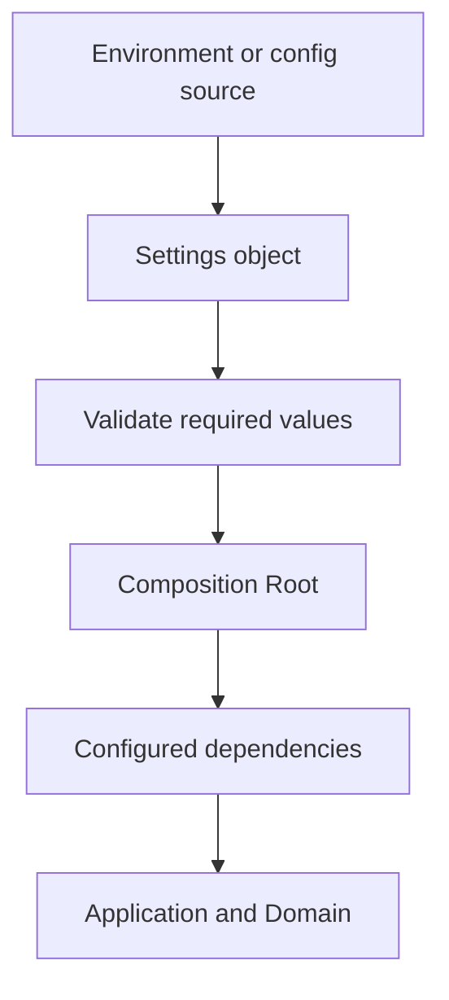

# Chapter 12. Configuration

## Real World Example

같은 가게라도 영업 주소와 운영 시간은 지점마다 다를 수 있습니다.

이 값을 가게의 상품 규칙 안에 적기보다 외부 설정으로 관리하면 환경을 바꾸기 쉽습니다.

Configuration은 실행 환경에 따라 달라지는 값을 모으는 방법입니다.

## Why Does It Exist?

개발, 테스트와 운영 환경은 데이터베이스 주소, 외부 서비스 자격증명, 로그 수준과 같은 값이 다릅니다. 이 값을 소스 코드에 넣으면 환경을 바꿀 때 코드를 수정해야 하고, 비밀 정보가 저장소에 노출될 위험이 있습니다.

Configuration은 환경 차이를 외부 입력으로 둡니다. Application과 Domain은 검증된 설정을 전달받고, 어떤 운영 환경인지 판단하기보다 자신의 책임을 수행합니다.

## Definition

Configuration은 프로그램을 실행하는 환경에 따라 달라지는 값을 모아 둔 정보입니다. 환경 변수, 설정 파일, 명령줄 인자와 Settings 객체가 여기에 포함될 수 있습니다. Configuration은 Domain의 업무 의미가 아니라, 애플리케이션을 어떤 환경과 의존성으로 실행할지 결정하는 입력입니다.

## Background Knowledge

### Environment Variable(환경 변수)

프로그램 바깥에서 실행 환경의 값을 전달하는 이름과 값의 쌍이다.

같은 코드를 두고도 개발·테스트·운영 환경마다 주소나 자격증명을 다르게 넣을 수 있다.

예를 들어 `DATABASE_URL`에 환경별 데이터베이스 주소를 넣을 수 있다.


### Settings Object(설정 객체)

여러 설정 값을 하나의 검증 가능한 객체로 묶은 것이다.

코드 곳곳에서 문자열을 직접 읽는 대신 시작 시점에 필요한 값과 형식을 확인할 수 있다.

예를 들어 `Settings(database_url, log_level)`처럼 실행 설정을 한 객체로 전달할 수 있다.


### Secret(비밀 값)

외부에 공개되면 안 되는 인증·접근 정보이다.

API Key와 비밀번호는 기능을 실행하는 데 필요하지만 코드, 문서와 로그에 평문으로 남기면 안 된다.

예를 들어 운영 환경이 API Key를 안전한 환경 변수나 Secret Manager에서 주입할 수 있다.

## Responsibilities

| 해야 하는 일 | 하면 안 되는 일 |
|---|---|
| 환경별 실행 값을 읽는다 | Domain 규칙을 환경 변수 이름으로 표현한다 |
| 필수 값과 형식을 시작 시점에 검증한다 | 비밀 값을 로그나 오류에 출력한다 |
| Settings 객체나 명시적인 계약으로 묶는다 | 모든 Module이 `os.getenv()`를 직접 호출하게 한다 |
| Composition Root에 검증된 값을 전달한다 | 설정과 업무 데이터의 의미를 하나로 합친다 |
| 개발·테스트·운영 환경의 차이를 관리한다 | 설정 누락을 안전하지 않은 기본값으로 숨긴다 |

Configuration은 값을 읽는 기능만이 아닙니다. 유효하지 않은 실행 조건을 시작 전에 발견하는 경계이기도 합니다.

## Typical Workflow



환경 입력은 Settings 객체로 모인 뒤 형식과 필수 조건을 검증합니다. Composition Root는 검증된 설정으로 의존성을 만들고 내부 구성요소에는 필요한 값이나 객체만 전달합니다.

## Relationship with Other Concepts

| 개념 | Configuration과의 차이 |
|---|---|
| Environment Variable | 설정을 전달하는 하나의 외부 입력 방식이다 |
| Settings Object | 설정 값을 검증하고 묶은 애플리케이션 입력이다 |
| Secret Manager | 비밀 값을 보관·제공하는 운영 시스템이다 |
| Dependency Injection | 검증된 설정으로 만든 의존성을 객체에 전달한다 |
| Composition Root | 설정을 읽고 의존성을 조립하는 실행 경계이다 |
| Domain Model | 환경이 아니라 업무 의미와 규칙을 표현한다 |

환경 변수는 Configuration 자체가 아니라 Configuration을 제공하는 방법입니다. Secret Manager도 설정을 읽는 경계를 제공하지만 Domain Model의 일부가 되지는 않습니다.

## Common Mistakes

- Domain이나 Provider 내부에서 환경 변수를 직접 읽는다.
- API Key와 비밀번호를 설정 파일이나 소스 코드에 하드코딩한다.
- 설정 오류를 애플리케이션 실행 뒤 늦게 발견한다.
- 문자열 설정을 검증 없이 숫자나 URL처럼 사용한다.
- 테스트가 개발자의 실제 환경 변수에 의존한다.
- 환경별 조건문을 Domain 코드에 계속 추가한다.

설정이 코드 곳곳에 퍼지면 어떤 값이 실제 실행에 사용되는지 확인하기 어렵습니다.

## Best Practices

1. 설정을 읽는 위치를 Composition Root 근처로 제한합니다.
2. 시작 시점에 필수 값, 형식과 범위를 검증합니다.
3. 비밀 정보는 Secret 관리 수단으로 전달하고 출력하지 않습니다.
4. 내부 계층에는 필요한 설정만 전달하거나 구성된 의존성을 전달합니다.
5. 테스트에서는 명시적인 Settings와 Fake 의존성을 사용합니다.
6. 환경별 차이는 설정으로 표현하고 Domain 조건문으로 복사하지 않습니다.
7. 기본값은 안전하고 의미가 분명할 때만 제공합니다.

모든 값을 하나의 거대한 Settings 객체에 넣기보다 실제 사용 범위에 맞게 나누는 것이 좋습니다.

## Trade-offs

| 선택 | 장점 | 단점 |
|---|---|---|
| 환경 변수 사용 | 배포 환경에서 쉽게 주입하고 비밀을 코드 밖에 둔다 | 타입과 누락 검증이 필요하다 |
| 설정 파일 사용 | 여러 값을 함께 관리하고 검토하기 쉽다 | 파일 배포와 비밀 보호가 필요하다 |
| Settings 객체 사용 | 검증과 타입 변환을 한 곳에서 수행한다 | 커지면 사용 범위가 불명확해질 수 있다 |
| Module이 환경 변수를 직접 읽는다 | 초기 코드가 짧다 | 테스트와 실행 구성 추적이 어렵다 |

어떤 전달 방식을 사용할지는 배포 환경과 보안 요구에 따라 달라집니다. 공통 원칙은 설정의 출처와 검증 위치를 숨기지 않는 것입니다.

## Minimal Python Example

```python
from dataclasses import dataclass
import os


@dataclass(frozen=True)
class Settings:
    endpoint: str


def load_settings() -> Settings:
    endpoint = os.environ.get("APP_ENDPOINT", "http://localhost")
    return Settings(endpoint)


settings = load_settings()
assert settings.endpoint
```

환경변수를 읽는 일은 설정 경계에 두고, 내부 규칙은 완성된 Settings를 받도록 합니다.

## Example from automation-hub

앞의 작은 예제에서는 환경 변수 하나를 Settings 객체로 모았습니다. 실제 Settings는 Watchlist 문자열을 검증하고 canonical symbol 목록으로 바꿉니다.

### 실제 코드

이 코드는 설정 문자열을 분리하고, 기존 symbol 검증을 재사용하며, 중복을 제거하고 입력 순서를 보존합니다.

```python
    def get_symbol_list(self) -> list[str]:
        """Parse, validate, canonicalize, and deduplicate Watchlist symbols.

        The collector owns the symbol grammar, so this method reuses its validator
        lazily to avoid a module-level circular import.
        """
        raw_symbols = self.stock_symbols.split(",")
        if not self.stock_symbols.strip() or any(not symbol.strip() for symbol in raw_symbols):
            raise ValueError("STOCK_SYMBOLS must contain at least one non-empty symbol")

        from google_finance.collector import validate_symbol

        symbols: list[str] = []
        seen: set[str] = set()
        for raw_symbol in raw_symbols:
            symbol = validate_symbol(raw_symbol)
            if symbol not in seen:
                seen.add(symbol)
                symbols.append(symbol)
        return symbols
```

Source: [`google_finance/config.py`](../../google_finance/config.py)

### 코드에서 확인할 점

- **이 코드는 무엇을 하는가?** 이 코드는 설정 문자열을 분리하고, 기존 symbol 검증을 재사용하며, 중복을 제거하고 입력 순서를 보존합니다.
- **왜 이 Chapter의 개념인가?** Configuration이 실행 입력을 검증하는 경계로 동작하는 예입니다.
- **무엇을 하지 않는가?** Domain Model이나 Movement가 환경 변수를 직접 읽지 않습니다. 별도 Secret Manager도 현재 Repository에는 구현되어 있지 않습니다.

### Repository에서 따라가 보기

- `tests/google_finance/test_config.py`에서 빈 항목·중복·순서 계약을 확인합니다.

## Checkpoint

1. 환경 변수와 Configuration은 어떻게 다른 개념입니까?
2. 설정을 Domain 안에서 직접 읽으면 테스트와 변경에 어떤 문제가 생깁니까?
3. Secret Manager와 Settings 객체는 각각 어떤 책임을 가집니까?
4. 설정 검증을 시작 시점에 수행해야 하는 이유는 무엇입니까?

## Summary

이번 Chapter에서 기억해야 할 것은 다음입니다. Configuration은 실행 환경의 차이를 명시적인 값으로 모읍니다. Domain과 분리하면 내부 규칙이 환경변수나 Secret 저장 방식에 묶이지 않습니다. 설정을 읽고 검증하는 위치는 실행 경계에서 분명하게 유지해야 합니다.

## Related Concepts

- [Dependency Injection](dependency-injection.md#chapter-10-dependency-injection): 설정으로 구성된 의존성을 객체에 전달합니다.
- [Composition Root](composition-root.md#chapter-11-composition-root): Configuration을 읽고 그래프를 조립합니다.
- [Provider](provider.md#chapter-6-provider): 외부 서비스 접근에 필요한 설정을 사용합니다.
- [Domain Model](domain-model.md#chapter-3-domain-model): Configuration과 분리된 업무 의미를 표현합니다.

## Related Project Documents

- [Google Finance Package README](../packages/google_finance/README.md): 현재 환경 변수와 실행 방법입니다.
- [Namuwiki Package README](../packages/namuwiki_trend/README.md): 현재 Package 설정과 실행 방법입니다.
- [Google Finance Architecture](../packages/google_finance/architecture.md): 현재 설정 조립의 Reference입니다.
- [Namuwiki Architecture](../packages/namuwiki_trend/architecture.md): 현재 설정 경계의 Reference입니다.
- [Root Architecture](../architecture.md): Repository 전체 구조입니다.
- [Architecture Handbook](../handbook/README.md): 설정과 의존성 경계의 설계 과정을 학습합니다.

## Next Chapter

[Chapter 13. Fake](fake.md#chapter-13-fake)에서는 테스트에서 실제 외부 의존성을 대체하는 구현을 설명합니다.

---

| 이전 Chapter | 목차 | 다음 Chapter |
|---|---|---|
| [Chapter 11. Composition Root](composition-root.md#chapter-11-composition-root) | [Concepts Book](README.md#python-automation-architecture-concepts) | [Chapter 13. Fake](fake.md#chapter-13-fake) |
