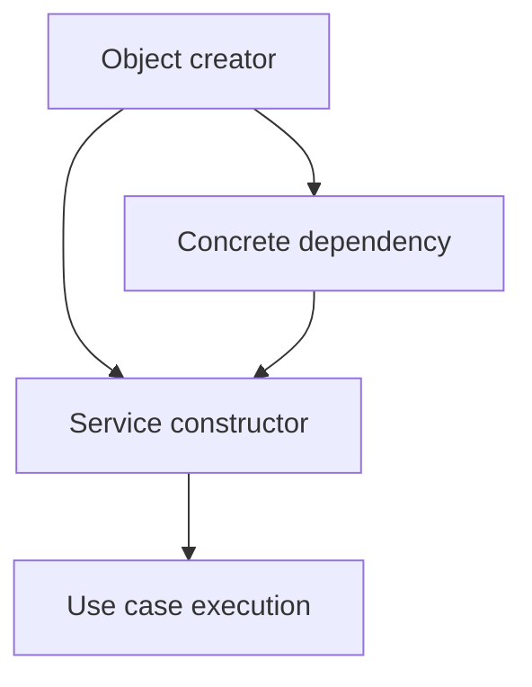

# Chapter 10. Dependency Injection

## Real World Example

식당 손님은 주방 도구를 직접 만들지 않고 필요한 음식을 주문합니다.

어떤 도구와 재료를 사용할지는 주방이나 운영자가 준비합니다.

Dependency Injection은 객체가 필요한 것을 밖에서 받게 하는 방식입니다.

## Why Does It Exist?

객체가 내부에서 HTTP Client, Database Connection 또는 파일 저장소를 직접 만들면 생성 방식과 사용 방식이 결합됩니다. 테스트에서 실제 외부 시스템을 피하기 어렵고, 구현을 바꿀 때 사용하는 객체까지 수정해야 합니다.

DI를 사용하면 객체는 필요한 의존성을 선언하고, 호출자는 어떤 구현을 연결할지 결정합니다. 따라서 객체는 업무 사용에 집중하고 생성 책임은 외부에 둘 수 있습니다.

## Definition

Dependency Injection은 객체가 필요한 다른 객체를 밖에서 받는 방식입니다. 객체 생성과 사용을 분리해 운영 환경과 테스트 환경에서 다른 구현을 연결할 수 있게 합니다. DI는 특정 Framework나 자동 생성 도구 자체가 아닙니다.

## Background Knowledge

### Constructor Injection(생성자 주입)

객체를 만들 때 생성자의 인자로 필요한 의존성을 전달하는 방식이다.

필요한 것이 생성자에 드러나므로 객체가 불완전한 상태로 만들어지는 일을 줄일 수 있다.

예를 들어 `Service(client)`처럼 사용할 Client를 객체를 만들 때 함께 전달한다.


### Dependency Inversion Principle(의존성 역전 원칙)

상위 수준의 업무 흐름이 하위 수준의 구체적인 기술에 직접 묶이지 않게 하는 원칙이다.

업무 코드는 “무엇을 할 수 있는가”를 기준으로 의존하고, 실제 구현 선택은 바깥에서 하도록 만든다.

예를 들어 주문 서비스가 특정 결제 회사의 Client가 아니라 결제 동작의 약속을 사용하게 할 수 있다.


### DI Container(의존성 주입 컨테이너)

객체 생성과 의존성 연결을 자동으로 관리하는 도구이다.

작은 프로그램에서는 직접 생성자를 호출하는 것보다 복잡할 수 있으므로 필요한 경우에만 사용한다.

예를 들어 Container가 Repository와 Service를 만들고 서로 연결한 뒤 Application을 반환할 수 있다.

## Responsibilities

| 해야 하는 일 | 하면 안 되는 일 |
|---|---|
| 필요한 의존성을 명확히 표현한다 | 객체 내부에서 외부 의존성을 몰래 생성한다 |
| 생성자·메서드·설정 경계로 의존성을 전달한다 | 모든 객체를 무조건 Container에 등록한다 |
| 운영 구현과 테스트 구현을 교체할 수 있게 한다 | DI를 Business Rule 자체로 착각한다 |
| 의존성의 수명과 소유자를 분명히 한다 | 내부 구현 세부사항을 호출자에게 모두 노출한다 |

DI는 의존성을 없애는 것이 아니라 누가 생성하고 누가 사용하는지를 분리합니다.

## Typical Workflow



객체를 조립하는 쪽이 구체적인 구현을 만들고, Service는 전달받은 계약을 사용합니다.

## Relationship with Other Concepts

| 개념 | Dependency Injection과의 차이 |
|---|---|
| Constructor Injection | 생성자의 인자로 의존성을 전달하는 방식이다 |
| Setter Injection | 생성 후 Setter나 속성으로 전달하는 방식이다 |
| Method Injection | 특정 메서드 호출 시 인자로 전달하는 방식이다 |
| Dependency Inversion Principle | 고수준 정책이 저수준 구현에 직접 의존하지 않게 하는 원칙이다 |
| DI Container | 의존성 생성과 연결을 자동화하는 도구이다 |
| Factory | 객체 생성 절차를 캡슐화하며 DI를 제공하지 않을 수도 있다 |

DIP는 방향에 대한 원칙이고 DI는 그 원칙을 구현하는 방법 중 하나입니다. Container도 선택 사항입니다.

## Common Mistakes

- 생성자에서 실제 HTTP Client나 Database Connection을 직접 만든다.
- Setter Injection으로 설정되지 않은 객체 상태를 허용한다.
- Container를 도입했지만 객체가 어디서 만들어지는지 더 알기 어려워진다.
- 필요하지 않은 값까지 Interface로 추상화한다.
- 테스트를 위해 운영 코드의 책임을 복잡하게 만든다.
- DI와 DIP를 같은 개념으로 설명한다.

DI는 객체 생성 문제를 해결하지만 잘못된 의존성 방향이나 큰 Service의 책임을 자동으로 고쳐 주지는 않습니다.

## Best Practices

1. 반드시 필요한 의존성은 Constructor Injection을 우선 검토합니다.
2. 선택적 의존성에만 Setter Injection을 사용합니다.
3. 한 번의 호출에만 필요한 의존성은 Method Injection을 고려합니다.
4. 의존성의 수명과 생성 위치를 명확히 합니다.
5. 테스트에서 외부 시스템을 대체할 작은 계약을 정의합니다.
6. Container보다 단순한 생성자 호출로 해결되는지 먼저 확인합니다.

의존성이 너무 많다면 DI 방식을 바꾸기보다 객체의 책임을 먼저 다시 살펴야 합니다.

## Trade-offs

| 선택 | 장점 | 단점 |
|---|---|---|
| Constructor Injection | 의존성이 명시되고 불완전한 객체를 줄인다 | 인자가 많아질 수 있다 |
| Setter Injection | 선택적 의존성을 나중에 설정할 수 있다 | 설정되지 않은 상태가 생길 수 있다 |
| Method Injection | 호출마다 다른 의존성을 전달할 수 있다 | 호출자가 매번 준비해야 한다 |
| DI Container | 반복적인 조립 코드를 줄인다 | 추적과 디버깅이 어려워질 수 있다 |
| 직접 생성 | 작은 코드에서 단순하다 | 교체와 테스트가 어려워질 수 있다 |

DI가 과한지는 의존성의 개수보다 복잡성의 증가로 판단합니다. 작은 함수에 Container와 여러 Interface를 추가하면 비용이 더 클 수 있습니다.

## Minimal Python Example

```python
class Greeter:
    def __init__(self, formatter) -> None:
        self._formatter = formatter

    def greet(self, name: str) -> str:
        return self._formatter(name)


def plain(name: str) -> str:
    return f"Hello, {name}"


greeter = Greeter(plain)
assert greeter.greet("Ada") == "Hello, Ada"
```

객체가 필요한 협력자를 내부에서 만들지 않고 외부에서 받는 것이 Constructor Injection의 핵심입니다.

## Example from automation-hub

앞의 작은 예제에서는 `Greeter`가 Formatter를 직접 만들지 않고 생성자로 받았습니다. 실제 Pipeline도 Collector를 외부에서 받아 변환 흐름에 사용합니다.

### 실제 코드

이 클래스는 생성자로 받은 Collector를 실행하고 그 결과를 `StockPrice`로 변환합니다.

```python
class StockPricePipeline:
    """Connect a raw quote collector to the StockPrice model conversion."""

    def __init__(self, collector: RawQuoteCollector) -> None:
        """Initialize the pipeline with an externally created collector."""
        self._collector = collector

    def run(self, symbol: str) -> StockPrice:
        """Collect and normalize one exchange-qualified symbol."""
        return parse_stock_quote(self._collector(symbol))
```

Source: [`google_finance/pipeline.py`](../../google_finance/pipeline.py)

### 코드에서 확인할 점

- **이 코드는 무엇을 하는가?** 이 클래스는 생성자로 받은 Collector를 실행하고 그 결과를 `StockPrice`로 변환합니다.
- **왜 이 Chapter의 개념인가?** 객체 생성과 사용을 분리해 테스트에서 Collector를 대체할 수 있게 하는 Constructor Injection의 사례입니다.
- **무엇을 하지 않는가?** DI Container를 사용하거나 Collector의 구체적인 생성 방법을 Pipeline 안에서 결정하지 않습니다.

### Repository에서 따라가 보기

- `tests/google_finance/test_pipeline.py`에서 대체 Collector 주입을 확인합니다.

## Checkpoint

1. 객체가 의존성을 직접 생성하면 테스트가 어려워지는 이유는 무엇입니까?
2. Constructor Injection과 Method Injection은 언제 다르게 선택할 수 있습니까?
3. DIP와 DI는 각각 어떤 질문에 답합니까?
4. DI Container가 과한 설계가 되는 경우는 언제입니까?

## Summary

이번 Chapter에서 기억해야 할 것은 다음입니다. Dependency Injection은 객체 생성과 사용을 분리해 협력자를 교체할 수 있게 합니다. 이 패턴은 테스트와 변경 영향 관리에 도움을 줍니다. 그러나 작은 흐름에 무조건 계층을 추가할 필요는 없습니다.

## Related Concepts

- [Domain Model](domain-model.md#chapter-3-domain-model): 외부 의존성 없이 업무 의미를 표현합니다.
- [Application Service](application-service.md#chapter-4-application-service): 주입된 의존성을 Use Case에 사용합니다.
- [Composition Root](composition-root.md#chapter-11-composition-root): 의존성을 한 곳에서 조립합니다.
- [Configuration](configuration.md#chapter-12-configuration): 환경별 설정을 전달합니다.

## Related Project Documents

- [Google Finance Architecture](../packages/google_finance/architecture.md): 현재 생성자 주입의 Reference입니다.
- [Namuwiki Architecture](../packages/namuwiki_trend/architecture.md): 현재 Pipeline 조립의 Reference입니다.
- [Root Architecture](../architecture.md): Repository 의존성 방향입니다.
- [Architecture Handbook](../handbook/README.md): Business Rule과 Infrastructure 분리를 학습합니다.
- [CODEBASE_GUIDE](../../CODEBASE_GUIDE.md): 관련 코드 탐색 순서입니다.

## Next Chapter

[Chapter 11. Composition Root](composition-root.md#chapter-11-composition-root)에서는 의존성을 프로젝트의 어느 위치에서 조립할지 설명합니다.

---

| 이전 Chapter | 목차 | 다음 Chapter |
|---|---|---|
| [Chapter 9. ORM and Data Mapping](orm-and-data-mapping.md#chapter-9-orm-and-data-mapping) | [Concepts Book](README.md#python-automation-architecture-concepts) | [Chapter 11. Composition Root](composition-root.md#chapter-11-composition-root) |
