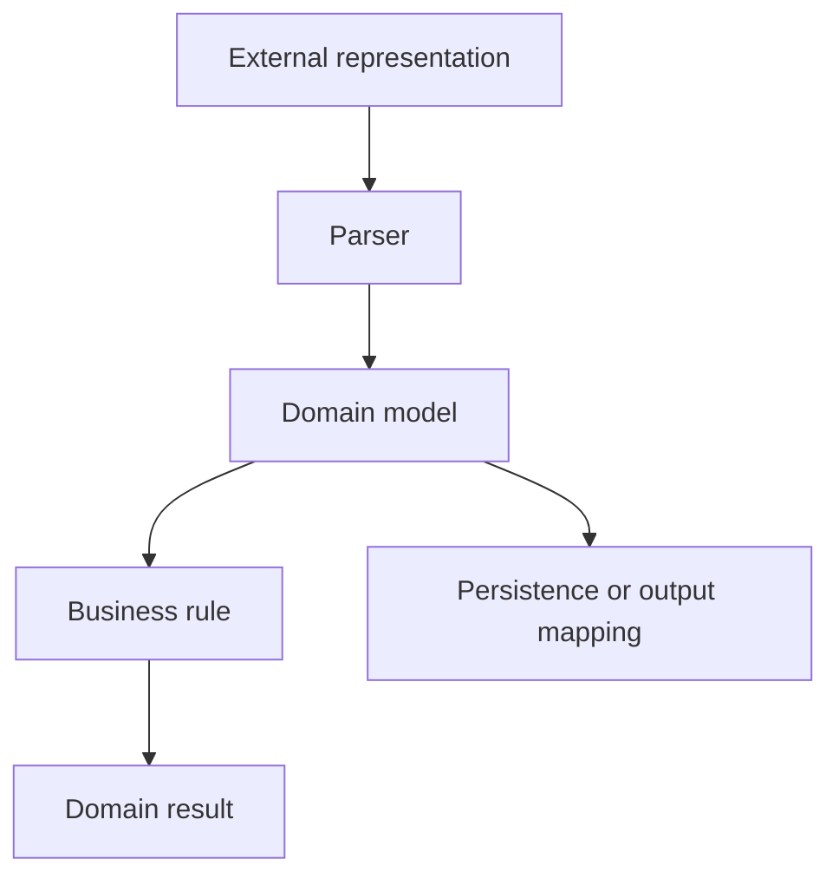

# Chapter 3. Domain Model

## Real World Example

은행 창구에서는 숫자 하나보다 “잔액”이라는 의미가 중요합니다.

같은 숫자라도 잔액, 수량과 가격은 서로 다른 업무 의미를 가질 수 있습니다.

Domain Model은 프로그램 안에서 이런 의미와 유효한 상태를 표현합니다.

## Why Does It Exist?

애플리케이션은 여러 외부 형식의 데이터를 다룹니다. 같은 값이 화면에서는 문자열이고, API에서는 JSON 필드이며, 데이터베이스에서는 여러 열로 저장될 수 있습니다. 이 표현을 그대로 사용하면 업무 규칙이 특정 기술의 자료 형식에 묶입니다.

Domain Model은 표현의 차이 뒤에 있는 공통 의미를 보존합니다. 또한 잘못된 상태를 모델 생성 시점에 거부하거나, 모델에 의미 있는 연산을 두어 규칙이 여러 곳에 흩어지지 않게 합니다.

## Definition

Domain Model은 프로그램 안에서 업무적으로 의미 있는 값을 표현하는 모델입니다. 특정 업무 영역의 개념과 상태를 코드로 나타냅니다. 단순히 데이터를 담는 구조체가 아니라, 그 값이 무엇을 의미하고 어떤 상태가 유효한지도 드러냅니다. 화면, 데이터베이스와 메시지 형식은 이 업무 의미를 전달하는 외부 표현일 뿐입니다.

## Background Knowledge

### Domain(업무 영역)

프로그램이 해결하려는 업무의 범위입니다. 금융 가격, 순위와 주문처럼 시스템이 실제로 다루는 주제가 Domain이 될 수 있습니다.


예를 들어 주식 자동화의 Domain에는 종목, 가격과 가격 변화가 포함될 수 있습니다.

### DTO(Data Transfer Object)

계층이나 시스템 사이에서 값을 전달하기 위한 객체입니다. DTO는 전달 형식을 표현하지만, Domain Model처럼 업무 규칙을 반드시 소유하지는 않습니다.


예를 들어 화면에 보낼 이름과 표시용 가격만 담은 객체가 DTO가 될 수 있습니다.

### Persistence Model(저장 모델)

파일이나 데이터베이스에 값을 저장하기 위한 모델입니다. 저장소의 열과 제약을 표현하며, 업무 의미를 표현하는 Domain Model과 책임이 다를 수 있습니다.


예를 들어 데이터베이스의 한 행을 표현하는 객체가 Persistence Model입니다.

### Decimal

소수 값을 정밀하게 다루기 위한 자료형입니다. 가격처럼 반올림 오류가 중요한 값에 사용할 수 있습니다.


예를 들어 가격 0.1을 정밀하게 계산해야 할 때 Decimal을 사용할 수 있습니다.

### UTC-aware datetime

UTC 기준과 시간대 정보를 함께 가진 날짜·시간 값입니다. 서로 다른 지역에서 수집한 시각을 비교할 때 시간대가 빠진 값보다 안전합니다.

예를 들어 서울에서 수집한 시각과 뉴욕에서 수집한 시각을 비교할 때 시간대 정보가 필요합니다.

## Responsibilities

| 해야 하는 일 | 하면 안 되는 일 |
|---|---|
| 업무상 중요한 개념과 상태를 표현한다 | 화면의 DOM 구조를 표현한다 |
| 유효한 상태의 조건을 드러낸다 | 데이터베이스 연결을 직접 관리한다 |
| 업무 규칙에 필요한 연산을 제공한다 | CLI 인자와 출력 형식을 소유한다 |
| 외부 표현과 독립적인 의미를 유지한다 | 외부 Provider 호출을 직접 수행한다 |
| 호출자가 이해할 수 있는 타입과 값을 제공한다 | 여러 계층의 모든 데이터를 하나의 모델에 넣는다 |

Domain Model은 모든 데이터를 담는 중앙 객체가 아닙니다. 특정 업무 개념의 책임을 명확히 표현하는 데 필요한 범위만 소유해야 합니다.

## Typical Workflow



Domain Model은 Parser나 입력 변환을 통해 만들어지고, 업무 규칙의 입력이 됩니다. 저장이나 출력이 필요하면 각 경계가 Domain Model을 자신의 표현으로 변환합니다. Domain Model 자체가 모든 경계의 구현을 알 필요는 없습니다.

## Relationship with Other Concepts

| 개념 | Domain Model과의 차이 |
|---|---|
| Collector | 외부에서 원시 데이터를 가져온다 |
| Parser | 원시 표현을 검증하고 Domain Model에 필요한 값으로 변환한다 |
| Provider | 외부 서비스 접근 방법과 응답 계약을 감싼다 |
| Persistence Model | 저장소의 테이블·문서·열 구조를 표현한다 |
| DTO | 계층이나 API 사이에서 전달할 데이터를 표현한다 |
| Pipeline | Domain Model을 사용하는 여러 단계를 조정한다 |

Domain Model과 Persistence Model의 필드가 우연히 같을 수는 있습니다. 그러나 둘의 변경 이유가 다르면 같은 클래스라고 단정하지 않는 편이 안전합니다.

## Common Mistakes

- 데이터베이스 ORM 모델을 곧바로 Domain Model이라고 부른다.
- 화면 문자열이나 API 응답 필드명을 업무 개념의 이름으로 그대로 사용한다.
- 모든 상태와 기능을 하나의 거대한 모델에 넣는다.
- Domain Model이 Storage, CLI, Browser를 직접 호출하게 한다.
- 유효성 검사를 모델 밖 여러 곳에 중복한다.
- 외부 표현이 바뀔 때마다 업무 규칙까지 함께 수정한다.

이런 구조에서는 저장 형식이나 화면 변경이 업무 규칙 변경으로 번질 수 있습니다.

## Best Practices

1. 먼저 업무에서 구분해야 하는 개념과 상태를 찾습니다.
2. 모델의 이름과 필드를 외부 화면보다 업무 언어에 맞춥니다.
3. 생성 시 반드시 만족해야 하는 조건과 실행 중 판단을 구분합니다.
4. 모델은 필요한 규칙만 보호하고, 상위 흐름의 조정은 Application에 둡니다.
5. 저장·출력·외부 통신 모델과 변환 경계를 명시합니다.
6. 모델이 실제로 표현하는 의미가 사라질 만큼 범용화하지 않습니다.

불변성이 유용한 경우에는 생성 후 상태가 바뀌지 않도록 설계할 수 있습니다. 다만 불변성 자체가 Domain Model의 전부는 아니며, 모델이 보호해야 할 업무 의미가 먼저 정의되어야 합니다.

## Trade-offs

| 선택 | 장점 | 단점 |
|---|---|---|
| Domain Model과 외부 모델을 분리한다 | 업무 규칙이 외부 기술 변화에 덜 흔들린다 | 변환 코드와 타입이 늘어난다 |
| 외부 모델을 그대로 사용한다 | 초기 구현이 짧고 빠르다 | 외부 형식이 업무 규칙을 오염시킬 수 있다 |
| 작은 개념별 모델을 둔다 | 책임과 테스트 범위가 명확하다 | 모델 사이 연결이 필요할 수 있다 |
| 하나의 통합 모델을 둔다 | 전달 흐름이 단순해 보인다 | 서로 다른 변경 이유가 결합될 수 있다 |

작은 프로젝트에서는 모든 경계마다 모델을 만들 필요가 없습니다. 분리를 통해 실제 변경 영향과 오류를 줄일 수 있는지 먼저 판단해야 합니다.

## Minimal Python Example

```python
from dataclasses import dataclass


@dataclass(frozen=True)
class Balance:
    amount: int

    def can_withdraw(self, value: int) -> bool:
        return 0 <= value <= self.amount


balance = Balance(100)
assert balance.can_withdraw(40)
assert not balance.can_withdraw(140)
```

Domain Model은 값과 함께 그 값이 의미상 유효한지 판단하는 규칙을 표현할 수 있습니다.

## Example from automation-hub

앞의 작은 예제에서는 잔액과 출금 규칙을 하나의 값 객체로 표현했습니다. 실제 `StockPrice`도 가격과 시각을 함께 가진 검증된 내부 값입니다.

### 실제 코드

이 코드는 `StockPrice`를 만들 때 필수 값과 시간대 정보를 확인합니다.

```python
    def __post_init__(self) -> None:
        """Validate fields that are required for an unambiguous quote."""
        _validate_quote_fields(
            symbol=self.symbol,
            name=self.name,
            current_price=self.current_price,
            previous_close=self.previous_close,
            open_price=self.open_price,
            change_percent=self.change_percent,
            currency=self.currency,
        )
        if self.collected_at.tzinfo is None or self.collected_at.utcoffset() is None:
            raise ValueError("collected_at must be timezone-aware")
```

Source: [`google_finance/models.py`](../../google_finance/models.py)

### 코드에서 확인할 점

- **이 코드는 무엇을 하는가?** 이 코드는 `StockPrice`를 만들 때 필수 값과 시간대 정보를 확인합니다.
- **왜 이 Chapter의 개념인가?** Domain Model이 외부 화면의 문자열이 아니라 업무적으로 사용할 수 있는 상태를 표현하는 예입니다.
- **무엇을 하지 않는가?** 데이터베이스에 저장하거나 외부 Provider를 호출하지 않습니다. 저장 표현은 별도의 Persistence Model이 담당합니다.

### Repository에서 따라가 보기

- `google_finance/movement.py`의 `detect_movement()`를 읽어 이 모델이 규칙에 입력되는 방식을 확인합니다.

## Checkpoint

1. Domain Model이 단순한 데이터 묶음과 다른 점은 무엇입니까?
2. 외부 문자열을 Domain Model로 바꾸는 경계를 따로 두는 이유는 무엇입니까?
3. Domain Model이 저장 기술을 직접 알지 않아야 하는 이유는 무엇입니까?
4. 유효하지 않은 상태를 모델 안에서 표현하지 않으면 어떤 문제가 생깁니까?

## Summary

이번 Chapter에서 기억해야 할 것은 다음입니다. Domain Model은 시스템이 다루는 데이터의 업무 의미와 유효한 상태를 표현합니다. 외부 형식이나 저장 형식과 분리하면 규칙이 특정 기술에 묶이지 않습니다. 이제 누가 여러 Domain Model과 작업을 하나의 Use Case로 연결하는지 살펴볼 수 있습니다.

## Related Concepts

- [Collector](collector.md#chapter-1-collector): 외부 시스템에서 원시 데이터를 가져옵니다.
- [Parser](parser.md#chapter-2-parser-and-extraction): 원시 표현을 검증하고 내부 값으로 변환합니다.
- [Application Service](application-service.md#chapter-4-application-service): Domain Model을 Use Case 흐름에 연결합니다.

## Related Project Documents

- [Architecture Handbook](../handbook/README.md): 프로젝트 사례를 통한 설계 학습 경로입니다.
- [Google Finance Architecture](../packages/google_finance/architecture.md): 현재 Domain과 Persistence 경계의 Reference입니다.
- [Namuwiki Architecture](../packages/namuwiki_trend/architecture.md): 현재 Package 모델 구조의 Reference입니다.
- [CODEBASE_GUIDE](../../CODEBASE_GUIDE.md): Repository 코드 탐색 순서입니다.
- [Root Architecture](../architecture.md): Repository 전체 구조입니다.

## Next Chapter

[Chapter 4. Application Service](application-service.md#chapter-4-application-service)에서는 여러 구성요소를 하나의 업무 흐름으로 조정하는 책임을 설명합니다.

---

| 이전 Chapter | 목차 | 다음 Chapter |
|---|---|---|
| [Chapter 2. Parser and Extraction](parser.md#chapter-2-parser-and-extraction) | [Concepts Book](README.md#python-automation-architecture-concepts) | [Chapter 4. Application Service](application-service.md#chapter-4-application-service) |
