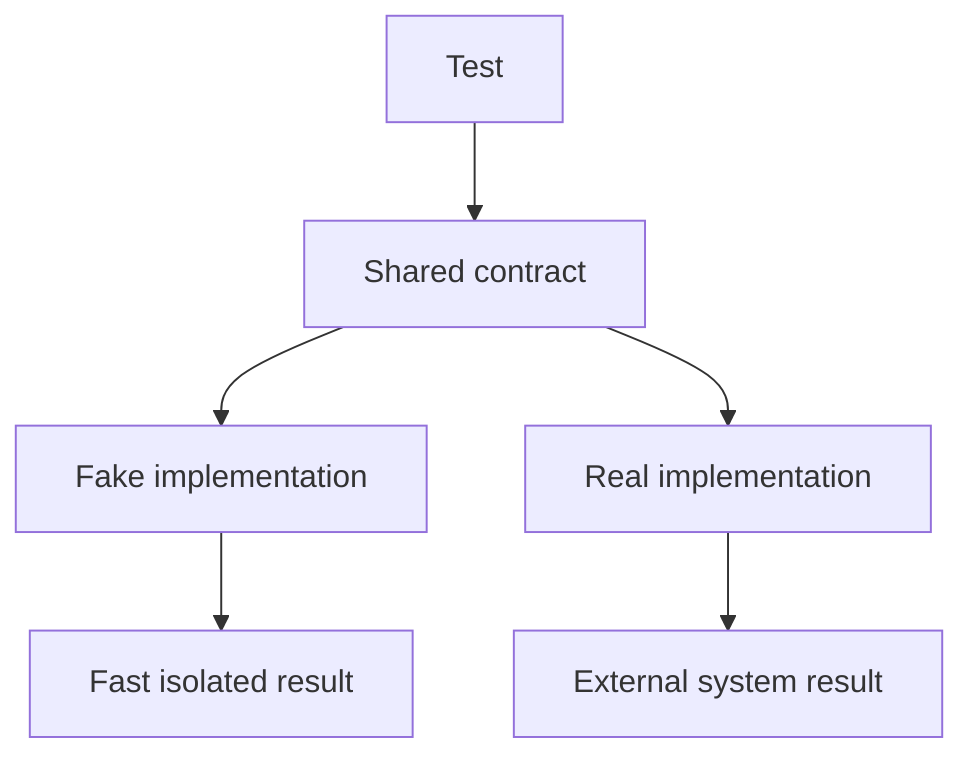

# Chapter 13. Fake

## Real World Example

실제 은행에 매번 가서 계좌 테스트를 하면 오래 걸리고 위험할 수 있습니다.

대신 테스트 안에 잔액을 저장하는 작은 은행을 만들 수 있습니다.

Fake는 실제 구현을 대신하지만 테스트에 필요한 동작은 수행합니다.

## Why Does It Exist?

실제 외부 시스템은 느리고 불안정하며 테스트마다 같은 상태를 보장하기 어렵습니다. Database, HTTP Service와 Browser를 매번 실행하면 테스트가 비싸고, 실패 원인이 코드인지 외부 환경인지 구분하기도 어렵습니다.

Fake는 테스트에 필요한 범위의 동작을 프로세스 안에서 제공합니다. 테스트는 실제 시스템의 운영 품질을 증명하지는 못하지만, Application이 의존성의 결과를 올바르게 처리하는지는 빠르게 확인할 수 있습니다.

## Definition

Fake는 테스트에서 실제 구현 대신 사용할 수 있는 단순한 동작 구현입니다. Fake Database, Fake Repository와 Fake Provider처럼 실제 외부 시스템의 결과를 흉내 내면서도 입력을 저장하거나 규칙을 수행할 수 있습니다. 단순한 반환값 하나만 제공하는 Stub과 달리, Fake는 작은 내부 상태나 동작을 가질 수 있습니다.

## Background Knowledge

### Test Double(테스트 대역)

테스트에서 실제 구성요소를 대신하는 모든 구현이나 객체를 통칭하는 말이다.

실제 Database나 외부 API를 쓰지 않고도 같은 호출 경계를 시험할 수 있게 한다.

예를 들어 실제 결제 서버 대신 테스트용 결제 객체를 전달할 수 있다.


### In-memory Implementation(메모리 구현)

파일이나 데이터베이스 대신 프로세스 메모리에 상태를 저장하는 구현이다.

준비와 정리가 빠르기 때문에 저장 계약이나 Application 정책을 격리해 확인할 때 유용하다.

예를 들어 `dict`에 사용자 값을 넣고 조회하는 Fake Repository를 만들 수 있다.


### Fake Repository(가짜 Repository)

실제 Repository와 같은 사용 계약을 지키면서 내부 저장만 단순하게 구현한 테스트 대역이다.

호출 횟수보다 저장하고 다시 읽은 결과 같은 상태를 확인하는 테스트에 적합하다.

예를 들어 메모리 목록으로 `save`와 `find`를 수행하는 Repository를 만들 수 있다.

## Responsibilities

| 해야 하는 일 | 하면 안 되는 일 |
|---|---|
| 실제 구현이 제공하는 사용 계약을 따른다 | 실제 시스템의 모든 기능을 복제하려 한다 |
| 테스트에 필요한 상태와 동작을 제공한다 | 실제 장애나 네트워크 품질을 보장한다고 주장한다 |
| 호출자가 결과를 예측할 수 있게 한다 | 테스트마다 다른 숨은 상태를 공유한다 |
| 빠르고 격리된 실행을 지원한다 | 실제 구현과 다른 정렬·오류 계약을 만든다 |

Fake의 목표는 “가짜지만 편리한 객체”가 아니라 테스트가 확인하려는 경계를 안정적으로 제공하는 것입니다.

## Typical Workflow



같은 계약을 통해 테스트에는 Fake를, 운영 실행에는 실제 구현을 연결할 수 있습니다. 두 구현이 완전히 같은 내부 코드를 공유해야 한다는 뜻은 아니지만, 호출자가 의존하는 결과와 오류의 의미는 일치해야 합니다.

## Relationship with Other Concepts

| 개념 | Fake와의 차이 |
|---|---|
| Stub | 미리 정한 값을 반환하는 단순 대체물이다 |
| Mock | 기대한 호출과 상호작용을 기록·검증하는 테스트 도구이다 |
| Test Fixture | 테스트에 필요한 객체와 데이터를 준비하는 구조이다 |
| In-memory Repository | 메모리에서 저장·조회 계약을 구현하는 Fake의 한 형태이다 |
| Integration Test | 실제 여러 구성요소나 인프라의 연결을 확인하는 테스트이다 |
| Production Implementation | 실제 외부 시스템과 운영 제약을 처리한다 |

Fake는 Test Double의 한 종류입니다. Fake를 사용했다고 Integration Test가 되는 것은 아니며, 테스트가 실제로 무엇을 사용했는지에 따라 증명 범위가 달라집니다.

## Common Mistakes

- Fake를 실제 API나 Database의 완전한 복제품으로 만든다.
- 실제 구현과 다른 입력 검증이나 정렬 결과를 반환한다.
- 여러 테스트가 하나의 Fake 상태를 공유한다.
- Fake가 너무 단순해 실패 경로를 표현하지 못한다.
- Fake 테스트만으로 실제 Provider 연결이 검증되었다고 생각한다.
- 테스트 전용 편의 메서드를 운영 계약처럼 사용한다.

Fake와 실제 구현의 차이가 커질수록 테스트는 통과하지만 운영에서 실패하는 위험이 커집니다.

## Best Practices

1. 먼저 테스트가 확인할 계약을 정의합니다.
2. 필요한 동작만 구현하고 실제 시스템 전체를 복제하지 않습니다.
3. 정상·빈 결과·실패 결과를 명시적으로 구성할 수 있게 합니다.
4. 테스트마다 Fake 상태를 새로 만듭니다.
5. 실제 구현과 공유해야 할 정렬, 누락과 오류 계약을 테스트합니다.
6. 외부 환경을 확인하는 Integration 또는 Live Test를 별도로 둡니다.

Fake Repository는 목록이나 Dictionary로 저장할 수 있고, Fake Provider는 미리 정한 응답을 반환할 수 있습니다. 중요한 것은 내부 자료구조가 아니라 외부 계약입니다.

## Trade-offs

| 선택 | 장점 | 단점 |
|---|---|---|
| Fake를 사용한다 | 빠르고 상태를 통제할 수 있다 | 실제 환경의 차이를 놓칠 수 있다 |
| 실제 구현을 사용한다 | 실제 연결을 검증한다 | 느리고 외부 환경에 의존한다 |
| In-memory Fake를 만든다 | 저장·조회 흐름을 간단히 테스트한다 | 동시성·SQL·네트워크는 재현하지 못한다 |
| 완전한 시뮬레이터를 만든다 | 다양한 상황을 표현할 수 있다 | 유지보수 비용이 커진다 |

Fake의 범위는 테스트의 질문에 맞춰야 합니다. 외부 시스템의 동작 자체가 질문이라면 Fake만으로는 충분하지 않습니다.

## Minimal Python Example

```python
class FakeClock:
    def __init__(self, value: str) -> None:
        self.value = value

    def now(self) -> str:
        return self.value


def greeting(clock) -> str:
    return f"time={clock.now()}"


assert greeting(FakeClock("fixed")) == "time=fixed"
```

Fake는 테스트가 필요한 계약을 유지하면서 실제 외부 동작을 빠르게 대체합니다.

## Example from automation-hub

앞의 작은 예제에서는 Fake Clock이 실제 시계를 대신했습니다. 실제 테스트도 외부 분석 Generator와 같은 호출 모양을 가진 Fake를 주입합니다.

### 실제 코드

이 Fake는 호출된 입력을 기록하고 고정된 summary를 반환합니다.

```python
class FakeGenerator:
    def __init__(self, result: str = "뉴스 근거를 요약했습니다.") -> None:
        self.result = result
        self.calls: list[tuple[StockPrice, MovementResult, list[StockNewsArticle]]] = []

    def generate_summary(
        self,
        stock_price: StockPrice,
        movement: MovementResult,
        articles: list[StockNewsArticle],
    ) -> str:
        self.calls.append((stock_price, movement, articles))
        return self.result
```

Source: [`tests/google_finance/test_analysis_application.py`](../../tests/google_finance/test_analysis_application.py)

### 코드에서 확인할 점

- **이 코드는 무엇을 하는가?** 이 Fake는 호출된 입력을 기록하고 고정된 summary를 반환합니다.
- **왜 이 Chapter의 개념인가?** Fake가 실제 Provider의 동작을 흉내 내는 것이 아니라 테스트에 필요한 Application 계약을 제공하는 예입니다.
- **무엇을 하지 않는가?** Gemini 인증, quota와 실제 응답 형식은 이 Fake로 검증하지 않습니다.

### Repository에서 따라가 보기

- `tests/google_finance/test_analysis_application.py`의 FakeStorage와 FakeNewsProvider를 함께 확인합니다.

## Checkpoint

1. Fake와 실제 구현이 공유해야 하는 최소 계약은 무엇입니까?
2. Fake Database가 실제 Database의 모든 동작을 복제할 필요가 없는 이유는 무엇입니까?
3. Fake 테스트가 외부 Provider 연결을 증명하지 못하는 이유는 무엇입니까?
4. Fake와 Fixture는 각각 어떤 문제를 해결합니까?

## Summary

이번 Chapter에서 기억해야 할 것은 다음입니다. Fake는 실제 구현과 비슷한 계약을 가진 테스트용 구현입니다. 빠르고 결정적인 테스트를 만들 수 있습니다. 하지만 실제 시스템의 모든 동작을 증명하지는 않으므로 별도의 통합 검증이 필요합니다.

## Related Concepts

- [Dependency Injection](dependency-injection.md#chapter-10-dependency-injection): Fake를 테스트 대상에 전달하는 방법입니다.
- [Mock and Stub](mock-and-stub.md#chapter-14-mock-and-stub): 다른 Test Double의 차이를 설명합니다.
- [Test Fixture](test-fixture.md#chapter-15-test-fixture): Fake와 테스트 데이터를 준비하는 방법입니다.
- [Repository Pattern](repository-pattern.md#chapter-8-repository-pattern): Fake Repository가 대체할 저장 계약입니다.

## Related Project Documents

- [Google Finance Application Tests](../../tests/google_finance/test_analysis_application.py): Fake 기반 Application 테스트입니다.
- [Google Finance Storage Tests](../../tests/google_finance/test_storage.py): Session Fake 사용 사례입니다.
- [Google Finance Architecture](../packages/google_finance/architecture.md): 현재 테스트 경계의 Reference입니다.
- [Architecture Handbook](../handbook/README.md): 테스트 경계와 의존성 분리의 설계 과정을 학습합니다.
- [CODEBASE_GUIDE](../../CODEBASE_GUIDE.md): 테스트 코드 탐색 순서입니다.

## Next Chapter

[Chapter 14. Mock and Stub](mock-and-stub.md#chapter-14-mock-and-stub)에서는 Fake와 상호작용 검증용 테스트 대역의 차이를 설명합니다.

---

| 이전 Chapter | 목차 | 다음 Chapter |
|---|---|---|
| [Chapter 12. Configuration](configuration.md#chapter-12-configuration) | [Concepts Book](README.md#python-automation-architecture-concepts) | [Chapter 14. Mock and Stub](mock-and-stub.md#chapter-14-mock-and-stub) |
