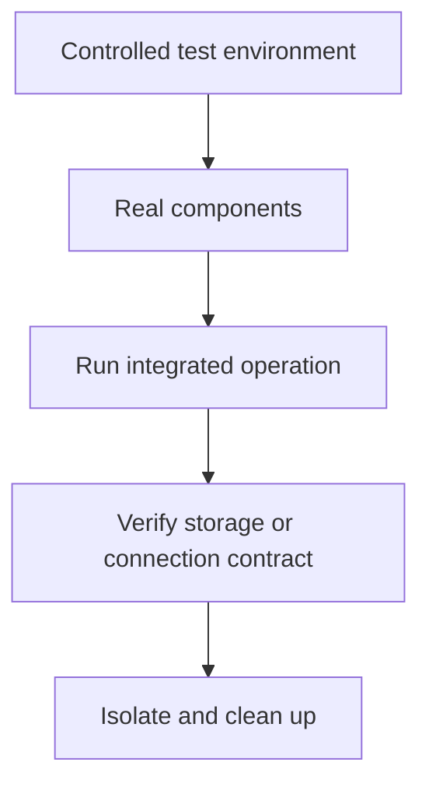

# Chapter 17. Integration Test

## Real World Example

자동차 부품을 각각 시험하는 것과 실제로 조립한 자동차를 시험하는 것은 다릅니다.

부품 사이의 연결이 맞아야 전체가 움직입니다.

Integration Test는 여러 실제 부분이 함께 작동하는지 확인합니다.

## Why Does It Exist?

각 구성요소를 Fake로 테스트해도 실제 연결에서는 다른 문제가 생길 수 있습니다. ORM 설정, Transaction, Schema, 파일 권한과 매핑은 격리된 객체만으로 완전히 확인할 수 없습니다.

Integration Test는 이 간극을 확인합니다. 느리고 Test Environment가 필요하지만, 실제로 함께 사용되는 구성요소가 같은 계약을 지키는지 보여주는 중요한 증거입니다.

## Definition

Integration Test는 여러 실제 구성요소가 함께 제대로 연결되는지 확인하는 테스트입니다. 실제 Database, File System, ORM, Repository 또는 제한된 외부 연결을 사용할 수 있습니다. Unit Test가 하나의 책임을 격리해 확인한다면, Integration Test는 경계 사이의 변환·설정·자원 연결이 실제 환경에서 맞는지 확인합니다.

## Background Knowledge

### Test Environment(테스트 환경)

테스트를 실행하는 데 필요한 데이터베이스, 파일과 설정을 갖춘 실행 조건이다.

개발자의 개인 환경에 기대지 않고 준비·정리 절차를 명시해야 결과를 재현할 수 있다.

예를 들어 테스트 전용 데이터베이스와 테스트용 자격증명을 따로 준비할 수 있다.


### Integration Boundary(통합 경계)

둘 이상의 실제 구성요소가 만나는 지점이다.

이 경계를 테스트하면 각 부품의 단위 동작이 아니라 함께 연결될 때의 변환과 계약을 확인할 수 있다.

예를 들어 ORM Model, Session과 실제 Database 사이가 통합 경계다.


### Database Schema(데이터베이스 스키마)

테이블, 열, 타입과 제약으로 이루어진 데이터베이스의 구조이다.

Application이 기대하는 저장 형태와 실제 구조가 다르면 개별 함수가 맞아도 통합 실행은 실패할 수 있다.

예를 들어 snapshot 테이블의 symbol과 collected_at 열이 스키마의 일부다.

## Responsibilities

| 해야 하는 일 | 하면 안 되는 일 |
|---|---|
| 실제 구성요소 사이의 연결을 검증한다 | 모든 입력 조합을 하나의 Integration Test로 실행한다 |
| 저장·조회·변환 계약을 확인한다 | Unit Test의 모든 작은 규칙을 반복한다 |
| Test Environment의 설정과 수명을 관리한다 | 운영 Database의 데이터를 무분별하게 변경한다 |
| 오류·정리·격리 조건을 확인한다 | 외부 시스템의 불안정성을 정상으로 숨긴다 |
| 실행 비용과 실행 조건을 문서화한다 | 테스트가 실행되지 않았는데 성공으로 해석한다 |

Integration Test는 실제 구성요소를 사용하지만, 반드시 Production 전체를 끝까지 실행하는 테스트는 아닙니다.

## Typical Workflow



테스트는 먼저 격리된 환경을 준비하고 실제 구성요소를 연결합니다. 동작을 실행한 뒤 경계의 결과를 확인하고, 다른 테스트에 영향을 주지 않도록 데이터를 정리합니다.

## Relationship with Other Concepts

| 개념 | Integration Test와의 차이 |
|---|---|
| Unit Test | 외부 인프라 없이 하나의 책임을 검증한다 |
| Live Test | 실제 운영에 가까운 외부 서비스와 연결을 실행 시점에 검증한다 |
| Test Environment | Integration Test가 사용할 실제 자원과 설정의 묶음이다 |
| ORM | Database와 객체 사이의 변환을 지원하는 구현 기술이다 |
| Repository | 저장·조회 계약을 제공하는 경계이다 |
| End-to-End Test | 사용자 진입점부터 결과까지 더 넓은 흐름을 검증한다 |

Integration Test와 End-to-End Test의 범위는 조직마다 다를 수 있습니다. 기준은 몇 개의 파일을 실행했는지가 아니라 실제 어떤 경계와 자원을 연결했는지입니다.

## Common Mistakes

- 기본 테스트에서 실제 Database를 항상 요구한다.
- 테스트 데이터를 정리하지 않아 다음 테스트에 영향을 준다.
- 개발 Database와 Test Database를 구분하지 않는다.
- ORM Model만 만들고 실제 Migration·Schema를 확인하지 않는다.
- Integration Test가 skip되었는데 통과했다고 보고한다.
- 외부 API의 변동성을 모두 Integration Test로 해결하려 한다.

느린 테스트는 가치가 있지만, 실행 조건과 실패 범위를 숨기면 신뢰하기 어려운 테스트가 됩니다.

## Best Practices

1. 실제로 연결할 구성요소와 검증할 계약을 먼저 정의합니다.
2. 별도의 Test Environment와 테스트 데이터를 사용합니다.
3. 각 테스트가 만든 데이터를 명시적으로 정리합니다.
4. Schema, Migration, Transaction과 복원 결과를 확인합니다.
5. 실행에 필요한 설정과 skip 조건을 문서화합니다.
6. 빠른 Unit Test와 분리해 필요한 시점에 실행합니다.

Integration Test는 느린 것이 문제가 아니라, 무엇을 증명하는지 모른 채 실행되는 것이 문제입니다. 실행 비용을 감수할 만큼 실제 위험을 확인하는지 판단해야 합니다.

## Trade-offs

| 선택 | 장점 | 단점 |
|---|---|---|
| 실제 Database 사용 | Schema·Transaction·ORM 연결을 확인한다 | 실행 환경과 정리 비용이 필요하다 |
| In-memory Database 사용 | 빠르고 준비가 쉽다 | 실제 Database 차이를 놓칠 수 있다 |
| 실제 File System 사용 | 경로·권한·직렬화를 확인한다 | 환경과 파일 정리가 필요하다 |
| 모든 외부 서비스를 연결한다 | 넓은 흐름을 확인한다 | 느리고 실패 원인과 재현성이 나빠진다 |

## Minimal Python Example

```python
from pathlib import Path
from tempfile import TemporaryDirectory


def save(path: Path, value: str) -> None:
    path.write_text(value, encoding="utf-8")


with TemporaryDirectory() as directory:
    path = Path(directory) / "value.txt"
    save(path, "stored")
    assert path.read_text(encoding="utf-8") == "stored"
```

실제 파일 시스템을 사용하면 여러 구성요소가 연결된 저장 계약을 확인할 수 있지만 실행 비용은 커집니다.

## Example from automation-hub

앞의 작은 예제에서는 실제 File System에 저장하고 다시 읽었습니다. 실제 Integration Test는 MySQL, SQLAlchemy와 Storage를 함께 연결합니다.

### 실제 코드

이 코드는 실제 DB에서 최신 Snapshot을 조회하고 Movement Application까지 연결해 결과를 확인합니다.

```python
        latest = storage.get_latest("integration:test")
        assert latest is not None
        assert latest.current_price == Decimal("13.00000001")

        latest_two = storage.get_latest_two(symbol)
        assert [item.collected_at.hour for item in latest_two] == [3, 2]
        assert [item.current_price for item in latest_two] == [
            Decimal("13.00000001"),
            Decimal("12.00000001"),
        ]
        movement = lookup_movement(storage, "integration:test")
        assert movement.direction is MovementDirection.UP
        assert movement.price_delta == Decimal("1.00000000")
```

Source: [`tests/database/test_google_finance_integration.py`](../../tests/database/test_google_finance_integration.py)

### 코드에서 확인할 점

- **이 코드는 무엇을 하는가?** 이 코드는 실제 DB에서 최신 Snapshot을 조회하고 Movement Application까지 연결해 결과를 확인합니다.
- **왜 이 Chapter의 개념인가?** 여러 구성요소가 함께 동작할 때 저장·조회·변환 계약이 유지되는지 보여 주는 Integration Test입니다.
- **무엇을 하지 않는가?** 환경 변수가 없을 때 기본 테스트가 자동으로 실제 DB를 검증한다는 뜻은 아닙니다. 이 테스트의 실행 조건은 별도로 준비해야 합니다.

### Repository에서 따라가 보기

- `tests/database/test_google_finance_integration.py`의 `RUN_DB_INTEGRATION=1` 조건과 정리 절차를 확인합니다.

## Checkpoint

1. Fake 기반 테스트가 통과해도 실제 ORM과 Database를 확인해야 하는 이유는 무엇입니까?
2. Integration Test에서 데이터 정리와 격리가 중요한 이유는 무엇입니까?
3. skip된 Integration Test를 성공으로 해석하면 안 되는 이유는 무엇입니까?
4. 실제 Database와 In-memory Database를 선택할 때 어떤 위험을 비교해야 합니까?

## Summary

이번 Chapter에서 기억해야 할 것은 다음입니다. Integration Test는 여러 구성요소가 실제 경계에서 함께 동작하는지 검증합니다. Unit Test보다 느릴 수 있지만 변환, 저장과 조회 사이의 연결 오류를 발견합니다. 따라서 모든 작은 규칙을 반복하기보다 연결 계약에 집중해야 합니다.

## Related Concepts

- [Unit Test](unit-test.md#chapter-16-unit-test): 격리된 내부 규칙을 검증합니다.
- [Fake](fake.md#chapter-13-fake): 실제 구성요소를 대체하는 빠른 테스트 구현입니다.
- [Test Fixture](test-fixture.md#chapter-15-test-fixture): Test Environment와 데이터를 준비합니다.
- [Live Test](live-test.md#chapter-18-live-test): 실제 외부 시스템 연결을 검증합니다.
- [Persistence](persistence.md#chapter-7-persistence): 저장·조회 계약의 목적을 설명합니다.

## Related Project Documents

- [Database Integration Tests](../../tests/database/test_integration.py): 실제 MySQL 통합 테스트입니다.
- [Google Finance Integration Tests](../../tests/database/test_google_finance_integration.py): Snapshot Persistence 통합 테스트입니다.
- [Operations](../operations/README.md): Integration Test 실행 조건의 운영 문서입니다.
- [Architecture Handbook](../handbook/README.md): 테스트 경계를 설계한 과정을 학습합니다.
- [CODEBASE_GUIDE](../../CODEBASE_GUIDE.md): 통합 테스트 코드 탐색 순서입니다.

## Next Chapter

[Chapter 18. Live Test](live-test.md#chapter-18-live-test)에서는 실제 외부 서비스와 연결해 실행 시점의 계약을 확인합니다.

---

| 이전 Chapter | 목차 | 다음 Chapter |
|---|---|---|
| [Chapter 16. Unit Test](unit-test.md#chapter-16-unit-test) | [Concepts Book](README.md#python-automation-architecture-concepts) | [Chapter 18. Live Test](live-test.md#chapter-18-live-test) |
