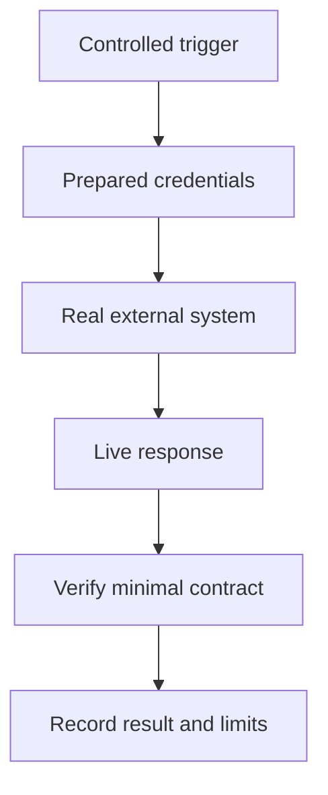

# Chapter 18. Live Test

## Real World Example

요리 연습은 모형 재료로 할 수 있지만, 손님에게 내기 전에는 실제 재료와 주방에서 확인해야 합니다.

외부 API와 웹 페이지도 실제 조건에서 한 번씩 확인할 필요가 있습니다.

Live Test는 실행 시점의 외부 연결을 점검합니다.

## Why Does It Exist?

Unit Test와 Integration Test가 모두 통과해도 외부 서비스는 바뀔 수 있습니다. API Key가 만료되거나, 모델 접근 권한이 사라지거나, RSS 형식·Web Page DOM·Provider 응답이 변경될 수 있습니다.

Live Test는 이런 외부 변화를 실제 조건에서 감지합니다. 다만 결과가 외부 상태, 네트워크, 비용과 사용량 한도에 영향을 받으므로 모든 테스트 실행에 포함할 수는 없습니다.

## Definition

Live Test는 실제 외부 시스템에 연결해 현재도 작동하는지 확인하는 테스트입니다. 실제 API, Browser, LLM, RSS와 Web Page를 사용할 수 있습니다. Live Test는 모든 입력과 장애를 증명하는 일반 회귀 테스트가 아니라, 특정 시점의 외부 경로를 확인하는 제한된 Smoke Test입니다.

## Background Knowledge

### Smoke Test(연기 테스트)

시스템의 가장 중요한 짧은 실행 경로가 살아 있는지 확인하는 테스트이다.

모든 예외를 검증하기보다 인증, 연결과 최소 응답 계약을 빠르게 점검한다.

예를 들어 검색어 하나로 뉴스와 분석 결과가 끝까지 생성되는지 확인할 수 있다.


### External System(외부 시스템)

테스트 대상 프로그램이 직접 소유하지 않는 서비스나 장치이다.

API, Browser, RSS와 Web Page는 언제든 응답이나 접근 조건이 바뀔 수 있으므로 내부 코드와 다른 검증이 필요하다.

예를 들어 뉴스 RSS 서버나 LLM Provider가 외부 시스템이다.


### Contract(계약)

호출자와 외부 시스템이 지켜야 하는 입력·응답의 약속이다.

Live Test는 전체 품질보다 현재 인증과 최소 응답 형식이 이 약속을 지키는지 확인하는 데 초점을 둔다.

예를 들어 응답에 필요한 제목과 URL이 있고 내부 모델로 변환되는지 검사할 수 있다.

## Responsibilities

| 해야 하는 일 | 하면 안 되는 일 |
|---|---|
| 실제 외부 경로의 현재 연결을 확인한다 | 모든 실패 조합을 Live Test 하나로 보장한다 |
| 인증, 접근 권한과 응답 형태를 확인한다 | API Key와 원본 응답을 로그에 남긴다 |
| 최소 비용과 범위로 Smoke Test를 실행한다 | 모든 Commit마다 외부 API를 무조건 호출한다 |
| 외부 계약 변경을 조기에 감지한다 | 실행 시점의 성공을 영구적인 보장으로 해석한다 |
| 실행 조건과 비용을 기록한다 | quota와 rate limit을 무시한 채 반복한다 |

Live Test는 외부 시스템의 현재 상태를 증명합니다. 내부 규칙의 모든 조합은 Unit Test와 Integration Test가 담당해야 합니다.

## Typical Workflow



실행 전에 자격증명, 비용과 대상 범위를 확인합니다. 실제 시스템에 연결한 뒤 최소 계약을 검증하고, 성공·실패와 실행 시점의 제한을 함께 기록합니다.

## Relationship with Other Concepts

| 개념 | Live Test와의 차이 |
|---|---|
| Unit Test | 외부 환경 없이 내부 규칙을 빠르게 검증한다 |
| Integration Test | 통제된 환경에서 여러 구성요소와 인프라를 검증한다 |
| Smoke Test | 넓은 회귀보다 최소 실행 경로가 살아 있는지 확인하는 목적이다 |
| End-to-End Test | 사용자 진입점부터 외부 결과까지 더 넓은 흐름을 검증할 수 있다 |
| Contract Test | 양쪽이 합의한 형식과 의미를 반복적으로 검증한다 |
| Monitoring | 실행 후 지속적으로 상태를 관찰하는 운영 활동이다 |

Live Test와 Monitoring은 모두 실제 환경을 다루지만, Live Test는 의도적으로 실행하는 점검이고 Monitoring은 운영 상태를 지속적으로 관찰합니다.

## Common Mistakes

- Live Test를 모든 회귀 테스트의 대체물로 사용한다.
- API Key, 원본 응답 또는 개인정보를 출력한다.
- 외부 요청 비용과 quota를 고려하지 않는다.
- 실제 Browser와 RSS가 항상 같은 결과를 준다고 가정한다.
- 실패를 코드 결함으로 즉시 단정한다.
- Live 성공을 이후 실행에도 보장되는 사실처럼 문서화한다.

Live 결과는 실행 시점의 증거입니다. 외부 조건이 바뀌면 같은 코드도 다른 결과를 낼 수 있습니다.

## Best Practices

1. Live Test의 대상, 횟수와 검증 계약을 최소화합니다.
2. Credentials와 실행 권한을 안전하게 준비합니다.
3. 응답 전문 대신 길이, 상태와 핵심 계약만 기록합니다.
4. Unit·Integration Test가 먼저 통과한 뒤 실행합니다.
5. quota, rate limit, 비용과 실행 시간을 고려합니다.
6. CI 전체에 항상 넣기보다 예약 실행이나 Release 전 점검으로 분리합니다.
7. 실패 원인을 코드, 환경, 인증과 외부 계약 변경으로 나누어 분석합니다.

CI에서 항상 실행하지 않는 이유는 외부 네트워크와 Credentials가 모든 개발 실행에 준비되지 않기 때문입니다. 또한 Live Test는 느리고 비용이 들며, 외부 서비스의 비결정성으로 작은 코드 회귀를 정확히 설명하지 못합니다.

## Trade-offs

| 선택 | 장점 | 단점 |
|---|---|---|
| 실제 외부 시스템을 호출한다 | 현재 인증·응답·접근 계약을 확인한다 | 느리고 비용과 quota가 필요하다 |
| Fake만 사용한다 | 빠르고 결정적이다 | 외부 계약 변경을 감지하지 못한다 |
| 모든 실행에 Live Test를 넣는다 | 문제를 빨리 발견할 수 있다 | 불안정성과 비용이 개발 흐름을 방해한다 |
| 제한된 Smoke Test로 운영한다 | 비용과 범위를 통제한다 | 모든 경로와 오류 조합을 확인하지 못한다 |

## Minimal Python Example

```python
import os


def smoke_call(client) -> str:
    return client.ping()


def run_live(client) -> None:
    if os.environ.get("RUN_LIVE") == "1":
        assert smoke_call(client)
    else:
        print("live test disabled")
```

Live Test는 명시적으로 활성화했을 때 실제 외부 경계를 확인하고, 기본 테스트 흐름과 비용을 분리합니다.

## Example from automation-hub

앞의 작은 예제에서는 선택적으로 실제 Client에 연결하는 Smoke Test를 만들었습니다. 실제 Repository에도 CLI가 Storage, News Provider와 Gemini Generator를 조립하는 실행 경로가 있습니다.

### 실제 코드

이 코드는 저장된 Snapshot을 조회하고 Google News Provider와 Gemini Generator를 사용해 하나의 분석을 실행합니다.

```python
    from google_finance.analysis_application import analyze_stored_quote
    from google_finance.analysis_generator import GeminiStockInsightGenerator
    from google_finance.movement_application import MovementUnavailable
    from google_finance.news import GoogleFinanceNewsProvider
    from google_finance.storage import StockQuoteStorage

    result = analyze_stored_quote(
        StockQuoteStorage(),
        GoogleFinanceNewsProvider(),
        GeminiStockInsightGenerator(api_key=settings.gemini_api_key),
        symbol,
    )
    if isinstance(result, StockInsight):
        _print_stock_insight(result)
    elif isinstance(result, MovementUnavailable):
        _print_movement_unavailable(result.symbol, result.snapshot_count)
```

Source: [`google_finance/main.py`](../../google_finance/main.py)

### 코드에서 확인할 점

- **이 코드는 무엇을 하는가?** 이 코드는 저장된 Snapshot을 조회하고 Google News Provider와 Gemini Generator를 사용해 하나의 분석을 실행합니다.
- **왜 이 Chapter의 개념인가?** Live 실행에서 확인할 외부 연결 경로가 어디에서 시작되는지 보여 주는 실제 Composition 코드입니다.
- **무엇을 하지 않는가?** 이 코드는 자동화된 Live Test 함수가 아닙니다. 실제 실행 성공을 영구 보장하지 않으며, 외부 상태와 quota의 영향을 받습니다.

### Repository에서 따라가 보기

- 실행 전 `tests/google_finance/`의 Fake 기반 테스트를 먼저 통과시키고 실제 CLI 명령을 별도로 확인합니다.

## Checkpoint

1. Live Test가 Unit Test와 Integration Test로 증명할 수 없는 것은 무엇입니까?
2. CI에서 모든 Live Test를 항상 실행하지 않는 이유는 무엇입니까?
3. Live 성공을 영구적인 품질 보증으로 해석하면 안 되는 이유는 무엇입니까?
4. 외부 실패를 코드 결함과 환경 문제로 나누려면 어떤 증거를 함께 봐야 합니까?

## Summary

이번 Chapter에서 기억해야 할 것은 다음입니다. Live Test는 실제 API, Browser 또는 외부 데이터와의 연결이 현재도 유효한지 확인합니다. 실행 환경과 외부 상태의 영향을 받으므로 Unit·Integration Test를 대신하지 않습니다. 비용과 외부 상태를 고려해 제한된 Smoke Test로 운영하는 것이 적절합니다.

## Related Concepts

- [Unit Test](unit-test.md#chapter-16-unit-test): 외부 환경 없이 내부 규칙을 검증합니다.
- [Integration Test](integration-test.md#chapter-17-integration-test): 실제 구성요소와 Test Environment를 검증합니다.
- [Test Fixture](test-fixture.md#chapter-15-test-fixture): 테스트 입력과 실행 환경을 준비합니다.
- [Provider](provider.md#chapter-6-provider): Live Test에서 실제 연결되는 외부 경계입니다.
- [Configuration](configuration.md#chapter-12-configuration): Credentials와 실행 설정을 제공합니다.

## Related Project Documents

- [Google Finance Package README](../packages/google_finance/README.md): 현재 실행 명령과 외부 설정입니다.
- [Namuwiki Package README](../packages/namuwiki_trend/README.md): 현재 Live 흐름과 실행 방법입니다.
- [Architecture Handbook Chapter 8](../handbook/08-defining-test-boundaries.md): Live Smoke Test의 실제 경계를 설명합니다.
- [DEV_LOG](../development/DEV_LOG.md): 실행 시점의 검증 기록입니다.
- [Operations](../operations/README.md): 외부 환경과 운영 실행 조건입니다.

## Next Chapter

[Chapter 19. Command-Line Interface (CLI)](cli.md#chapter-19-command-line-interface-cli)에서는 프로그램을 실행하고 결과와 실패를 외부에 전달하는 진입점을 설명합니다.

---

| 이전 Chapter | 목차 | 다음 Chapter |
|---|---|---|
| [Chapter 17. Integration Test](integration-test.md#chapter-17-integration-test) | [Concepts Book](README.md#python-automation-architecture-concepts) | [Chapter 19. Command-Line Interface (CLI)](cli.md#chapter-19-command-line-interface-cli) |
