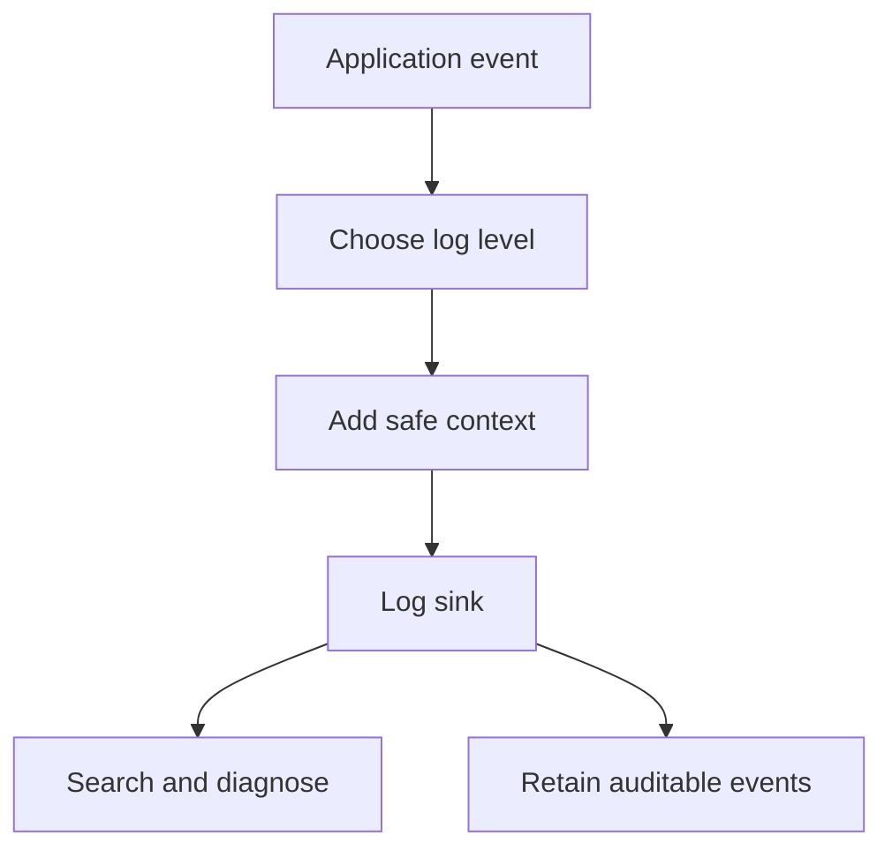

# Chapter 21. Logging

## Real World Example

비행기의 블랙박스는 비행 중 어떤 일이 있었는지 나중에 확인하게 해 줍니다.

프로그램도 시작, 주요 단계와 실패를 기록해야 운영자가 원인을 찾을 수 있습니다.

Logging은 실행의 흔적을 남기는 방법입니다.

## Why Does It Exist?

자동화는 사람이 화면을 보고 있지 않아도 실행됩니다. 작업이 언제 시작되었고 어떤 단계에서 실패했는지 기록이 없으면 운영자는 결과만 보고 원인을 추측해야 합니다.

Log Level은 사건의 중요도와 대응 필요성을 구분합니다. DEBUG는 개발 진단, INFO는 정상 흐름, WARNING은 주의가 필요한 상태, ERROR는 실패한 작업, CRITICAL은 시스템 전체에 영향을 줄 수 있는 심각한 상태에 사용합니다.

## Definition

Logging은 프로그램이 한 일을 나중에 확인할 수 있도록 기록하는 방법입니다. Log는 사람이 현재 작업을 이해하고 운영 도구가 문제를 찾는 데 사용하는 신호입니다. Logging은 예외를 대신하는 것도, 모든 실행 데이터를 복사하는 것도 아니며, 필요한 맥락을 안전한 수준으로 남기는 운영 경계입니다.

## Background Knowledge

### Log Level(로그 수준)

기록된 사건의 중요도와 대응 필요성을 나타내는 분류이다.

DEBUG, INFO, WARNING과 ERROR를 구분하면 정상 흐름과 문제 신호를 운영자가 빠르게 나눌 수 있다.

예를 들어 정상 작업은 INFO, 복구가 필요한 오류는 ERROR로 기록할 수 있다.


### Structured Logging(구조화된 로깅)

로그 메시지와 맥락을 정해진 필드 형태로 기록하는 방식이다.

긴 문장을 사람이 읽는 데서 그치지 않고 작업 ID나 단계별로 검색·집계할 수 있다.

예를 들어 `{"level": "ERROR", "stage": "news"}`처럼 필드를 기록할 수 있다.


### Correlation ID(연관 ID)

하나의 요청이나 작업에서 발생한 여러 기록을 묶는 식별자이다.

외부 호출과 내부 단계를 같은 실행으로 추적할 때 유용하다.

예를 들어 하나의 Batch ID를 모든 단계의 로그에 함께 넣을 수 있다.

## Responsibilities

| 해야 하는 일 | 하면 안 되는 일 |
|---|---|
| 시작·종료·중요 단계와 실패를 기록한다 | API Key, 비밀번호와 원본 비밀을 기록한다 |
| 적절한 Log Level을 선택한다 | 모든 값을 DEBUG로 남긴다 |
| 시간, 작업 식별자와 단계 맥락을 제공한다 | 예외를 기록했다는 이유로 처리했다고 생각한다 |
| Structured Logging으로 검색 가능한 필드를 제공한다 | 개인정보와 전체 Payload를 무분별하게 저장한다 |
| Audit이 필요한 사건을 별도 요구에 맞게 보존한다 | Log를 Business Database의 대체물로 사용한다 |

Log는 문제를 설명하는 데 필요한 최소 맥락을 남겨야 합니다. 너무 적으면 원인을 찾지 못하고, 너무 많으면 비용과 보안 위험이 커집니다.

## Typical Workflow



사건이 발생하면 중요도를 정하고 안전한 맥락을 추가한 뒤 Log Sink에 기록합니다. 운영자는 기록을 검색해 진단하고, 법적·업무상 보존이 필요한 사건은 Audit Log 정책에 따라 별도로 관리할 수 있습니다.

## Relationship with Other Concepts

| 개념 | Logging과의 차이 |
|---|---|
| DEBUG | 개발 중 상세 진단에 사용하는 낮은 수준의 기록이다 |
| INFO | 정상적인 주요 흐름을 기록한다 |
| WARNING | 즉시 실패는 아니지만 주의가 필요한 상태다 |
| ERROR | 특정 작업이나 요청이 실패한 상태다 |
| CRITICAL | 시스템 전체나 복구 가능성에 큰 영향을 주는 상태다 |
| Exception | 실행 흐름에서 발생한 오류 객체이며 Log와 동일하지 않다 |
| Structured Logging | 메시지와 필드를 구조화해 검색·집계하는 방식이다 |
| Audit Log | 누가 언제 어떤 중요한 행위를 했는지 보존하는 기록이다 |

Exception은 호출자에게 전달하거나 처리해야 하는 실행 상태이고, Log는 그 상태를 관찰하기 위한 기록입니다. 모든 Exception을 그대로 Log에 남겨야 하는 것도, 모든 Log가 Audit Log인 것도 아닙니다.

## Common Mistakes

- 모든 메시지를 INFO나 ERROR로만 기록한다.
- Exception 전체와 원본 Client Error를 사용자 출력과 Log에 남긴다.
- Correlation ID 없이 여러 요청의 Log를 섞는다.
- Structured Field 대신 사람이 읽는 긴 문자열만 만든다.
- 민감한 Header, Token, Cookie와 전체 Response를 기록한다.
- Log가 있으니 예외 처리가 끝났다고 생각한다.

특히 비밀 정보는 Log Sink, 백업 파일과 중앙 수집 시스템에 오래 남을 수 있으므로 처음부터 제외해야 합니다.

## Best Practices

1. Log Level의 의미를 팀과 시스템 전체에서 일관되게 정합니다.
2. 작업 ID나 Correlation ID를 사용해 하나의 실행을 추적합니다.
3. Structured Logging으로 시간, 단계, 결과와 식별자를 필드로 남깁니다.
4. Exception은 필요한 경우 원인과 함께 기록하되 민감정보를 제거합니다.
5. Audit Log와 일반 진단 Log의 보존·접근 정책을 분리합니다.
6. Log 용량, 보존 기간과 Rotation을 운영 요구에 맞게 정합니다.

Correlation ID는 여러 Service나 외부 요청을 하나의 실행으로 묶어 보는 식별자입니다. 단일 프로세스에서도 Batch 실행 ID나 Job ID가 같은 역할을 할 수 있습니다.

## Trade-offs

| 선택 | 장점 | 단점 |
|---|---|---|
| 텍스트 Log | 사람이 바로 읽기 쉽다 | 검색과 집계가 제한적일 수 있다 |
| Structured Logging | 필드 검색과 자동 집계가 쉽다 | 생산·조회 형식의 약속이 필요하다 |
| 상세 Log | 진단에 필요한 정보가 많다 | 비용·성능·민감정보 위험이 커진다 |
| 최소 Log | 비용과 노출 위험이 낮다 | 실패 원인을 찾기 어려울 수 있다 |
| Audit Log 분리 | 중요한 행위의 추적성과 보존이 명확하다 | 저장·접근 정책을 별도로 운영해야 한다 |

좋은 Logging은 가장 많은 내용을 남기는 것이 아니라, 장애·운영·감사 질문에 필요한 정보를 안전하게 남기는 것입니다.

## Minimal Python Example

```python
import logging


logger = logging.getLogger("worker")
logging.basicConfig(level=logging.INFO)


def run_job(job_id: str) -> None:
    logger.info("job started: %s", job_id)
    try:
        logger.info("job completed: %s", job_id)
    except RuntimeError:
        logger.exception("job failed: %s", job_id)
        raise


run_job("J-1")
```

Logging은 실행의 중요한 상태와 실패 원인을 기록하지만, 예외를 조용히 삼키는 대체물이 아닙니다.

## Example from automation-hub

앞의 작은 예제에서는 Job 시작과 실패를 Log Level에 맞춰 기록했습니다. 실제 Package도 Logger를 만들고 설정된 수준을 적용합니다.

### 실제 코드

이 코드는 이름과 Level을 받아 Logger를 만들고 중복 Handler를 피합니다.

```python
def get_logger(name: str, level: str = "INFO") -> logging.Logger:
    """모듈별 로거를 생성하여 반환한다.

    - 콘솔 핸들러: 모든 로그를 stdout으로 출력
    - 파일 핸들러: RotatingFileHandler로 logs/namuwiki_trend.log에 기록
      - 최대 10MB, 백업 파일 5개 유지

    Args:
        name: 로거 이름. 일반적으로 __name__을 전달한다.
        level: 로그 레벨. 기본값은 "INFO".

    Returns:
        설정된 logging.Logger 인스턴스.
    """
    logger = logging.getLogger(name)

    if logger.handlers:
        return logger

    logger.setLevel(getattr(logging, level.upper()))
```

Source: [`namuwiki_trend/config.py`](../../namuwiki_trend/config.py)

### 코드에서 확인할 점

- **이 코드는 무엇을 하는가?** 이 코드는 이름과 Level을 받아 Logger를 만들고 중복 Handler를 피합니다.
- **왜 이 Chapter의 개념인가?** Logging이 Application의 중요한 실행 흔적을 남기는 공통 운영 경계임을 보여 줍니다.
- **무엇을 하지 않는가?** 현재 코드에는 Structured Logging과 Correlation ID가 별도 구현되어 있지 않습니다. 또한 Log 기록만으로 예외 처리가 끝나는 것도 아닙니다.

### Repository에서 따라가 보기

- `google_finance/config.py`의 `get_logger()`와 RotatingFileHandler 설정을 비교합니다.

## Checkpoint

1. Log와 Exception이 서로 다른 책임을 가지는 이유는 무엇입니까?
2. DEBUG, INFO, WARNING, ERROR와 CRITICAL을 구분하면 어떤 운영상 이점이 있습니까?
3. Correlation ID가 여러 단계의 실행을 추적하는 데 어떻게 도움을 줍니까?
4. 민감정보를 Log에 남기면 안 되는 이유는 무엇입니까?

## Summary

이번 Chapter에서 기억해야 할 것은 다음입니다. Logging은 실행 상태와 문제를 시간순으로 관찰할 수 있게 합니다. 레벨과 메시지를 목적에 맞게 선택하고 민감정보를 기록하지 않아야 합니다. 로그는 예외 처리와 함께 사용되지만 그 자체가 복구 정책은 아닙니다.

## Related Concepts

- [Command-Line Interface](cli.md#chapter-19-command-line-interface-cli): 결과와 Exit Code를 사용자에게 전달합니다.
- [Scheduler](scheduler.md#chapter-20-scheduler): 반복 Job의 시작과 종료를 기록합니다.
- [Configuration](configuration.md#chapter-12-configuration): Log Level과 출력 설정을 제공합니다.
- [Live Test](live-test.md#chapter-18-live-test): 실제 실행의 외부 상태를 점검합니다.

## Related Project Documents

- [Google Finance Configuration](../packages/google_finance/README.md): 실행 설정과 현재 기능입니다.
- [Namuwiki Operations](../operations/namuwiki_trend.md): Wrapper Log와 운영 절차입니다.
- [DEV_LOG](../development/DEV_LOG.md): 구현·검증 기록입니다.
- [Root Architecture](../architecture.md): Repository 전체 구조입니다.
- [Architecture Handbook](../handbook/README.md): 실패와 테스트 경계를 학습합니다.

## Next Chapter

Part 7의 마지막 Chapter입니다. 이제 CLI, Scheduler와 Logging을 실제 운영 경계에서 함께 판단할 수 있습니다. 책의 전체 학습 흐름은 [Concepts Book README](README.md#python-automation-architecture-concepts)에서 다시 확인할 수 있습니다.

---

| 이전 Chapter | 목차 | 다음 Chapter |
|---|---|---|
| [Chapter 20. Scheduler](scheduler.md#chapter-20-scheduler) | [Concepts Book](README.md#python-automation-architecture-concepts) | 마지막 |
