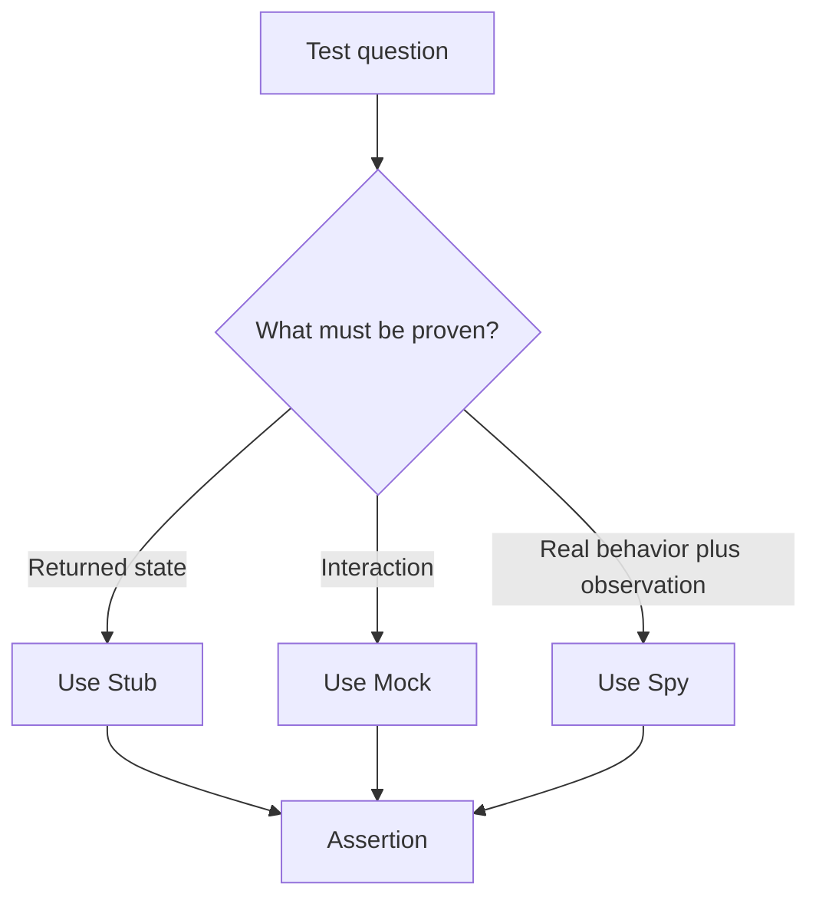

# Chapter 14. Mock and Stub

## Real World Example

전화 주문 테스트에서 Stub은 미리 정한 답을 말하는 직원입니다.

Mock은 직원에게 전화가 몇 번 왔고 어떤 말을 했는지 확인하는 기록지입니다.

둘은 테스트가 확인하려는 질문에 따라 선택합니다.

## Why Does It Exist?

모든 테스트가 의존성의 내부 동작을 실행해야 하는 것은 아닙니다. 어떤 테스트는 “뉴스가 없으면 Generator를 호출하지 않는다”처럼 호출 여부를 확인하고, 다른 테스트는 “Generator가 정한 결과를 받으면 Application이 저장한다”처럼 반환값만 필요로 합니다.

Stub은 상태와 결과를 통제하고, Mock은 상호작용을 확인하게 합니다. 그러나 호출 횟수와 인자를 너무 많이 검증하면 테스트가 실제 업무 결과보다 구현 순서에 묶일 수 있습니다.

## Definition

Mock과 Stub은 테스트에서 실제 의존성을 대신하는 작은 도구입니다. Mock은 어떤 메서드가 몇 번, 어떤 인자로 호출되었는지와 같은 상호작용을 기록하고 검증하는 Test Double입니다. Spy는 실제 동작이나 감싼 동작을 수행하면서 호출 정보를 기록하는 방식으로, 이 세 가지는 테스트가 확인하려는 질문에 따라 선택합니다.

## Background Knowledge

### Mock(목 객체)

테스트 대상이 다른 객체와 어떻게 상호작용했는지 기록하고 확인하는 테스트 대역이다.

반환 값보다 호출 횟수, 인자와 호출 순서가 중요한 경우에 사용할 수 있다.

예를 들어 결제 Client가 정확히 한 번 호출되었는지 확인하는 것이 Mock 검증이다.


### Stub(스텁)

테스트에 필요한 미리 정한 값을 반환하는 단순한 대역이다.

상호작용을 검증하기보다 특정 입력에서 테스트 대상이 어떤 결과를 내는지 확인할 때 사용한다.

예를 들어 뉴스 Provider가 항상 두 개의 기사 목록을 반환하도록 만들 수 있다.


### Spy(스파이)

호출된 사실과 인자를 기록하면서 실제 또는 단순한 동작을 수행하는 대역이다.

테스트가 끝난 뒤 기록을 확인해 호출 여부와 전달된 값을 검사할 수 있다.

예를 들어 저장 함수에 전달된 symbol 목록을 기록하는 객체가 Spy다.

## Responsibilities

| 해야 하는 일 | 하면 안 되는 일 |
|---|---|
| Stub은 테스트에 필요한 결과를 제공한다 | Stub이 실제 외부 서비스 전체를 복제하게 한다 |
| Mock은 중요한 상호작용을 검증한다 | 모든 내부 메서드 호출을 검증한다 |
| Spy는 실제 동작과 관찰을 조합한다 | 관찰 목적을 넘어 테스트를 복잡하게 만든다 |
| Test Double의 역할을 테스트 질문에 맞춘다 | 도구 이름만 보고 검증 방식을 결정한다 |

Mock과 Stub은 둘 다 테스트 대상과 의존성 사이의 경계를 대체합니다. 차이는 무엇을 검증하는지에 있습니다. Stub은 상태와 반환 결과, Mock은 상호작용을 중심으로 합니다.

## Typical Workflow



테스트를 작성하기 전에 반환 상태를 확인할지 호출 상호작용을 확인할지 결정합니다. 질문이 명확하면 Test Double의 종류도 단순해집니다.

## Relationship with Other Concepts

| 개념 | Mock and Stub과의 차이 |
|---|---|
| Fake | 실제 구현과 비슷한 동작을 제공하는 독립적인 대체 구현이다 |
| Stub | 정해진 반환값과 오류를 제공한다 |
| Mock | 호출 상호작용을 기대값과 비교한다 |
| Spy | 실제 동작을 수행하면서 관찰 정보를 기록한다 |
| State Verification | 결과 객체나 상태 변화를 검사한다 |
| Interaction Test | 호출 횟수, 순서와 인자를 검사한다 |

State Verification과 Interaction Test는 Test Double의 종류가 아니라 검증 방식입니다. Stub을 사용해 State를 검증할 수도 있고, Mock을 사용해 Interaction을 검증할 수도 있습니다.

## Common Mistakes

- 모든 테스트에서 Mock을 사용한다.
- 내부 호출 순서까지 고정해 리팩터링을 어렵게 만든다.
- Mock이 반환하는 값과 실제 계약을 맞추지 않는다.
- Stub으로 성공 응답만 만들고 실패 경로를 확인하지 않는다.
- Mock 호출 횟수를 업무 결과보다 중요하게 취급한다.
- 테스트 도구의 API를 학습하는 데 테스트 목적보다 더 많은 시간을 쓴다.

과도한 Mock은 “무엇을 했는가”는 증명하지만 “올바른 결과를 만들었는가”를 충분히 증명하지 못할 수 있습니다.

## Best Practices

1. 먼저 테스트가 증명할 상태나 상호작용을 문장으로 씁니다.
2. 결과만 중요하면 Stub이나 Fake를 우선 검토합니다.
3. 외부 요청을 반드시 하지 않아야 한다는 정책처럼 상호작용이 계약이면 Mock을 사용합니다.
4. 내부 구현이 아니라 경계의 호출을 검증합니다.
5. Mock의 기대값은 최소한으로 유지합니다.
6. 여러 상태와 동작이 필요하면 Mock보다 Fake가 더 읽기 쉬운지 확인합니다.

Fake가 더 좋은 선택인 경우는 상태가 여러 번 바뀌거나, 저장·조회처럼 동작 자체가 테스트의 일부일 때입니다. Mock은 단일 상호작용의 차단과 검증에 적합합니다.

## Trade-offs

| 선택 | 장점 | 단점 |
|---|---|---|
| Stub | 반환 상태를 빠르게 구성한다 | 호출 여부는 보장하지 않는다 |
| Mock | 외부 호출의 횟수와 인자를 검증한다 | 구현 세부사항에 결합되기 쉽다 |
| Spy | 실제 동작과 호출 관찰을 함께 한다 | 어떤 동작이 실제로 실행되는지 주의해야 한다 |
| Fake | 여러 상태와 흐름을 자연스럽게 표현한다 | 별도 구현과 계약 유지가 필요하다 |

Mock은 비용이 낮아 보여도 테스트의 결합도를 높일 수 있습니다. 반대로 Fake는 코드가 더 많지만 상태 중심 테스트를 더 안정적으로 만들 수 있습니다.

## Minimal Python Example

```python
class StubWeather:
    def current(self, city: str) -> str:
        return "sunny"


class SpyWeather:
    def __init__(self) -> None:
        self.calls = []

    def current(self, city: str) -> str:
        self.calls.append(city)
        return "sunny"


assert StubWeather().current("Seoul") == "sunny"
spy = SpyWeather()
spy.current("Seoul")
assert spy.calls == ["Seoul"]
```

Stub은 반환값을 제공하고, Spy는 호출 사실을 기록합니다. Mock은 보통 이 상호작용을 기대값과 함께 검증합니다.

## Example from automation-hub

앞의 작은 예제에서는 Stub이 결과를 제공하고 Spy가 호출을 기록했습니다. 실제 테스트도 뉴스가 없을 때 Generator가 호출되지 않는 상호작용을 기록으로 확인합니다.

### 실제 코드

이 테스트는 빈 뉴스 결과에서 정상 fallback을 만들고 Generator 호출 목록이 비어 있는지 검사합니다.

```python
def test_analyze_stored_quote_skips_generator_when_news_is_empty() -> None:
    storage = FakeStorage([_quote("101.00", LATER), _quote("100.00", EARLIER)])
    news = FakeNewsProvider([])
    generator = FakeGenerator()

    result = analyze_stored_quote(storage, news, generator, "AAPL:NASDAQ")

    assert isinstance(result, StockInsight)
    assert result.summary == INSUFFICIENT_EVIDENCE_REASON
    assert generator.calls == []
```

Source: [`tests/google_finance/test_analysis_application.py`](../../tests/google_finance/test_analysis_application.py)

### 코드에서 확인할 점

- **이 코드는 무엇을 하는가?** 이 테스트는 빈 뉴스 결과에서 정상 fallback을 만들고 Generator 호출 목록이 비어 있는지 검사합니다.
- **왜 이 Chapter의 개념인가?** 반환 상태와 상호작용을 분리해 검증하는 Stub·Spy 관점을 보여 줍니다.
- **무엇을 하지 않는가?** 현재 Repository가 별도의 Mock Framework나 `Spy` 클래스를 사용한다는 뜻은 아닙니다. 작은 Fake와 호출 기록을 사용합니다.

### Repository에서 따라가 보기

- `tests/google_finance/test_watchlist_main.py`에서 `monkeypatch` 기반 CLI 경계 대체도 비교합니다.

## Checkpoint

1. 반환 상태를 확인하는 테스트와 호출 상호작용을 확인하는 테스트는 어떻게 다릅니까?
2. Mock이 내부 구현에 테스트를 결합시키는 이유는 무엇입니까?
3. 여러 상태를 표현해야 할 때 Fake가 Mock보다 나을 수 있는 이유는 무엇입니까?
4. Spy는 Stub이나 Mock과 어떤 점에서 다릅니까?

## Summary

이번 Chapter에서 기억해야 할 것은 다음입니다. Stub은 정해진 결과를 제공하고 Mock은 상호작용을 검증하는 데 초점을 둡니다. 테스트 대상의 상태를 확인하는 것이 더 중요한 경우에는 Fake가 더 단순할 수 있습니다. 어떤 Test Double을 선택할지는 테스트가 묻는 질문에 따라 결정합니다.

## Related Concepts

- [Fake](fake.md#chapter-13-fake): 동작하는 대체 구현의 역할을 설명합니다.
- [Test Fixture](test-fixture.md#chapter-15-test-fixture): Test Double과 입력 데이터를 준비합니다.
- [Dependency Injection](dependency-injection.md#chapter-10-dependency-injection): 대체 구현을 테스트 대상에 전달합니다.
- [Application Service](application-service.md#chapter-4-application-service): 테스트 대상이 되는 Use Case 경계입니다.

## Related Project Documents

- [Google Finance Application Tests](../../tests/google_finance/test_analysis_application.py): Fake 기반 상태와 호출 검증입니다.
- [Google Finance CLI Tests](../../tests/google_finance/test_watchlist_main.py): `monkeypatch`를 사용한 경계 테스트입니다.
- [Google Finance Architecture](../packages/google_finance/architecture.md): 현재 테스트 경계의 Reference입니다.
- [Architecture Handbook](../handbook/README.md): 테스트 경계 판단의 설계 과정을 학습합니다.
- [CODEBASE_GUIDE](../../CODEBASE_GUIDE.md): 테스트 코드 탐색 순서입니다.

## Next Chapter

[Chapter 15. Test Fixture](test-fixture.md#chapter-15-test-fixture)에서는 테스트에 필요한 객체와 데이터를 일관되게 준비하는 방법을 설명합니다.

---

| 이전 Chapter | 목차 | 다음 Chapter |
|---|---|---|
| [Chapter 13. Fake](fake.md#chapter-13-fake) | [Concepts Book](README.md#python-automation-architecture-concepts) | [Chapter 15. Test Fixture](test-fixture.md#chapter-15-test-fixture) |
