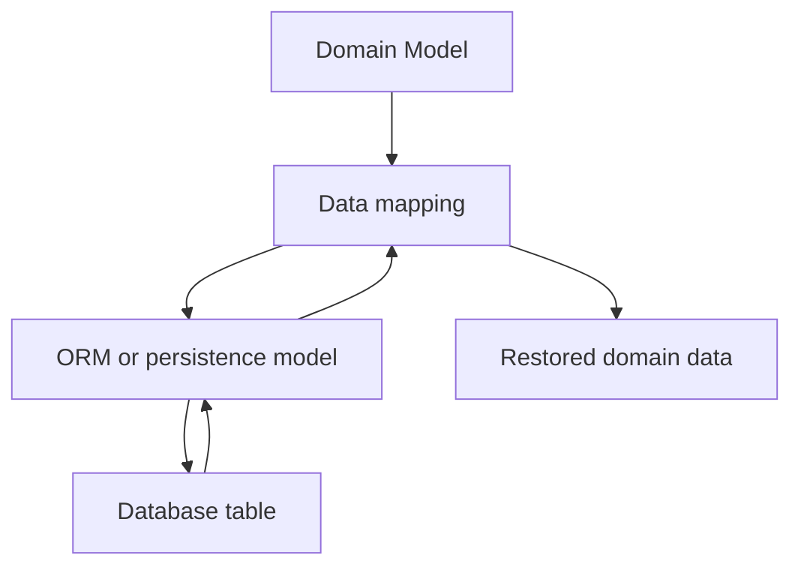

# Chapter 9. ORM and Data Mapping

## Real World Example

엑셀 표의 한 행과 프로그램의 객체는 비슷한 정보를 담을 수 있습니다.

하지만 표는 저장을 위한 모양이고 객체는 프로그램의 의미를 위한 모양일 수 있습니다.

ORM과 Data Mapping은 두 표현 사이를 연결합니다.

## Why Does It Exist?

객체는 속성과 메서드로 업무 의미를 표현하고, 관계형 데이터베이스는 테이블·열·행으로 데이터를 표현합니다. 두 형태가 우연히 비슷해 보여도 변경 이유는 다를 수 있습니다. Domain Model에 데이터베이스 열 이름과 ORM Session을 직접 넣으면 저장 구조의 변화가 업무 규칙으로 퍼집니다.

개발자는 객체로 업무를 표현하고 데이터베이스는 관계형 구조로 데이터를 보존합니다. 애플리케이션이 이 둘을 직접 변환하면 반복 코드가 늘고, 어느 계층이 저장 제약을 책임지는지 불명확해집니다.

ORM은 반복적인 행·열 변환과 Session 접근을 줄이는 도구를 제공합니다. 그러나 ORM이 Domain Model과 Persistence Model의 차이를 없애 주는 것은 아닙니다. 어떤 객체를 저장하고 어떤 제약을 적용할지는 여전히 설계 판단입니다.

## Definition

ORM은 프로그램의 객체와 데이터베이스의 표를 연결해 주는 기술입니다. Data Mapping은 한 표현의 값을 다른 표현으로 변환하는 더 넓은 개념이며, ORM을 사용하지 않고도 구현할 수 있습니다. Persistence Model은 저장소의 제약과 구조를 표현하고, Domain Model은 업무의 의미와 규칙을 표현합니다.

## Background Knowledge

### ORM(Object-Relational Mapping)

프로그램 객체와 데이터베이스 테이블을 연결하는 기술이다.

객체를 사용해 데이터를 다루면서도 저장할 때는 테이블의 행과 열로 표현할 수 있다.

예를 들어 `User(name="Kim")`을 `users` 테이블의 한 행으로 저장할 수 있다.


### Data Mapping(데이터 매핑)

한 표현의 값을 다른 표현으로 옮기는 과정이다.

프로그램에서 쓰는 객체와 데이터베이스에 저장하는 행은 모양과 책임이 다를 수 있으므로 중간 변환이 필요하다.

예를 들어 객체의 `collected_at` 값을 데이터베이스의 timestamp 열로 옮기는 것이 매핑이다.


### Persistence Model(저장 모델)

저장소의 테이블 구조와 저장 제약을 표현하는 모델이다.

Persistence Model은 프로그램의 업무 의미보다 데이터베이스가 요구하는 열, 식별자와 제약에 초점을 둔다.

예를 들어 주문 객체와 별도로 주문 테이블의 열과 기본 키를 표현하는 모델을 둘 수 있다.

## Responsibilities

| 해야 하는 일 | 하면 안 되는 일 |
|---|---|
| 객체와 행·열 표현의 매핑을 지원한다 | 업무 규칙 전체를 자동으로 정의한다 |
| 저장 타입과 제약을 선언한다 | Domain Model이 ORM Session을 직접 알게 한다 |
| 저장과 조회 과정의 변환을 일관되게 한다 | 외부 Provider 호출을 담당한다 |
| 매핑 실패와 저장 제약 위반을 드러낸다 | 서로 다른 의미의 모델을 무조건 하나로 합친다 |
| Domain과 Persistence Model의 차이를 관리한다 | ORM 사용 자체를 Architecture의 목표로 삼는다 |

ORM은 Persistence 도구입니다. Repository가 저장 접근의 사용 계약을 제공한다면, ORM은 그 계약을 데이터베이스 표현으로 구현하는 데 도움을 줄 수 있습니다.

## Typical Workflow



매핑은 단순 복사가 아닐 수 있습니다. 시간대, 정밀도, 기본값, 식별자와 저장 제약을 변환 과정에서 확인해야 합니다. 이 계약을 명시하지 않으면 저장은 성공해도 복원된 Domain 데이터가 달라질 수 있습니다.

## Relationship with Other Concepts

| 개념 | ORM and Data Mapping과의 차이 |
|---|---|
| Domain Model | 업무 의미와 규칙을 표현한다 |
| Persistence Model | 테이블·열·저장 제약을 표현한다 |
| DTO | 계층이나 외부 인터페이스 사이의 전달 형식이다 |
| Repository | 저장·조회 작업을 호출 목적의 계약으로 제공한다 |
| Data Mapper | 두 표현 사이의 변환 책임을 직접 구현하는 방식이다 |
| Active Record | 객체가 자신의 저장·조회 동작을 함께 가지는 방식이다 |

ORM은 Data Mapper와 함께 사용할 수도 있고 Active Record 방식으로 사용할 수도 있습니다. ORM이라는 기술 이름만으로 Domain과 Persistence의 책임 분리가 결정되지는 않습니다.

## Common Mistakes

- ORM Model을 곧바로 Domain Model이라고 가정한다.
- 데이터베이스 열 이름과 제약을 모든 계층에 노출한다.
- 시간대와 숫자 정밀도의 변환을 암묵적으로 맡긴다.
- ORM이 제공하는 기본 동작을 업무 규칙으로 착각한다.
- 매핑 실패를 조용히 기본값으로 바꾼다.
- 저장 모델과 출력 DTO를 하나의 거대한 모델로 합친다.

특히 객체와 행이 자동으로 변환된다는 이유만으로 데이터 의미까지 보존된다고 생각하면 안 됩니다.

## Best Practices

1. Domain Model과 Persistence Model의 변경 이유를 먼저 비교합니다.
2. 매핑되는 필드와 변환 규칙을 명시합니다.
3. 시간, 숫자, 식별자와 nullable 조건을 테스트 가능한 계약으로 만듭니다.
4. ORM Model을 Domain 계층에 직접 노출할 필요가 있는지 판단합니다.
5. Repository와 Mapper의 책임을 구분합니다.
6. ORM의 편의 기능보다 복원된 데이터의 의미와 일관성을 우선합니다.

모든 프로젝트에 별도 Mapper 클래스가 필요한 것은 아닙니다. 변환이 단순한 경우 작은 함수나 생성 메서드로 충분할 수 있습니다. 중요한 것은 변환 책임이 어디에 있는지 숨기지 않는 것입니다.

## Trade-offs

| 선택 | 장점 | 단점 |
|---|---|---|
| ORM을 사용한다 | 반복적인 SQL·행 변환을 줄일 수 있다 | ORM 동작과 설정을 이해해야 한다 |
| SQL과 명시적 매핑을 사용한다 | 실제 쿼리와 변환이 분명하다 | 반복 코드와 유지보수 비용이 늘 수 있다 |
| Domain/Persistence Model을 분리한다 | 저장 구조 변화가 Domain에 덜 전파된다 | 변환 코드와 모델 수가 증가한다 |
| 하나의 모델을 공유한다 | 초기 코드가 짧다 | 저장·업무·출력 변경 이유가 결합된다 |

ORM 선택은 Architecture의 종착점이 아닙니다. 데이터 규모, 팀의 익숙함, 쿼리 복잡도와 모델 분리의 필요성을 함께 보고 결정해야 합니다.

## Minimal Python Example

```python
from dataclasses import dataclass


@dataclass(frozen=True)
class Price:
    symbol: str
    amount: str


@dataclass(frozen=True)
class PriceRow:
    ticker_code: str
    amount_text: str


def to_row(price: Price) -> PriceRow:
    return PriceRow(price.symbol, price.amount)


def to_domain(row: PriceRow) -> Price:
    return Price(row.ticker_code, row.amount_text)


price = Price("EXAMPLE:MARKET", "10.50")
assert to_domain(to_row(price)) == price
```

이 예제는 ORM 라이브러리를 사용하지 않지만 두 표현 사이의 명시적인 변환 경계를 보여줍니다.

## Example from automation-hub

앞의 작은 예제에서는 Domain 객체와 저장용 행을 명시적으로 서로 변환했습니다. 실제 코드는 저장 전 UTC와 정밀도를 확인하고, 조회 시 `StockPrice`로 복원합니다.

### 실제 코드

이 코드는 Domain Model을 Persistence Model로 바꾸고 다시 Domain Model로 복원하는 변환 메서드입니다.

```python
    def to_domain(self) -> StockPrice:
        """Convert this persistence row to the existing StockPrice contract."""
        return StockPrice(
            symbol=self.symbol,
            name=self.name,
            current_price=self.current_price,
            previous_close=self.previous_close,
            open_price=self.open_price,
            change_percent=self.change_percent,
            currency=self.currency,
            collected_at=_as_utc_aware(self.collected_at, "collected_at"),
        )
```

Source: [`google_finance/db_models.py`](../../google_finance/db_models.py)

### 코드에서 확인할 점

- **이 코드는 무엇을 하는가?** 이 코드는 Domain Model을 Persistence Model로 바꾸고 다시 Domain Model로 복원하는 변환 메서드입니다.
- **왜 이 Chapter의 개념인가?** ORM이 테이블을 연결하더라도 두 모델의 책임과 변환 규칙을 별도로 관리하는 예입니다.
- **무엇을 하지 않는가?** ORM Model이 가격 변동 규칙을 수행하거나 외부 Provider를 호출하지는 않습니다.

### Repository에서 따라가 보기

- `tests/google_finance/test_storage.py`에서 Decimal과 UTC 복원 테스트를 확인합니다.

## Checkpoint

1. ORM과 Data Mapping은 어떻게 다른 범위의 개념입니까?
2. Domain Model과 Persistence Model을 하나로 합쳤을 때 어떤 변경이 결합될 수 있습니까?
3. 시간대와 숫자 정밀도가 매핑 계약에 포함되어야 하는 이유는 무엇입니까?
4. Repository와 ORM은 각각 어떤 질문에 답합니까?

## Summary

이번 Chapter에서 기억해야 할 것은 다음입니다. ORM은 객체와 관계형 저장 구조를 연결하는 기술이고, Data Mapping은 두 표현 사이의 변환 자체를 가리킵니다. Persistence Model은 저장 제약을, Domain Model은 업무 의미를 표현할 수 있으므로 둘은 우연히 비슷해도 같은 책임은 아닙니다. Repository는 저장 접근 계약을 제공하고 ORM은 그 계약의 구현에 사용될 수 있습니다. 다음 Part에서는 이러한 의존성을 어떻게 계층으로 구조화하고 실행 시점에 조립하는지 살펴봅니다.

## Related Concepts

- [Domain Model](domain-model.md#chapter-3-domain-model): 매핑의 출발점인 내부 업무 의미를 표현합니다.
- [Persistence](persistence.md#chapter-7-persistence): 데이터를 실행 사이에 보존하는 목적을 설명합니다.
- [Repository Pattern](repository-pattern.md#chapter-8-repository-pattern): 저장 접근의 계약과 구현을 구분합니다.

## Related Project Documents

- [Google Finance Architecture](../packages/google_finance/architecture.md): 현재 Domain·Persistence 변환의 Reference입니다.
- [Namuwiki Architecture](../packages/namuwiki_trend/architecture.md): 현재 Snapshot Persistence 구조의 Reference입니다.
- [Root Architecture](../architecture.md): Repository의 Database 경계를 설명합니다.
- [Architecture Handbook](../handbook/README.md): Business Rule과 Persistence 연결 과정을 학습합니다.
- [CODEBASE_GUIDE](../../CODEBASE_GUIDE.md): 관련 코드 탐색 순서입니다.

## Next Chapter

Part 4에서는 Domain과 Infrastructure의 의존성 방향을 구조화하고, 의존성을 실행 시점에 조립하는 방법을 설명합니다.

[Chapter 10. Dependency Injection](dependency-injection.md#chapter-10-dependency-injection)

---

| 이전 Chapter | 목차 | 다음 Chapter |
|---|---|---|
| [Chapter 8. Repository Pattern](repository-pattern.md#chapter-8-repository-pattern) | [Concepts Book](README.md#python-automation-architecture-concepts) | [Chapter 10. Dependency Injection](dependency-injection.md#chapter-10-dependency-injection) |
