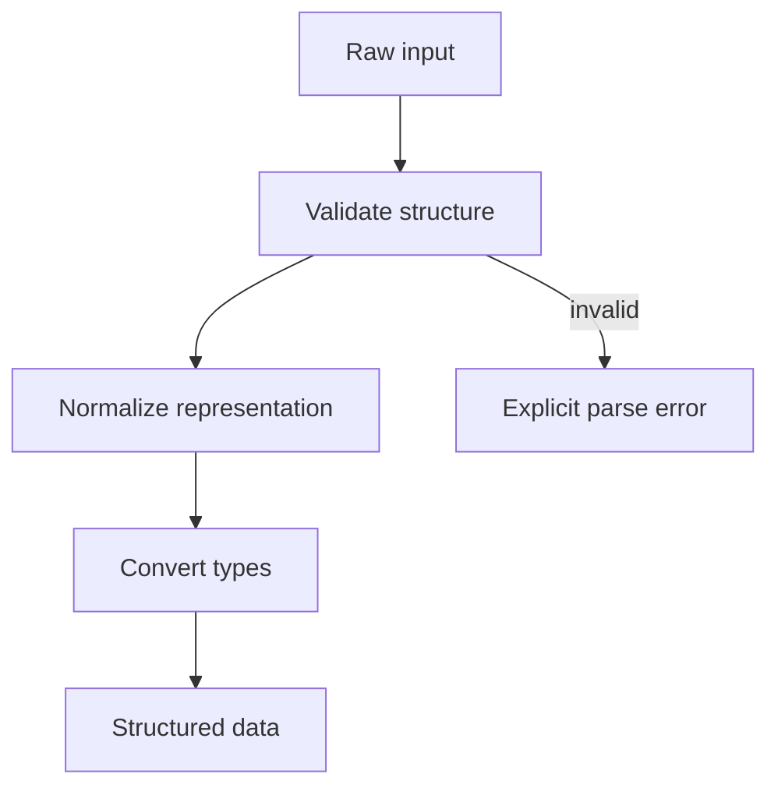

# Chapter 2. Parser and Extraction

## Real World Example

영수증에 적힌 `1,250원`을 계산에 쓰려면 숫자 `1250`으로 바꿔야 합니다.

문자열을 그대로 사용하면 쉼표와 원 단위 때문에 계산이 어려울 수 있습니다.

Parser는 이런 표현을 프로그램이 다룰 수 있는 값으로 바꿉니다.

## Why Does It Exist?

외부 데이터는 사람이 보기에는 그럴듯해도 프로그램이 바로 사용할 수 있다는 보장이 없습니다. 공백, 누락, 타입, 숫자 형식, 단위, 필드 개수와 같은 문제는 데이터가 경계를 통과할 때 확인해야 합니다. Parser는 입력을 조용히 받아들이는 대신, 어떤 값을 내부 데이터로 인정할지 한 곳에서 결정합니다.

Parser가 없으면 같은 문자열을 여러 계층이 각각 변환하게 됩니다. 그러면 오류가 늦게 발견되고, 같은 입력에 서로 다른 결과가 나올 수 있습니다.

## Definition

Parser는 Collector가 가져온 데이터를 프로그램이 사용할 수 있는 형태로 바꾸는 역할입니다. 원시 표현은 문자열, 바이트, JSON 객체, DOM에서 추출한 값처럼 외부 시스템의 문법을 담고 있습니다. Parser의 결과는 이후 코드가 외부 문법을 다시 해석하지 않아도 되도록 의미가 분명해야 합니다.

## Background Knowledge

### Parsing(파싱)

문자열이나 JSON처럼 정해진 형식의 입력을 읽고, 프로그램이 다룰 수 있는 구조로 해석하는 과정입니다.


예를 들어 `{"price": 1250}`라는 JSON에서 `price` 값을 읽는 것이 파싱입니다.

### Validation(검증)

값이 우리 프로그램에서 허용되는지 확인하는 일입니다. 형식을 읽을 수 있다는 사실과 업무상 유효하다는 사실은 다를 수 있습니다.


예를 들어 수량이 음수가 아닌지 확인하는 일이 검증입니다.

### Normalization(정규화)

같은 의미를 가진 여러 표현을 하나로 통일하는 과정입니다. 앞뒤 공백을 제거하거나 숫자의 쉼표를 없애는 것이 예입니다.


예를 들어 ` NVDA:NASDAQ `과 `NVDA:NASDAQ`을 같은 표기로 맞추는 것이 정규화입니다.

### Type Conversion(타입 변환)

문자열을 정수, 날짜 또는 Domain Model 같은 다른 자료형으로 바꾸는 일입니다.

예를 들어 문자열 `1250`을 정수 1250으로 바꾸는 것이 타입 변환입니다.

## Responsibilities

| 해야 하는 일 | 하면 안 되는 일 |
|---|---|
| 입력 형식과 타입을 확인한다 | 브라우저나 네트워크 연결을 직접 관리한다 |
| 공백, 기호, 단위와 같은 표현을 정규화한다 | 데이터베이스에 저장한다 |
| 필수 값과 범위를 검증한다 | 외부 서비스에 추가 요청을 보낸다 |
| 구조화된 값이나 내부 모델로 변환한다 | 사용자에게 최종 결과를 출력한다 |
| 유효하지 않은 입력을 명시적으로 거부한다 | 검증 실패를 임의의 기본값으로 숨긴다 |

Parser는 입력의 문법과 변환을 담당합니다. 여러 입력이 함께 있어야 판단할 수 있는 업무 정책은 Domain Model이나 Application의 책임일 수 있습니다.

## Typical Workflow



이 흐름은 모든 Parser가 반드시 같은 함수 순서를 구현해야 한다는 뜻이 아닙니다. 핵심은 검증과 변환이 외부 표현을 내부 계약으로 바꾸는 명시적인 경계가 된다는 점입니다.

## Relationship with Other Concepts

| 개념 | Parser와의 차이 |
|---|---|
| Collector | 외부 시스템에서 원시값을 가져온다 |
| Provider | 외부 서비스 접근 계약을 제공하며 Parser를 포함할 수도 있다 |
| Domain Model | 변환된 값의 업무 의미와 불변 조건을 표현한다 |
| Repository | 이미 구조화된 데이터를 영속 저장소와 변환한다 |
| Pipeline | Parser를 포함한 여러 단계를 순서대로 조정한다 |

Parser는 단순한 문자열 분할 함수보다 넓은 개념일 수 있지만, 외부 연결이나 실행 순서까지 소유하는 계층은 아닙니다.

## Common Mistakes

- 파싱 실패를 빈 값이나 `None`으로 바꾸고 계속 진행한다.
- 숫자와 날짜를 문자열로 남겨 모든 호출자가 다시 해석하게 한다.
- 입력의 일부만 확인하고 필드 개수나 필수 값을 검증하지 않는다.
- Parser 안에서 데이터베이스나 외부 API를 호출한다.
- 서로 다른 데이터 의미를 하나의 범용 Parser로 합친다.
- 성공적으로 파싱된 값과 단순히 형식만 통과한 값을 구분하지 않는다.

특히 기본값으로 오류를 숨기면 잘못된 입력이 정상 데이터처럼 저장될 수 있습니다.

## Best Practices

1. Parser의 입력과 출력 타입을 명시합니다.
2. 정규화와 검증의 규칙을 한 경계에서 확인합니다.
3. 오류 메시지에 어떤 필드와 조건이 실패했는지 드러냅니다.
4. 동일한 입력은 동일한 결과를 내도록 외부 상태와 분리합니다.
5. 숫자, 시간, 단위처럼 의미가 달라질 수 있는 값은 명시적인 타입으로 변환합니다.
6. Parser가 처리할 수 없는 업무 판단은 상위 계층으로 넘깁니다.

## Trade-offs

| 선택 | 장점 | 단점 |
|---|---|---|
| 입력마다 전용 Parser를 둔다 | 데이터 의미와 오류 조건이 명확하다 | 유사한 검증 코드가 반복될 수 있다 |
| 범용 Parser를 만든다 | 공통 문법을 재사용하기 쉽다 | 서로 다른 계약이 하나로 뭉칠 수 있다 |
| 유효하지 않은 입력에서 즉시 실패한다 | 잘못된 데이터가 다음 단계로 퍼지지 않는다 | 일부 결과를 복구하지 못할 수 있다 |
| 가능한 값을 보정해 계속 진행한다 | 부분 결과를 얻을 수 있다 | 오류가 숨겨지고 결과 신뢰도가 낮아질 수 있다 |

범용화와 보정은 입력의 의미와 실패 비용을 확인한 뒤 선택해야 합니다. 짧은 코드보다 잘못된 데이터를 정상으로 인정하지 않는 계약이 더 중요할 때가 많습니다.

## Minimal Python Example

```python
def parse_count(text: str) -> int:
    value = text.strip().replace(",", "")
    if not value.isdigit():
        raise ValueError("invalid count")
    return int(value)


count = parse_count("1,250")
assert count == 1250
```

Parser는 외부 표현을 내부 값으로 바꾸면서 입력이 계약을 만족하는지 확인합니다. 이 예제에서는 문자열로 받은 수량을 정수로 변환합니다.

## Example from automation-hub

앞의 작은 예제에서는 문자열 하나를 숫자로 바꿨습니다. 실제 코드는 여러 원시 항목을 검증하고 sentinel을 제거한 뒤 내부 순위를 부여합니다.

### 실제 코드

이 코드는 원시 목록의 sentinel과 항목 수를 확인하고 `TrendItem`을 만듭니다.

```python
    data_items = normalized_items[:-1]
    if len(data_items) != EXPECTED_ITEM_COUNT:
        raise ValueError(
            "sentinel 제거 후 항목 수가 10개가 아님: "
            f"{len(data_items)}개"
        )

    return [
        TrendItem(rank=rank, keyword=keyword, href=href)
        for rank, (keyword, href) in enumerate(data_items, start=1)
    ]
```

Source: [`namuwiki_trend/extraction.py`](../../namuwiki_trend/extraction.py)

### 코드에서 확인할 점

- **이 코드는 무엇을 하는가?** 이 코드는 원시 목록의 sentinel과 항목 수를 확인하고 `TrendItem`을 만듭니다.
- **왜 이 Chapter의 개념인가?** Parser와 Extraction이 형식 확인, 정규화와 내부 모델 생성을 담당하는 모습을 보여 줍니다.
- **무엇을 하지 않는가?** 브라우저를 열거나 데이터를 저장하지 않습니다. 이미 읽힌 원시값만 다룹니다.

### Repository에서 따라가 보기

- `namuwiki_trend/models.py`의 `TrendItem` 정의를 확인합니다.

## Checkpoint

1. Parser가 변환 전에 입력을 검증해야 하는 이유는 무엇입니까?
2. 형식 오류를 Domain 규칙 오류와 구분하면 어떤 이점이 있습니까?
3. Parser가 외부 시스템을 다시 호출하지 않아야 하는 이유는 무엇입니까?
4. 변환 결과가 내부 계약을 보장하려면 무엇을 확인해야 합니까?

## Summary

이번 Chapter에서 기억해야 할 것은 다음입니다. Parser는 원시 표현을 검증된 내부 값으로 변환합니다. 이 경계에서 형식과 누락을 처리하면 이후 계층은 더 명확한 계약을 사용할 수 있습니다. Parser는 업무 흐름을 조정하지 않고 변환에 집중합니다.

## Related Concepts

- [Collector](collector.md#chapter-1-collector): 외부 시스템에서 원시값을 가져옵니다.
- [Domain Model](domain-model.md#chapter-3-domain-model): 변환된 값의 내부 의미를 표현합니다.

## Related Project Documents

- [Architecture Handbook](../handbook/README.md): 프로젝트 사례를 통한 설계 학습 경로입니다.
- [Namuwiki Architecture](../packages/namuwiki_trend/architecture.md): 현재 변환 흐름의 Reference입니다.
- [Google Finance Architecture](../packages/google_finance/architecture.md): 현재 Quote 변환 구조의 Reference입니다.
- [CODEBASE_GUIDE](../../CODEBASE_GUIDE.md): Repository 코드 탐색 순서입니다.
- [Root Architecture](../architecture.md): Repository 전체 구조입니다.

## Next Chapter

[Chapter 3. Domain Model](domain-model.md#chapter-3-domain-model)에서는 Parser가 만든 값을 업무 의미와 유효한 상태로 표현하는 방법을 설명합니다.

---

| 이전 Chapter | 목차 | 다음 Chapter |
|---|---|---|
| [Chapter 1. Collector](collector.md#chapter-1-collector) | [Concepts Book](README.md#python-automation-architecture-concepts) | [Chapter 3. Domain Model](domain-model.md#chapter-3-domain-model) |
