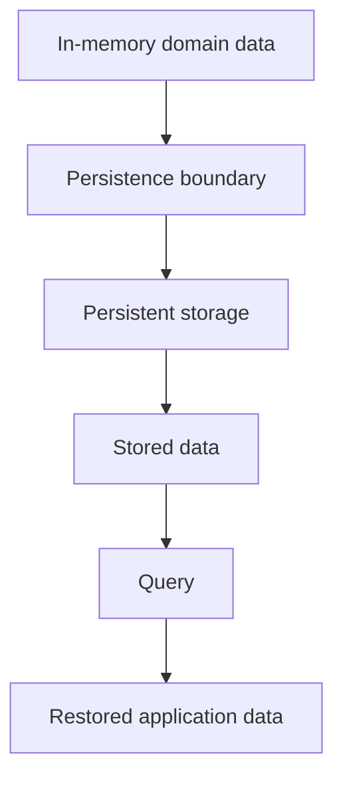

# Chapter 7. Persistence

## Real World Example

메모장에만 적은 내용은 컴퓨터를 끄면 사라질 수 있습니다.

파일이나 데이터베이스에 저장하면 다음 실행에서도 다시 볼 수 있습니다.

Persistence는 데이터를 실행 이후에도 남기는 문제입니다.

## Why Does It Exist?

메모리에 있는 데이터는 프로세스가 종료되면 사라집니다. 자동화가 한 번 실행되는 것만 중요하다면 이 사실이 문제가 아닐 수 있습니다. 그러나 반복 실행 결과를 비교하거나, 나중에 상태를 조회하거나, 실패 뒤에 다시 시작하려면 데이터가 실행 너머에 남아 있어야 합니다.

외부 데이터를 읽고 Domain Model을 만든 뒤에도 자동화의 책임은 끝나지 않습니다. 현재 결과를 출력하는 것만으로는 이전 결과와 비교할 수 없고, 실행이 실패했을 때 무엇이 관찰되었는지도 확인할 수 없습니다.

Persistence는 다음과 같은 목적을 제공합니다.

- 여러 실행의 결과를 비교한다.
- 특정 시점의 상태를 다시 조회한다.
- 변경과 실패의 근거를 남긴다.
- 프로세스가 다시 시작되어도 필요한 데이터를 복구한다.
- 현재 상태와 과거 기록을 별도로 읽는다.

특히 자동화에서는 “지금 값”보다 “언제 관찰한 값인가”가 중요할 수 있습니다. 그래서 저장할 때 값과 함께 시간, 식별자와 같은 문맥도 보존해야 합니다.

## Definition

Persistence는 프로그램이 끝난 뒤에도 데이터를 다시 사용할 수 있게 보관하는 방법입니다. Persistence는 그 값을 파일이나 데이터베이스에 보관해 다음 실행에서도 다시 사용할 수 있게 하는 개념입니다. 기술적으로는 실행이 끝난 뒤에도 데이터를 보존하고 다시 읽게 하는 과정과 경계를 뜻합니다. 무엇을 어떤 의미로 보존하고 어떻게 다시 해석할지도 Persistence 계약에 포함됩니다.

## Background Knowledge

### Memory(메모리)

프로그램이 실행되는 동안 값을 임시로 보관하는 공간입니다. 프로세스가 종료되면 일반적으로 그 값도 사라집니다.


책상 위에 잠시 적어 둔 메모처럼 프로그램이 실행되는 동안만 값을 보관합니다.

### File System(파일 시스템)

파일과 디렉터리를 저장하고 다시 읽는 운영체제의 기능입니다. 작은 데이터나 JSON 결과를 보관하는 데 사용할 수 있습니다.


노트에 적은 내용을 서랍에 넣고 나중에 다시 꺼내는 것처럼 파일을 보관합니다.

### Database(데이터베이스)

많은 데이터를 구조화해 저장하고 조건에 따라 조회하는 시스템입니다.


많은 장부를 정리해 조건에 맞는 기록을 빠르게 찾는 시스템입니다.

### Snapshot(스냅샷)

특정 시점에 관찰한 상태를 기록한 데이터입니다. 여러 Snapshot을 비교하면 시간에 따른 변화를 볼 수 있습니다.


매일 같은 시각에 찍은 사진처럼 특정 시점의 상태를 남긴 기록입니다.

### Transaction(트랜잭션)

여러 저장 작업을 하나의 논리적 단위로 처리하는 방식입니다. 중간 상태를 다른 작업에 보이지 않게 하거나 실패 시 되돌리는 데 사용됩니다.

은행 송금에서 출금과 입금이 함께 성공하거나 함께 취소되어야 하는 하나의 작업 단위입니다.

## Responsibilities

| 해야 하는 일 | 하면 안 되는 일 |
|---|---|
| 실행 사이에 필요한 데이터를 보존한다 | Domain 규칙을 Persistence 경계에 복사한다 |
| 저장 데이터의 의미와 생명주기를 정의한다 | 화면이나 외부 API를 직접 호출한다 |
| 조회 조건과 정렬 기준을 명확히 한다 | CLI 출력 형식을 결정한다 |
| 저장 실패와 조회 실패를 호출자에게 드러낸다 | 실패한 저장을 조용히 성공으로 바꾼다 |
| Domain 데이터와 저장 표현 사이의 계약을 유지한다 | 모든 과거 데이터를 무조건 보존한다고 가정한다 |

Persistence는 Write Model과 Read Model을 같은 형태로 유지할 수도 있고, 목적에 따라 다르게 구성할 수도 있습니다. 중요한 것은 저장과 조회가 어떤 의미를 보장하는지 명확히 하는 것입니다.

## Typical Workflow



Domain 데이터는 Persistence Boundary를 통해 저장 표현으로 바뀝니다. 나중에 조회할 때는 저장 표현을 다시 Application이 사용할 형태로 복원합니다. 이 과정에서 시간대, 정밀도, 정렬과 같은 계약이 조용히 바뀌지 않아야 합니다.

## Relationship with Other Concepts

| 개념 | Persistence와의 차이 |
|---|---|
| Domain Model | 업무 의미와 유효한 상태를 표현한다 |
| Repository Pattern | Persistence 접근을 Domain 관점의 계약으로 감쌀 수 있다 |
| ORM | 객체와 테이블 사이의 매핑을 돕는 기술이다 |
| Read Model | 조회 목적에 맞게 구성된 데이터 표현이다 |
| Write Model | 저장과 변경에 필요한 데이터 표현이다 |
| Cache | 빠른 재사용을 위한 저장이며 영구 보존을 보장하지 않을 수 있다 |

Persistence는 데이터베이스와 동의어가 아닙니다. 파일, 관계형 데이터베이스, 객체 저장소 등 여러 방식으로 구현할 수 있습니다.

## Common Mistakes

- 프로세스 메모리에 있는 값을 영구 데이터라고 생각한다.
- 저장 시점과 식별자를 남기지 않아 과거 상태를 구분하지 못한다.
- 저장 형식의 필드와 Domain 의미를 아무런 계약 없이 동일시한다.
- 조회 순서와 필터 조건을 정의하지 않는다.
- 저장 실패를 무시하고 성공 결과를 반환한다.
- 모든 데이터를 계속 쌓으면서 보존 기간과 복구 방법을 정하지 않는다.

저장은 성공했지만 다시 읽은 값의 의미가 달라지는 것도 Persistence 실패입니다.

## Best Practices

1. 무엇을 보존해야 하는지 먼저 정의합니다.
2. 현재 상태와 변경 이력이 필요한지 구분합니다.
3. 저장·조회·복원 과정의 데이터 계약을 명시합니다.
4. 시간, 식별자, 정렬 기준처럼 재현성에 필요한 문맥을 보존합니다.
5. 저장 실패를 정상 결과로 숨기지 않습니다.
6. 보존 기간, 삭제와 복구 방법을 운영 요구에 맞게 정합니다.
7. Domain Model이 특정 저장 기술을 직접 알 필요가 있는지 신중히 판단합니다.

Persistence는 나중에 추가하는 부가 기능이 아니라, 반복 실행과 결과 설명이 필요한 순간부터 Use Case의 일부가 됩니다.

## Trade-offs

| 선택 | 장점 | 단점 |
|---|---|---|
| 실행 결과를 저장한다 | 비교, 감사와 복구가 가능하다 | 저장 비용과 보존 정책이 필요하다 |
| 메모리에서만 처리한다 | 구조가 단순하고 빠르다 | 실행 종료 후 기록을 잃는다 |
| 모든 실행을 Snapshot으로 남긴다 | 과거 상태를 재현하기 쉽다 | 데이터가 계속 증가한다 |
| 현재 상태만 덮어쓴다 | 저장 공간과 조회가 단순하다 | 변경 이력과 원인 추적이 어렵다 |

어떤 저장 방식이 적절한지는 재현성, 비용, 보존 기간과 조회 요구를 함께 보고 결정해야 합니다.

## Minimal Python Example

```python
from dataclasses import asdict, dataclass
import json
from pathlib import Path


@dataclass(frozen=True)
class Snapshot:
    symbol: str
    price: str
    collected_at: str


def save_snapshot(path: Path, snapshot: Snapshot) -> None:
    path.write_text(json.dumps(asdict(snapshot)), encoding="utf-8")


def load_snapshot(path: Path) -> Snapshot:
    return Snapshot(**json.loads(path.read_text(encoding="utf-8")))


path = Path("snapshot.json")
save_snapshot(path, Snapshot("EXAMPLE:MARKET", "10.50", "2026-01-01T00:00:00Z"))
assert load_snapshot(path).symbol == "EXAMPLE:MARKET"
path.unlink()
```

이 예제의 핵심은 JSON 자체가 아닙니다. 저장과 복원을 별도의 경계로 두고, 복원된 값이 다시 사용할 수 있는 계약을 가져야 한다는 점입니다.

## Example from automation-hub

앞의 작은 예제에서는 메모리의 Snapshot을 파일에 저장하고 다시 복원했습니다. 실제 Storage는 Domain 가격을 저장 행으로 바꾸고 Transaction 안에서 보존합니다.

### 실제 코드

이 코드는 `StockPrice`를 `StockQuoteSnapshot`으로 변환해 저장하고, 최신 Snapshot을 다시 Domain 값으로 읽습니다.

```python
    def save(self, stock_price: StockPrice) -> None:
        """Append one snapshot in a transaction and propagate database errors."""
        row = StockQuoteSnapshot.from_domain(stock_price)
        with self._session_factory.begin() as session:
            session.add(row)
```

Source: [`google_finance/storage.py`](../../google_finance/storage.py)

### 코드에서 확인할 점

- **이 코드는 무엇을 하는가?** 이 코드는 `StockPrice`를 `StockQuoteSnapshot`으로 변환해 저장하고, 최신 Snapshot을 다시 Domain 값으로 읽습니다.
- **왜 이 Chapter의 개념인가?** Persistence가 실행 사이에 데이터를 보존하고 복원하는 책임을 보여 줍니다.
- **무엇을 하지 않는가?** Movement 계산이나 CLI 출력은 하지 않습니다. 저장 접근의 세부사항은 Storage에 남습니다.

### Repository에서 따라가 보기

- `google_finance/db_models.py`의 `from_domain()`과 `to_domain()`을 읽습니다.

## Checkpoint

1. 자동화 결과를 메모리에만 두면 어떤 질문에 답할 수 없게 됩니까?
2. 현재 상태와 Snapshot History는 어떤 요구에서 서로 다르게 필요합니까?
3. 저장된 데이터가 원래 Domain 데이터와 같은 의미를 유지하려면 어떤 계약이 필요합니까?
4. 저장 성공과 복원 성공을 별도로 검증해야 하는 이유는 무엇입니까?

## Summary

이번 Chapter에서 기억해야 할 것은 다음입니다. Persistence는 실행이 끝난 뒤에도 필요한 데이터를 보존하고 다시 읽는 경계입니다. Snapshot과 History는 반복 실행 결과를 비교하고 실패의 근거를 남기게 합니다. 저장 표현은 Domain Model과 다를 수 있지만, 변환 과정에서 의미와 조회 계약을 보존해야 합니다. 이제 남은 질문은 Domain이 저장 기술을 직접 알지 않으면서 이 경계를 어떻게 사용할 것인가입니다.

## Related Concepts

- [Domain Model](domain-model.md#chapter-3-domain-model): 저장되는 내부 업무 의미를 표현합니다.
- [Application Service](application-service.md#chapter-4-application-service): Persistence를 Use Case 흐름에 연결할 수 있습니다.
- [Repository Pattern](repository-pattern.md#chapter-8-repository-pattern): 저장 접근을 Domain에서 분리하는 계약을 설명합니다.
- [ORM and Data Mapping](orm-and-data-mapping.md#chapter-9-orm-and-data-mapping): Domain과 저장 표현의 변환을 설명합니다.

## Related Project Documents

- [Google Finance Architecture](../packages/google_finance/architecture.md): 현재 Snapshot 저장 구조의 Reference입니다.
- [Namuwiki Architecture](../packages/namuwiki_trend/architecture.md): 현재 TrendSnapshot 구조의 Reference입니다.
- [Root Architecture](../architecture.md): Repository의 Database 경계를 설명합니다.
- [Architecture Handbook](../handbook/README.md): Persistence 설계 판단의 형성 과정을 학습합니다.
- [CODEBASE_GUIDE](../../CODEBASE_GUIDE.md): 관련 코드 탐색 순서입니다.

## Next Chapter

다음 Chapter에서는 Persistence 접근을 Domain 관점의 계약으로 감싸는 [Chapter 8. Repository Pattern](repository-pattern.md#chapter-8-repository-pattern)을 설명합니다.

---

| 이전 Chapter | 목차 | 다음 Chapter |
|---|---|---|
| [Chapter 6. Provider](provider.md#chapter-6-provider) | [Concepts Book](README.md#python-automation-architecture-concepts) | [Chapter 8. Repository Pattern](repository-pattern.md#chapter-8-repository-pattern) |
