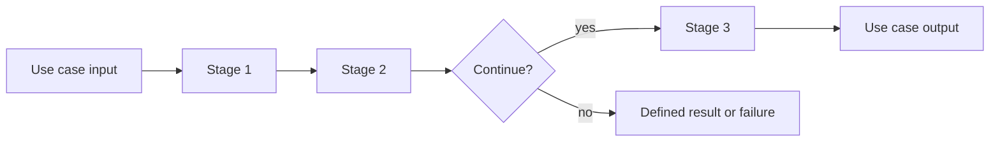

# Chapter 5. Pipeline and Orchestration

## Real World Example

공장에서 제품은 조립, 검사, 포장 순서로 지나갑니다.

앞 단계의 결과가 다음 단계의 입력이 됩니다.

Pipeline은 여러 작업을 이런 순서로 연결해 전체 흐름을 보여줍니다.

## Why Does It Exist?

하나의 Use Case가 수집, 검증, 보강, 저장과 같은 여러 작업을 포함하면 모든 코드를 하나의 함수에 넣기 쉽습니다. 처음에는 빠르지만, 한 단계의 변경이 전체 흐름을 흔들고 실패 위치를 찾기 어려워집니다.

Pipeline은 이 흐름을 작은 단계로 나눕니다. 각 단계는 자신이 받는 입력과 반환하는 출력을 알고, Orchestrator는 그 결과를 다음 단계에 전달합니다. 그래서 “하나의 Use Case가 커지면 어떻게 분리하는가?”라는 질문에 단계와 계약으로 답할 수 있습니다.

## Definition

Pipeline은 여러 작업을 정해진 순서로 이어서 실행하는 방식입니다. Orchestration은 그 단계의 순서, 조건, 중단 지점을 조정하는 행위입니다. Pipeline은 각 단계의 내부 구현을 대신하는 것이 아니라, 단계 사이의 데이터 흐름과 실행 관계를 명확히 합니다.

## Background Knowledge

### Stage(단계)

Pipeline 안에서 하나의 작업을 수행하는 부분입니다. 각 Stage는 입력을 받아 결과를 다음 Stage에 전달합니다.


예를 들어 세척, 검사와 포장이 각각 하나의 Stage가 될 수 있습니다.

### Sequential Processing(순차 처리)

앞 단계가 끝난 뒤 그 결과를 다음 단계가 사용하는 실행 방식입니다. 단계의 순서가 결과에 영향을 주므로 계약을 분명히 해야 합니다.


첫 작업이 끝난 뒤 그 결과를 사용해 두 번째 작업을 시작하는 방식입니다.

### Fail-fast(빠른 실패)

필수 단계에서 오류가 생기면 뒤의 단계를 실행하지 않고 즉시 실패를 알리는 정책입니다. 모든 Pipeline이 이 정책을 사용해야 하는 것은 아닙니다.


필수 재료가 없으면 요리를 계속하지 않고 바로 알려 주는 것과 비슷합니다.

### Orchestration(조정)

각 Stage의 내부 작업이 아니라, Stage를 언제 호출하고 어떤 조건에서 멈출지 결정하는 일입니다.

예를 들어 조회 후 계산하고 마지막에 저장하도록 작업 순서를 정하는 것이 Orchestration입니다.

## Responsibilities

| 해야 하는 일 | 하면 안 되는 일 |
|---|---|
| 단계의 실행 순서를 정의한다 | 모든 단계의 내부 알고리즘을 다시 구현한다 |
| 단계 사이의 입력과 출력을 연결한다 | 각 단계의 책임을 하나의 거대한 함수에 합친다 |
| 조건에 따라 다음 단계와 중단을 결정한다 | 실패를 무조건 무시하고 다음 단계로 넘긴다 |
| 입력 순서와 결과 수 같은 흐름 계약을 보존한다 | 외부 서비스의 세부 통신을 직접 소유한다 |
| 전체 Use Case의 실행 결과를 조정한다 | Domain 규칙을 임의로 복사한다 |

Pipeline은 데이터 변환을 포함할 수 있지만, 그 변환이 어느 단계의 계약인지 명확해야 합니다. Orchestrator가 모든 업무 판단을 대신하면 Pipeline은 또 다른 거대한 Business Layer가 됩니다.

## Typical Workflow



Pipeline의 각 단계는 이전 단계의 계약을 입력으로 받고 자신의 계약을 출력합니다. 중단이 정상 상태인지 실패인지도 흐름의 계약으로 표현해야 합니다. 모든 Pipeline이 선형이어야 하는 것은 아니며, 조건 분기와 일부 단계 생략이 필요할 수 있습니다.

## Relationship with Other Concepts

| 개념 | Pipeline과의 차이 |
|---|---|
| Application Service | 하나의 Use Case 경계를 제공하고 Pipeline을 조정할 수 있다 |
| Domain Model | 각 단계가 사용하는 업무 의미와 상태를 표현한다 |
| Provider | 특정 외부 시스템과 통신한다 |
| Function or Module | Pipeline의 하나의 실행 단계가 될 수 있다 |
| Workflow Engine | 복잡한 장기 실행·재개·분기 기능까지 제공할 수 있다 |

Pipeline은 Workflow Engine과 같지 않습니다. 단순한 순차 흐름을 코드로 조정하는 것과 상태 저장, 재개, 분산 실행을 제공하는 것은 다른 범위입니다.

## Common Mistakes

- 단계 이름만 나누고 실제 책임과 계약은 나누지 않는다.
- Pipeline 안에서 모든 Parser와 Provider의 로직을 다시 작성한다.
- 단계 사이에서 암묵적인 전역 상태를 사용한다.
- 실패한 단계와 정상적인 중단 상태를 구분하지 않는다.
- 작은 흐름에도 복잡한 Workflow Engine을 도입한다.
- 여러 Pipeline에서 같은 업무 규칙을 복사한다.

이런 구조에서는 파일 수만 늘어나고, 단계 분리로 얻으려던 독립성과 테스트 가능성은 생기지 않습니다.

## Best Practices

1. 먼저 Use Case의 입력, 단계, 결과를 글로 정의합니다.
2. 각 단계의 입력과 출력을 명시합니다.
3. 단계는 하나의 변경 이유를 가지게 합니다.
4. Orchestrator는 순서와 조건에 집중하고 세부 구현은 단계에 둡니다.
5. 실패 경계와 부분 결과 정책을 명확히 합니다.
6. 흐름이 실제로 복잡할 때만 별도 Pipeline 계층을 둡니다.

Pipeline을 설계할 때 단계의 개수보다 변경 이유와 실패 위치를 먼저 봐야 합니다. 세 단계로 나누었다고 자동으로 좋은 Pipeline이 되는 것은 아닙니다.

## Trade-offs

| 선택 | 장점 | 단점 |
|---|---|---|
| 단계를 명시적인 Pipeline으로 나눈다 | 흐름과 실패 위치를 추적하기 쉽다 | 중간 계약과 조정 코드가 늘어난다 |
| 하나의 함수로 처리한다 | 작은 기능에서는 읽고 실행하기 쉽다 | 커질수록 변경 영향과 테스트 범위가 커진다 |
| 단계별 결과를 엄격히 검증한다 | 잘못된 데이터가 다음 단계로 퍼지지 않는다 | 일부 입력에서 전체 흐름이 중단될 수 있다 |
| 실패한 단계 이후에도 계속 진행한다 | 부분 결과를 얻을 수 있다 | 결과의 일관성과 의미를 별도로 관리해야 한다 |

어떤 실패에서 중단할지는 외부 의존성, 결과의 완전성, 재실행 가능성을 함께 보고 결정해야 합니다.

## Minimal Python Example

```python
def strip_text(value: str) -> str:
    return value.strip()


def add_prefix(value: str) -> str:
    return f"item:{value}"


def run_pipeline(value: str, stages) -> str:
    for stage in stages:
        value = stage(value)
    return value


result = run_pipeline("  A-1  ", [strip_text, add_prefix])
assert result == "item:A-1"
```

Pipeline은 각 단계의 입력과 출력을 연결하고, 전체 순서를 한 곳에서 드러냅니다.

## Example from automation-hub

앞의 작은 예제에서는 같은 값을 여러 Stage에 순서대로 전달했습니다. 실제 Pipeline도 Collector 결과를 Enricher에 입력 순서대로 전달합니다.

### 실제 코드

이 코드는 Collector와 Enricher를 생성자로 받고, 수집된 각 `TrendItem`을 `TrendInsight`로 보강합니다.

```python
class TrendPipeline:
    """Collector와 TrendEnricher를 연결하는 순차 Batch Orchestrator."""

    def __init__(
        self,
        collector: TrendCollector,
        enricher: TrendEnricherProtocol,
    ) -> None:
        self._collector = collector
        self._enricher = enricher

    def run(self) -> list[TrendInsight]:
        """Collector 결과를 입력 순서대로 enrichment하여 반환한다."""
        trends = self._collector()
        return [self._enricher.enrich(trend) for trend in trends]
```

Source: [`namuwiki_trend/pipeline.py`](../../namuwiki_trend/pipeline.py)

### 코드에서 확인할 점

- **이 코드는 무엇을 하는가?** 이 코드는 Collector와 Enricher를 생성자로 받고, 수집된 각 `TrendItem`을 `TrendInsight`로 보강합니다.
- **왜 이 Chapter의 개념인가?** Pipeline이 단계의 순서와 데이터 전달을 한 곳에서 보여 주는 예입니다.
- **무엇을 하지 않는가?** Collector의 브라우저 접근이나 Enricher의 뉴스·LLM 세부사항을 다시 구현하지 않습니다.

### Repository에서 따라가 보기

- `namuwiki_trend/collector.py`와 `namuwiki_trend/enricher.py`를 이어서 읽습니다.

## Checkpoint

1. Application Service와 Pipeline은 각각 어떤 질문에 답합니까?
2. 단계 사이의 입력·출력 계약이 필요한 이유는 무엇입니까?
3. 모든 흐름을 하나의 함수에 두면 어떤 변경 비용이 생깁니까?
4. 어느 단계에서 실패했는지를 드러내는 것이 운영에 왜 중요합니까?

## Summary

이번 Chapter에서 기억해야 할 것은 다음입니다. Pipeline은 여러 작업을 순서가 있는 단계로 연결합니다. 각 단계의 책임과 계약을 분리하면 흐름을 읽고 실패 위치를 추적하기 쉬워집니다. 다음에는 외부 시스템과 통신하는 Provider를 이 흐름의 경계로 살펴봅니다.

## Related Concepts

- [Application Service](application-service.md#chapter-4-application-service): Pipeline을 포함한 Use Case의 경계를 조정합니다.
- [Provider](provider.md#chapter-6-provider): Pipeline이 호출하는 외부 통신 경계입니다.
- [Parser and Extraction](parser.md#chapter-2-parser-and-extraction): Pipeline 단계의 데이터 변환을 담당할 수 있습니다.

## Related Project Documents

- [Architecture Handbook](../handbook/README.md): 여러 외부 서비스를 연결하는 설계 과정을 학습합니다.
- [Google Finance Architecture](../packages/google_finance/architecture.md): 현재 Collection과 Application 흐름의 Reference입니다.
- [Namuwiki Architecture](../packages/namuwiki_trend/architecture.md): 현재 Pipeline과 Enricher 구조의 Reference입니다.
- [CODEBASE_GUIDE](../../CODEBASE_GUIDE.md): Repository 코드 탐색 순서입니다.
- [Root Architecture](../architecture.md): Repository 전체 구조입니다.

## Next Chapter

[Chapter 6. Provider](provider.md#chapter-6-provider)에서는 Pipeline이 외부 시스템과 통신할 때 호출 경계를 두는 방법을 설명합니다.

---

| 이전 Chapter | 목차 | 다음 Chapter |
|---|---|---|
| [Chapter 4. Application Service](application-service.md#chapter-4-application-service) | [Concepts Book](README.md#python-automation-architecture-concepts) | [Chapter 6. Provider](provider.md#chapter-6-provider) |
