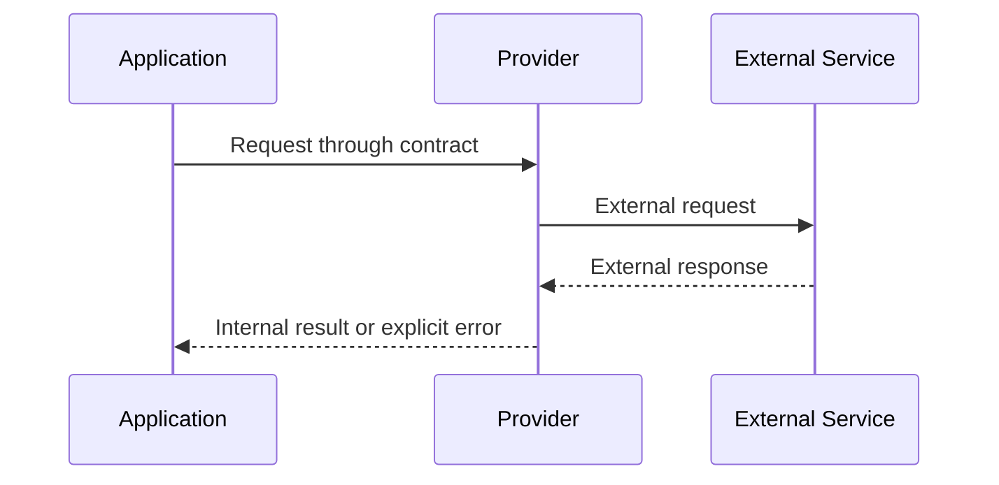

# Chapter 6. Provider

## Real World Example

번역 앱은 Google 번역인지 DeepL인지 몰라도 “이 문장을 번역해 달라”고 요청할 수 있습니다.

앱은 외부 서비스에 보내는 요청 형식과 응답 형식을 직접 다루지 않아도 됩니다.

Provider는 이 연결을 맡는 부분입니다.

## Why Does It Exist?

외부 서비스는 자체 URL, 인증 방식, 요청 형식, 응답 형식과 실패 규칙을 가집니다. 이 세부사항을 Application이나 Domain Model에 직접 넣으면 외부 서비스가 바뀔 때 내부 흐름까지 함께 수정해야 합니다.

Provider는 외부 통신의 변경 이유를 한 경계에 모읍니다. Application은 “뉴스를 검색한다” 또는 “reason을 생성한다”라는 사용 목적에 집중하고, Provider는 그 목적을 특정 서비스의 요청과 응답으로 연결합니다.

## Definition

Provider는 다른 서비스나 기술을 프로그램에서 사용할 수 있게 연결하는 부분입니다. 호출자에게 필요한 작은 계약을 제공합니다. HTTP Client, SDK, 인증과 응답 형식 같은 외부 세부사항은 이 경계 안에 둡니다. Provider가 외부 서비스의 모든 의미를 숨기는 것은 아니며, 호출자가 사용할 결과와 실패는 분명히 전달해야 합니다.

## Background Knowledge

### HTTP(HyperText Transfer Protocol)

웹에서 요청과 응답을 주고받는 통신 규칙입니다. Provider는 HTTP Client를 사용해 외부 서비스에 요청할 수 있습니다.


브라우저가 웹 서버에 페이지를 요청하고 응답을 받는 통신이 HTTP입니다.

### API(Application Programming Interface)

다른 프로그램이 기능이나 데이터를 요청할 수 있도록 정한 사용 규칙입니다.


날씨 앱이 날씨 서비스에 현재 온도를 요청하는 약속이 API입니다.

### RSS(Really Simple Syndication)

웹사이트가 새 글 목록을 프로그램에 제공하는 문서 형식입니다. 뉴스 Provider는 RSS를 읽어 기사 정보를 얻을 수 있습니다.


유튜브 구독 목록처럼 뉴스 제목과 링크를 모아 전달하는 형식입니다.

### JSON(JavaScript Object Notation)

키와 값으로 데이터를 표현하는 텍스트 형식입니다. API 응답에서 자주 사용됩니다.


프로그램끼리 `{"name": "Apple", "price": 210}`처럼 데이터를 주고받는 형식입니다.

### Enrichment(정보 보강)

이미 가진 데이터에 뉴스, 분석 결과나 추가 metadata를 붙여 더 풍부한 결과를 만드는 과정입니다. 외부 정보를 붙이는 작업 자체와 그 정보의 업무상 판단은 서로 다른 책임일 수 있습니다.


검색어에 관련 뉴스 제목을 붙여 결과를 더 풍부하게 만드는 일이 Enrichment입니다.

### Timeout(시간 초과)

정해진 시간 안에 외부 응답이 오지 않아 요청을 끝내는 상황입니다. Provider는 이를 정상적인 빈 결과와 구분해야 합니다.

택배를 기다리기로 한 시간이 지나면 더 기다리지 않고 실패로 처리하는 것과 비슷합니다.

## Responsibilities

| 해야 하는 일 | 하면 안 되는 일 |
|---|---|
| 외부 서비스의 요청과 응답을 감싼다 | Domain Model의 핵심 규칙을 결정한다 |
| 인증과 통신 자원을 관리한다 | Application의 전체 실행 순서를 조정한다 |
| 외부 응답을 호출자 계약으로 변환한다 | 데이터베이스 저장과 조회를 함께 담당한다 |
| 외부 오류를 의미 있는 경계로 전달한다 | 오류를 임의의 성공 결과로 숨긴다 |
| 테스트에서 대체할 수 있는 작은 계약을 제공한다 | 모든 외부 서비스를 하나의 범용 Provider로 합친다 |

Provider는 외부 시스템의 책임을 소유하지만, 외부 응답을 어떻게 업무 결과로 사용할지는 Application과 Domain의 책임일 수 있습니다.

## Typical Workflow



Provider는 외부 요청을 만들고 응답을 읽은 뒤 호출자가 사용할 형태로 반환합니다. 네트워크 오류, 인증 오류, 응답 형식 오류처럼 외부 경계에서 의미가 있는 실패는 숨기지 않고 호출자에게 전달해야 합니다.

## Relationship with Other Concepts

| 개념 | Provider와의 차이 |
|---|---|
| Application Service | Provider를 호출해 Use Case의 흐름을 조정한다 |
| Pipeline | 여러 단계와 Provider 호출의 순서를 연결한다 |
| Domain Model | 외부 기술과 독립적인 업무 의미를 표현한다 |
| Collector | 외부 시스템에서 데이터를 수집하는 Provider의 한 형태가 될 수 있다 |
| Repository | 영속 저장소 접근을 감싸는 경계이다 |
| Test Double | 테스트에서 Provider를 대체하는 객체이다 |

Provider는 외부 서비스의 종류에 따라 달라집니다. HTTP Provider, 메시지 Provider, 파일 Provider가 모두 같은 인터페이스를 가져야 하는 것은 아닙니다.

## Common Mistakes

- Application이나 Domain Model에서 외부 SDK를 직접 호출한다.
- 모든 외부 서비스에 동일한 범용 Provider 인터페이스를 강제한다.
- Provider가 외부 응답을 업무 규칙까지 해석한다.
- 인증 정보와 원본 응답을 로그에 그대로 남긴다.
- 네트워크 오류와 빈 정상 응답을 같은 값으로 반환한다.
- Provider를 교체할 가능성만으로 지나치게 많은 추상 계층을 만든다.

Provider는 외부 기술을 숨기기 위한 장식이 아닙니다. 실제로 외부 통신의 변경 이유와 테스트 대체 필요성이 있을 때 경계를 만듭니다.

## Best Practices

1. Application이 필요로 하는 작업 중심의 작은 계약을 정의합니다.
2. 외부 요청과 응답 변환을 Provider 내부에 둡니다.
3. 설정과 인증 정보는 호출자가 안전하게 주입할 수 있게 합니다.
4. 정상적인 빈 결과와 통신 실패를 구분합니다.
5. 재시도, timeout, rate limit과 같은 정책의 소유자를 명확히 합니다.
6. 테스트에서는 실제 외부 서비스 대신 Fake나 Stub을 사용할 수 있게 합니다.
7. 교체 가능성보다 현재의 변경 이유와 단순성을 우선합니다.

Provider의 계약은 외부 API 문서의 복사본이 아닙니다. Application이 실제로 필요한 입력, 출력과 실패를 기준으로 정의해야 합니다.

## Trade-offs

| 선택 | 장점 | 단점 |
|---|---|---|
| 외부 서비스마다 Provider를 둔다 | 변경과 실패를 서비스별로 격리하기 쉽다 | 유사한 연결 코드가 반복될 수 있다 |
| Application에서 SDK를 직접 호출한다 | 작은 기능의 초기 코드가 짧다 | 외부 기술이 내부 흐름과 테스트에 퍼진다 |
| 작은 호출 계약을 사용한다 | Fake와 Stub으로 대체하기 쉽다 | 계약과 구현을 별도로 유지해야 한다 |
| 범용 Provider를 만든다 | 여러 서비스의 공통 기능을 재사용할 수 있다 | 서로 다른 의미와 오류가 하나로 뭉칠 수 있다 |

Provider를 도입하는 비용은 외부 의존성이 실제로 변경되거나 격리되어야 할 때 정당화됩니다. 단지 언젠가 교체할 수 있다는 이유만으로 추상화를 추가할 필요는 없습니다.

## Minimal Python Example

```python
class WeatherProvider:
    def __init__(self, client) -> None:
        self._client = client

    def current(self, city: str) -> str:
        return self._client.get(city)


class FakeClient:
    def get(self, city: str) -> str:
        return "sunny"


weather = WeatherProvider(FakeClient())
assert weather.current("Seoul") == "sunny"
```

Provider는 외부 호출의 차이와 오류를 내부 흐름이 사용하는 작은 계약 뒤에 둡니다.

## Example from automation-hub

앞의 작은 예제에서는 Provider가 Client를 감싸고 결과를 내부 호출자에게 돌려줬습니다. 실제 Provider도 외부 RSS를 읽기 전에 응답과 URL을 검증합니다.

### 실제 코드

이 코드는 RSS URL을 HTTP(S) 주소로 검증하고 XML 응답을 파싱해 기사 목록을 준비합니다.

```python
def _validate_url(value: str, *, item_index: int) -> str:
    """기사 URL이 HTTP(S) 절대 URL인지 검증한다."""
    parsed = urlparse(value)
    if parsed.scheme not in {"http", "https"} or not parsed.netloc:
        raise ValueError(f"RSS item {item_index}의 URL이 유효하지 않음: {value!r}")
    return value


def parse_google_news_rss(xml: bytes, *, limit: int = 5) -> list[NewsArticle]:
    """Google News RSS XML을 검증·파싱하고 URL 중복을 제거한다."""
    if not isinstance(xml, bytes):
        raise TypeError(f"RSS 응답은 bytes여야 함: {type(xml).__name__}")
    if type(limit) is not int or limit <= 0:
        raise ValueError(f"limit은 양의 정수여야 함: {limit!r}")

    try:
        root = ElementTree.fromstring(xml)
    except ElementTree.ParseError as exc:
        raise ValueError("RSS XML을 파싱할 수 없음") from exc
```

Source: [`namuwiki_trend/news_context_provider.py`](../../namuwiki_trend/news_context_provider.py)

### 코드에서 확인할 점

- **이 코드는 무엇을 하는가?** 이 코드는 RSS URL을 HTTP(S) 주소로 검증하고 XML 응답을 파싱해 기사 목록을 준비합니다.
- **왜 이 Chapter의 개념인가?** Provider가 외부 통신과 외부 응답의 차이를 내부 흐름 뒤에 감추는 예입니다.
- **무엇을 하지 않는가?** Trend Domain 규칙이나 LLM 호출 순서를 결정하지 않습니다. 그 연결은 Application과 Pipeline이 담당합니다.

### Repository에서 따라가 보기

- `namuwiki_trend/enricher.py`에서 Provider가 호출되는 위치를 확인합니다.

## Checkpoint

1. Provider가 외부 SDK를 직접 사용하는 코드와 다른 점은 무엇입니까?
2. Provider 계약을 작게 유지하면 테스트에 어떤 이점이 있습니까?
3. 외부 오류를 Provider 경계에서 다루는 이유는 무엇입니까?
4. 모든 외부 호출에 범용 Provider를 만들면 어떤 위험이 있습니까?

## Summary

이번 Chapter에서 기억해야 할 것은 다음입니다. Provider는 외부 시스템의 호출 방식과 내부 Application의 의미를 분리하는 경계입니다. 작은 계약을 사용하면 외부 구현을 대체하고 변경 영향을 제한할 수 있습니다. 다만 실제 변경 이유가 없으면 불필요한 추상화가 될 수 있습니다.

## Related Concepts

- [Application Service](application-service.md#chapter-4-application-service): Provider를 호출하는 Use Case 경계를 조정합니다.
- [Pipeline and Orchestration](pipeline-and-orchestration.md#chapter-5-pipeline-and-orchestration): 여러 Provider 호출의 실행 순서를 연결합니다.
- [Domain Model](domain-model.md#chapter-3-domain-model): Provider 결과와 결합되는 내부 업무 의미를 표현합니다.

## Related Project Documents

- [Architecture Handbook](../handbook/README.md): 외부 Provider와 실패 경계의 설계 과정을 학습합니다.
- [Google Finance Architecture](../packages/google_finance/architecture.md): 현재 News와 Gemini Provider의 Reference입니다.
- [Namuwiki Architecture](../packages/namuwiki_trend/architecture.md): 현재 News와 LLM Provider의 Reference입니다.
- [CODEBASE_GUIDE](../../CODEBASE_GUIDE.md): Repository 코드 탐색 순서입니다.
- [Root Architecture](../architecture.md): Repository 전체 구조입니다.

## Next Chapter

[Chapter 7. Persistence](persistence.md#chapter-7-persistence)에서는 내부 결과를 실행 사이에 보존하고 다시 읽는 경계를 설명합니다.

---

| 이전 Chapter | 목차 | 다음 Chapter |
|---|---|---|
| [Chapter 5. Pipeline and Orchestration](pipeline-and-orchestration.md#chapter-5-pipeline-and-orchestration) | [Concepts Book](README.md#python-automation-architecture-concepts) | [Chapter 7. Persistence](persistence.md#chapter-7-persistence) |
