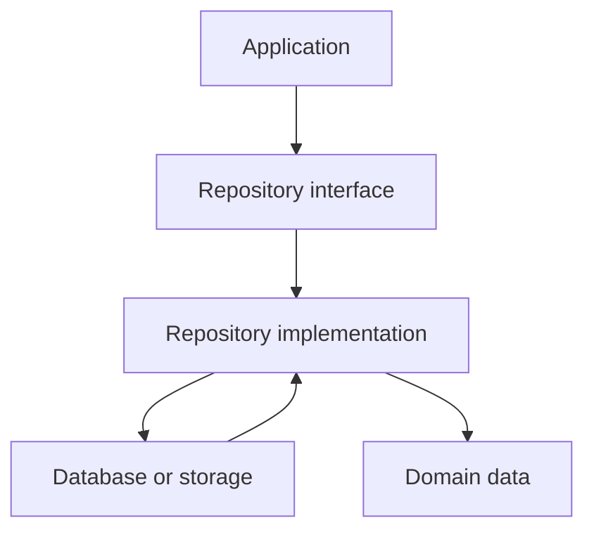

# Chapter 8. Repository Pattern

## Real World Example

도서관 이용자는 책을 빌릴 뿐, 책이 어느 창고의 어느 선반에 있는지는 몰라도 됩니다.

도서관 직원이 책을 찾는 방법을 바꾸어도 이용자는 같은 요청을 합니다.

Repository는 저장 위치와 방법을 호출자에게 숨기는 접근 방식입니다.

## Why Does It Exist?

Domain 규칙이 데이터베이스 Session, SQL 문법 또는 특정 ORM 객체를 직접 사용하면 저장 기술의 변경이 업무 규칙의 변경으로 번집니다. 테스트에서도 실제 데이터베이스가 없으면 Domain 규칙을 확인하기 어렵습니다.

Domain은 “필요한 데이터를 저장하고 조회한다”는 의미만 알면 될 수 있습니다. 어떤 테이블을 읽고 어떤 쿼리를 실행하는지는 별도의 경계에 남겨야 합니다.

Persistence가 필요하다는 사실과 Domain이 SQL을 알아야 한다는 사실은 같지 않습니다. 저장 방식은 변경될 수 있고, 조회 조건은 Use Case의 의미에 맞게 이름 붙여져야 합니다.

Repository는 이 두 관심사를 분리합니다. Domain 관점에서는 “최신 두 Snapshot을 가져온다”와 같은 의미 있는 작업을 요청하고, 구현은 이를 SQL Query나 파일 조회로 바꿉니다. 따라서 Repository의 목적은 CRUD 메서드 수를 늘리는 것이 아니라, 호출자가 필요한 저장 계약을 보호하는 것입니다.

## Definition

Repository Pattern은 저장 위치를 몰라도 데이터를 읽고 쓸 수 있게 해 주는 사용 방식입니다. Repository Pattern은 Application이나 Domain이 저장 위치와 조회 방법을 몰라도 되도록 저장 접근 계약을 제공하는 설계 방식입니다. 호출자는 특정 데이터베이스나 ORM이 아니라 자신의 Use Case에 필요한 작업을 사용합니다. 같은 계약은 메모리 구현, 데이터베이스 구현 또는 Fake로 만들 수 있습니다.

## Background Knowledge

### Contract(계약)

호출자와 구현이 지켜야 하는 입력, 출력과 오류의 약속입니다. Repository 계약은 저장 기술이 아니라 호출 목적을 기준으로 정할 수 있습니다.


도서관 이용 시간과 반납 규칙처럼 호출자와 구현이 함께 지켜야 하는 약속입니다.

### CRUD

Create, Read, Update, Delete의 약자입니다. 데이터를 만들고, 읽고, 바꾸고, 삭제하는 기본 작업을 가리킵니다.


은행 계좌를 만들고(Create), 조회하고(Read), 수정하고(Update), 삭제하는(Delete) 네 가지 동작입니다.

### Query(조회)

조건에 맞는 데이터를 읽어오는 요청입니다. Repository에서는 기술적인 SQL보다 Use Case가 필요한 의미를 이름과 결과로 드러내는 것이 중요합니다.


도서관에서 특정 제목의 책을 찾아 달라고 요청하는 것이 Query입니다.

### DAO(Data Access Object)

저장 기술에 가까운 데이터 접근 객체를 가리키는 이름입니다. DAO와 Repository는 이름보다 계약이 어느 관점에 서 있는지로 구분해야 합니다.


서류 보관 담당자처럼 저장 기술에 가까운 데이터 접근 객체를 가리킵니다.

### In-memory implementation(메모리 구현)

파일이나 데이터베이스 대신 프로세스 메모리에 값을 저장하는 구현입니다. 테스트에서는 빠른 대체 구현으로 사용할 수 있습니다.

실제 창고 대신 책상 위 상자에 물건을 넣어 보는 것처럼 메모리에서 저장을 흉내 냅니다.

## Responsibilities

| 해야 하는 일 | 하면 안 되는 일 |
|---|---|
| Domain 관점의 저장·조회 계약을 제공한다 | Domain 규칙을 대신 계산한다 |
| 저장 기술과 호출자 사이를 변환한다 | CLI 출력과 사용자 메시지를 결정한다 |
| 조회 결과의 정렬·필터 계약을 보장한다 | 모든 테이블에 기계적인 CRUD를 노출한다 |
| 저장소 오류를 호출자에게 전달한다 | 오류를 빈 결과로 임의 변환한다 |
| 테스트에서 대체 구현을 사용할 수 있게 한다 | Provider와 외부 뉴스·LLM을 호출한다 |

Repository는 저장소 접근의 소유자이지만, 저장된 데이터의 모든 업무 의미를 소유하는 것은 아닙니다. 어떤 두 가격의 차이가 상승인지 판단하는 규칙은 Domain에 남을 수 있습니다.

## Typical Workflow



Application은 Repository 계약을 사용하고, 구현은 그 계약을 특정 저장 기술로 연결합니다. 테스트에서는 Database 대신 Memory Repository나 Fake Repository를 연결할 수 있습니다.

## Relationship with Other Concepts

| 개념 | Repository와의 차이 |
|---|---|
| Persistence | 데이터를 실행 사이에 보존하는 더 넓은 개념이다 |
| DAO | 저장 기술 중심의 데이터 접근 객체를 가리키는 경우가 많다 |
| Storage Service | 파일·DB 저장 기능을 기술 중심으로 묶을 수 있다 |
| Query Service | 읽기 전용 조회 계약에 집중한다 |
| ORM | 객체와 테이블을 매핑하는 기술이다 |
| Domain Model | Repository가 읽고 저장할 업무 의미를 표현한다 |

Repository는 DAO와 구현상 비슷할 수 있습니다. 구분 기준은 이름이 아니라 계약이 Domain의 사용 목적을 중심으로 하는지, 저장 기술의 세부사항을 그대로 노출하는지입니다.

## Common Mistakes

- `create`, `read`, `update`, `delete`만 나열하고 Use Case 의미를 정의하지 않는다.
- Repository Interface에 SQLAlchemy Session이나 ORM Row를 반환한다.
- Repository가 Movement나 다른 Business Rule을 계산한다.
- 모든 Domain Model마다 무조건 Repository를 만든다.
- Fake Repository가 실제 Database Repository와 다른 정렬·필터 계약을 가진다.
- 저장소 오류를 `None`이나 빈 목록으로 숨긴다.

Repository가 있다고 해서 Domain이 자동으로 독립되는 것은 아닙니다. 계약이 저장 기술의 언어로 작성되면 의존성은 여전히 남아 있습니다.

## Best Practices

1. 먼저 Use Case가 필요로 하는 저장 작업을 이름 붙입니다.
2. Interface에는 호출자가 필요한 입력과 결과만 둡니다.
3. 저장 구현은 별도의 모듈에서 Persistence Model과 변환을 처리합니다.
4. Fake와 실제 구현이 같은 정렬·누락·오류 계약을 지키게 합니다.
5. 읽기와 쓰기의 요구가 다르면 별도 계약을 검토합니다.
6. Repository가 필요하지 않은 작은 흐름에는 직접 저장 함수를 사용할 수도 있습니다.

Repository Pattern의 목적은 추상화 개수를 늘리는 것이 아니라, 저장 기술의 변경 이유와 Domain 규칙의 변경 이유를 분리하는 것입니다.

## Trade-offs

| 선택 | 장점 | 단점 |
|---|---|---|
| Domain 관점의 Repository를 둔다 | 저장 기술과 Domain을 분리하기 쉽다 | Interface와 구현이 추가된다 |
| 저장 구현을 직접 호출한다 | 작은 기능에서는 코드가 짧다 | 저장 기술이 호출 계층으로 퍼진다 |
| Memory/Fake 구현을 둔다 | 격리된 테스트가 쉽다 | Fake가 실제 계약을 잘못 모사할 위험이 있다 |
| 모든 CRUD를 Repository에 둔다 | 기본 작업을 빠르게 노출할 수 있다 | Use Case 의미가 약해지고 불필요한 API가 늘어난다 |

Repository는 저장 기술 교체 가능성만으로 도입하지 않습니다. Domain 규칙을 보호하거나, 저장 계약을 테스트와 여러 Use Case에서 재사용해야 할 때 비용을 정당화할 수 있습니다.

## Minimal Python Example

```python
from dataclasses import dataclass


@dataclass(frozen=True)
class Account:
    account_id: str
    active: bool


class MemoryAccountRepository:
    def __init__(self, accounts: list[Account]) -> None:
        self._accounts = {a.account_id: a for a in accounts}

    def find(self, account_id: str) -> Account | None:
        return self._accounts.get(account_id)


repository = MemoryAccountRepository([Account("A-1", True)])
assert repository.find("A-1").active
```

이 예제에서는 `find()`가 저장 접근 계약의 작은 예입니다. 호출자는 저장 구현이 Dictionary인지 Database인지 알 필요 없이 필요한 조회만 사용합니다.

## Example from automation-hub

앞의 작은 예제에서는 호출자가 Dictionary인지 Database인지 몰라도 `find()`를 사용할 수 있었습니다. 실제 Storage도 호출 목적에 맞는 `get_latest()`와 `get_latest_two()`를 제공합니다.

### 실제 코드

이 코드는 한 종목의 최신 두 Snapshot을 정해진 순서로 조회하는 접근 경계를 보여 줍니다.

```python
    def get_latest_two(self, symbol: str) -> list[StockPrice]:
        """Return ``[newest, previous]`` snapshots for one symbol."""
        return self._query_latest(symbol, limit=2)

    def _query_latest(self, symbol: str, *, limit: int) -> list[StockPrice]:
        """Query only one symbol with deterministic newest-first ordering."""
        normalized_symbol = _canonical_symbol(symbol)

        statement = (
            select(StockQuoteSnapshot)
            .where(StockQuoteSnapshot.symbol == normalized_symbol)
            .order_by(
                StockQuoteSnapshot.collected_at.desc(),
                StockQuoteSnapshot.id.desc(),
            )
            .limit(limit)
        )
```

Source: [`google_finance/storage.py`](../../google_finance/storage.py)

### 코드에서 확인할 점

- **이 코드는 무엇을 하는가?** 이 코드는 한 종목의 최신 두 Snapshot을 정해진 순서로 조회하는 접근 경계를 보여 줍니다.
- **왜 이 Chapter의 개념인가?** Repository에 가까운 역할은 저장 기술이 아니라 호출자가 필요한 조회 계약으로 드러납니다.
- **무엇을 하지 않는가?** 현재 코드에는 별도의 `Repository` Interface가 없습니다. Storage가 제공하는 실제 계약만 설명하며, Movement 계산은 하지 않습니다.

### Repository에서 따라가 보기

- `tests/google_finance/test_storage.py`에서 조회 순서와 변환 계약을 확인합니다.

## Checkpoint

1. Repository 계약이 SQL 문법이 아니라 Use Case의 의미를 표현해야 하는 이유는 무엇입니까?
2. DAO와 Repository를 구분할 때 이름보다 어떤 기준을 봐야 합니까?
3. Fake Repository와 실제 저장 구현이 반드시 공유해야 하는 계약은 무엇입니까?
4. 현재 구조에서 Repository를 새로 추가하지 않아도 되는 경우는 언제입니까?

## Summary

이번 Chapter에서 기억해야 할 것은 다음입니다. Repository Pattern은 Domain과 저장 기술 사이에 호출 목적 중심의 계약을 둡니다. CRUD 목록보다 어떤 데이터를 어떤 의미로 저장하고 조회하는지가 중요합니다. Fake와 실제 구현은 같은 정렬, 누락과 오류 계약을 지켜야 합니다. 다음 Chapter에서는 Repository 구현에서 자주 사용하는 ORM과 Domain·Persistence Model의 매핑을 구분합니다.

## Related Concepts

- [Persistence](persistence.md#chapter-7-persistence): 실행 사이에 데이터를 보존하는 경계를 설명합니다.
- [ORM and Data Mapping](orm-and-data-mapping.md#chapter-9-orm-and-data-mapping): Repository 구현과 Model 변환의 관계를 설명합니다.
- [Domain Model](domain-model.md#chapter-3-domain-model): Repository 계약이 보호해야 할 내부 의미를 표현합니다.

## Related Project Documents

- [Google Finance Architecture](../packages/google_finance/architecture.md): 현재 Storage 경계의 Reference입니다.
- [Google Finance Storage](../../google_finance/storage.py): 실제 저장·조회 구현입니다.
- [Root Architecture](../architecture.md): Root Database 경계를 설명합니다.
- [Architecture Handbook](../handbook/README.md): Business Rule과 Persistence 연결 과정을 학습합니다.
- [CODEBASE_GUIDE](../../CODEBASE_GUIDE.md): 관련 코드 탐색 순서입니다.

## Next Chapter

다음 Chapter에서는 ORM이 Repository 자체가 아니라 객체와 저장 표현 사이의 매핑 기술이라는 점을 설명합니다.

[Chapter 9. ORM and Data Mapping](orm-and-data-mapping.md#chapter-9-orm-and-data-mapping)

---

| 이전 Chapter | 목차 | 다음 Chapter |
|---|---|---|
| [Chapter 7. Persistence](persistence.md#chapter-7-persistence) | [Concepts Book](README.md#python-automation-architecture-concepts) | [Chapter 9. ORM and Data Mapping](orm-and-data-mapping.md#chapter-9-orm-and-data-mapping) |
