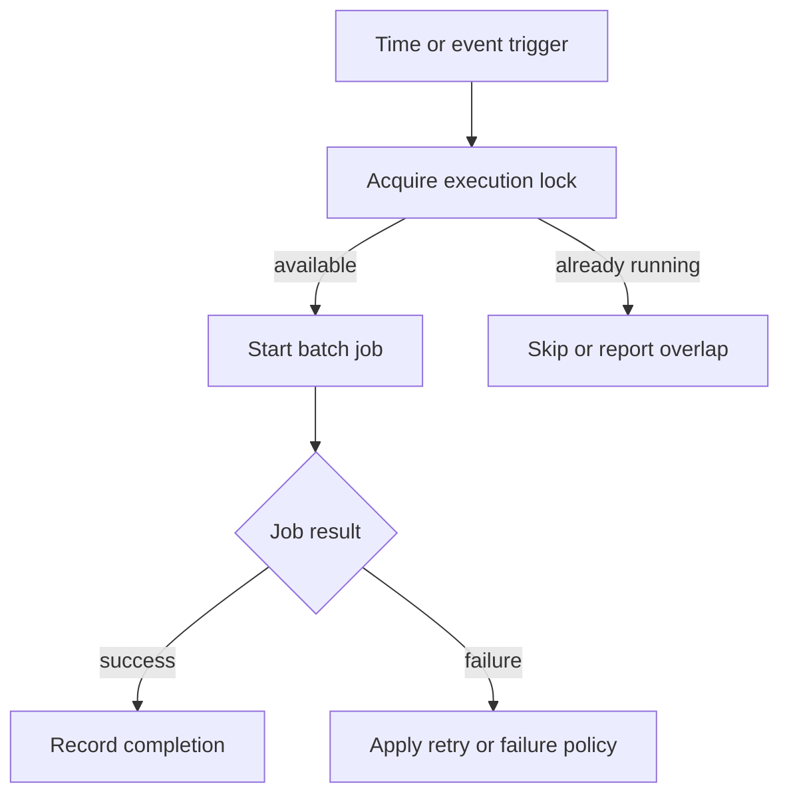

# Chapter 20. Scheduler

## Real World Example

알람 시계가 매일 오전 8시에 울리도록 설정할 수 있습니다.

알람은 언제 시작할지만 결정하고, 일어나는 일 자체를 대신하지 않습니다.

Scheduler도 프로그램 실행 시점을 정합니다.

## Why Does It Exist?

자동화가 한 번 실행되는 도구가 아니라 반복되는 Batch Job이면 실행 시점을 관리해야 합니다. 사람이 매번 CLI를 실행하면 누락될 수 있고, 실행 간격과 실패 결과를 일관되게 관리하기 어렵습니다.

Scheduler는 시간과 이벤트를 실행 요청으로 바꿉니다. 그러나 반복 실행에서는 같은 작업이 겹치거나 실패 후 재시도와 원래 실행이 동시에 진행될 수 있습니다. 따라서 Schedule과 Business Logic, 중복 실행 방지와 Retry 정책을 분리해 설계해야 합니다.

## Definition

Scheduler는 프로그램을 정해진 시간이나 사건에 맞춰 실행하는 도구입니다. Cron, Windows Task Scheduler, APScheduler와 Event Trigger는 서로 다른 Scheduler 방식입니다. Scheduler는 언제 실행할지를 결정하지만, 실행되는 Business Logic과 그 결과의 의미를 소유하지 않습니다.

## Background Knowledge

### Cron

운영체제가 정해진 시간표에 따라 명령을 실행하는 도구이다.

프로그램 내부에 시간을 재우는 코드를 넣지 않고도 반복 실행을 운영체제에 맡길 수 있다.

예를 들어 매일 오전 9시에 `python -m package.main`을 실행하도록 등록할 수 있다.


### Batch Job(배치 작업)

많은 입력이나 정해진 작업을 한 번에 처리하는 실행 단위이다.

사람이 한 건씩 처리하지 않고 목록 전체를 순서대로 처리할 때 유용하다.

예를 들어 Watchlist의 여러 symbol을 차례로 수집하는 작업이 Batch Job이다.


### Lock(잠금)

같은 자원에 동시에 접근하거나 같은 작업을 중복 실행하지 못하게 하는 제어 수단이다.

첫 실행이 끝나기 전에 다음 실행이 시작되면 데이터와 외부 호출이 중복될 수 있으므로 사용한다.

예를 들어 `flock`으로 같은 Shell Job의 동시 실행을 막을 수 있다.

## Responsibilities

| 해야 하는 일 | 하면 안 되는 일 |
|---|---|
| 시간·간격·이벤트에 따라 실행을 시작한다 | Business Logic을 Scheduler 안에 복사한다 |
| 실행 환경과 작업 인자를 전달한다 | 성공 여부를 임의로 판단해 결과를 숨긴다 |
| 중복 실행 방지와 실행 수명을 관리한다 | 모든 실패를 무조건 재시도한다 |
| 작업의 종료 상태를 운영 시스템에 전달한다 | 저장·수집·분석의 내부 순서를 소유한다 |

Scheduler는 실행 트리거이고, Batch Job은 실행되는 Use Case입니다. 둘을 분리하면 같은 Job을 수동 CLI와 예약 실행에서 함께 사용할 수 있습니다.

## Typical Workflow



중복 실행을 막기 위해 Lock을 먼저 확인할 수 있습니다. Retry를 적용하더라도 외부 오류와 입력 오류를 구분하고, 재시도 횟수와 간격을 제한해야 합니다.

## Relationship with Other Concepts

| 개념 | Scheduler와의 차이 |
|---|---|
| Cron | 운영체제의 시간 기반 실행 도구이다 |
| Windows Task Scheduler | Windows 환경의 예약 실행 도구이다 |
| APScheduler | 애플리케이션 내부에서 Schedule을 관리하는 Library이다 |
| Event Trigger | 메시지·Webhook·상태 변화로 실행을 시작한다 |
| Batch Job | Scheduler가 실행하는 일괄 작업이다 |
| Lock | 동시에 하나의 작업만 실행되게 하는 제어 수단이다 |
| Retry | 실패한 작업을 다시 실행하는 정책이다 |

Cron과 APScheduler는 실행을 시작하는 방법이고, Lock과 Retry는 반복 실행에서 발생하는 위험을 다루는 정책입니다. 이들을 하나의 Business Service로 묶을 필요는 없습니다.

## Common Mistakes

- Scheduler가 업무 규칙과 저장 순서를 직접 구현한다.
- 작업이 끝나기 전에 다음 실행이 시작된다.
- Retry가 실패 원인과 관계없이 모든 오류를 반복한다.
- 실행 시간대와 시간 기준을 명확히 하지 않는다.
- Lock을 얻지 못한 실행을 성공으로 기록한다.
- Scheduler 로그와 Job 결과를 구분하지 않는다.

중복 실행은 같은 데이터를 두 번 처리하거나 외부 API 호출과 비용을 증가시킬 수 있습니다.

## Best Practices

1. Scheduler는 CLI나 Application Entry Point를 호출하는 수준으로 제한합니다.
2. Job의 입력, 종료 상태와 재실행 가능성을 정의합니다.
3. 실행 전 Lock과 실행 후 해제를 보장합니다.
4. Retry는 일시적 오류에만 제한적으로 적용합니다.
5. 시간대, 지연 실행과 실패 알림 정책을 명시합니다.
6. 수동 실행과 예약 실행이 같은 Business Logic을 사용하게 합니다.

Scheduler를 도입하기 전에 운영체제의 Cron이나 Task Scheduler로 충분한지 확인합니다. 복잡한 내부 Scheduler는 여러 Schedule, 동적 Job과 애플리케이션 상태가 실제로 필요할 때 선택합니다.

## Trade-offs

| 선택 | 장점 | 단점 |
|---|---|---|
| Cron 사용 | 단순하고 운영체제에서 관리한다 | 실행 상태와 재시도 기능이 제한적일 수 있다 |
| Windows Task Scheduler 사용 | Windows 환경과 권한 관리에 통합된다 | 다른 환경과 설정 방식이 다르다 |
| APScheduler 사용 | 애플리케이션 안에서 유연한 Schedule을 구성한다 | 프로세스 수명과 장애 복구를 직접 관리해야 한다 |
| Event Trigger 사용 | 이벤트가 생길 때만 실행한다 | 이벤트 전달과 중복 처리가 필요하다 |
| Lock 없이 실행한다 | 구성이 단순하다 | 겹친 실행과 데이터 중복 위험이 있다 |

## Minimal Python Example

```python
from datetime import datetime, timedelta


def should_run(last_run: datetime | None, now: datetime) -> bool:
    return last_run is None or now - last_run >= timedelta(hours=1)


last = None
now = datetime(2026, 1, 1, 9)
if should_run(last, now):
    print("run job")
    last = now
```

Scheduler는 실행 시점을 결정하고, 실제 업무 흐름은 별도의 함수나 Application에 남겨야 합니다.

## Example from automation-hub

앞의 작은 예제에서는 시간을 보고 실행 여부만 판단했습니다. 실제 운영 Wrapper는 예약 실행을 감싸고 중복 실행을 Lock으로 막습니다.

### 실제 코드

이 코드는 로그에 시작을 기록하고 `flock`으로 이미 실행 중인 작업을 건너뜁니다.

```bash
start_epoch="$(date +%s)"
start_time="$(date --iso-8601=seconds)"
echo "[$start_time] start"

exec 9>"$LOCK_FILE"
if ! flock -n 9; then
    echo "[$(date --iso-8601=seconds)] skipped: another run is active"
    exit 75
fi
```

Source: [`run_namuwiki_trend.sh`](../../run_namuwiki_trend.sh)

### 코드에서 확인할 점

- **이 코드는 무엇을 하는가?** 이 코드는 로그에 시작을 기록하고 `flock`으로 이미 실행 중인 작업을 건너뜁니다.
- **왜 이 Chapter의 개념인가?** Scheduler 자체보다 실행 시점과 중복 실행 제어가 업무 흐름과 분리된 모습을 보여 줍니다.
- **무엇을 하지 않는가?** 이 Repository가 Python Scheduler Framework를 구현했다는 뜻은 아닙니다. Cron이 이 Wrapper를 호출하는 운영 경계가 별도로 필요합니다.

### Repository에서 따라가 보기

- `run_namuwiki_trend.sh`의 Python 실행과 종료 코드 기록 부분을 이어서 읽습니다.

## Checkpoint

1. Scheduler와 Batch Job을 분리해야 하는 이유는 무엇입니까?
2. Lock이 없을 때 반복 실행에서 어떤 문제가 생길 수 있습니까?
3. 모든 실패에 Retry를 적용하면 안 되는 이유는 무엇입니까?
4. Cron과 애플리케이션 내부 Scheduler를 선택할 때 어떤 운영 비용을 비교해야 합니까?

## Summary

이번 Chapter에서 기억해야 할 것은 다음입니다. Scheduler는 프로그램을 언제 실행할지 결정하는 운영 경계입니다. 일정과 업무 규칙을 분리하면 실행 방식이 바뀌어도 핵심 흐름을 재사용할 수 있습니다. 중복 실행과 실패 후 처리 같은 운영 조건도 함께 고려해야 합니다. 실제 업무 판단은 Scheduler가 아니라 실행되는 Application이 소유합니다.

## Related Concepts

- [Command-Line Interface](cli.md#chapter-19-command-line-interface-cli): Scheduler가 실행할 수 있는 Entry Point입니다.
- [Configuration](configuration.md#chapter-12-configuration): Schedule과 실행 환경의 설정을 제공합니다.
- [Logging](logging.md#chapter-21-logging): Job의 시작·종료와 실패를 기록합니다.
- [Live Test](live-test.md#chapter-18-live-test): 실제 외부 Job 흐름을 점검합니다.

## Related Project Documents

- [Namuwiki Operations](../operations/namuwiki_trend.md): Wrapper, Cron과 Lock 운영 절차입니다.
- [Namuwiki Package README](../packages/namuwiki_trend/README.md): 실행 명령과 현재 기능입니다.
- [DEV_LOG](../development/DEV_LOG.md): Scheduler와 운영 검증 기록입니다.
- [CODEBASE_GUIDE](../../CODEBASE_GUIDE.md): 실행 진입점 탐색 순서입니다.
- [Architecture Handbook](../handbook/README.md): Pipeline과 운영 경계를 학습합니다.

## Next Chapter

[Chapter 21. Logging](logging.md#chapter-21-logging)에서는 반복 실행의 상태와 실패를 운영자가 관찰할 수 있게 기록하는 방법을 설명합니다.

---

| 이전 Chapter | 목차 | 다음 Chapter |
|---|---|---|
| [Chapter 19. Command-Line Interface (CLI)](cli.md#chapter-19-command-line-interface-cli) | [Concepts Book](README.md#python-automation-architecture-concepts) | [Chapter 21. Logging](logging.md#chapter-21-logging) |
