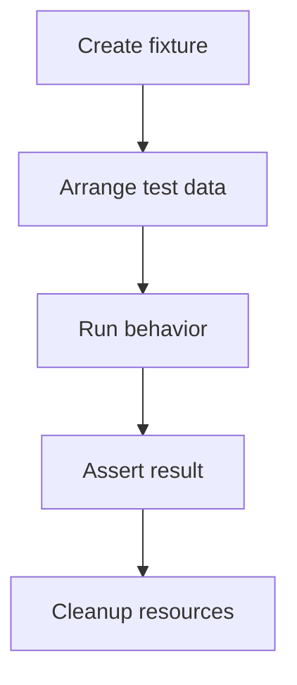

# Chapter 15. Test Fixture

## Real World Example

시험을 볼 때 연필, 답안지와 신분증을 미리 준비하면 시험 자체에 집중할 수 있습니다.

테스트도 필요한 객체와 데이터를 먼저 준비해야 합니다.

Fixture는 이 준비물을 만드는 방법입니다.

## Why Does It Exist?

테스트마다 객체와 데이터를 처음부터 만들면 준비 코드가 반복되고, 테스트의 핵심 질문이 묻힐 수 있습니다. 반대로 하나의 전역 데이터를 여러 테스트가 공유하면 한 테스트의 변경이 다른 테스트에 영향을 줍니다.

Fixture는 필요한 초기 상태를 명시적으로 준비하고 테스트를 독립적으로 실행하게 합니다. 반복되는 데이터 생성은 Factory Function, Object Mother와 Builder Pattern 같은 방식으로 정리할 수 있지만, 재사용이 테스트의 독립성과 가독성을 해치지 않아야 합니다.

## Definition

Test Fixture는 테스트를 시작하기 전에 필요한 데이터와 객체를 준비하는 방법입니다. Fixture는 특정 테스트의 Arrange 단계를 반복 가능하게 만들지만, 테스트의 의미를 숨기는 거대한 공통 데이터 저장소가 되어서는 안 됩니다. 테스트 도구의 기능 이름이 아니라 테스트를 재현하는 준비 계약이라는 개념입니다.

## Background Knowledge

### Arrange(준비 단계)

테스트에 필요한 입력, 의존성과 초기 상태를 준비하는 단계이다.

Act와 Assert 전에 무엇을 준비했는지 분명히 하면 테스트가 어떤 상황을 검증하는지 읽기 쉬워진다.

예를 들어 Fake Storage에 이전 가격과 최신 가격을 넣고 테스트 대상을 만드는 것이 Arrange다.


### Object Mother(객체 생성 도우미)

자주 쓰는 완성된 테스트 객체를 만들어 주는 공통 도우미이다.

반복되는 기본값을 줄일 수 있지만, 서로 다른 테스트의 의미까지 숨기지 않도록 주의해야 한다.

예를 들어 기본 사용자 객체를 만들고 필요한 테스트만 이름을 바꿀 수 있다.


### Builder Pattern(빌더 패턴)

여러 선택 값을 단계적으로 설정해 객체를 만드는 방식이다.

필드가 많거나 조합이 다양한 테스트 데이터에서 읽기 쉬운 생성 코드를 만들 수 있다.

예를 들어 `StockBuilder().symbol("NVDA").price("100")`처럼 필요한 값만 바꿀 수 있다.


### Factory Function(팩토리 함수)

인자를 받아 테스트에 필요한 객체를 만들어 반환하는 작은 함수이다.

Object Mother보다 현재 테스트의 변형 값을 인자로 드러내기 쉽다.

예를 들어 `make_price(symbol="NVDA")`가 기본값이 있는 `StockPrice`를 반환할 수 있다.

## Responsibilities

| 해야 하는 일 | 하면 안 되는 일 |
|---|---|
| 테스트에 필요한 초기 객체와 데이터를 준비한다 | 테스트의 핵심 검증까지 대신 수행한다 |
| Arrange 단계의 반복을 줄인다 | 서로 다른 테스트가 변경 가능한 상태를 공유한다 |
| 테스트 종료 후 자원을 정리한다 | 모든 테스트에 불필요한 데이터를 넣는다 |
| 기본값과 변형 지점을 명확히 한다 | 기본값을 숨겨 테스트 조건을 알 수 없게 한다 |
| 테스트가 독립적으로 실행되게 한다 | Fixture 하나에 모든 도메인 객체를 모은다 |

Fixture는 테스트의 결과를 만들어 주는 장치가 아니라 테스트를 실행할 조건을 준비하는 장치입니다.

## Typical Workflow



Fixture는 Arrange 앞이나 Arrange 과정에서 사용됩니다. 테스트별로 필요한 변형을 명시하고, 외부 자원이 있다면 Cleanup까지 같은 수명 범위에서 관리합니다.

## Relationship with Other Concepts

| 개념 | Test Fixture와의 차이 |
|---|---|
| Arrange | 테스트 실행 전 상태를 만드는 단계이다 |
| Factory Function | 객체 하나나 작은 그래프를 생성하는 함수이다 |
| Object Mother | 의미 있는 기본 테스트 객체를 제공하는 패턴이다 |
| Builder Pattern | 여러 선택적 속성을 단계적으로 구성하는 패턴이다 |
| Fake | Fixture가 준비할 수 있는 대체 구현이다 |
| Test Double | 외부 의존성을 대체하는 객체의 상위 개념이다 |

Object Mother와 Builder는 Fixture를 만드는 방법입니다. Fixture 자체는 데이터와 자원의 준비·정리라는 더 넓은 테스트 구조를 가리킵니다.

## Common Mistakes

- 모든 테스트가 하나의 전역 Fixture를 변경한다.
- Fixture 함수가 너무 많은 기본값을 숨긴다.
- 테스트마다 필요하지 않은 객체와 데이터를 함께 만든다.
- Object Mother가 현실의 모든 상태를 표현하는 거대한 Factory가 된다.
- Builder의 호출이 테스트 의도를 읽기 어렵게 만든다.
- 외부 자원을 만들고 정리하지 않는다.

Fixture가 편리하다는 이유로 테스트의 조건을 감추면, 실패한 테스트를 읽고 원인을 찾기 어려워집니다.

## Best Practices

1. 테스트의 핵심 조건은 테스트 본문에서 드러냅니다.
2. 공통 기본값은 재사용하되 중요한 변형은 호출부에서 명시합니다.
3. Fixture는 가능한 한 작고 독립적으로 유지합니다.
4. 변경 가능한 객체는 테스트마다 새로 생성합니다.
5. Object Mother, Builder와 Factory Function 중 가장 읽기 쉬운 방식을 선택합니다.
6. Database나 파일처럼 외부 자원은 생성과 정리를 같은 Fixture 수명에 둡니다.

Fixture 재사용은 코드 중복을 줄이는 수단이지, 모든 테스트를 같은 시나리오로 만드는 규칙이 아닙니다. 테스트 독립성과 의도를 우선해야 합니다.

## Trade-offs

| 선택 | 장점 | 단점 |
|---|---|---|
| 테스트 안에서 직접 데이터를 만든다 | 조건이 눈에 보인다 | 반복 코드가 늘어난다 |
| Factory Function을 사용한다 | 간단한 기본 객체를 재사용한다 | 기본값이 숨겨질 수 있다 |
| Object Mother를 사용한다 | 의미 있는 시나리오 객체를 빠르게 만든다 | 변형이 늘면 거대해질 수 있다 |
| Builder Pattern을 사용한다 | 선택적 속성을 읽기 좋게 구성한다 | 단순 객체에는 코드가 과할 수 있다 |
| 공유 Fixture를 사용한다 | 준비 시간이 줄어든다 | 상태 공유로 테스트가 오염될 수 있다 |

Fixture 추상화는 준비 코드가 실제로 반복되고, 동일한 의미를 유지할 때 도입합니다. 테스트가 한두 개뿐이라면 직접 작성하는 편이 더 명확할 수 있습니다.

## Minimal Python Example

```python
from dataclasses import dataclass


@dataclass
class User:
    name: str
    active: bool = True


def user_fixture(name: str = "Ada") -> User:
    return User(name=name)


first = user_fixture()
second = user_fixture("Grace")
assert first.name == "Ada"
assert second.name == "Grace"
```

Fixture는 테스트가 시작될 때 필요한 데이터를 한 곳에서 준비하고, 각 테스트가 독립적으로 사용할 수 있게 합니다.

## Example from automation-hub

앞의 작은 예제에서는 Factory Function으로 테스트 객체의 기본값을 준비했습니다. 실제 Storage 테스트도 반복되는 `StockPrice` 생성값을 helper로 모읍니다.

### 실제 코드

이 helper는 테스트가 필요한 시각만 인자로 받고 나머지 가격 필드는 일관된 기본값으로 채웁니다.

```python
def _stock_price(*, collected_at: datetime) -> StockPrice:
    """Create a precise quote fixture."""
    return StockPrice(
        symbol="AAPL:NASDAQ",
        name="Apple Inc",
        current_price=Decimal("338.19000001"),
        previous_close=Decimal("340.08000001"),
        open_price=Decimal("339.73000001"),
        change_percent=Decimal("-0.55555555"),
        currency="USD",
        collected_at=collected_at,
    )
```

Source: [`tests/google_finance/test_storage.py`](../../tests/google_finance/test_storage.py)

### 코드에서 확인할 점

- **이 코드는 무엇을 하는가?** 이 helper는 테스트가 필요한 시각만 인자로 받고 나머지 가격 필드는 일관된 기본값으로 채웁니다.
- **왜 이 Chapter의 개념인가?** Fixture가 테스트를 시작할 때 필요한 입력을 준비하고 테스트 본문이 검증 대상에 집중하게 하는 예입니다.
- **무엇을 하지 않는가?** 이 helper는 운영 코드의 Factory가 아니며, 실제 DB 연결이나 테스트 실행 순서를 관리하지 않습니다.

### Repository에서 따라가 보기

- `tests/google_finance/test_movement.py`의 `_stock_price()`도 비교해 봅니다.

## Checkpoint

1. Test Fixture와 Arrange 단계는 어떤 관계입니까?
2. Factory Function, Object Mother와 Builder Pattern 중 어떤 기준으로 선택해야 합니까?
3. 공유 Fixture가 테스트 독립성을 해칠 수 있는 이유는 무엇입니까?
4. Fixture가 테스트의 핵심 조건을 숨기지 않게 하려면 어떻게 해야 합니까?

## Summary

이번 Chapter에서 기억해야 할 것은 다음입니다. Test Fixture는 테스트의 Arrange 단계에서 필요한 데이터와 객체를 준비합니다. 재사용 가능한 생성 함수는 중복을 줄입니다. 그러나 테스트마다 필요한 차이를 숨기지 않아야 하며, 각 테스트의 독립성도 보존해야 합니다.

## Related Concepts

- [Fake](fake.md#chapter-13-fake): Fixture로 준비할 수 있는 대체 구현입니다.
- [Mock and Stub](mock-and-stub.md#chapter-14-mock-and-stub): Fixture와 함께 사용하는 Test Double입니다.
- [Dependency Injection](dependency-injection.md#chapter-10-dependency-injection): 준비한 의존성을 테스트 대상에 전달합니다.
- [Configuration](configuration.md#chapter-12-configuration): 테스트 환경 설정을 준비합니다.

## Related Project Documents

- [Google Finance Storage Tests](../../tests/google_finance/test_storage.py): 저장 테스트 데이터 준비 사례입니다.
- [Google Finance Application Tests](../../tests/google_finance/test_analysis_application.py): Application Fixture 사례입니다.
- [Google Finance Collector Tests](../../tests/google_finance/test_collector.py): 외부 경계 테스트 준비 사례입니다.
- [Google Finance Architecture](../packages/google_finance/architecture.md): 테스트 경계의 Reference입니다.
- [Architecture Handbook](../handbook/README.md): 테스트 경계를 설계한 과정을 학습합니다.
- [CODEBASE_GUIDE](../../CODEBASE_GUIDE.md): 테스트 코드 탐색 순서입니다.

## Next Chapter

[Chapter 16. Unit Test](unit-test.md#chapter-16-unit-test)에서는 준비된 Fixture와 격리된 의존성으로 가장 작은 규칙을 검증하는 방법을 설명합니다.

---

| 이전 Chapter | 목차 | 다음 Chapter |
|---|---|---|
| [Chapter 14. Mock and Stub](mock-and-stub.md#chapter-14-mock-and-stub) | [Concepts Book](README.md#python-automation-architecture-concepts) | [Chapter 16. Unit Test](unit-test.md#chapter-16-unit-test) |
