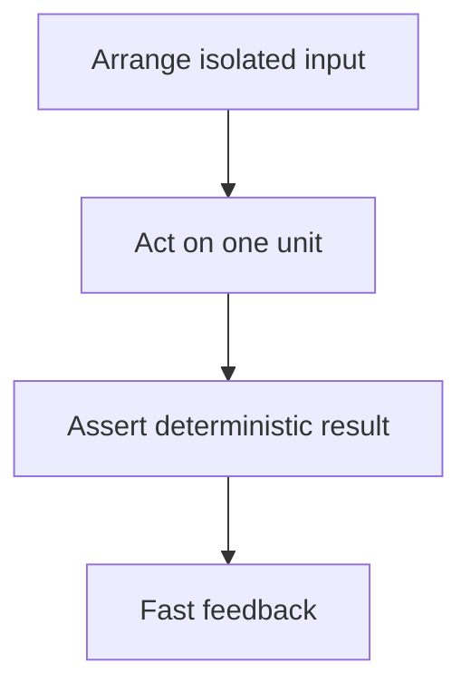

# Chapter 16. Unit Test

## Real World Example

계산기에서 세금 계산 버튼 하나만 눌러 결과를 확인할 수 있습니다.

전체 가게를 실제로 운영하지 않아도 계산 규칙은 따로 시험할 수 있습니다.

Unit Test는 작은 규칙 하나를 빠르게 확인합니다.

## Why Does It Exist?

작은 규칙의 오류를 매번 전체 애플리케이션이나 실제 외부 시스템으로 확인하면 피드백이 느립니다. 실패 원인도 여러 구성요소 사이에 섞입니다.

Unit Test는 하나의 질문을 좁은 입력으로 확인합니다. 같은 입력이면 같은 결과가 나오게 만들고, 실패가 발생했을 때 어떤 규칙이 깨졌는지 바로 알 수 있게 합니다.

## Definition

Unit Test는 하나의 작은 규칙이 제대로 동작하는지 확인하는 테스트입니다. 여기서 Unit은 반드시 파일 하나나 클래스 하나를 뜻하지 않고, 하나의 책임과 판단을 함께 확인할 수 있는 가장 작은 테스트 경계를 뜻합니다. Unit Test는 빠르고 결정적이어야 하며, 실제 Database나 외부 API 연결 자체를 검증하는 테스트는 아닙니다.

## Background Knowledge

### Isolation(격리)

테스트 대상이 다른 외부 상태나 테스트의 실행 순서에 영향을 받지 않게 하는 것이다.

격리되면 실패 원인을 작은 범위에서 찾을 수 있고 테스트를 어떤 순서로 실행해도 결과가 같아진다.

예를 들어 실제 Database 대신 각 테스트가 새 Fake Storage를 사용하는 방식이다.


### Arrange-Act-Assert(준비·실행·검증)

테스트를 준비, 실행, 결과 확인의 세 부분으로 나누는 작성 방식이다.

세 단계가 보이면 테스트가 어떤 상황과 결과를 다루는지 빠르게 읽을 수 있다.

예를 들어 두 가격을 준비하고 movement를 계산한 뒤 방향과 delta를 검증한다.


### Deterministic Test(결정적 테스트)

같은 코드와 입력이면 실행할 때마다 같은 결과가 나오는 테스트이다.

현재 시간, 네트워크와 무작위 값에 의존하지 않도록 만들어야 안정적으로 회귀를 확인할 수 있다.

예를 들어 고정된 두 `StockPrice`의 delta는 실행 시점과 관계없이 같아야 한다.

## Responsibilities

| 해야 하는 일 | 하면 안 되는 일 |
|---|---|
| 하나의 책임과 규칙을 격리해 검증한다 | 실제 외부 서비스의 정상 동작을 증명한다 |
| Arrange-Act-Assert 구조를 명확히 한다 | 여러 구성요소의 연결을 한꺼번에 검증한다 |
| Fake나 고정 입력으로 의존성을 대체한다 | 테스트마다 현재 시간·네트워크에 의존한다 |
| 결정적이고 빠른 결과를 제공한다 | 내부 구현의 모든 호출 순서를 고정한다 |
| 테스트 이름에 검증 조건을 드러낸다 | 실패를 무조건 무시하거나 재시도한다 |

Unit Test의 책임은 작은 규칙을 보호하는 것입니다. 외부 환경의 변화나 Database Schema는 다른 테스트 경계에서 확인해야 합니다.

## Typical Workflow



테스트는 먼저 입력과 대체 의존성을 준비하고, 하나의 동작을 실행한 뒤 결과를 검증합니다. 테스트가 실행될 때마다 외부 상태가 달라진다면 Unit Test의 경계가 너무 넓거나 입력이 충분히 통제되지 않은 것입니다.

## Relationship with Other Concepts

| 개념 | Unit Test와의 차이 |
|---|---|
| Fake | Unit Test에서 외부 의존성을 대체하는 구현이다 |
| Test Fixture | Unit Test의 입력과 초기 상태를 준비한다 |
| Integration Test | 여러 구성요소나 실제 인프라의 연결을 검증한다 |
| Live Test | 실행 시점의 실제 외부 시스템 연결을 검증한다 |
| Contract Test | 경계 양쪽이 공유하는 입력·출력 계약을 검증한다 |
| Arrange-Act-Assert | Unit Test를 구성하는 준비·실행·검증 흐름이다 |

Unit Test는 테스트의 크기보다 격리된 질문이 중요합니다. 작은 테스트 파일이라도 실제 Database와 네트워크를 사용하면 Unit Test가 아닐 수 있습니다.

## Common Mistakes

- Unit Test에서 실제 API나 Database를 호출한다.
- 테스트가 현재 시간, 파일 순서와 환경 변수에 의존한다.
- 하나의 테스트가 너무 많은 객체와 흐름을 검증한다.
- 구현의 private 호출 순서를 지나치게 고정한다.
- 테스트 이름이 입력과 기대 결과를 설명하지 않는다.
- 같은 Fixture를 변경 가능한 상태로 여러 테스트가 공유한다.

이런 테스트는 느리고 불안정해지며, 실패가 어느 책임에서 발생했는지 알려주지 못합니다.

## Best Practices

1. 테스트 단위를 Business Rule이나 하나의 Application 계약으로 정의합니다.
2. Arrange-Act-Assert를 짧고 명확하게 유지합니다.
3. 시간, 난수와 외부 호출을 주입하거나 고정합니다.
4. 테스트 이름에 조건과 기대 결과를 씁니다.
5. 정상·경계·실패 입력을 각각 확인합니다.
6. Unit Test가 증명하지 못하는 것은 Integration·Live Test로 보완합니다.

Unit Test는 빠른 피드백을 제공해야 합니다. 속도를 위해 검증 범위를 줄이는 것이 아니라, 질문을 좁히고 외부 상태를 제거하는 방식으로 빠르게 만듭니다.

## Trade-offs

| 선택 | 장점 | 단점 |
|---|---|---|
| 격리된 Unit Test | 빠르고 실패 원인이 좁다 | 실제 연결 문제는 놓칠 수 있다 |
| 실제 의존성을 사용한다 | 현실에 가까운 동작을 확인한다 | 느리고 환경에 영향을 받는다 |
| Fake를 사용한다 | 상태와 오류를 통제하기 쉽다 | 실제 구현과의 차이가 남는다 |
| 호출 상호작용을 많이 검증한다 | 특정 호출 정책을 확인한다 | 리팩터링에 취약해질 수 있다 |

## Minimal Python Example

```python
def add_tax(amount: int, rate: int) -> int:
    return amount + amount * rate // 100


amount = 100
result = add_tax(amount, 10)
assert result == 110
```

이 예제는 외부 시스템 없이 하나의 규칙을 같은 입력에 대해 결정적으로 검증합니다.

## Example from automation-hub

앞의 작은 예제에서는 외부 시스템 없이 세금 계산 규칙을 검증했습니다. 실제 Unit Test도 두 개의 고정된 `StockPrice`만으로 Movement 결과를 확인합니다.

### 실제 코드

이 테스트는 최신·이전 가격을 준비하고 `detect_movement()`를 호출한 뒤 정확한 delta와 방향을 검증합니다.

```python
def test_detect_movement_returns_up_and_exact_delta() -> None:
    result = detect_movement(
        _stock_price(current_price="100.30"),
        _stock_price(current_price="100.20", collected_at=EARLIER),
    )

    assert result == MovementResult(
        direction=MovementDirection.UP,
        symbol="AAPL:NASDAQ",
        latest_price=Decimal("100.30"),
        previous_price=Decimal("100.20"),
        price_delta=Decimal("0.10"),
        latest_collected_at=LATER,
        previous_collected_at=EARLIER,
    )
```

Source: [`tests/google_finance/test_movement.py`](../../tests/google_finance/test_movement.py)

### 코드에서 확인할 점

- **이 코드는 무엇을 하는가?** 이 테스트는 최신·이전 가격을 준비하고 `detect_movement()`를 호출한 뒤 정확한 delta와 방향을 검증합니다.
- **왜 이 Chapter의 개념인가?** 작은 Domain Rule을 격리하고 결정적으로 검증하는 Unit Test의 사례입니다.
- **무엇을 하지 않는가?** Database, Playwright, Google News와 Gemini의 현재 상태는 검증하지 않습니다.

### Repository에서 따라가 보기

- `tests/google_finance/test_movement.py`의 symbol·시간 역전 실패 테스트도 확인합니다.

## Checkpoint

1. Unit의 경계를 파일이나 클래스 수가 아니라 책임으로 판단해야 하는 이유는 무엇입니까?
2. 결정적인 Unit Test를 만들려면 어떤 외부 상태를 통제해야 합니까?
3. Unit Test가 실제 Provider 연결을 증명하지 못하는 이유는 무엇입니까?
4. Arrange-Act-Assert가 테스트 가독성에 어떤 도움을 줍니까?

## Summary

이번 Chapter에서 기억해야 할 것은 다음입니다. Unit Test는 가장 작은 의미 있는 단위의 규칙을 격리해서 빠르게 검증합니다. Fake를 사용하면 외부 시스템 없이 결정적인 결과를 확인할 수 있습니다. 실제 Database나 Provider 연결은 다른 테스트 수준의 책임입니다.

## Related Concepts

- [Fake](fake.md#chapter-13-fake): Unit Test에서 사용할 수 있는 동작하는 대체 구현입니다.
- [Mock and Stub](mock-and-stub.md#chapter-14-mock-and-stub): 상태와 상호작용을 대체하는 다른 방법입니다.
- [Test Fixture](test-fixture.md#chapter-15-test-fixture): 테스트 입력과 초기 상태를 준비합니다.
- [Integration Test](integration-test.md#chapter-17-integration-test): 다음 단계의 실제 구성요소 연결을 검증합니다.
- [Live Test](live-test.md#chapter-18-live-test): 실제 외부 시스템을 실행 시점에 확인합니다.

## Related Project Documents

- [Google Finance Movement Tests](../../tests/google_finance/test_movement.py): 순수 Domain 규칙 테스트입니다.
- [Google Finance Application Tests](../../tests/google_finance/test_analysis_application.py): Fake 기반 Application 테스트입니다.
- [Namuwiki Extraction Tests](../../tests/namuwiki_trend/test_extraction.py): 변환 규칙 테스트입니다.
- [Architecture Handbook](../handbook/README.md): 테스트 경계의 설계 과정을 학습합니다.
- [CODEBASE_GUIDE](../../CODEBASE_GUIDE.md): 테스트 코드 탐색 순서입니다.

## Next Chapter

[Chapter 17. Integration Test](integration-test.md#chapter-17-integration-test)에서는 여러 구성요소가 실제 환경에서 함께 동작하는 계약을 검증합니다.

---

| 이전 Chapter | 목차 | 다음 Chapter |
|---|---|---|
| [Chapter 15. Test Fixture](test-fixture.md#chapter-15-test-fixture) | [Concepts Book](README.md#python-automation-architecture-concepts) | [Chapter 17. Integration Test](integration-test.md#chapter-17-integration-test) |
