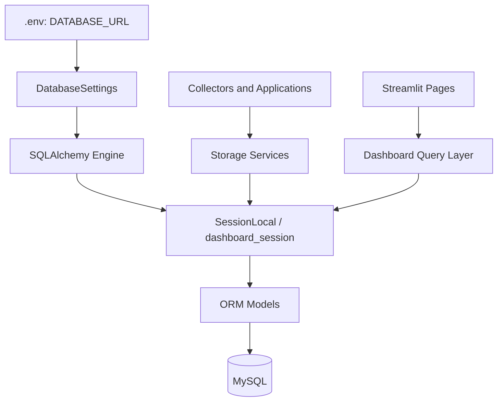
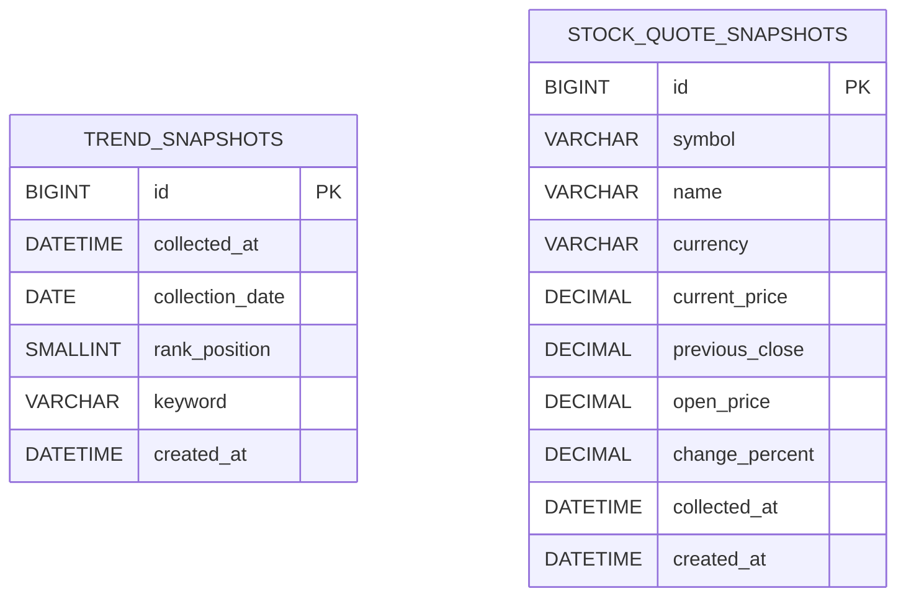
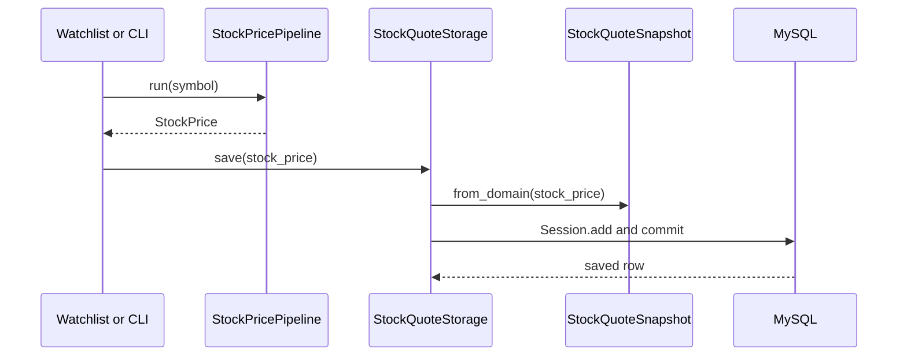
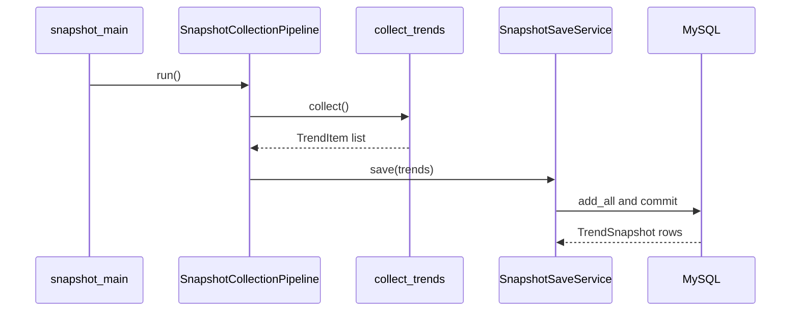
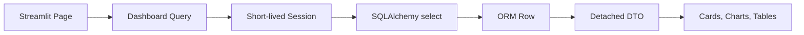

# Database Architecture

이 문서는 `automation-hub`의 실제 Database Layer를 읽는 학습 문서다. SQLAlchemy와
Alembic을 일반론으로만 설명하지 않고, 현재 Repository의 파일과 함수가 어떻게 연결되는지
따라간다. 비밀번호와 전체 `DATABASE_URL` 값은 문서에 기록하지 않는다.

## 현재 구조 한눈에 보기

현재 코드가 사용하는 운영 DBMS는 MySQL이다. 운영 연결 문자열은 `.env`의
`DATABASE_URL`을 `database/config.py`의 `DatabaseSettings`가 읽고, `database/engine.py`의
전역 `engine`과 `database/session.py`의 `SessionLocal`을 통해 사용한다. Dashboard는
`DASHBOARD_DATABASE_URL`을 우선하고 없으면 `DATABASE_URL`로 fallback한다.



현재 Repository에서 각 책임은 다음 위치에 있다.

| 책임 | 실제 위치 | 현재 역할 |
|---|---|---|
| 설정 | `database/config.py`, `automation_dashboard/config.py` | 환경변수에서 DB URL 선택 |
| Declarative Base | `database/base.py` | ORM metadata의 공통 기반 |
| Engine | `database/engine.py`, `automation_dashboard/session.py` | 연결과 Pool을 관리 |
| Session factory | `database/session.py` | 저장 Package가 사용할 `SessionLocal` 제공 |
| ORM Model | `database/models.py`, `google_finance/db_models.py` | 두 Snapshot 테이블의 Python 표현 |
| Namuwiki 저장 | `database/snapshot_save_service.py` | TrendSnapshot 묶음을 한 Transaction으로 저장 |
| Google Finance 저장 | `google_finance/storage.py` | StockQuoteSnapshot 저장과 최신 조회 |
| Dashboard 조회 | `automation_dashboard/queries/*.py` | ORM Row를 Dashboard DTO로 변환 |
| Migration | `alembic/env.py`, `alembic/versions/` | DB Schema 변경 이력 관리 |
| DB 통합 테스트 | `tests/database/` | 선택적 실제 MySQL 계약 검증 |

테스트의 기본 Query 검증은 `sqlite+pysqlite:///:memory:`를 사용한다. 실제 MySQL 통합
테스트는 `RUN_DB_INTEGRATION=1`일 때만 실행된다.

## Engine: 데이터베이스와 연결하는 출발점

### Engine이 필요한 이유

Application 코드가 매번 DB 주소를 해석하고 TCP 연결을 새로 만들면 연결 관리가 각 함수에
흩어진다. SQLAlchemy `Engine`은 DB URL과 Dialect를 알고, 필요할 때 Connection을 빌려주며,
사용이 끝난 Connection을 Pool로 돌려보내는 중심 객체다.

`database/engine.py`는 다음과 같이 `DatabaseSettings().database_url`을 사용해 Engine을
한 번 만든다.

```python
engine = create_engine(settings.database_url, pool_pre_ping=True)
```

`pool_pre_ping=True`는 Pool에서 꺼낸 연결이 아직 살아 있는지 확인해 오래된 연결을
사용하는 오류를 줄이는 설정이다. Pool의 크기나 재활용 시간은 이 Repository에서 별도로
지정하지 않으므로 SQLAlchemy Dialect의 기본값을 사용한다.

Dashboard는 저장 Package의 전역 Engine을 그대로 가져오지 않는다. `automation_dashboard/session.py`
의 `get_session_factory()`가 Dashboard 설정으로 Engine을 만들고 `lru_cache(maxsize=1)`로
factory를 재사용한다. 중요한 점은 Streamlit cache에 Session이나 ORM Row를 넣지 않는다는
것이다.

### DATABASE_URL의 흐름

```text
.env
  ↓
DatabaseSettings 또는 DashboardSettings
  ↓
create_engine(URL)
  ↓
SessionLocal 또는 dashboard_session()
```

문서와 로그에는 실제 URL, 비밀번호, 사용자 인증정보를 출력하지 않는다. 이 문서에서는
연결 문자열의 형식과 흐름만 다룬다.

## Declarative Base와 ORM Model

`database/base.py`의 `Base(DeclarativeBase)`는 SQLAlchemy가 Python class와 Table 정보를
모아두는 공통 기반이다. Model이 `Base`를 상속하면 SQLAlchemy의 `Base.metadata`에 Table,
Column, Constraint 정보가 등록된다.

`alembic/env.py`는 `database.models`와 `google_finance.db_models`를 import해 두 Model을
metadata에 등록한 뒤 `target_metadata = Base.metadata`로 Alembic에 전달한다. 따라서
Alembic이 Model을 발견하려면 migration 환경에서 Model module이 import되어야 한다.

ORM Model은 Domain Model과 같은 것이 아니다. 예를 들어
`google_finance.models.StockPrice`는 Application이 사용하는 Domain 계약이고,
`google_finance.db_models.StockQuoteSnapshot`은 DB Column과 저장 시각 표현을 가진
Persistence Model이다. `from_domain()`과 `to_domain()`이 두 표현 사이를 변환한다.

## 실제 ORM Model 목록

현재 Repository에서 `Base`를 상속하는 실제 ORM Model은 두 개다. 두 테이블 사이에 Foreign
Key나 ORM Relationship은 없다. 각 수집 결과가 독립적인 append-only Snapshot으로 저장된다.

### TrendSnapshot

| 항목 | 실제 계약 |
|---|---|
| Class / Table | `TrendSnapshot` / `trend_snapshots` |
| 목적 | 한 Namuwiki 수집 시점의 순위 항목 저장 |
| Primary Key | `id BIGINT`, auto increment |
| `collected_at` | `DATETIME`, NOT NULL, aware UTC를 naive UTC로 저장 |
| `collection_date` | `DATE`, NOT NULL, UTC 시각을 KST 날짜로 계산 |
| `rank_position` | `SMALLINT`, NOT NULL, 1~10 Check |
| `keyword` | `VARCHAR(255)`, NOT NULL, trim 후 빈 문자열 금지 |
| `created_at` | `DATETIME`, NOT NULL, 저장 생성 시각 |
| Default | DB default 없음. Python 생성자가 `created_at`을 계산 |
| Index | `(collection_date, keyword)` |
| Unique | `(collected_at, rank_position)` |
| Foreign Key / Relationship | 없음 |
| 생성 위치 | `database/snapshot_save_service.py:SnapshotSaveService.save()` |
| 조회 위치 | `database/daily_trend_query.py`, `automation_dashboard/queries/namuwiki.py` |

`TrendSnapshot.__init__()`은 입력 시각이 timezone-aware인지 확인하고 UTC로 바꾼다. 같은
수집 시각의 순위 항목은 `collected_at`과 `rank_position` 조합으로 중복을 막는다.

### StockQuoteSnapshot

| 항목 | 실제 계약 |
|---|---|
| Class / Table | `StockQuoteSnapshot` / `stock_quote_snapshots` |
| 목적 | 한 symbol의 Google Finance 가격 Snapshot 저장 |
| Primary Key | `id BIGINT`, auto increment |
| `symbol` | `VARCHAR(64)`, NOT NULL, trim 후 빈 문자열 금지 |
| `name` | `VARCHAR(255)`, NOT NULL, trim 후 빈 문자열 금지 |
| `currency` | `VARCHAR(3)`, NOT NULL, 길이 3 Check |
| `current_price` | `NUMERIC(24,8)`, NOT NULL |
| `previous_close` | `NUMERIC(24,8)`, NOT NULL |
| `open_price` | `NUMERIC(24,8)`, NOT NULL |
| `change_percent` | `NUMERIC(12,8)`, NOT NULL |
| `collected_at` | `DATETIME`, NOT NULL, UTC naive 저장 |
| `created_at` | `DATETIME`, NOT NULL, UTC naive 저장 |
| Default | DB default 없음. `from_domain()`이 생성 시각을 계산 |
| Index | `(symbol, collected_at)` |
| Unique | 별도 Unique Constraint 없음 |
| Foreign Key / Relationship | 없음 |
| 생성 위치 | `google_finance/storage.py:StockQuoteStorage.save()` |
| 조회 위치 | `google_finance/storage.py`, `automation_dashboard/queries/google_finance.py` |

`StockQuoteSnapshot.from_domain()`은 Symbol을 canonical form으로 만들고 Decimal scale을
검증한다. DB 행을 다시 Application에서 사용할 때는 `to_domain()`이 `StockPrice`로
변환한다.

## ERD

실제 Foreign Key 관계가 없으므로 관계선을 만들지 않았다.



## Session: 작업 단위와 Transaction

### Session은 무엇인가

`Session`은 SQLAlchemy ORM 작업을 모아두는 짧은 작업 공간이다. 일반적으로 다음 역할을
한다.

- `add()`로 새 ORM 객체를 작업 목록에 등록
- `flush()`로 필요한 SQL을 DB에 보내지만 Transaction은 유지
- `commit()`으로 Transaction을 확정
- `rollback()`으로 현재 Transaction의 변경을 취소
- `refresh()`로 DB의 최신 값을 다시 읽음
- `close()`로 Session이 가진 DB 자원을 정리

Session은 Connection 자체가 아니며 전역 공유 객체로 사용하면 안 된다. 이 Repository의
저장 코드는 `SessionLocal.begin()` 또는 `SessionLocal()` context manager로 Session 수명을
제한한다.

### Unit of Work와 Identity Map

Unit of Work는 하나의 업무 작업에서 바뀐 객체를 모아 한 번에 확정하는 관점이다.
`SnapshotSaveService.save()`는 여러 `TrendSnapshot`을 `add_all()`한 뒤 하나의
`SessionLocal.begin()` 안에서 저장하므로 한 수집 묶음이 하나의 Transaction 경계를 갖는다.

Identity Map은 같은 Session 안에서 같은 DB 행을 조회할 때 SQLAlchemy가 같은 ORM identity를
관리하는 기능이다. 현재 Application이 이 기능을 직접 의존하는 코드는 없지만, Session이
ORM 객체의 작업 단위라는 이유 중 하나다.

### add, flush, commit, rollback, close

| 동작 | 의미 | 현재 코드 |
|---|---|---|
| `add()` | ORM 객체 하나를 Session 작업 목록에 등록 | `StockQuoteStorage.save()` |
| `add_all()` | 여러 ORM 객체를 등록 | `SnapshotSaveService.save()` |
| `flush()` | SQL을 DB로 보내고 오류를 조기에 확인. 아직 확정 아님 | `tests/database/test_integration.py`에서 중복 오류 확인 |
| `commit()` | 현재 Transaction을 영구 반영 | 저장 context manager가 정상 종료될 때 수행 |
| `rollback()` | 현재 Transaction을 취소 | 통합 테스트가 IntegrityError 후 명시적으로 수행 |
| `refresh()` | DB 값을 다시 읽어 ORM 객체를 갱신 | 현재 Production 코드에서는 직접 사용하지 않음 |
| `close()` | Session과 연결 자원 정리 | `with SessionLocal()`, `dashboard_session()`이 담당 |

`with SessionLocal.begin() as session:`은 정상 종료 시 commit하고 예외가 발생하면 rollback한
뒤 Session을 닫는다. 그래서 저장 서비스가 직접 `try/except`로 commit과 rollback을 반복하지
않아도 된다.

### 현재 코드의 예외 처리

- Namuwiki Snapshot 저장: `SnapshotSaveService.save()`의 Transaction context가 예외를
  rollback하고 예외를 호출자에게 전파한다.
- Google Finance 저장: `StockQuoteStorage.save()`도 같은 `begin()` 패턴을 사용한다.
- Dashboard 조회: `dashboard_session()`은 SQLAlchemy 예외를 `DashboardDatabaseError`로
  바꾸고 Session context를 종료한다. Dashboard는 쓰기를 수행하지 않으므로 rollback을
  별도로 호출하지 않는다.
- Integration test: 중복을 일부러 `flush()`로 확인한 뒤 `session.rollback()`을 호출한다.

현재 코드에는 여러 Package를 묶는 별도 Unit of Work 추상화는 없다. 저장 서비스 하나의
Transaction 경계가 현재 규모에 맞는 범위다.

## 저장 흐름

### Google Finance

`google_finance/watchlist_main.py`의 `_run_collect()` 또는 `google_finance/main.py`의
`--save-db` 경로가 `StockPricePipeline`으로 `StockPrice`를 만든다. 그 다음
`StockQuoteStorage.save()`가 `StockQuoteSnapshot.from_domain()`으로 ORM 행을 만들고,
`SessionLocal.begin()` 안에서 `session.add(row)`를 수행한다. context가 정상 종료되면
SQLAlchemy가 flush 후 commit하여 MySQL에 append한다.



이 흐름에서 Collector는 DB를 직접 알지 않고, Storage가 Domain Model과 Persistence Model의
변환 및 Transaction을 담당한다.

### Namuwiki Snapshot

`namuwiki_trend/snapshot_main.py`의 `build_snapshot_pipeline()`이
`SnapshotCollectionPipeline`과 `SnapshotSaveService`를 조립한다. Pipeline은
`collect_trends()` 결과를 `SnapshotSaveService.save()`에 넘긴다. Save service는 모든
`TrendItem`에 동일한 `collected_at`을 부여해 `TrendSnapshot` 목록을 만들고 `add_all()`한
뒤 하나의 Transaction으로 commit한다.



Enrichment 결과인 `TrendInsight`는 DB Snapshot과 별개다. `namuwiki_trend/main.py`의
enrichment 경로는 `JsonTrendInsightStorage`를 사용해 `output/trend_insights.json`에
저장하며, 이 문서의 MySQL 모델에는 포함되지 않는다.

## Dashboard 조회 흐름

Dashboard는 저장이나 Provider 호출을 하지 않는다. 각 페이지의 `@st.cache_data(ttl=60)`
함수는 `dashboard_session()`으로 짧은 Session을 열고 Query를 실행한 뒤, Session 밖으로
DTO만 반환한다.



### Google Finance Dashboard

`automation_dashboard/pages/1_google_finance.py`는 다음 Query를 사용한다.

- `list_latest_quotes()`는 symbol별 최신 `StockQuoteSnapshot`을 `LatestQuoteRow`로 변환
- `load_price_history()`는 `PricePoint` 목록을 오래된 순서로 반환
- `load_latest_delta()`는 최신 두 행을 `SnapshotDelta`로 변환

페이지는 ORM 객체를 직접 표시하지 않고 가격·시각을 포맷한 DataFrame과 Chart를 만든다.

### Namuwiki Dashboard

`automation_dashboard/pages/2_namuwiki.py`는 다음 Query를 사용한다.

- `list_latest_snapshot()` → `LatestTrendRow`
- `list_keyword_history()` → `TrendHistoryPoint`
- `list_keyword_statistics()` → `KeywordSummary`
- `load_snapshot_summary()` → `SnapshotSummary`

Query는 KST 변환과 정렬을 수행하고, 페이지는 그 결과를 Table과 Plotly Chart에 전달한다.

### Operations Dashboard

`automation_dashboard/pages/3_operations.py`는 `automation_dashboard/queries/operations.py`
의 Query를 사용한다.

- `load_database_summary()`는 `select(1)`과 가능한 DB 크기를 조회
- `load_snapshot_summary()`는 두 Snapshot 테이블의 Count와 최신 저장 정보를 조회
- `load_alembic_status()`는 local Script head와 `alembic_version`을 비교
- `load_log_summary()`와 `load_runtime_info()`는 DB 밖의 read-only metadata를 반환

### 왜 ORM 객체를 UI에 노출하지 않는가

ORM 객체는 Session과 연결된 상태, Lazy Loading, DB Column 표현을 포함할 수 있다. UI가
ORM에 직접 결합하면 Query 변경이 화면 변경으로 번지고 Session 수명도 길어질 위험이 있다.
DTO는 화면에 필요한 필드와 정렬·시간 변환 계약만 전달한다.

### 왜 Session과 Engine을 Streamlit cache에 넣지 않는가

Session과 Engine은 연결·Transaction·파일 descriptor 같은 runtime 자원을 가진다. 이를
화면 데이터와 같은 방식으로 cache하면 오래된 연결이나 다른 rerun과 공유되는 Session이
생길 수 있다. 현재 구현은 Engine factory만 `lru_cache`하고, Session은 context 안에서
생성·종료하며, `st.cache_data`에는 detached DTO만 저장한다.

운영 환경에서는 Dashboard URL에 쓰기 권한이 없는 DB 계정을 사용하는 것이 바람직하다.
현재 Repository는 read-only 계정을 코드로 강제하지 않으므로 운영 설정의 책임으로 남아
있다.

## Repository Pattern 판단

현재 Repository에는 모든 DB 작업을 감싸는 명시적인 `Repository` Protocol이나 공통
Repository interface는 없다.

다만 역할별 구현은 존재한다.

- `google_finance/storage.py:StockQuoteStorage`는 Google Finance Snapshot 저장과 최신
  조회를 감싸는 Package-specific Storage다.
- `database/snapshot_save_service.py:SnapshotSaveService`는 Namuwiki Snapshot 저장
  Transaction을 담당하는 Storage Service다.
- Dashboard는 `automation_dashboard/queries/`에서 직접 SQLAlchemy `select()`를 작성한다.

따라서 현재 결론은 **Package 저장에는 구체적인 Storage가 있고, Dashboard 조회에는 Query
Layer가 있지만, 범용 Repository Pattern을 통일해서 적용한 구조는 아니다**이다.

| 방식 | 장점 | 단점 | 현재 판단 |
|---|---|---|---|
| Application에서 직접 Session 사용 | 가장 단순함 | DB 결합과 Transaction 경계가 Application에 퍼짐 | 일부 Query에서 사용 |
| Repository 사용 | 테스트와 저장소 교체가 쉬움 | interface와 mapping 비용이 생김 | 범용 interface는 없음 |
| Storage Service 사용 | 저장 책임과 Transaction이 명확함 | Repository와 경계가 겹칠 수 있음 | 현재 저장 흐름에 적용 |

현재 규모에서는 모든 Query를 Generic Repository로 감싸는 것보다, 이미 있는 Storage와
Dashboard Query의 책임을 명확히 유지하는 편이 단순하다.

## Alembic 구조

### 구성

- `alembic.ini`: migration script 위치와 기본 logging 설정. URL 값은 비워 두고 runtime에
  `env.py`가 설정한다.
- `alembic/env.py`: `DatabaseSettings`에서 URL을 읽고 ORM module들을 import한 뒤
  `Base.metadata`를 `target_metadata`로 지정한다.
- `alembic/versions/`: revision별 `upgrade()`와 `downgrade()`를 보관한다.
- `alembic_version`: 적용된 revision을 DB에 기록하는 Alembic 관리 테이블이다.

### Migration 목록

| Revision ID | Parent | 목적 | Table / 주요 변경 | Head |
|---|---|---|---|---|
| `0001_initial_empty` | 없음 | 초기 migration 기준점 | 없음 | 아니오 |
| `0002_create_trend_snapshots` | `0001_initial_empty` | Namuwiki Snapshot 저장 | `trend_snapshots`, Check·Unique·Index | 아니오 |
| `0003_stock_quote_snapshots` | `0002_create_trend_snapshots` | Google Finance Snapshot 저장 | `stock_quote_snapshots`, Check·Index | 아니오 |
| `0004_bus_monitor_snapshots` | `0003_stock_quote_snapshots` | Bus Monitor Snapshot 저장 | target·route·lane·realtime tables, Check·FK·Index | 예 |

코드의 `0004_create_bus_monitor_snapshots_tables.py`에서 revision 값은
`0004_bus_monitor_snapshots`이며, `0003_stock_quote_snapshots`를 parent로 가진다. 따라서
현재 Repository의 migration head는 `0004_bus_monitor_snapshots`다. 실제 DB 적용 상태는
`alembic_version`의 값과 `automation_dashboard/queries/operations.py`의
`load_alembic_status()` 비교 결과로 확인한다.

### ORM 변경과 Migration은 다르다

ORM class에 Column을 하나 추가한다고 이미 생성된 DB Table이 자동으로 바뀌지는 않는다.
Application은 수정된 Python class를 보지만, 실행 중인 MySQL은 기존 Table을 계속 가진다.

안전한 변경 순서는 다음과 같다.

```text
ORM Model 수정
  ↓
alembic revision --autogenerate -m "..."
  ↓
생성 Script 검토 및 수정
  ↓
alembic upgrade head
  ↓
DB Schema 확인
  ↓
호환 가능한 Application 배포
```

Autogenerate는 Model metadata와 연결된 DB Schema의 차이를 제안할 뿐이다. 데이터 이동,
이름 변경 의도, 대용량 Table 영향, DB별 SQL 차이를 완전히 판단하지 못하므로 생성된
Script를 사람이 검토해야 한다.

### 운영 Migration 절차

현재 Repository의 Python 환경에서 Alembic 명령을 실행할 때는 활성화된 `.venv` 또는
`.venv/bin/alembic`을 사용한다.

```bash
.venv/bin/alembic current
.venv/bin/alembic heads
.venv/bin/alembic history
.venv/bin/alembic revision --autogenerate -m "describe schema change"
.venv/bin/alembic upgrade head
.venv/bin/alembic downgrade -1
```

Production 적용 전 확인할 항목:

- DB Backup 또는 복구 가능성
- `alembic current`와 `alembic heads`의 차이
- Pending migration의 SQL과 데이터 영향
- Downgrade가 실제로 가능한지
- 대용량 변경과 Table Lock 위험
- 새 Schema와 기존 Application의 호환성
- 적용 후 `alembic_version`과 주요 Table·Index 확인

## Index와 Constraint

현재 실제로 정의된 항목은 다음과 같다.

| Table | Index / Constraint | 목적 |
|---|---|---|
| `trend_snapshots` | PK `id` | 행 식별 |
| `trend_snapshots` | Unique `(collected_at, rank_position)` | 한 수집 시점의 같은 순위 중복 방지 |
| `trend_snapshots` | Check `rank_position BETWEEN 1 AND 10` | Top 10 범위 보장 |
| `trend_snapshots` | Check `CHAR_LENGTH(TRIM(keyword)) > 0` | 빈 Keyword 방지 |
| `trend_snapshots` | Index `(collection_date, keyword)` | 날짜별 Keyword 집계와 조회 지원 |
| `stock_quote_snapshots` | PK `id` | 행 식별 |
| `stock_quote_snapshots` | Check `TRIM(symbol)` nonempty | 빈 Symbol 방지 |
| `stock_quote_snapshots` | Check `TRIM(name)` nonempty | 빈 Instrument name 방지 |
| `stock_quote_snapshots` | Check `LENGTH(currency) = 3` | 통화 코드 길이 보장 |
| `stock_quote_snapshots` | Index `(symbol, collected_at)` | Symbol별 최신·이력 조회 지원 |

두 Table 모두 Foreign Key와 Unique Symbol 제약은 없다. Google Finance의 같은 시각
Snapshot 중복은 `id` tie-break로 조회 순서를 결정하며, Table 차원의 중복 방지 Constraint는
현재 정의되어 있지 않다.

현재 조회 패턴과 Index의 관계는 대체로 명확하다. Namuwiki는 `collection_date`와
`keyword`를 자주 사용하고, Google Finance는 `symbol`과 `collected_at`을 기준으로 최신
행과 이력을 찾는다. 추가 Index는 실제 Query profile과 데이터 규모를 확인한 뒤 검토해야
하며, 현재 문서에서는 구현되지 않은 Index를 권장하지 않는다.

## DB 테스트 구조

| 테스트 범위 | 실제 DB | Isolation / Cleanup | 검증 계약 |
|---|---|---|---|
| `tests/database/test_models.py` | 없음 | ORM 객체만 생성 | Rank, Keyword, KST 날짜, timezone validation |
| `tests/database/test_snapshot_save_service.py` | Fake Session | Fake Transaction이 commit/rollback 기록 | 전체 Snapshot 묶음 저장과 rollback |
| `tests/database/test_integration.py` | MySQL | `RUN_DB_INTEGRATION=1`일 때만 실행. 중복 테스트 후 rollback 또는 delete | Migration Table, Index, Unique, Daily query |
| `tests/database/test_google_finance_integration.py` | MySQL | 테스트 Symbol을 사용하고 마지막에 delete | Schema, append 저장, 최신 2개, tie-break, MovementUnavailable |
| `tests/automation_dashboard/test_google_finance_queries.py` | SQLite memory | Test fixture별 Engine·Session 생성 후 dispose | 최신 정렬, History, Delta, UTC→KST |
| `tests/automation_dashboard/test_namuwiki_queries.py` | SQLite memory | Test fixture별 Table 생성 후 Session 종료 | Top 10, History, 통계, Snapshot summary |
| `tests/automation_dashboard/test_operations_queries.py` | SQLite memory | 임시 Table 생성 | DB status, Count, Alembic 비교, 로그 metadata |
| `tests/database/test_dashboard_*_integration.py` | MySQL 또는 skip | `RUN_DB_INTEGRATION=1`, Dashboard Query는 읽기만 수행 | 실제 migrated schema와 Dashboard Query 계약 |

기본 자동화 테스트는 외부 MySQL 없이 SQLite memory 또는 Fake로 실행된다. 실제 MySQL을
검증하는 테스트는 skip 조건이 있으며, 기존 데이터를 남기지 않도록 테스트 전용 Symbol이나
시간을 사용하고 cleanup을 수행한다.

## 현재 구조의 장점

현재 코드에서 실제로 확인되는 장점은 다음과 같다.

1. **저장과 Dashboard 조회가 분리되어 있다.** 저장은 `StockQuoteStorage`와
   `SnapshotSaveService`, 조회는 `automation_dashboard/queries/`가 담당한다.
2. **Persistence Model과 Domain Model이 분리되어 있다.** Google Finance는
   `StockQuoteSnapshot.from_domain()`과 `to_domain()`을 명시적으로 제공한다.
3. **Schema 변경이 Alembic 이력으로 관리된다.** 두 Snapshot Table이 migration revision으로
   생성되고 downgrade도 정의되어 있다.
4. **Dashboard는 read-only 흐름이다.** Query와 Operations metadata 조회는 DB를 변경하지
   않으며, 짧은 Session과 detached DTO를 사용한다.
5. **시간 표현이 명시적이다.** DB에는 naive UTC를 저장하고 Query와 Model이 KST 변환을
   명시적으로 수행한다.
6. **Snapshot은 append-only 성격이다.** 수집 결과를 기존 행을 수정하지 않고 새 행으로
   저장한다.
7. **DB 경계가 테스트된다.** SQLite memory, Fake Transaction, 선택적 MySQL integration이
   서로 다른 위험을 나누어 검증한다.

## 개선 가능성

### 지금 바로 필요한 것

현재 확인되는 운영 위험은 Dashboard의 read-only 권한이 코드가 아니라 DB 계정 설정에
의존한다는 점이다. Production Dashboard에는 명시적인 MySQL read-only 계정을 사용하고,
쓰기 계정과 Credential을 분리하는 것이 우선이다. 실제 권한 설정은 Repository 밖의
운영 작업이므로 이번 문서에서는 원칙만 기록한다.

또한 Migration 적용 전 Backup, 현재 revision, pending SQL 검토를 운영 체크리스트로
강제하는 것이 필요하다. 이는 이미 존재하는 Alembic 절차를 안전하게 사용하는 문제다.

### 규모가 커지면 필요한 것

- 실제 Connection 사용량에 근거한 Pool size와 `pool_recycle` 조정
- 여러 Package가 같은 저장 계약을 공유하게 될 때의 명시적 Repository Interface
- 여러 Host가 Dashboard를 읽을 때의 DB 권한·Connection 관리
- 읽기 부하가 커질 때 Read Replica
- Migration을 배포 단계에서 자동 검증하는 절차
- 실행 상태와 저장 결과를 추적할 `job_runs` 같은 운영 모델

이 항목들은 현재 구현된 기능이 아니며, 데이터량과 운영 요구가 확인될 때 검토한다.

### 현재는 불필요한 것

현재 규모와 실제 반복을 고려하면 다음을 지금 추가할 근거는 없다.

- 복잡한 Unit of Work 추상화
- 모든 Model을 감싸는 Generic Repository
- Event Sourcing
- CQRS
- DB Sharding

일반적인 패턴을 도입하는 것보다 현재 Storage와 Query 경계를 명확하게 유지하는 것이
낮은 복잡도와 빠른 검증에 유리하다.

## 학습 요약

### Engine은 무엇인가

DB URL과 Dialect를 바탕으로 Connection을 만들고 Pool을 관리하는 SQLAlchemy의 중심
객체다. 현재 `database/engine.py`와 Dashboard의 `get_session_factory()`가 Engine을 만든다.

### Session은 무엇인가

ORM 객체와 Transaction을 짧은 작업 단위로 관리하는 객체다. 현재 저장은 `begin()` context,
Dashboard는 `dashboard_session()` context를 사용한다.

### ORM은 무엇인가

Python class와 DB Table·Column을 매핑해 SQL 작업을 객체와 SQLAlchemy 표현으로 다루게 하는
기술이다. 실제 Model은 `TrendSnapshot`과 `StockQuoteSnapshot`이다.

### flush와 commit의 차이는 무엇인가

`flush()`는 SQL을 DB에 보내 오류와 생성된 값 확인을 가능하게 하지만 Transaction을
확정하지 않는다. `commit()`은 현재 Transaction을 영구 반영한다.

### rollback은 왜 필요한가

저장 중 오류가 나면 아직 확정하지 않은 변경을 취소해 부분 저장을 막는다. 현재 `begin()`
context와 통합 테스트가 이 경계를 사용한다.

### Alembic은 왜 필요한가

ORM Model 변경과 실제 DB Schema 변경을 시간순 revision으로 관리하고, 어느 revision까지
적용되었는지 추적하기 위해 필요하다.

### ORM Model과 DB Schema는 왜 다른가

ORM은 Application이 기대하는 Python-side mapping이고, DB Schema는 실제 MySQL의 Table,
Column, Index, Constraint다. ORM class를 바꾸어도 DB Table은 자동으로 바뀌지 않는다.

### Migration은 언제 만드는가

저장 Table, Column, Index, Constraint처럼 영속적인 Schema를 변경할 때 만든다. Script를
생성한 뒤 SQL과 데이터 영향, 호환성을 검토하고 적용한다.

### Dashboard는 DB를 어떻게 읽는가

Streamlit Page가 Query를 호출하고, Query가 짧은 Session에서 `select()`를 실행한다. ORM
Row는 DTO로 변환되고, DTO만 UI와 `st.cache_data(ttl=60)` 경계를 넘는다.

### 이 프로젝트 DB 계층의 핵심 설계는 무엇인가

두 Package의 append-only Snapshot을 SQLAlchemy Model과 Alembic Schema로 관리하고,
저장 흐름과 Dashboard read-only Query 흐름을 분리한 점이다. 현재 규모에 필요한 단순한
Storage Service와 명시적 DTO를 유지하면서, 범용 추상화는 실제 필요가 생길 때만 추가한다.

## Related Documents

- Repository 전체 구조: `docs/architecture.md`
- Google Finance 설계: `docs/packages/google_finance/architecture.md`
- Namuwiki 설계: `docs/packages/namuwiki_trend/architecture.md`
- 운영 문서: `docs/operations/README.md`
- 테스트 경계 학습: `docs/handbook/08-defining-test-boundaries.md`
