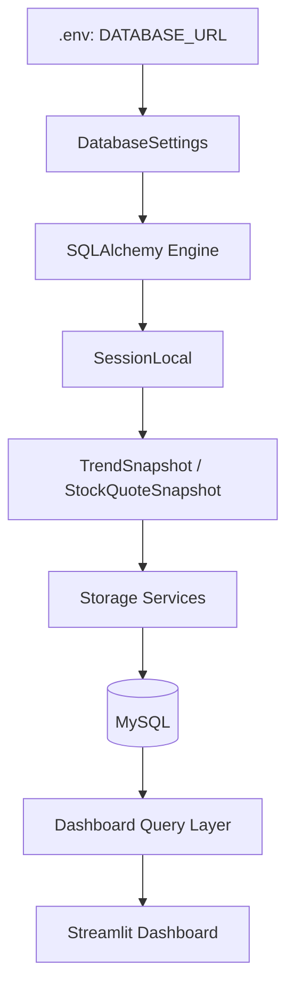
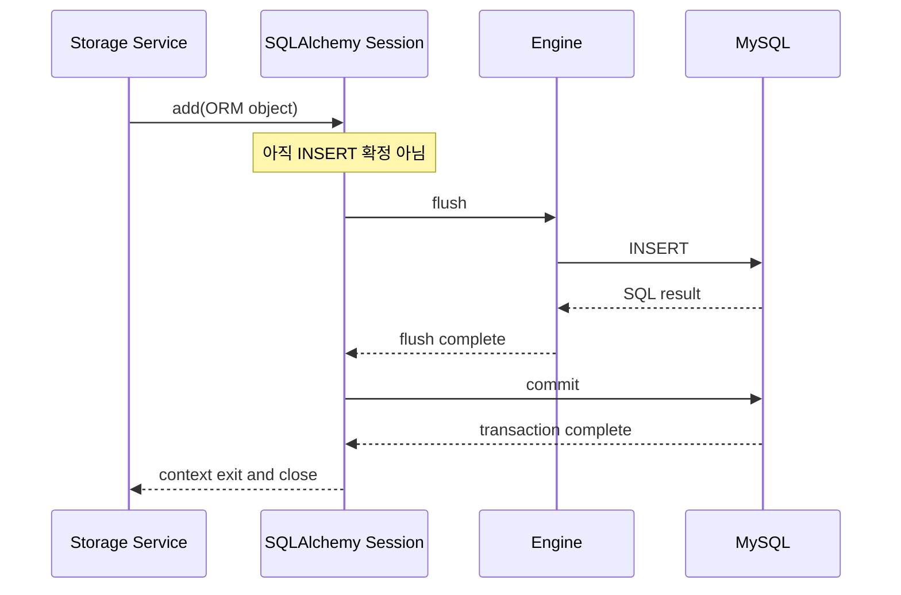
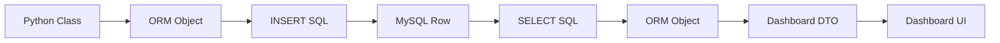

# SQLAlchemy ORM과 Alembic 따라가기

이 문서는 `automation-hub`의 Database 코드를 직접 따라가며 SQLAlchemy ORM, Session,
Transaction, Query, Engine, Alembic을 배우는 교재다. 일반 이론을 먼저 외우기보다
`database/`, `google_finance/`, `namuwiki_trend/`, `automation_dashboard/`에서 실제로
어떤 객체가 만들어지고 언제 SQL이 실행되는지 확인한다.

문서의 SQL은 SQLAlchemy가 만드는 **구조를 이해하기 위한 예상 SQL**이다. 실제 실행에서는
값이 bound parameter로 전달되며, DBMS Dialect에 따라 세부 문법이 달라질 수 있다.

## 1. 이 프로젝트에서 DB는 어디서 시작되는가

먼저 `DATABASE_URL`을 누가 읽는지 찾는다.

1. `database/config.py`의 `DatabaseSettings`가 Repository root의 `.env`에서
   `database_url`을 읽는다.
2. `database/engine.py`가 `create_engine(settings.database_url, pool_pre_ping=True)`로
   Engine을 만든다.
3. `database/session.py`의 `SessionLocal`이 그 Engine에 연결된 Session factory가 된다.
4. `database/models.py`와 `google_finance/db_models.py`의 ORM Model이 `Base.metadata`에
   Table 정보를 등록한다.
5. `SnapshotSaveService`와 `StockQuoteStorage`가 ORM 객체를 저장한다.
6. Engine이 MySQL Connection을 사용해 SQL을 실행한다.
7. Dashboard는 별도 `DashboardSettings`와 짧은 Session으로 같은 저장 데이터를 읽는다.



Dashboard의 실제 흐름은 저장 흐름과 반대 방향이다.

```text
Streamlit Page
  → automation_dashboard/queries/*.py
  → dashboard_session()
  → SQLAlchemy select()
  → DTO
  → Card, Chart, Table
```

`automation_dashboard/session.py`는 저장 Package의 `SessionLocal`을 재사용하지 않고
Dashboard용 Session factory를 만든다. `DASHBOARD_DATABASE_URL`이 있으면 그것을 우선하고,
없으면 `DATABASE_URL`을 사용한다.

## 2. Engine

### database/engine.py 따라가기

실제 코드는 다음과 같은 순서로 읽을 수 있다.

```python
settings = DatabaseSettings()
engine = create_engine(
    settings.database_url,
    pool_pre_ping=True,
)
```

Engine은 Python 객체 하나가 곧 DB Connection 하나라는 뜻이 아니다. Engine은 다음 정보를
가지고 있는 SQLAlchemy의 DB 진입점이다.

- 어떤 DBMS와 연결할지 결정하는 URL과 Dialect
- Connection을 빌리고 반환하는 Pool
- ORM이 만든 SQL을 실제 DB Driver로 전달하는 방법

### Connection Pool은 무엇인가

Connection Pool은 이미 만들어진 DB Connection을 보관했다가 다음 작업에 재사용하는
대기열이다. 매번 TCP 연결과 인증을 새로 하지 않으므로 짧은 작업이 반복되는 서버에서
효율적이다.

이 프로젝트의 `database/engine.py`는 Pool 크기나 재활용 시간을 직접 지정하지 않는다.
SQLAlchemy와 MySQL Dialect의 기본 Pool 정책을 사용하며, `pool_pre_ping=True`로 빌려오기
전에 Connection 생존 여부를 확인한다.

Dashboard의 `automation_dashboard/session.py`는 `get_session_factory()`에
`@lru_cache(maxsize=1)`를 사용한다. 즉 Dashboard Process 안에서 Engine factory를
재사용하지만, 각각의 Session을 전역으로 공유하지는 않는다.

### 왜 Engine을 하나만 만드는가

한 Process가 같은 DB 설정으로 작업한다면 함수마다 Engine을 새로 만들 필요가 없다.
Engine마다 별도의 Pool이 생기므로 무분별하게 만들면 Connection 수가 불필요하게 증가할
수 있다.

현재 구조에서는 다음 두 경계가 있다.

| 경계 | Engine 생성 방식 | 사용 목적 |
|---|---|---|
| 저장 Package | `database/engine.py`의 module-level Engine | `SessionLocal`을 통한 저장·조회 |
| Dashboard | `get_session_factory()`의 cached factory | Dashboard 전용 read-only 조회 |

두 Engine은 같은 Engine을 공유한다는 뜻이 아니라, 각각의 사용 경계에서 반복 생성을
막는다는 뜻이다.

### Engine은 언제 SQL을 실행하는가

Engine 객체를 만드는 순간 모든 Query가 실행되는 것은 아니다. 일반적인 흐름은 다음과
같다.

```text
create_engine()
  → Engine과 Pool 준비
Session 생성
  → 작업 공간 준비
select() 또는 add()
  → SQL 표현 또는 ORM 객체를 Session에 등록
flush / execute
  → Engine이 Connection을 빌리고 SQL 실행
commit
  → DB Transaction 확정
```

예를 들어 `StockQuoteStorage.save()`에서 `session.add(row)`를 호출하는 순간보다,
Transaction context가 flush하는 시점에 INSERT가 DB로 전송된다.

## 3. Session

### `with SessionLocal.begin()` 읽기

Namuwiki 저장 코드는 `database/snapshot_save_service.py`에 있다.

```python
with self._session_factory.begin() as session:
    session.add_all(snapshots)
```

이 두 줄을 단계별로 읽으면 다음과 같다.

| 코드 | 의미 |
|---|---|
| `self._session_factory` | `SessionLocal`처럼 Session을 생성하는 factory |
| `.begin()` | Session과 Transaction을 context manager로 시작 |
| `as session` | context 안에서 사용할 Session 객체 |
| `session.add_all(snapshots)` | ORM 객체들을 현재 Unit of Work에 등록 |
| context 정상 종료 | 필요한 flush 후 commit |
| context 안에서 예외 발생 | rollback 후 예외를 호출자에게 전달 |
| context 종료 | Session과 Connection 자원 정리 |

Google Finance의 `StockQuoteStorage.save()`도 같은 모양이다.

```python
with self._session_factory.begin() as session:
    session.add(row)
```

### add부터 close까지



#### `add()`

`session.add(snapshot)`은 Python ORM 객체를 Session의 작업 목록에 추가한다. 이것은
즉시 영구 저장을 뜻하지 않는다. SQLAlchemy는 Flush가 필요할 때 객체의 상태를 보고
INSERT SQL을 만든다.

#### `flush()`

Flush는 현재 Transaction 안에서 필요한 SQL을 DB로 보낸다. DB가 Unique Constraint나
Check Constraint를 위반하면 이 단계에서 오류가 발생할 수 있다. 하지만 Flush만으로는
다른 Transaction에서 영구적으로 보이는 상태가 되었다고 볼 수 없다.

`tests/database/test_integration.py`는 중복 `TrendSnapshot`을 두 번 추가한 뒤
`session.flush()`를 호출해 `IntegrityError`를 확인한다.

#### `commit()`

Commit은 현재 Transaction을 확정한다. `SnapshotSaveService.save()`와
`StockQuoteStorage.save()`는 `SessionLocal.begin()`이 정상 종료될 때 이 과정을 맡긴다.
따라서 저장 함수에는 직접 `session.commit()`이 보이지 않지만, 저장이 확정되는 경계는
분명히 존재한다.

#### `rollback()`

Flush 또는 다른 DB 작업이 실패하면 현재 Transaction을 되돌린다. 같은 Transaction 안에서
여러 Row를 저장하던 중 실패했을 때 일부만 확정되지 않도록 하는 장치다.

#### `close()`

Close는 Session과 연결 자원을 정리한다. 현재 코드는 `with SessionLocal()` 또는
`with SessionLocal.begin()`을 사용하므로 수동 `close()` 호출을 놓칠 위험을 줄인다.

## 4. ORM

### TrendSnapshot: Python Class에서 Table로

`database/models.py`의 `TrendSnapshot`은 `Base`를 상속하는 ORM Model이다.

```python
class TrendSnapshot(Base):
    __tablename__ = "trend_snapshots"
    id: Mapped[int] = mapped_column(BigInteger, primary_key=True)
    rank_position: Mapped[int] = mapped_column(SmallInteger, nullable=False)
    keyword: Mapped[str] = mapped_column(String(255), nullable=False)
```

Python class의 Attribute와 DB Column은 다음처럼 대응한다.

| Python | DB |
|---|---|
| `TrendSnapshot` | `trend_snapshots` Table |
| `id` | `id BIGINT PRIMARY KEY` |
| `rank_position` | `rank_position SMALLINT NOT NULL` |
| `keyword` | `keyword VARCHAR(255) NOT NULL` |
| `collected_at` | `collected_at DATETIME NOT NULL` |
| `collection_date` | `collection_date DATE NOT NULL` |

Model 생성자는 aware UTC 시각을 받아 DB에 저장할 naive UTC 시각으로 바꾸고, 같은 시각의
KST 날짜를 `collection_date`에 계산한다. 이 값은 Dashboard의 날짜별 집계에 사용된다.

### StockQuoteSnapshot: Persistence Model

`google_finance/db_models.py`의 `StockQuoteSnapshot`은 `StockPrice` Domain Model을
저장하기 위한 ORM Model이다.

```python
row = StockQuoteSnapshot.from_domain(stock_price)
```

`from_domain()`은 다음을 처리한다.

- Symbol canonicalization
- Currency 길이 검증
- Decimal scale 검증
- aware UTC를 DB용 naive UTC로 변환
- `created_at` 생성

조회 뒤 `to_domain()`은 DB 행을 다시 `StockPrice`로 바꾼다.

### 전체 ORM 흐름



Dashboard Query는 ORM 객체를 그대로 화면에 넘기지 않는다. 예를 들어
`list_latest_quotes()`는 SQL 결과를 `LatestQuoteRow`로 만들고,
`list_latest_snapshot()`은 `LatestTrendRow`로 변환한다. 이 DTO가 화면에 필요한 필드와
시간·정렬 규칙을 고정한다.

## 5. 실제 SQL

SQLAlchemy는 값 자체를 문자열로 붙이지 않고 bound parameter로 전달한다. 아래 SQL은
개념을 설명하기 위해 `:value` 형태로 표시한다.

### `session.add(snapshot)`의 INSERT

`SnapshotSaveService.save()`가 `TrendSnapshot`을 만들고 Flush하면 구조적으로 다음과
비슷한 INSERT가 생성된다.

```sql
INSERT INTO trend_snapshots
    (collected_at, collection_date, rank_position, keyword, created_at)
VALUES
    (:collected_at, :collection_date, :rank_position, :keyword, :created_at);
```

`id`는 auto increment이므로 일반적인 Insert 값 목록에 직접 포함되지 않는다.

Google Finance의 `StockQuoteStorage.save()`는 다음과 같은 Column을 저장한다.

```sql
INSERT INTO stock_quote_snapshots
    (symbol, name, currency, current_price, previous_close,
     open_price, change_percent, collected_at, created_at)
VALUES
    (:symbol, :name, :currency, :current_price, :previous_close,
     :open_price, :change_percent, :collected_at, :created_at);
```

### `select()`의 SELECT

`database/daily_trend_query.py`의 `select(TrendSnapshot.keyword, ...)`는 집계 Query다.
핵심 구조는 다음과 같다.

```sql
SELECT
    keyword,
    COUNT(id) AS appearance_count,
    MIN(rank_position) AS best_rank,
    AVG(rank_position) AS average_rank,
    SUM(11 - rank_position) AS rank_score
FROM trend_snapshots
WHERE collection_date = :target_date
GROUP BY keyword
ORDER BY rank_score DESC,
         appearance_count DESC,
         best_rank ASC,
         average_rank ASC,
         keyword ASC
LIMIT :limit;
```

### `where()`

`automation_dashboard/queries/google_finance.py`의 `load_price_history()`는 Symbol 조건을
추가한다.

```python
select(StockQuoteSnapshot).where(
    StockQuoteSnapshot.symbol == normalized_symbol
)
```

구조적으로는 다음과 같다.

```sql
SELECT ...
FROM stock_quote_snapshots
WHERE symbol = :symbol;
```

### `order_by()`

`StockQuoteStorage._query_latest()`는 최신 행을 먼저 찾는다.

```python
order_by(
    StockQuoteSnapshot.collected_at.desc(),
    StockQuoteSnapshot.id.desc(),
)
```

이는 다음 SQL로 표현된다.

```sql
ORDER BY collected_at DESC, id DESC
```

같은 시각에 저장된 두 행이 있을 때 `id DESC`가 결정적인 tie-breaker가 된다.

### `limit()`

```python
select(StockQuoteSnapshot).limit(2)
```

은 다음 구조를 만든다.

```sql
LIMIT 2
```

`load_latest_delta()`는 최신 두 Snapshot만 가져와 직전 가격과 비교한다. Snapshot이 두 개
미만이면 `None`을 반환해 Dashboard가 Movement Unavailable 상태를 표시할 수 있게 한다.

## 6. Transaction

### 성공 흐름

Namuwiki의 `SnapshotSaveService.save()`를 기준으로 보면 다음과 같다.

```text
TrendItem 목록 생성
  ↓
TrendSnapshot 목록 생성
  ↓
SessionLocal.begin()
  ↓
session.add_all(snapshots)
  ↓
flush / INSERT
  ↓
commit
  ↓
MySQL에 수집 묶음 반영
```

모든 TrendSnapshot은 하나의 `collected_at`을 공유하고 하나의 Transaction에서 저장된다.
따라서 한 수집 묶음의 Row가 부분적으로만 확정되는 위험을 줄인다.

### 실패 흐름

```text
session.add_all()
  ↓
flush 또는 commit 중 Constraint 오류
  ↓
Transaction rollback
  ↓
예외를 호출자에게 전파
```

`tests/database/test_snapshot_save_service.py`의 Fake Transaction은 성공 시 `committed`,
실패 시 `rolled_back`를 기록해 이 계약을 검증한다.

### 왜 Dashboard는 commit하지 않는가

Dashboard Query는 저장된 Snapshot을 읽어 화면에 표시하는 역할만 한다.

- 수집 실행 없음
- ORM 객체 저장 없음
- `add()`와 `commit()` 없음
- Query 결과는 DTO로 변환

Dashboard가 commit을 하지 않는 것은 Transaction을 몰라서가 아니라, 애초에 쓰기 작업을
수행하지 않는 read-only 경계이기 때문이다. 운영에서는 이 경계에 DB read-only 계정을
사용하는 것이 안전하다.

## 7. flush와 commit

초보자가 가장 많이 혼동하는 네 가지를 먼저 비교한다.

| 동작 | SQL 실행 | Transaction 확정 | 현재 프로젝트 예 |
|---|---|---|---|
| `flush()` | 보통 실행됨 | 아니오 | 중복 오류 조기 확인 테스트 |
| `commit()` | 필요한 SQL 후 확정 | 예 | Storage context 정상 종료 |
| `rollback()` | 변경 취소 | 현재 Transaction 취소 | IntegrityError 후 테스트 |
| `close()` | 남은 작업을 확정하지 않음 | Session 종료 | `with` context 종료 |

### `refresh()`

`refresh(obj)`는 DB에서 해당 Row를 다시 읽어 ORM 객체의 값을 갱신한다. 외부에서 값이
변경되었거나 DB가 생성한 값을 다시 확인할 때 사용한다. 현재 `automation-hub`의 저장
흐름은 `refresh()`에 의존하지 않는다.

### `expire()`

`expire(obj)`는 Session이 객체의 Attribute를 다음 접근 때 다시 읽도록 만료시킨다. 이는
변경을 DB에서 재조회하게 만드는 기능이지 commit이나 rollback이 아니다. 현재 Session
factory는 `expire_on_commit=False`를 사용하므로 commit 뒤 객체 Attribute를 자동 만료시키지
않는다.

### `merge()`

`merge(obj)`는 현재 Session에 연결되지 않은 객체의 상태를 Session identity에 병합한다.
이미 다른 Session에서 만들어진 객체를 다시 저장해야 할 때 유용하지만, 현재 Storage는
`from_domain()`으로 새 Persistence 객체를 만들고 같은 Transaction에서 저장하므로
`merge()`를 사용하지 않는다.

### 핵심 기억법

```text
add      = 작업 목록에 등록
flush    = SQL을 보내 오류를 확인
commit   = Transaction 확정
rollback = 확정 전 변경 취소
close    = Session 자원 정리
refresh  = DB에서 다시 읽기
expire   = 다음 접근 때 다시 읽도록 표시
merge    = 다른 객체 상태를 현재 Session에 병합
```

## 8. Alembic

### ORM 수정만으로 DB가 바뀌지 않는 이유

`database/models.py`를 수정하면 Python Process가 읽는 metadata가 바뀐다. 이미 실행 중인
MySQL의 Table은 자동으로 바뀌지 않는다. 실제 DB를 변경하려면 별도의 Migration SQL이
필요하다.

현재 Repository의 표준 흐름은 다음이다.

```text
ORM Model 수정
  ↓
alembic revision --autogenerate -m "..."
  ↓
Migration Script 생성
  ↓
upgrade() / downgrade() 검토
  ↓
alembic upgrade head
  ↓
MySQL Schema 변경
  ↓
Dashboard Query와 Application이 새 Column 사용
```

### `alembic/env.py` 따라가기

1. `context.config`로 `alembic.ini` 설정을 읽는다.
2. `database.models`와 `google_finance.db_models`를 import해 Model을 등록한다.
3. `DatabaseSettings`에서 URL을 읽어 Alembic 설정에 넣는다.
4. `target_metadata = Base.metadata`로 비교 기준을 지정한다.
5. Offline mode에서는 URL 기반 migration을 실행한다.
6. Online mode에서는 `engine_from_config()`로 Connection을 만들고 migration을 실행한다.

### Autogenerate가 완전 자동화가 아닌 이유

Autogenerate는 metadata와 DB의 차이를 감지해 Script 초안을 만들 뿐이다.

- Column rename을 삭제와 추가로 오해할 수 있음
- 데이터 변환이 필요한지 판단하지 못함
- 대용량 Table Lock을 평가하지 못함
- 운영 중인 Application과의 호환성을 판단하지 못함
- DBMS별 제약과 Index 의도를 완전히 알지 못함

따라서 생성된 `upgrade()`와 `downgrade()`를 사람이 읽고 검증해야 한다.

## 9. Migration 따라가기

### 0001: 초기 기준점

파일: `alembic/versions/0001_initial_empty.py`

이 Migration의 `upgrade()`와 `downgrade()`는 아무 Schema도 만들지 않는다. 이후 Revision이
시작할 수 있는 빈 기준점을 만든다.

### 0002: Namuwiki Snapshot

파일: `alembic/versions/0002_create_trend_snapshots_table.py`

현재 Namuwiki Snapshot 기능을 위해 `trend_snapshots`를 만들었다.

- `id`, `collected_at`, `collection_date`, `rank_position`, `keyword`, `created_at`
- Rank 1~10 Check
- 빈 Keyword 방지 Check
- `(collected_at, rank_position)` Unique
- `(collection_date, keyword)` Index

`SnapshotSaveService`가 이 Table에 묶음으로 저장하고, `DailyTrendQueryService`와
Namuwiki Dashboard Query가 날짜·Keyword 기준으로 읽는다.

### 0003: Google Finance Snapshot

파일: `alembic/versions/0003_create_stock_quote_snapshots_table.py`

Google Finance 가격 이력을 저장하기 위해 `stock_quote_snapshots`를 만들었다.

- Symbol, name, currency
- current price, previous close, open price, change percent
- collected_at, created_at
- 빈 Symbol/name 방지 Check
- Currency 길이 3 Check
- `(symbol, collected_at)` Index

`StockQuoteStorage`가 이 Table에 append하고, Google Finance Dashboard Query가 최신 가격,
가격 이력, 최신 두 Snapshot의 Delta를 읽는다.

이 Revision이 현재 코드 기준 migration head인 `0003_stock_quote_snapshots`다.

## 10. 현재 프로젝트 데이터 흐름

### Google Finance

실제 실행 경로는 다음과 같다.

```text
google_finance/watchlist_main.py:main()
  ↓
_run_collect()
  ↓
StockPricePipeline.run(symbol)
  ↓
collect_stock_quote()
  ↓
StockPrice
  ↓
StockQuoteStorage.save()
  ↓
StockQuoteSnapshot.from_domain()
  ↓
SessionLocal.begin() + session.add(row)
  ↓
flush + commit
  ↓
MySQL: stock_quote_snapshots
  ↓
automation_dashboard/queries/google_finance.py
  ↓
LatestQuoteRow / PricePoint / SnapshotDelta
  ↓
Google Finance Dashboard
```

단일 Symbol CLI의 `google_finance/main.py --save-db`도 마지막 Storage 단계에서 같은
`StockQuoteStorage.save()`를 사용한다.

### Namuwiki Snapshot

```text
namuwiki_trend/snapshot_main.py:main()
  ↓
build_snapshot_pipeline()
  ↓
SnapshotCollectionPipeline.run()
  ↓
collect_trends()
  ↓
TrendItem 목록
  ↓
SnapshotSaveService.save()
  ↓
TrendSnapshot 목록 생성
  ↓
SessionLocal.begin() + session.add_all()
  ↓
flush + commit
  ↓
MySQL: trend_snapshots
  ↓
automation_dashboard/queries/namuwiki.py
  ↓
LatestTrendRow / TrendHistoryPoint / KeywordSummary / SnapshotSummary
  ↓
Namuwiki Dashboard
```

Enrichment 실행인 `namuwiki_trend/main.py`은 별도 흐름이다. Collector와 Pipeline 결과를
Gemini로 분석한 뒤 `JsonTrendInsightStorage`가 JSON artifact를 저장하며, Snapshot MySQL
Table을 수정하는 흐름으로 문서화하면 안 된다.

## 11. Repository Pattern

현재 프로젝트는 모든 DB 접근을 Generic Repository로 감싸지 않는다. 대신 저장 책임이
명확한 두 구현을 사용한다.

### Storage Service

`SnapshotSaveService`는 TrendItem 목록을 TrendSnapshot으로 변환하고 한 Transaction으로
저장한다. 이 서비스의 관심사는 저장 묶음과 Transaction이다.

`StockQuoteStorage`는 StockPrice를 StockQuoteSnapshot으로 변환하고, Symbol별 최신 행을
조회한다. 이 클래스의 관심사는 Google Finance Snapshot의 persistence 계약이다.

### Repository와의 차이

Repository는 보통 Domain이 필요한 객체를 저장소에서 가져오는 경계를 의미한다. Storage
Service는 저장 과정, 변환, 묶음 Transaction 같은 저장 작업 자체를 더 직접적으로 드러낼
수 있다. 둘의 이름만으로 경계를 결정하지 말고 실제 책임을 확인해야 한다.

현재 구조에서 Generic Repository를 만들지 않은 이유는 다음과 같다.

- 실제 반복되는 저장 계약이 두 Package에서 동일하지 않음
- Dashboard Query는 화면별 집계·정렬 DTO가 필요함
- Generic CRUD 추상화가 현재 Query를 단순하게 만들지 않음
- 기존 Storage Service가 이미 테스트 가능한 Session factory 주입을 제공함

## 12. 실무 팁

### Session 누수

`SessionLocal()`을 직접 만들고 `close()`를 빠뜨리지 말고 현재 코드처럼 `with`를 사용한다.
Dashboard는 `dashboard_session()`을 통해 짧은 Session을 얻는다.

### Commit 누락

`session.add()`가 호출되었다고 저장이 끝난 것이 아니다. 현재 저장은
`SessionLocal.begin()` context가 정상 종료되어야 commit된다. 저장 후 데이터가 보이지
않으면 Transaction 경계를 먼저 확인한다.

### Flush 오해

Flush 성공은 Commit 성공과 다르다. 중복 Check를 확인하기 위해 `flush()`한 뒤에도
Transaction을 commit하거나 rollback해야 한다.

### Alembic 누락

ORM Model만 수정하고 `alembic revision`과 `upgrade`를 생략하면 Application과 DB Schema가
서로 다른 상태가 된다. Model, migration script, 실제 DB의 세 층을 함께 확인한다.

### Migration 충돌

두 개발자가 같은 parent에서 Migration을 만들면 여러 Head가 생길 수 있다. 적용 전
`alembic heads`와 `alembic history`를 확인하고, 생성된 Script의 parent와 변경 Table을
검토한다.

### Transaction 범위

Namuwiki Top 10 한 묶음은 하나의 `SnapshotSaveService.save()` Transaction에 들어간다.
Symbol 하나를 저장하는 Google Finance Storage는 Symbol 한 건을 하나의 Transaction으로
저장한다. 이 경계를 바꾸면 부분 저장과 재시도 의미가 달라진다.

### UTC와 KST 혼동

Model은 aware UTC를 받아 DB용 naive UTC를 저장하고, `collection_date` 또는 Dashboard
Query에서 KST로 변환한다. DB의 naive datetime을 곧바로 KST로 해석하지 않는다.

### Dashboard에서 쓰기 수행

Dashboard Query는 `select()`와 집계만 수행한다. 화면에서 데이터를 고치기 위해
`session.add()`나 `commit()`을 넣으면 read-only 계약이 깨진다.

## 13. 학습 체크리스트

다음 질문에 답할 수 있다면 이 Repository의 Database 흐름을 다시 따라갈 준비가 된 것이다.

- [ ] `DATABASE_URL`은 어느 Settings class가 읽는가?
- [ ] `database/engine.py`에서 Engine은 왜 만드는가?
- [ ] Connection Pool은 어떤 자원을 재사용하는가?
- [ ] `SessionLocal`은 Engine과 어떤 관계인가?
- [ ] `with SessionLocal.begin()`은 무엇을 자동으로 관리하는가?
- [ ] `session.add()`는 즉시 INSERT와 같은가?
- [ ] `flush()`와 `commit()`의 차이는 무엇인가?
- [ ] `rollback()`은 어느 범위의 변경을 취소하는가?
- [ ] `close()`는 왜 필요한가?
- [ ] `TrendSnapshot`과 `StockQuoteSnapshot`은 각각 어느 Table에 매핑되는가?
- [ ] ORM Model과 Domain Model의 차이는 무엇인가?
- [ ] `StockQuoteSnapshot.from_domain()`과 `to_domain()`은 왜 필요한가?
- [ ] `select()`, `where()`, `order_by()`, `limit()`은 어떤 SQL 구조가 되는가?
- [ ] `SnapshotSaveService.save()`에서 Transaction은 어디서 시작되는가?
- [ ] Google Finance의 저장 함수는 무엇인가?
- [ ] Namuwiki Snapshot의 저장 함수는 무엇인가?
- [ ] ORM Model만 수정하면 MySQL Table도 자동으로 바뀌는가?
- [ ] Alembic Revision `0002`와 `0003`은 각각 무엇을 만들었는가?
- [ ] `alembic_version`은 어떤 정보를 보관하는가?
- [ ] Dashboard는 왜 ORM 객체 대신 DTO를 사용하는가?
- [ ] Dashboard는 왜 `commit()`하지 않는가?
- [ ] 현재 프로젝트는 Generic Repository를 사용하는가?

## 다음 읽을 문서

현재 Database Layer의 구조와 계약을 표로 확인하려면
[Database Architecture](database_architecture.md)를 읽는다.
