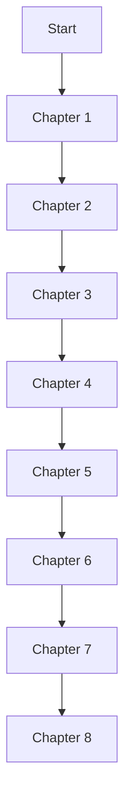

# Automation Hub Architecture Handbook

> `automation-hub`의 실제 개발 사례를 통해 Architecture 설계 판단을 학습하는 Handbook입니다.

| 항목 | 내용 |
|---|---|
| 문서 유형 | 학습 Hub |
| 대상 독자 | Python 기본 문법은 알지만 Architecture 경험이 적은 개발자 |
| 권장 읽기 순서 | Chapter 1부터 Chapter 8까지 |
| 정확한 구현 Reference | Package Architecture |

## 이 Handbook은 무엇인가

이 Handbook은 `automation-hub`의 실제 개발 사례를 사용하는 Architecture 학습 문서입니다. Repository 사용법이나 정확한 구현 Reference가 아니며, 특정 폴더 구조를 그대로 복사하는 것을 목표로 하지 않습니다.

문제, 선택, 구현과 Trade-off를 따라가며 상황에 맞는 설계 판단을 학습합니다. 현재 Repository의 사실과 다른 프로젝트에도 적용할 수 있는 일반 원칙을 구분해서 읽어야 합니다.

## 누구를 위한 문서인가

- Python 기본 문법은 알지만 Architecture 경험이 적은 개발자
- 자동화 스크립트를 유지 가능한 시스템으로 발전시키고 싶은 개발자
- Domain, Persistence, Provider, 실패 처리와 테스트 경계를 실제 사례로 배우고 싶은 학습자

## 문서 역할 구분

| 문서 | 역할 |
|---|---|
| [Package README](../packages/) | 실행 방법과 현재 기능 |
| [Package Architecture](../packages/google_finance/architecture.md) | 현재 구현의 정확한 설계 Reference |
| Handbook | 설계 판단을 학습하는 서사 |
| [DEV_LOG](../development/DEV_LOG.md) | 시간순 개발 기록 |

## Chapter 학습 흐름

### Chapter Map

| Chapter | 제목 | 핵심 질문 | 주요 사례 |
|---|---|---|---|
| [Chapter 1](01-redesigning-automation-with-python.md) | 업무 자동화를 Python 시스템으로 다시 설계하기 | 왜 화면 중심 자동화를 데이터와 실패 경계를 가진 시스템으로 바라보게 되었는가? | 공통 |
| [Chapter 2](02-designing-package-boundaries-in-a-monorepo.md) | Monorepo 안에서 패키지 독립성과 공통화를 설계하기 | 무엇을 공통으로 관리하고 무엇을 Package 책임으로 남겨야 하는가? | 공통, 두 Package 비교 |
| [Chapter 3](03-building-a-collection-pipeline.md) | 외부 데이터를 검증 가능한 내부 데이터로 바꾸기 | 원시 데이터를 어떻게 검증 가능한 내부 데이터로 바꾸는가? | 공통, 두 Package 비교 |
| [Chapter 4](04-keeping-business-rules-independent-of-infrastructure.md) | Business Rule을 Infrastructure로부터 독립시키기 | 왜 Business Rule은 Infrastructure에 의존하지 않아야 하는가? | Google Finance |
| [Chapter 5](05-connecting-business-rules-to-persistent-data.md) | Business Rule을 영속 데이터와 연결하기 | Business Rule이 DB에 의존하지 않으면서 Persistence와 어떻게 연결되는가? | Google Finance |
| [Chapter 6](06-orchestrating-multiple-external-providers.md) | 여러 외부 서비스를 하나의 검증 가능한 자동화 파이프라인으로 연결하기 | 서로 다른 외부 Provider를 어떻게 하나의 실행 흐름으로 조정하는가? | Namuwiki |
| [Chapter 7](07-handling-external-failures-and-api-limits.md) | 외부 서비스 실패와 API 제한을 운영 가능한 상태로 다루기 | 실패와 데이터 부족을 언제 unavailable 또는 시스템 실패로 표현하는가? | Google Finance, Namuwiki |
| [Chapter 8](08-defining-test-boundaries.md) | Fake, Integration Test와 Live Smoke Test의 경계를 정하기 | 자동화를 어떤 수준에서 Fake와 실제 외부 환경으로 검증하는가? | Google Finance, Namuwiki |

## 추천 읽기 경로

### 전체 학습

Chapter 1부터 Chapter 8까지 순서대로 읽습니다. 프로젝트의 출발점에서 Package 경계, 데이터 계약, Business Rule, Persistence, 외부 Provider, 실패 처리와 테스트 경계로 이해를 넓힙니다.

### Google Finance 중심

Chapter 1, 2, 3, 4, 5를 순서대로 읽은 뒤 Chapter 7과 Chapter 8로 이어집니다.

Chapter 6을 건너뛰면 Namuwiki 사례를 통한 다중 외부 Provider와 Pipeline 조정 문제를 놓칩니다.

### Namuwiki 중심

Chapter 1, 2, 3을 읽은 뒤 Chapter 6, 7, 8을 순서대로 읽습니다.

Chapter 4와 Chapter 5를 건너뛰면 Business Rule의 독립성과 Persistence 연결을 Google Finance 사례로 먼저 이해하는 흐름을 놓칩니다.

## 읽기 전에 알아둘 점

- Repository 파일명은 각 설계 설명의 사례 근거입니다.
- 일반적인 Architecture 원칙과 현재 Repository의 선택을 구분해서 읽습니다.
- 정확한 현재 구현은 [Google Finance Architecture](../packages/google_finance/architecture.md)와 [Namuwiki Architecture](../packages/namuwiki_trend/architecture.md)를 기준으로 확인합니다.
- 과거의 live 실행 결과는 현재의 영구적인 보장을 의미하지 않습니다.

## Start Reading

[Chapter 1. 업무 자동화를 Python 시스템으로 다시 설계하기](01-redesigning-automation-with-python.md)부터 시작합니다. 이 Chapter에서는 기존 화면 중심 자동화를 Python 시스템으로 다시 구현하며 데이터와 실패 경계를 의식하게 된 출발점을 설명합니다.

## Related Documents

- [Root README](../../README.md): Repository의 첫 실행과 문서 Navigation을 확인합니다.
- [Root Architecture](../architecture.md): Monorepo 전체 구조와 공통 책임을 확인합니다.
- [Google Finance Architecture](../packages/google_finance/architecture.md): Google Finance의 정확한 설계 Reference를 확인합니다.
- [Namuwiki Architecture](../packages/namuwiki_trend/architecture.md): Namuwiki Trend의 정확한 설계 Reference를 확인합니다.
- [STYLE_GUIDE](STYLE_GUIDE.md): Handbook 집필 규칙입니다. 일반 독자용 Chapter가 아닙니다.

## Next Reading

- [Chapter 1](01-redesigning-automation-with-python.md): 프로젝트의 출발점과 첫 번째 설계 질문을 학습합니다.
