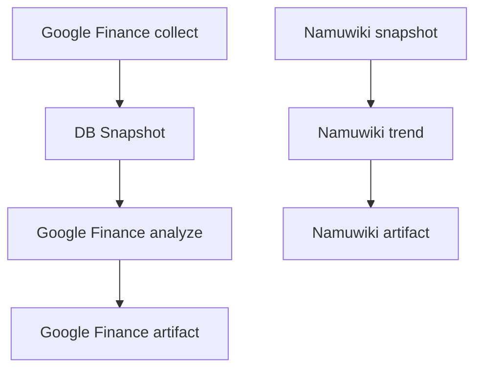

# Cron 운영 가이드

이 문서는 `automation-hub`의 Wrapper를 Linux cron에서 실행하기 위한 운영 기준을
정리한다. 실제 crontab을 등록하지 않으며, 아래 Schedule은 권장안이다.

## Job 목록

| Job | 목적 | Gemini | Wrapper |
|---|---|---:|---|
| Google Finance collect | Watchlist 가격을 수집하고 DB Snapshot 저장 | 아니오 | `run_google_finance.sh --collect` |
| Google Finance analyze | 저장된 Snapshot과 News를 Batch 분석하고 Insight artifact 저장 | 예 | `run_google_finance.sh --analyze --key-profile production` |
| Namuwiki snapshot | Top 10 검색어 Snapshot 저장 | 아니오 | `run_namuwiki_snapshot.sh` |
| Namuwiki trend | 검색어와 News를 Batch 분석하고 trend artifact 저장 | 예 | `run_namuwiki_trend.sh --key-profile production` |
| Bus Monitor | target 2 route/lane/realtime snapshot 저장 | 아니오 | `run_bus_monitor.sh` |

Package의 실행 방법과 결과 계약은 [Google Finance 운영 문서](google_finance.md)와
[Namuwiki 운영 문서](namuwiki_trend.md)를 기준으로 한다.

## 권장 Schedule

```cron
SHELL=/bin/bash
PATH=/usr/local/sbin:/usr/local/bin:/usr/sbin:/usr/bin:/sbin:/bin

# Google Finance 가격 수집: 매시간 정각
0 * * * * /home/kstec/projects/automation-hub/run_google_finance.sh --collect

# Namuwiki Snapshot: 두 시간마다 17분
17 */2 * * * /home/kstec/projects/automation-hub/run_namuwiki_snapshot.sh

# Google Finance Batch 분석: 매일 08시 10분
10 8 * * * /home/kstec/projects/automation-hub/run_google_finance.sh --analyze --key-profile production

# Namuwiki Trend Batch: 매일 08시 30분
30 8 * * * /home/kstec/projects/automation-hub/run_namuwiki_trend.sh --key-profile production

# Bus Monitor target 2: 평일 17:00, 17:10, 17:20
0,10,20 17 * * 1-5 /home/kstec/projects/automation-hub/run_bus_monitor.sh
```

08:00 Google Finance collect가 먼저 DB에 Snapshot을 저장하고, 08:10 analyze는 저장된
최신 Snapshot을 읽는다. 08:17 Namuwiki Snapshot 이후 08:30 trend가 실행된다. 따라서
각 분석 작업은 선행 수집 작업과 같은 시각에 실행하지 않는다. Snapshot을 정기적으로
갱신하려면 다음 Wrapper를 별도 cron 항목으로 추가한다.

```cron
# Namuwiki Snapshot: 두 시간마다 17분
17 */2 * * * /home/kstec/projects/automation-hub/run_namuwiki_snapshot.sh
```

Google Finance collect는 정각 실행을 허용한다. 08:10 analyze는 08:00 collect가 끝난
뒤 최신 Snapshot을 사용하고 평균 실행 시간 기준으로 10분의 여유를 둔다. 08:30
Namuwiki enrichment는 Google Finance LLM 작업과 겹치지 않으며 Provider retry가
발생해도 시간적 여유가 있다. 출근 후 Dashboard에서 두 분석 결과를 확인하는 것이
목적이다. 임의의 7분·17분 분산을 일반 원칙으로 강제하지는 않는다.

Schedule의 시간은 cron host의 local timezone을 따른다. 운영 Host가 KST가 아니라면
시각 변환을 확인해야 하며, cron 설정에 별도 timezone을 가정하지 않는다.

분 단위의 간격은 작업 시간을 고려한 운영 여유다. 최근 로그에서 Google Finance
Wrapper의 성공 실행은 대체로 15–52초, Namuwiki enrichment의 최근 성공 실행은 약
31초였다. 과거 Namuwiki 실행은 약 124초까지 기록되었고, Snapshot은 대체로 2–5초였다.
이 시간은 외부 네트워크와 Provider 상태에 따라 달라지므로 Schedule을 실행 시간의
보장으로 해석하지 않는다.

## Profile 정책

cron은 `production` profile만 사용한다.

```text
Production: --key-profile production
Test:       수동 smoke test 전용
```

`--collect`와 `run_namuwiki_snapshot.sh`는 Gemini key profile을 사용하지 않는다.
분석 Wrapper는 명시적인 profile이 없으면 실패한다. Wrapper는 선택한 Job/profile의
환경변수만 확인하며 다른 Job이나 profile의 key로 fallback하지 않는다.

Local quota의 현재 기본값은 다음과 같다.

| 항목 | 기본값 |
|---|---:|
| Production daily request budget | 16 |
| Test daily request budget | 5 |
| Requests per minute | 4 |
| Tokens per minute | 200,000 |

Quota identity는 `project_profile`, Provider, model 기준이다. 따라서 같은 production
project profile을 사용하는 Namuwiki와 Google Finance 요청은 local ledger에서 quota를
공유한다. Job별 API key가 분리되어 있어도 project profile이 같으면 별도 quota로
계산되지 않는다.

정상 Batch 기준으로 Google Finance analyze와 Namuwiki trend는 각각 최대 1회의 논리적
LLM 요청을 예약한다. Runtime retry가 발생하면 retry도 별도 reservation이 된다. 따라서
하루 예상량은 기본 실행 2회에 retry 여유를 더해 계산해야 하며, daily budget 16을
자동으로 모두 사용할 수 있다고 가정하지 않는다.

## Job 의존성



Collector와 Snapshot 작업은 cron이 시작하는 실행 단위이며, analyze 작업은 기존 저장
데이터를 읽고 결과 artifact를 갱신한다. 분석 실패 시 기존 정상 artifact를 보존하는
계약을 유지한다.

## Lock, timeout, signal

각 Wrapper는 저장소의 절대 경로를 기준으로 실행하며 `.venv/bin/python`을 직접 사용한다.
cron의 제한된 `PATH`에 의존하지 않도록 Wrapper가 자체 `PATH`도 설정한다. 실행 전에
`.env`를 저장소 루트의 절대 경로에서 읽고 자식 프로세스에 export한다.

| Job | Lock | Log | 기본 timeout |
|---|---|---|---:|
| Google Finance | `logs/google_finance.lock` | `logs/google_finance_wrapper.log` | 600초 |
| Namuwiki trend | `logs/namuwiki_trend.lock` | `logs/namuwiki_trend.log` | 600초 |
| Namuwiki snapshot | `logs/namuwiki_snapshot.lock` | `logs/namuwiki_snapshot.log` | 600초 |
| Bus Monitor target 2 | `logs/bus_monitor_target_2.lock` | `logs/bus_monitor.log` | 600초 |

Wrapper는 `flock -n`으로 동일 Job의 중복 실행을 차단한다. Google Finance의 collect와
analyze는 같은 lock을 사용하므로 서로 겹치지 않는다. Namuwiki trend와 snapshot은
서로 다른 lock을 사용하므로 Schedule 사이에 충분한 간격을 둔다.

`SIGINT`와 `SIGTERM`은 실행 중인 child process로 전달된다. timeout은 `TERM`을 먼저
보내고 30초 후 강제 종료하며, timeout 종료 코드는 `124`다. 실제 운영에서는 timeout과
signal 이후 Browser 또는 Python 자식 프로세스가 남지 않는지 확인한다.

## 로그와 종료 코드

Wrapper 로그는 다음 절대 경로 아래에 생성된다.

```text
/home/kstec/projects/automation-hub/logs/google_finance_wrapper.log
/home/kstec/projects/automation-hub/logs/namuwiki_trend.log
/home/kstec/projects/automation-hub/logs/namuwiki_snapshot.log
/home/kstec/projects/automation-hub/logs/bus_monitor.log
```

Python logger가 별도 파일을 사용하는 Job은 Wrapper 로그와 Application 로그를 함께
확인한다. `logs/`는 운영 상태이며 Git에 커밋하지 않는다. log rotation과 보존 기간은
호스트 운영 정책으로 별도 설정해야 한다.

| 코드 | 의미 | 운영 해석 |
|---:|---|---|
| `0` | 성공 | 정상 완료 |
| `1` | Job 또는 분석 실패 | 오류 로그와 artifact 보존 여부 확인 |
| `2` | Wrapper 사용법 오류 | cron 명령 확인 |
| `75` | 동일 Job 실행 중 | 중복 실행 방지에 따른 skip |
| `78` | 실행 환경 오류 | `.env`, Python, 필수 환경변수 확인 |
| `124` | 전체 timeout | child process와 네트워크 상태 확인 |
| `130` | SIGINT 중단 | 수동 중단 여부 확인 |
| `143` | SIGTERM 중단 | timeout 또는 외부 종료 여부 확인 |

현재 로그에는 일부 음수 `elapsed_seconds`가 기록된 과거 항목도 있다. 이는 작업
성공 여부와 별개로 시간 측정 로그의 신뢰성을 낮추므로, cron 알림 기준은 elapsed 값이
아니라 종료 코드와 Job 결과를 우선한다. 로그 Rotation과 함께 elapsed 측정값 정비는
별도 운영 개선 작업으로 남긴다.

## WSL 운영 주의사항

WSL 환경에서는 Windows가 켜져 있는 것만으로 Linux cron 실행이 보장되지 않는다.

- WSL 인스턴스가 실행 중이어야 한다.
- 해당 배포판 안의 cron daemon이 실행 중이어야 한다.
- Windows 재부팅 후 WSL과 cron daemon이 자동으로 시작되는지 별도 확인해야 한다.
- WSL이 종료되거나 중지되면 그동안의 cron 실행은 자동으로 보충되지 않는다.

WSL에서 systemd가 활성화되어 있으면 `systemctl status cron`으로 확인하고, 그렇지
않으면 배포판의 `service cron status` 또는 동일한 서비스 관리 명령을 사용한다.
`crontab -l`로 등록 내용을 확인하고, 로그와 artifact의 갱신 시각으로 실제 실행을
검증한다. Windows 부팅만으로 WSL과 cron daemon이 자동 시작된다고 가정하지 않는다.
장기 운영이 필요하면 Windows Task Scheduler로 WSL 시작을 보조할 수 있지만, 자동 시작
스크립트는 이 문서에서 구현하지 않는다.

## 등록 전 체크리스트

- [ ] 저장소 절대 경로와 `.venv/bin/python`이 운영 호스트에 존재한다.
- [ ] `.env` 권한과 required key가 확인되었다.
- [ ] `logs/`의 소유자, 권한, Rotation 정책이 정해졌다.
- [ ] MySQL 연결과 Snapshot 저장을 수동으로 확인했다.
- [ ] Google Finance collect가 완료된 뒤 analyze가 실행되도록 Schedule을 확인했다.
- [ ] Namuwiki snapshot이 완료된 뒤 trend가 실행되도록 Schedule을 확인했다.
- [ ] 두 Job의 production project profile quota를 합산했다.
- [ ] retry reservation을 포함해 daily budget 여유를 확인했다.
- [ ] 동일 Wrapper 동시 실행 시 `75`가 반환되는지 확인했다.
- [ ] timeout 이후 Browser/Python child process가 남지 않는지 확인했다.
- [ ] WSL 시작과 cron daemon 자동 시작 정책을 확인했다.
- [ ] cron 등록 전 backup을 생성했다.

이 문서는 계획과 운영 기준만 정의한다. 실제 crontab 등록과 변경은 체크리스트를
완료한 뒤 별도 승인과 검증을 거쳐 수행한다.
