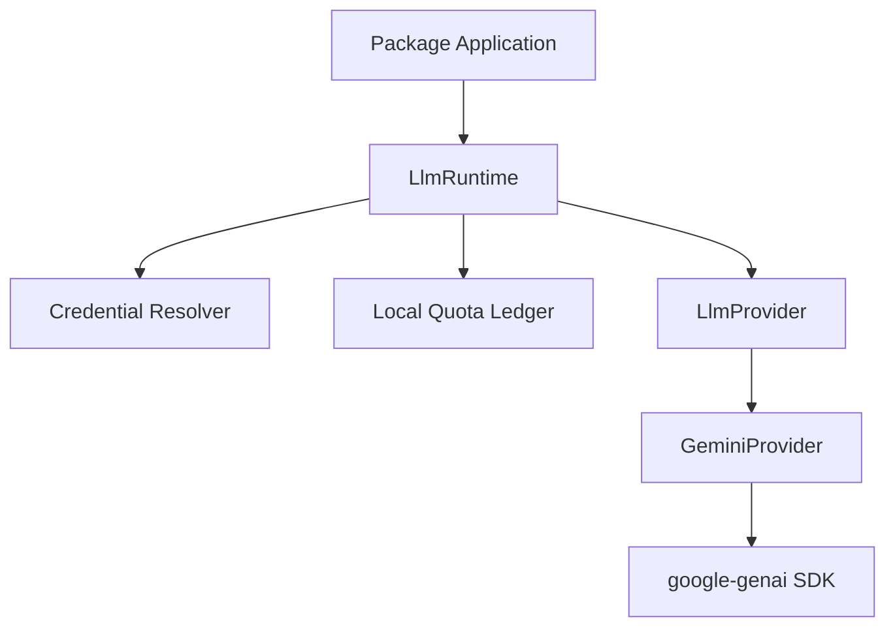
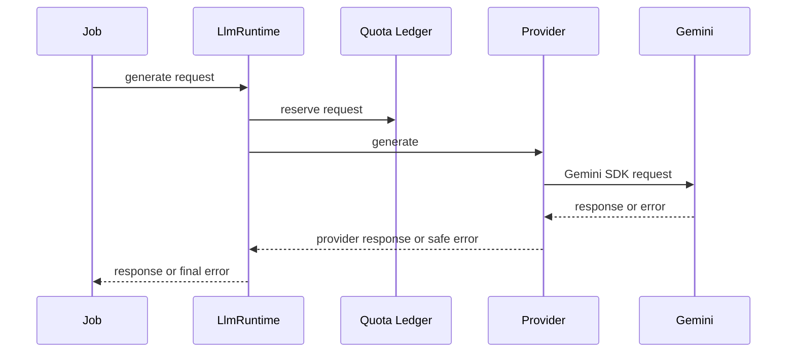
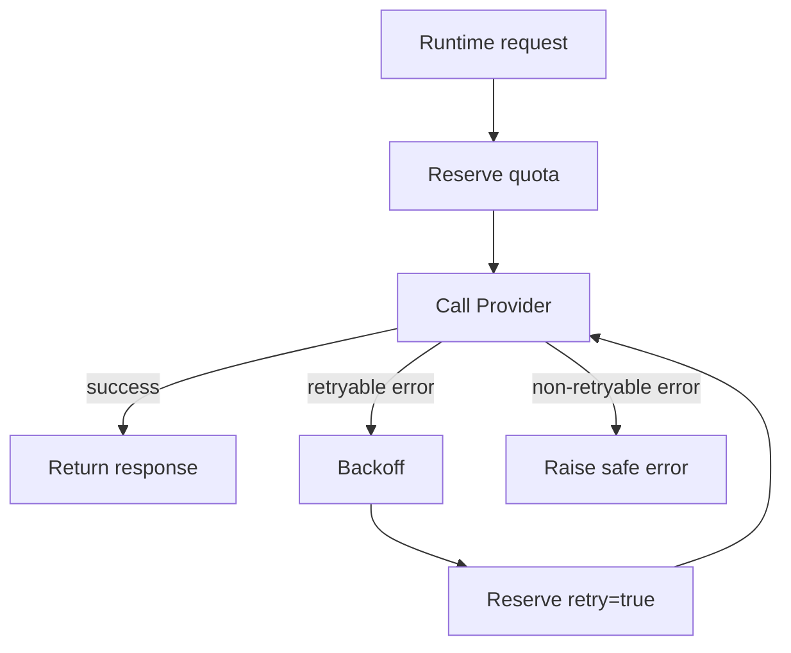
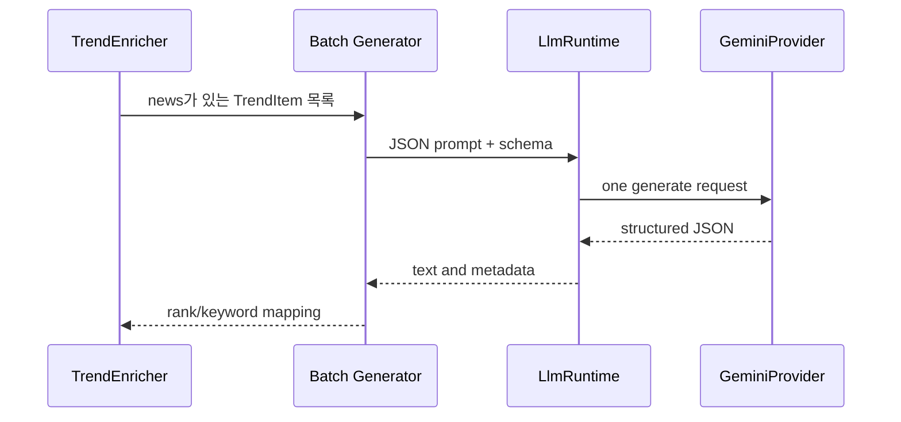
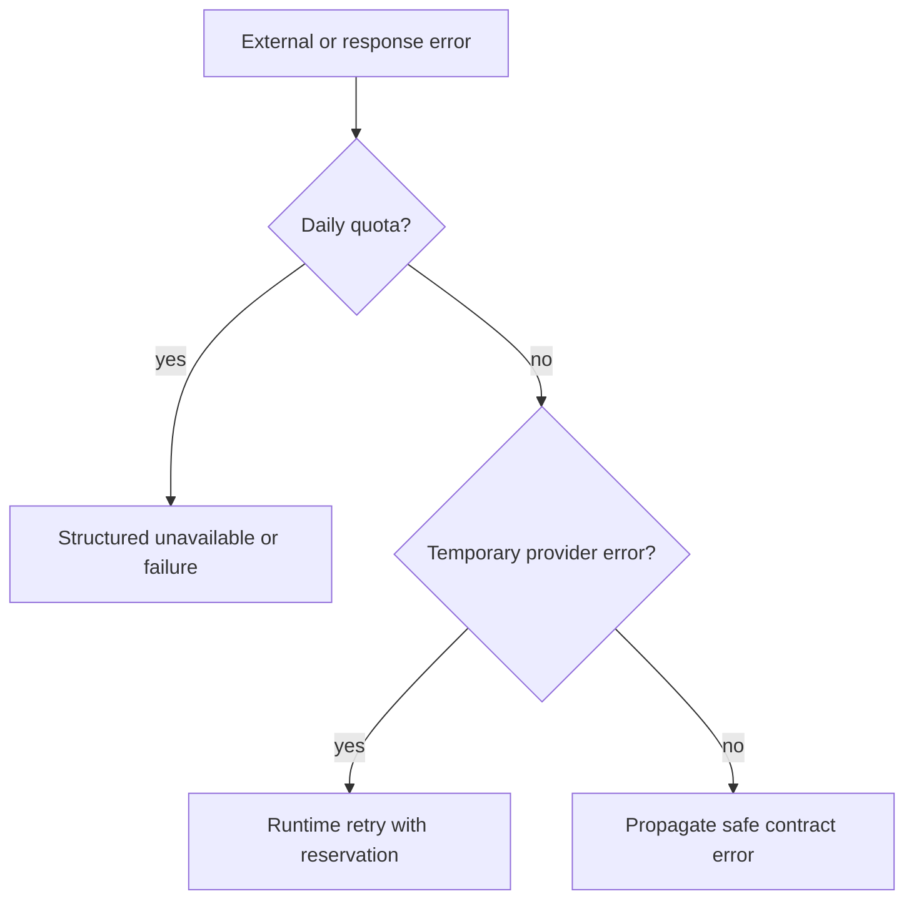

# LLM Runtime 운영 가이드

이 문서는 `llm_runtime`의 현재 운영 계약을 설명한다. 공통 Runtime은
credential 선택, quota reservation, retry 조정과 Provider 호출을 담당한다. Package는
Prompt와 Domain 응답 검증을 소유하며 Gemini SDK를 직접 호출하지 않는다.

## Quick Start

### Production

```bash
./run_namuwiki_trend.sh --key-profile production
./run_google_finance.sh --analyze --key-profile production
```

### Test

```bash
./run_namuwiki_trend.sh --key-profile test
./run_google_finance.sh --analyze --key-profile test
```

Production은 운영 실행에 사용하고, Test는 수동 smoke test에 사용한다. 두 명령 모두
실행 환경에 필요한 credential과 quota 설정이 먼저 준비되어 있어야 한다.

## Runtime Architecture



현재 구현에서 `google_finance`와 `namuwiki_trend`는 `LlmRuntime`을 생성자 주입으로
사용한다. Runtime은 Package의 keyword, rank, StockInsight 같은 Domain 의미를 알지
못한다.



## Provider

`GeminiProvider`는 `LlmProvider` 계약을 Gemini SDK 호출로 변환한다.

- API key로 Client를 생성한다.
- 요청 중 Client를 유지하고 요청 종료 후 닫는다.
- text, usage metadata, finish reason을 공통 응답으로 변환한다.
- Gemini `ClientError`와 `ServerError`를 안전한 Runtime 예외로 분류한다.
- API key, Prompt, raw SDK 응답은 예외 메시지에 포함하지 않는다.

503 `ServerError`는 `LlmProviderUnavailableError`가 되어 Runtime retry 대상이 된다.
일일 quota marker가 있는 429는 `LlmDailyQuotaExceededError`로 분류되어 재시도하지
않는다.

## Quota Ledger

기본 ledger 경로는 다음과 같다.

```text
.state/llm/quota-ledger.json
```

`LocalFileQuotaLedger`는 하나의 WSL Host에서 다음 제한을 예약한다.

| 항목 | 현재 계약 |
|---|---|
| 날짜 기준 | `America/Los_Angeles` |
| 일일 요청 | RPD |
| 최근 60초 요청 | RPM |
| 최근 60초 토큰 | TPM |
| 동시 접근 | 별도 lock file과 `fcntl.flock` |
| 저장 | temp file, flush, fsync, atomic replace |
| 보존 | 최근 reservation retention |
| 손상 파일 | fail-closed |

Production과 Test profile은 분리되지만, 같은 project profile과 model을 사용하는
Job은 quota를 공유한다. retry도 실제 Provider 요청이므로 별도 reservation을 만든다.
Ledger 파일에는 API key나 Prompt를 저장하지 않는다.

## Retry

Runtime의 기본 최대 시도 횟수는 3회다. 다음 오류만 retry 대상이다.

- `LlmRateLimitError`
- `LlmProviderUnavailableError`
- `TimeoutError`

재시도 전에는 backoff 후 `retry=true` reservation을 먼저 만든다. 일일 quota 오류,
인증 오류, 잘못된 요청과 같은 비재시도 오류는 즉시 호출자에게 전달한다.



## Structured Output

Provider-neutral `LlmResponseFormat`으로 MIME type과 JSON schema를 전달할 수 있다.
Namuwiki Batch는 다음 형식을 요청한다.

```json
{
  "items": [
    {
      "rank": 1,
      "keyword": "검색어",
      "reason": "간결한 분석"
    }
  ]
}
```

GeminiProvider는 이를 `application/json`, `response_schema` 설정으로 변환한다.
Structured Output이 설정되어도 Package Parser의 mapping과 길이 검증은 계속 수행한다.

## Batch

현재 Batch 분석은 Namuwiki Trend와 Google Finance Watchlist에 각각 적용되어 있다. 두 Package는
같은 Runtime을 사용하지만 prompt, 응답 schema와 결과 검증 계약은 공유하지 않는다.



- 뉴스가 있는 항목이 있으면 Runtime 호출은 정상 경로에서 1회다.
- 뉴스가 없는 항목은 Gemini를 호출하지 않고 fallback reason을 사용한다.
- missing, duplicate, unknown item 또는 pair mismatch는 전체 Batch 오류다.
- 응답 순서가 달라도 입력 rank 순서로 복원한다.
- Batch 실패 시 부분 결과를 저장하지 않고 기존 `output/trend_insights.json`을 보존한다.

Google Finance의 `watchlist_main.py --analyze --key-profile <profile>`은
`analyze_stored_quotes_batch()`와 `GeminiStockInsightBatchGenerator`를 사용해 분석 가능한
Watchlist symbol을 하나의 Batch 요청으로 처리한다. Snapshot이 부족하거나 뉴스가 없는 symbol은
Batch 입력에서 제외하고 각자의 결과 상태를 유지한다. 단일 symbol CLI의 `main.py --analyze`는
별도 `GeminiStockInsightGenerator` 경로를 유지한다.

Google Finance Watchlist 분석은 `FAILED` 또는 `ANALYSIS_UNAVAILABLE` 결과가 없을 때만
profile별 JSON artifact를 원자적으로 저장한다.

| Profile | Artifact path |
|---|---|
| Production | `output/google_finance_insights.json` |
| Test | `output/test/google_finance_insights.json` |

## Key Profile

Credential은 Job과 profile 조합으로 선택한다.

| Job | Production | Test |
|---|---|---|
| Namuwiki | `GEMINI_NAMUWIKI_API_KEY_PROD` | `GEMINI_NAMUWIKI_API_KEY_TEST` |
| Google Finance | `GEMINI_GOOGLE_FINANCE_API_KEY_PROD` | `GEMINI_GOOGLE_FINANCE_API_KEY_TEST` |

cron은 production profile을 사용하고 Test profile은 수동 smoke test 용도로 사용한다.
다른 Job이나 profile의 key로 fallback하지 않는다. 같은 Google Cloud Project의 key는
quota를 공유하므로 Production/Test quota를 분리하려면 Project 자체를 분리해야 한다.

## Failure Flow



실패 진단 시 사용자 출력과 개발용 DEBUG metadata를 구분한다. Package Batch Parser는
응답 전문을 출력하지 않고 문자 수, delimiter, decode 위치, finish reason과 token 수만
기록할 수 있다.

| Failure | Runtime 동작 | Artifact |
|---|---|---|
| Daily quota | 재시도하지 않고 오류 전달 | 기존 artifact 보존 |
| 503 provider unavailable | quota를 예약하며 제한적으로 retry | 성공 전까지 기존 artifact 보존 |
| malformed JSON | Package Batch 오류 전달 | 기존 artifact 보존 |
| truncated JSON | 잘림 오류로 분류하고 전달 | 기존 artifact 보존 |
| Authentication | 재시도하지 않고 오류 전달 | 기존 artifact 보존 |

503이 retry 후 성공하면 호출 Package가 새 결과를 처리한다. Runtime은 artifact를 직접
저장하지 않으며, 위 표의 보존 정책은 현재 Package Application 계약을 함께 나타낸다.

## Runtime Directories

| Directory | Purpose | Commit |
|---|---|---|
| `.state/` | Local quota ledger와 lock 등 실행 상태 | 하지 않음 |
| `logs/` | Wrapper와 Package 실행 로그 | 하지 않음 |
| `output/` | Namuwiki·Google Finance Package가 생성하는 결과 artifact | 하지 않음 |

세 디렉터리는 실행 중 생성되는 로컬 상태·로그·결과 영역이다. `logs/`와 `output/`은
현재 `.gitignore`에서 제외되지만, `.state/`는 이 문서의 운영 계약상 로컬 상태로
취급하며 커밋하지 않는다.

## 운영 시 주의사항

- `.state/llm/quota-ledger.json`과 lock file을 삭제하거나 수동 편집하지 않는다.
- Production과 Test가 같은 Project를 사용하면 quota가 공유된다.
- 503 retry는 Runtime이 수행하므로 Package에서 별도 retry를 추가하지 않는다.
- 일일 quota 오류는 retry로 해결되지 않으므로 반복 실행하지 않는다.
- Batch JSON 오류가 발생하면 기존 artifact가 보존되는지 확인한다.
- 실제 Gemini Live smoke test는 quota reservation을 소비하므로 실행 횟수를 제한한다.
- Dashboard Home은 local quota ledger의 profile별 당일 요청 수, retry 수와 최근 요청 시각을
  read-only로 표시한다. Google Finance page는 production Insight artifact를, Namuwiki page는
  Trend Insight artifact를 읽는다. Dashboard는 LLM을 호출하거나 ledger/artifact를 수정하지 않는다.

## Related Documents

- [Operations overview](README.md): 공통 종료 코드와 운영 체크리스트
- [Namuwiki operations](namuwiki_trend.md): Namuwiki profile, Batch와 artifact 운영
- [Google Finance operations](google_finance.md): Google Finance Runtime 사용과 제한
- [ADR-0007](../adr/ADR-0007-llm-runtime.md): 공통 Runtime 도입 결정
- [ADR-0008](../adr/ADR-0008-batch-analysis.md): Namuwiki Batch 결정
- [ADR-0009](../adr/ADR-0009-gemini-profile.md): Production/Test profile 결정

## Next Reading

- [LLM Runtime ADR](../adr/ADR-0007-llm-runtime.md): Runtime을 도입한 이유를 확인합니다.
- [Namuwiki Package Architecture](../packages/namuwiki_trend/architecture.md): 실제 Package 경계를 확인합니다.
