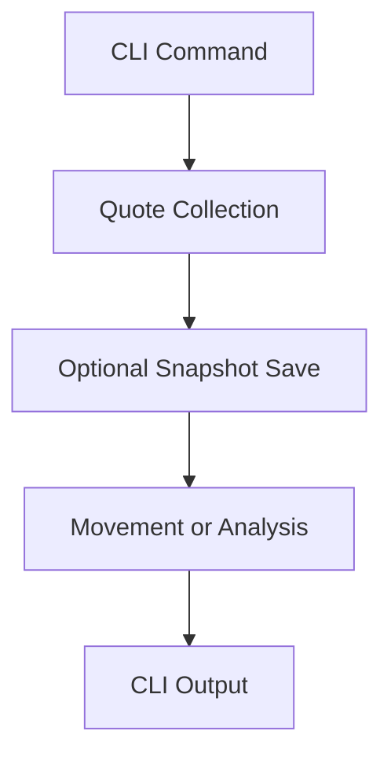

# google_finance

> Google Finance에서 주가를 수집하고 저장된 snapshot의 변동과 공개 뉴스 기반 분석을 확인하는 자동화 Package입니다.

| 항목 | 내용 |
|---|---|
| 문서 유형 | Package Guide |
| 대상 독자 | 실행 사용자, Junior Developer, Maintainer |
| 예상 읽기 시간 | 5~10분 |
| 설계 Reference | [architecture.md](architecture.md) |

## Purpose

`google_finance`는 exchange-qualified symbol을 Playwright로 수집하고 `StockPrice`로 변환합니다. 선택적으로 MySQL snapshot을 저장하며, 저장된 최신 snapshot과 관련 Google News를 사용해 Movement와 StockInsight를 CLI에 출력합니다.

## Quick Start

설치와 공통 검증은 [Root README](../../../README.md)를 먼저 확인합니다.

```bash
python -m google_finance.main AAPL:NASDAQ
```

DB 저장 또는 저장 데이터 분석은 `DATABASE_URL`과 실행 모드에 맞는 환경을 준비해야 합니다.

## Environment

| 환경 변수 | 사용 흐름 | 설명 |
|---|---|---|
| `DATABASE_URL` | `--save-db`, `--show-movement`, `--analyze`, Watchlist | MySQL 연결 설정 |
| `GEMINI_API_KEY` | `--analyze`, Watchlist `--analyze` | Gemini StockInsight 생성 |
| `STOCK_SYMBOLS` | Watchlist | 쉼표로 구분한 Watchlist 입력 |
| `GOOGLE_FINANCE_LOCALE` | Quote 수집 | 기본값은 `en-US` |
| `LOG_LEVEL` | 로깅 | 기본값은 `INFO` |

## Commands

| 명령 | 동작 |
|---|---|
| `python -m google_finance.main AAPL:NASDAQ` | 한 종목 Quote를 수집해 출력 |
| `python -m google_finance.main AAPL:NASDAQ --save-db` | Quote를 MySQL snapshot으로 저장 |
| `python -m google_finance.main AAPL:NASDAQ --show-movement` | 저장된 최신 두 snapshot의 변동을 출력 |
| `python -m google_finance.main AAPL:NASDAQ --analyze` | 저장된 변동과 Google News·Gemini 분석을 출력 |
| `python -m google_finance.watchlist_main --collect` | `STOCK_SYMBOLS`를 순차 수집·저장 |
| `python -m google_finance.watchlist_main --analyze` | Watchlist의 저장 snapshot을 순차 분석 |



## Current Features

- Playwright 기반 단일 종목 Quote 수집과 순수 추출·정규화
- `StockPrice`와 `StockReport` 모델
- 가격·변동률의 `Decimal`, 수집 시각의 UTC-aware datetime 계약
- MySQL append-only snapshot 저장과 `[newest, previous]` 조회
- 가격 delta 기반 Movement Detection
- Google News RSS Provider와 Gemini StockInsight 생성
- 뉴스가 없을 때 Gemini를 호출하지 않는 근거 부족 결과
- `STOCK_SYMBOLS` 기반 순차 Watchlist 수집·분석
- Fake 기반 테스트, Google Finance CLI 검증과 MySQL Integration Test

분석 결과는 현재 JSON이나 DB에 저장하지 않습니다.

## Verification

관련 테스트와 전체 검증은 다음 명령으로 실행합니다.

```bash
pytest -q tests/google_finance
python scripts/verify.py
```

MySQL Integration Test와 Live 실행은 [Operations](../../operations/README.md) 및 관련 테스트 조건을 따릅니다.

## Limitations

- 현재 Collector와 parser는 `en-US` 화면 계약을 사용합니다.
- 테스트하지 않은 거래소·종목의 DOM 차이와 selector의 장기 안정성은 보장하지 않습니다.
- Scheduler, threshold, 상대 변동률, 분석 결과 저장은 현재 범위가 아닙니다.
- 외부 Google Finance·Google News·Gemini·MySQL 상태에 따라 실행 결과가 달라질 수 있습니다.

## Related Documents

- [Architecture](architecture.md): Package 구조와 설계 책임을 확인합니다.
- [Operations](../../operations/README.md): 외부 서비스와 DB 실행 조건을 확인합니다.
- [Root Architecture](../../architecture.md): Monorepo 전체 경계를 확인합니다.
- [DEV_LOG](../../development/DEV_LOG.md): 구현과 검증의 시간순 기록을 확인합니다.
- [Architecture Handbook](../../handbook/README.md): 관련 설계 판단을 학습합니다.

## Next Reading

- [Architecture](architecture.md): 이 Package의 책임 경계와 의존성 방향을 읽습니다.
- [Tests](../../../tests/google_finance/): 공개 계약과 실패 경계를 확인합니다.
