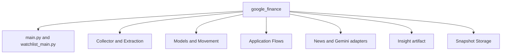
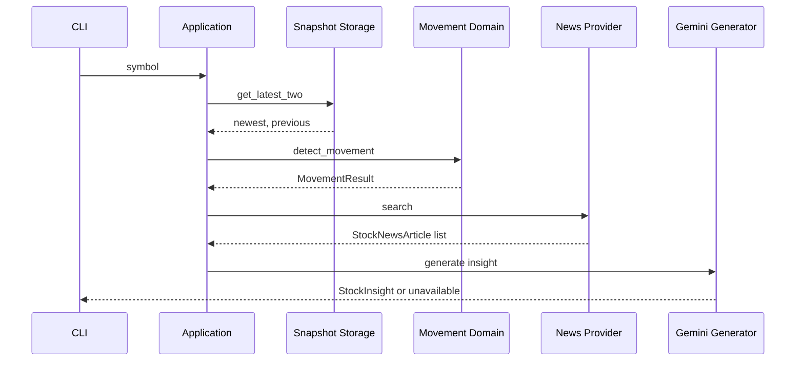
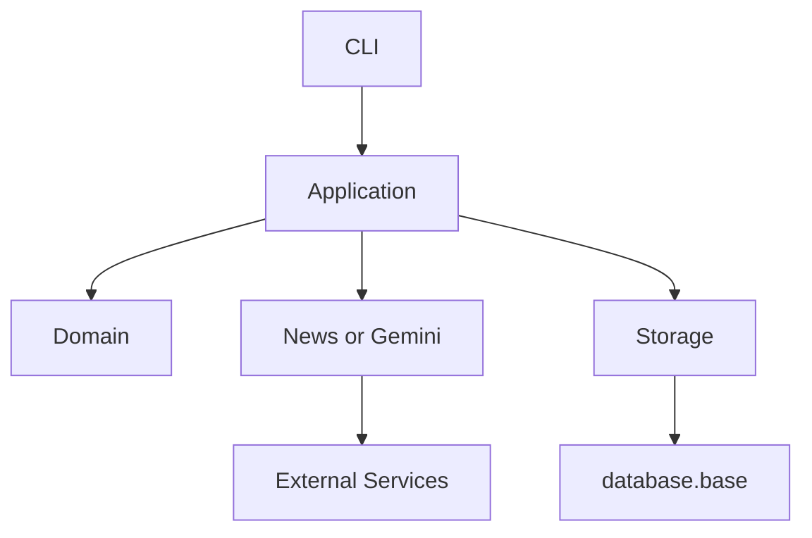

# google_finance Architecture

> 이 문서는 `google_finance`의 현재 구조와 책임 경계를 설명하는 Package Architecture Reference입니다.

| 항목 | 내용 |
|---|---|
| 문서 유형 | Package Reference |
| 대상 독자 | Maintainer, Backend Engineer |
| 예상 읽기 시간 | 15~20분 |
| 실행 방법 | [README.md](README.md) |

## Scope

이 문서는 Package 내부의 구조, Domain·Application·Provider·Storage 책임, 의존성 방향, 테스트 경계와 현재 Trade-off를 다룹니다. 실행 명령과 환경 변수는 [Package README](README.md)가 소유합니다.

## Package Structure

| 영역 | 현재 모듈 | 책임 |
|---|---|---|
| Entrypoint | `main.py`, `watchlist_main.py` | 단일 종목·Watchlist CLI 조립과 출력 |
| Collection | `collector.py`, `extraction.py`, `pipeline.py` | Quote 수집과 내부 `StockPrice` 변환 |
| Domain | `models.py`, `movement.py` | 주가 데이터 계약과 snapshot Movement 계산 |
| Application | `movement_application.py`, `analysis_application.py`, `watchlist_application.py` | Storage·Domain·Provider 실행 순서와 단일·Batch 분석 조정 |
| Provider / LLM adapter | `news.py`, `analysis_generator.py`, `batch_analysis.py` | Google News RSS, 단일 symbol Gemini와 Watchlist Batch Gemini 연결 |
| Artifact | `insight_artifact.py` | profile별 Insight artifact 변환·원자적 저장 |
| Persistence | `db_models.py`, `storage.py` | MySQL snapshot 변환·저장·조회 |
| Configuration | `config.py` | 환경 변수와 logger 조립 |

## Responsibilities

### Domain

`StockPrice`는 수집된 주가의 내부 계약을 표현합니다. `movement.py`의 `detect_movement(latest, previous)`는 두 검증된 `StockPrice`만으로 가격 delta와 방향을 계산하며 DB, Storage, Playwright, CLI를 import하지 않습니다.

### Application

Application 모듈은 이미 존재하는 구성요소의 실행 순서를 조정합니다.

- `movement_application.py`: Storage에서 최신 두 snapshot을 조회하고 Domain 계산을 호출합니다.
- `analysis_application.py`: Movement 결과, News Provider와 Gemini Generator를 연결합니다.
- `watchlist_application.py`: 설정된 symbol을 순차 처리하고 종목별 결과를 집계합니다.

Watchlist 분석은 `analysis_application.py`의 `analyze_stored_quotes_batch()`가 분석 가능한
symbol을 준비하고, `batch_analysis.py`의 `GeminiStockInsightBatchGenerator`가 하나의 Batch
응답을 symbol별 결과로 검증합니다. `watchlist_main.py`는 실패·사용 불가 결과가 없을 때
`insight_artifact.py`로 profile별 artifact를 저장합니다.

### Provider and Collection

`collector.py`와 `extraction.py`는 Google Finance 화면의 외부 문자열을 수집·검증하고 `StockPrice`로 변환합니다. `news.py`는 Google News RSS를 `StockNewsArticle`로 변환합니다. `analysis_generator.py`는 단일 symbol 분석을, `batch_analysis.py`는 Watchlist Batch prompt·응답 검증과 Gemini adapter를 담당합니다.

### Storage

`storage.py`는 `StockPrice`를 append-only `StockQuoteSnapshot`으로 저장하고, symbol별 최신 두 snapshot을 결정적으로 조회합니다. Movement 계산이나 CLI 출력은 담당하지 않습니다.

## Data Flow

기본 Quote 실행은 Collection 흐름을 사용하고, `--save-db`에서만 저장을 수행합니다. `--show-movement`와 `--analyze`는 새로운 Quote를 수집하지 않고 저장된 snapshot을 사용합니다.

Watchlist `--analyze`는 eligible symbol을 하나의 Batch 요청으로 분석합니다. 결과가 모두 저장 가능한
상태이면 `insight_artifact.py`가 production 또는 test artifact를 저장합니다. Dashboard는 production
artifact를 read-only로 읽고, 선택 symbol과 정확히 일치하는 Insight만 표시합니다.

## Dependency Direction

`movement.py`는 Storage와 Provider를 모릅니다. Storage는 Movement를 호출하지 않으며, CLI는 Domain 계산을 직접 재구현하지 않고 Application 결과를 출력합니다.

## Testing Strategy

| 대상 | 확인 범위 |
|---|---|
| `test_extraction.py`, `test_pipeline.py` | 원시 Quote 변환과 Pipeline 계약 |
| `test_movement.py` | 순수 Movement 계산·검증 |
| `test_storage.py` | 저장·조회·정렬·모델 변환 |
| `test_movement_application.py`, `test_analysis_application.py` | Application 연결과 unavailable 계약 |
| `test_watchlist_application.py`, `test_watchlist_main.py` | 순차 실행·종목별 결과·CLI 상태 |
| `test_google_finance_integration.py` | 실제 MySQL persistence 경계 |

기본 테스트는 Fake와 격리된 입력을 사용합니다. MySQL Integration Test와 Live Collector 검증은 별도 환경 계약이며 [Operations](../../operations/README.md)에서 실행 조건을 확인합니다.

## Trade-offs

| 선택 | 얻은 것 | 감수한 것 |
|---|---|---|
| Domain과 Storage 분리 | 순수 계산 테스트와 DB 독립성 | Model 변환과 계층 증가 |
| Package 내부 Provider | Google Finance 계약의 독립성 | Namuwiki와 공통 Provider를 공유하지 않음 |
| append-only snapshot | 반복 실행 결과와 결정적 Movement 조회 | 데이터 정리·보존 정책이 별도 과제 |
| 순차 Watchlist | 입력 순서와 실패 격리 | 전체 실행 시간이 길어질 수 있음 |

## Related Documents

- [Package README](README.md): 실행 명령과 환경 변수입니다.
- [Root Architecture](../../architecture.md): Monorepo와 Root 경계입니다.
- [ADR](../../decisions/README.md): 공통 설계 결정입니다.
- [DEV_LOG](../../development/DEV_LOG.md): 구현·검증 History입니다.
- [Architecture Handbook](../../handbook/README.md): 관련 설계 판단을 학습합니다.

## Next Reading

- [Movement Tests](../../../tests/google_finance/test_movement.py): 순수 Domain 계약을 확인합니다.
- [Storage Tests](../../../tests/google_finance/test_storage.py): Persistence 계약을 확인합니다.
