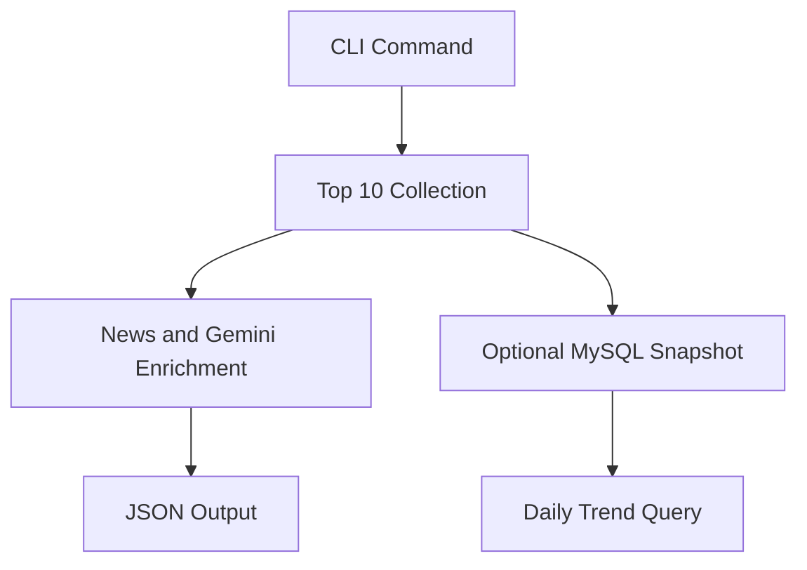

# namuwiki_trend

> Namuwiki 실시간 검색어 Top 10을 수집하고 뉴스·LLM enrichment와 snapshot 조회에 활용하는 자동화 Package입니다.

| 항목 | 내용 |
|---|---|
| 문서 유형 | Package Guide |
| 대상 독자 | 실행 사용자, Junior Developer, Maintainer |
| 예상 읽기 시간 | 5~10분 |
| 설계 Reference | [architecture.md](architecture.md) |

## Purpose

`namuwiki_trend`는 Playwright로 렌더링된 검색어 Top 10을 수집하고 `TrendItem`으로 변환합니다. 기본 흐름은 뉴스 문맥과 Gemini reason을 결합해 `TrendInsight`를 JSON으로 저장하며, 별도 흐름은 원본 TrendSnapshot 저장과 Daily Trend 조회를 제공합니다.

## Quick Start

설치와 공통 검증은 [Root README](../../../README.md)를 확인합니다.

```bash
python -m namuwiki_trend.main
```

기본 흐름은 `output/trend_insights.json`에 결과를 저장합니다. 외부 서비스와 MySQL이 필요한 실행은 [Operations](../../operations/README.md)의 조건을 확인합니다.

## Environment

| 환경 변수 | 사용 위치 | 설명 |
|---|---|---|
| `GEMINI_API_KEY` | `GeminiReasonGenerator` | 기본 enrichment reason 생성 |
| `DATABASE_URL` | Snapshot·Daily Trend | MySQL 연결 설정 |
| `NAVER_CLIENT_ID` | `Settings` | 현재 설정 모델에 정의된 값 |
| `NAVER_CLIENT_SECRET` | `Settings` | 현재 설정 모델에 정의된 값 |
| `LOG_LEVEL` | Logger | 기본값은 `INFO` |

현재 기본 Google News RSS Provider는 RSS 응답을 직접 사용하며, 실제 실행 흐름과 환경 조건은 [Architecture](architecture.md)와 Operations 문서를 함께 확인합니다.

## Commands

| 명령 | 동작 |
|---|---|
| `python -m namuwiki_trend.main` | Top 10 수집·뉴스·Gemini enrichment·JSON 저장 |
| `python -m namuwiki_trend.snapshot_main` | TrendSnapshot을 MySQL에 저장 |
| `python -m namuwiki_trend.daily_trend_main --date YYYY-MM-DD` | 지정한 KST 날짜의 Daily Trend 조회 |
| `python -m namuwiki_trend.daily_trend_main --limit 10` | 기본 날짜의 Daily Trend 조회 |



`playwright_poc.py`와 `news_context_poc.py`는 운영 진입점이 아니라 조사·수동 검증 경로입니다.

## Current Features

- Playwright 기반 Top 10 Collector와 rank 보존
- HTML/DOM 값의 Extraction 및 `TrendItem` 변환
- Google News RSS 문맥 Provider
- Gemini reason Generator와 OpenAI 기반 Generator 구현
- `TrendEnricher`와 `TrendPipeline`
- 원본 CSV 저장과 enriched `TrendInsight` JSON 저장
- MySQL `TrendSnapshot` 저장과 Daily Trend 조회
- Unit·Fake 기반 테스트와 DB Integration Test

## Verification

```bash
pytest -q tests/namuwiki_trend
python scripts/verify.py
```

MySQL Integration Test, 브라우저와 외부 API를 사용하는 Live 검증은 기본 테스트와 분리합니다. 실행 조건은 [Operations](../../operations/README.md)를 확인합니다.

## Limitations

- 브라우저 DOM, 외부 RSS, Gemini quota와 MySQL 상태에 따라 Live 결과가 달라질 수 있습니다.
- 기본 Pipeline은 실패를 호출자에게 전달하는 fail-fast 흐름입니다.
- Scheduler, cache와 집계 결과의 추가 저장 정책은 현재 Package README의 실행 범위에 포함되지 않습니다.
- PoC 결과는 운영 계약이 아니며 [PoC 기록](../../poc/playwright-preparation.md)에서 별도로 관리합니다.

## Related Documents

- [Architecture](architecture.md): Package 구조와 설계 책임을 확인합니다.
- [Operations](../../operations/README.md): DB와 운영 환경을 확인합니다.
- [Root Architecture](../../architecture.md): Monorepo 전체 경계를 확인합니다.
- [DEV_LOG](../../development/DEV_LOG.md): 구현과 검증의 시간순 기록을 확인합니다.
- [Architecture Handbook](../../handbook/README.md): 관련 설계 판단을 학습합니다.
- [Playwright PoC](../../poc/playwright-preparation.md): 조사·실험 기록을 확인합니다.

## Next Reading

- [Architecture](architecture.md): Collector·Pipeline·Provider·Storage 경계를 읽습니다.
- [Operations](../../operations/namuwiki_trend.md): MySQL과 운영 실행 조건을 확인합니다.
