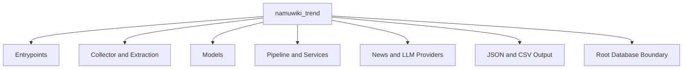
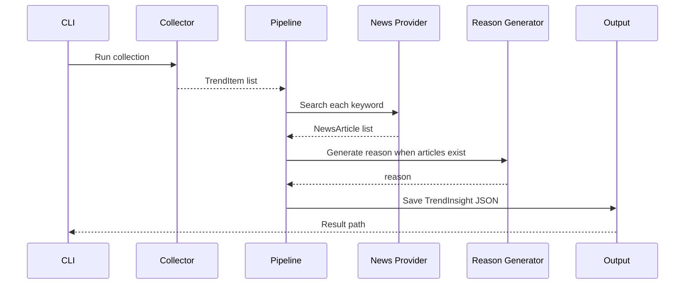
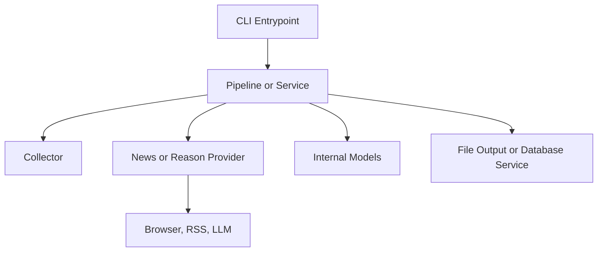

# namuwiki_trend Architecture

> 이 문서는 `namuwiki_trend`의 현재 구조와 책임 경계를 설명하는 Package Architecture Reference입니다.

| 항목 | 내용 |
|---|---|
| 문서 유형 | Package Reference |
| 대상 독자 | Maintainer, Backend Engineer |
| 예상 읽기 시간 | 20~30분 |
| 실행 방법 | [README.md](README.md) |

## Scope

이 문서는 Collector, Extraction, Model, Application Pipeline, Provider, Output·Persistence, 테스트 경계를 다룹니다. 실행 명령과 운영 환경은 [Package README](README.md)와 [Operations](../../operations/README.md)가 소유합니다. 초기 조사와 선택하지 않은 대안은 [Playwright PoC](../../poc/playwright-preparation.md)와 [DEV_LOG](../../development/DEV_LOG.md)에서 확인합니다.

## Package Structure

| 영역 | 현재 모듈 | 책임 |
|---|---|---|
| Entrypoint | `main.py`, `snapshot_main.py`, `daily_trend_main.py` | Enrichment, Snapshot, Daily Trend 실행 조립 |
| Collection | `collector.py`, `extraction.py` | 렌더링 DOM 수집, 검증·정규화, `TrendItem` 생성 |
| Model | `models.py` | `TrendItem`, `NewsArticle`, `TrendInsight`, Daily Trend 관련 계약 |
| Application | `pipeline.py`, `enricher.py`, `snapshot_pipeline.py`, Daily Trend services | 단계 조정과 외부 결과 결합 |
| Provider | `news_context_provider.py`, Gemini·OpenAI Generator | 뉴스 RSS와 LLM 외부 서비스 연결 |
| Output | `insight_storage.py`, `csv_storage.py` | JSON·CSV 파일 저장 |
| Persistence | Root `database/`와 `snapshot_save_service.py` | TrendSnapshot 저장·조회 기반 |
| Diagnostics | `quality_diagnostics.py` | TrendInsight 품질 지표 계산 |

## Responsibilities

### Collector and Extraction

`collector.py`는 Playwright로 페이지와 렌더링된 DOM의 원시 항목을 읽습니다. `extraction.py`는 항목의 순위·keyword·href를 검증하고 `TrendItem` 목록으로 변환합니다.

### Models

`TrendItem`은 Top 10 원본 항목과 rank를 보존합니다. `NewsArticle`은 뉴스 문맥을, `TrendInsight`는 원본 TrendItem·뉴스·reason을 묶습니다. `TrendReason`과 `TrendKeyword`는 Daily Trend 관련 흐름에서 사용됩니다.

### Application

`TrendPipeline`은 Collector 결과를 입력 순서대로 `TrendEnricher`에 전달합니다. `TrendEnricher`는 News Provider를 호출하고, 뉴스가 있으면 Reason Generator를 호출해 `TrendInsight`를 만듭니다. 뉴스가 없으면 Gemini를 호출하지 않고 근거 부족 reason을 사용합니다.

`SnapshotCollectionPipeline`은 Collector 결과를 Root `database`의 Snapshot 저장 서비스로 전달합니다. `DailyTrendNewsService`와 `DailyTrendReasonService`는 저장된 Daily Trend 조회 결과를 뉴스·reason 흐름과 연결합니다.

### Providers and Output

`NewsContextProvider`는 Google News RSS를 `NewsArticle` 목록으로 파싱하며 같은 검색 결과 내부의 URL 중복을 제거합니다. `GeminiReasonGenerator`는 뉴스 문맥에 근거한 짧은 reason을 생성하고 제한된 429 재시도를 적용합니다. `OpenAITrendReasonGenerator`도 구조화된 reason 생성 구현으로 존재합니다.

`JsonTrendInsightStorage`는 `TrendInsight` 목록을 schema version과 함께 JSON으로 원자적으로 저장합니다. `csv_storage.py`는 원본 `TrendItem`을 CSV로 저장합니다.

## Data Flow

Snapshot과 Daily Trend는 위 enrichment 흐름과 별도의 Application 흐름입니다. `snapshot_main.py`는 Collector 결과를 Snapshot으로 저장하고, `daily_trend_main.py`는 저장된 날짜별 결과를 조회해 출력합니다.

## Dependency Direction

Application이 실행 순서를 조정하며 Collector와 Provider는 상위 Application을 호출하지 않습니다. Root `database/`는 DB 기반과 현재 Namuwiki 전용 Snapshot·Daily Trend 코드가 함께 있는 경계이므로 순수한 공통 Domain 모듈로 취급하지 않습니다.

## Testing Strategy

| 대상 | 확인 범위 |
|---|---|
| `test_collector.py`, `test_extraction.py` | DOM 원시 항목과 Top 10 변환 계약 |
| `test_pipeline.py`, `test_enricher.py` | 순차 흐름, 뉴스 있음·없음, `TrendInsight` 계약 |
| `test_news_context_provider.py` | RSS 파싱, URL 검증, 검색 결과 중복 제거 |
| Generator tests | Gemini·OpenAI 응답 검증, reason 계약, 오류·재시도 정책 |
| Storage tests | CSV·JSON 저장 계약 |
| Snapshot·Daily Trend tests | Root Database 저장·조회 경계 |
| `tests/database/` Integration | 실제 DB 모델·조회·Snapshot 경계 |

기본 테스트는 Fake·fixture·격리된 입력을 사용합니다. 브라우저·RSS·LLM·MySQL을 실제로 연결하는 검증은 별도 Live 또는 Integration 조건으로 관리합니다.

## Trade-offs

| 선택 | 얻은 것 | 감수한 것 |
|---|---|---|
| Playwright 기반 수집 | JavaScript 실행 후 DOM과 실제 화면 결과 확인 | 브라우저 설치·실행 비용과 DOM 변경 위험 |
| Collector와 Extraction 분리 | 외부 DOM과 내부 검증을 별도로 테스트 | 모듈과 데이터 변환 단계 증가 |
| News·LLM Provider 분리 | 외부 서비스 교체와 Fake 주입 가능 | Provider 계약과 조립 코드 필요 |
| 원본 CSV와 Enriched JSON 분리 | 원본 계약과 분석 결과 소비 목적을 분리 | 두 저장 형식의 관리 비용 |
| Root Database 사용 | Snapshot·Daily Trend persistence 재사용 | Package 전용 코드가 Root에 있어 경계가 혼재 |
| 순차 Pipeline | 입력 순서와 단계별 실패 위치를 추적하기 쉬움 | 전체 실행 시간이 길어질 수 있음 |

## Related Documents

- [Package README](README.md): 실행 명령과 환경 변수입니다.
- [Root Architecture](../../architecture.md): Monorepo와 Root Database 경계입니다.
- [Operations](../../operations/README.md): 운영 환경과 DB 절차입니다.
- [Playwright PoC](../../poc/playwright-preparation.md): 초기 조사와 실험 근거입니다.
- [ADR](../../decisions/README.md): 공통 설계 결정입니다.
- [DEV_LOG](../../development/DEV_LOG.md): 구현·검증 History입니다.
- [Architecture Handbook](../../handbook/README.md): 관련 설계 판단을 학습합니다.

## Next Reading

- [Pipeline Tests](../../../tests/namuwiki_trend/test_pipeline.py): Application 흐름 계약을 확인합니다.
- [Enricher Tests](../../../tests/namuwiki_trend/test_enricher.py): 뉴스와 reason 결합 계약을 확인합니다.
- [Operations](../../operations/namuwiki_trend.md): Snapshot과 운영 실행 조건을 확인합니다.
